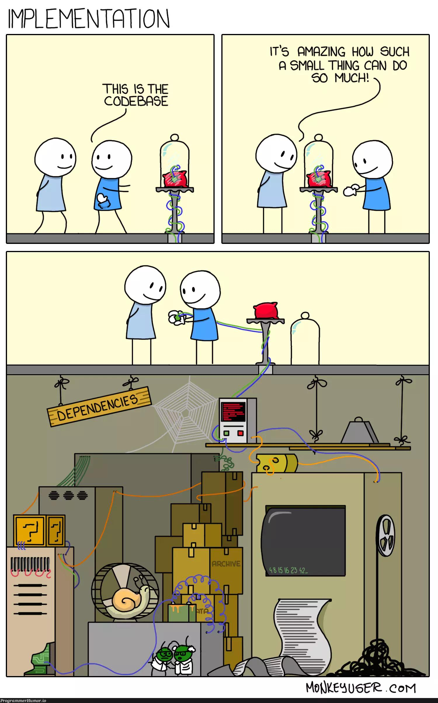
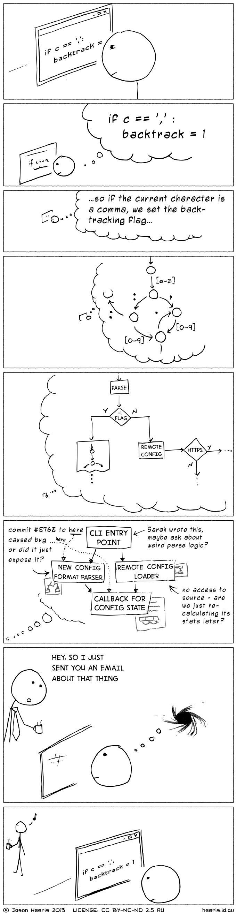
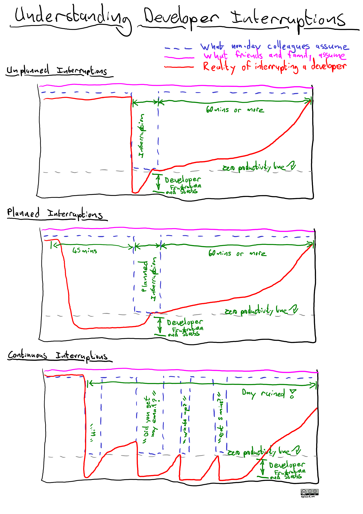

# Reality

> # **90% of real-world programs are database frontends, held by duct tape.**

> # **Most of programming is really just taking data from place A, transforming it, and putting it in place B.**

# Programming

### **Javascript**

-   [Language](./topics/javascriptLanguage.md)
-   [Basics](./topics/javascriptBasics.md)
-   [ES6](./topics/javascriptEs6.md)
-   [Document Object Model (DOM)](./topics/javascriptDom.md)
-   [Async](./topics/javascriptAsync.md)
-   [Object Oriented Programming (OOP)](./topics/oop.md)
-   [Functional Programming](./topics/fp.md)
-   [Debugging](./topics/javascriptDebugging.md)
-   [Code Golf](./topics/javascriptCodeGolf.md)

### **Frontend**

-   Frameworks
    -   [Svelte](./topics/svelte.md)
    -   [React](./topics/react.md)
    -   [Vue](./topics/vue.md)
    -   [Electron](./topics/electron.md)
    -   [Elm](./topics/elm.md)
-   Libraries
    -   [tabulator](./topics/tabulator.md)
    -   [tagify](./topics/tagify.md)
    -   [pdfmake](./topics/pdfmake.md)
    -   [sheetjs](./topics/sheetjs.md)
    -   [Various](./topics/libraries-frontend.md)
-   Other
    -   [CSS](./topics/css.md)

### **Backend**

-   Technologies
    -   [Node](./topics/node.md)
        -   [npm/npx](./topics/npm.md)
        -   [Express](./topics/express.md)
            -   [Code Structure](./topics/express-structure.md)
        -   [Middleware](./topics/middleware.md)
        -   [.env](./topics/dotenv.md)
    -   [GraphQL](./topics/graphql.md)
    -   [Web Sockets](./topics/websockets.md)
-   Web server
    -   [nginx](./topics/nginx.md)
        -   [SSL](./topics/ssl.md)
-   Libraries
    -   [cryptojs](./topics/cryptojs.md)
    -   [nodemailer](./topics/nodemailer.md)
    -   [puppeteer](./topics/puppeteer.md)
-   Other
    -   [Caching](./topics/caching.md)
    -   [Logging](./topics/logging.md)

### **Database**

-   [Design](./topics/database/design.md)
-   [Indexing](./topics/database/indexing.md)
-   [Useful queries](./topics/database/usefulQueries.md)
-   [MySQL](./topics/database/mysql.md)
    -   [node mysql](./topics/database/node-mysql.md)
-   [SQL Server](./topics/database/sqlserver.md)
    -   [node mssql](./topics/database/node-mssql.md)

### **Cybersecurity**

-   [Best practices](./topics/cybersecurity/cybersecurity.md)
-   [SQL Injection](./topics/cybersecurity/sqlinjection.md)
-   [Cross Site Scripting (XSS)](./topics/cybersecurity/xss.md)
-   [Cross Site Request Forgery (CSRF)](./topics/cybersecurity/csrf.md)
-   [Cross-origin resource sharing (CORS)](./topics/cybersecurity/cors.md)

### **Tooling**

-   [VS Code](./topics/vscode.md)
-   [Git](./topics/git.md)
-   [Babel](./topics/babel.md)
-   [Webpack](./topics/webpack.md)

### **Architecture**

-   [MVC](./topics/mvc.md)
-   [Architecture](./topics/architecture.md)
-   [RESTful](./topics/restful.md)
-   [Microservices](./topics/microservices.md)
-   [Serverless](./topics/serverless.md)
-   [Message Brokers](./topics/messageBrokers.md)

### **Concepts**

-   [Code quality and performance](./topics/codeQuality.md)
-   [UI/UX](./topics/uiux.md)
-   [Methodologies (Agile/SCRUM)](./topics/methodologies.md)
-   [Testing](./topics/testing.md)
    -   [Jest](./topics/testingJest.md)
    -   [Mocha](./topics/testingMocha.md)

### **Useful**

-   [Algorithms](./topics/algos.md)
    -   [Graph Theory](./topics/graphTheory.md)
-   [Binary base](./topics/base.md)
    -   [Bitwise](./topics/bitwise.md)
-   [Assembly](./topics/assembly.md)
    -   [WebAssembly](./topics/wasm.md)
-   [.NET](./topics/dotnet.md)
-   [Notifications](./topics/notifications.md)

### **APIs**

-   [Google API](./topics/googleapi.md)
-   [Reddit API](./topics/reddit.md)

# Workflow

-   [Environment](./topics/workflow/environment.md)
-   [Development](./topics/workflow/development.md)
-   [Deployment](./topics/workflow/deployment.md)

# Mobile

-   [Overview](./topics/mobile.md)

**Native**

-   [Android (Kotlin, Java) - Android Studio / Google](./topics/mobileAndroid.md)
-   [iOS (Swift, Objective-C) - XCode / Apple](./topics/mobileiOS.md)

**Compiled**

-   React Native (React, Javascript)
-   Native Script (XML, Javascript)
-   Flutter (Dart)

**Hybrid (HTML, CSS, Javascript)**

-   [Cordova](./topics/mobileCordova.md)
-   [Capacitor](./topics/mobileCapacitor.md)
-   [PWA](./topics/mobilePWA.md)

# Linux

-   [Operating System](./topics/linux/linux.md)

### **Administration**

-   [Terminal](./topics/linux/terminal.md)
-   [Filesystem](./topics/linux/filesystem.md)
-   [Users](./topics/linux/users.md)

### **Tools**

-   [vim - editor](./topics/linux/vim.md)
-   [tmux - terminal windows multiplexer](./topics/linux/tmux.md)
-   [grep - search](./topics/linux/grep.md)
-   [bash - scripting](./topics/linux/bash.md)
-   [ssh - remote access](./topics/linux/ssh.md)
-   [rsync - file transfer](./topics/linux/rsync.md)
-   [cron - scheduling](./topics/linux/cron.md)
-   [gzip - compression](./topics/linux/gzip.md)
-   [ffmpeg - video & audio](./topics/linux/ffmpeg.md)
-   [systemd - daemons](./topics/linux/systemd.md)

# Networking

-   [Overview](./topics/networkingOverview.md)
    -   [OSI Model](./topics/networkingModelOSI.md)
    -   [TCP/IP Model](./topics/networkingModelTCPIP.md)
        -   [2. Link - MAC](./topics/networkingLayer2LinkMAC.md)
        -   [3. Network - IP, Subnet, Gateway, DHCP](./topics/networkingLayer3NetworkIP.md)
        -   [4. Transfer - TCP, Ports ](./topics/networkingLayer4TransferTCP.md)
        -   [5. Application - HTTP, DNS, DDNS](./topics/networkingLayer5ApplicationHTTP.md)
-   [Tools](./topics/networkingTools.md)
-   [Devices](./topics/networkingDevices.md)
-   [Roles](./topics/networkingRoles.md)

# DevOps

### **Virtualization**

-   [VM](./topics/vm.md)
-   [Vagrant](./topics/vagrant.md)

### **Containerization**

-   [Docker](./topics/docker.md)

### **Configuration Management**

-   [Ansible](./topics/ansible.md)

# Artificial Intelligence (AI)

-   [AI](./topics/ai.md)
-   [Models](./topics/aiModels.md)
    -   [OpenAI GPT API](./topics/aiGptApi.md)
-   [Concepts](./topics/aiConcepts.md)
-   [Tools](./topics/aiTools.md)
-   [Langchain](./topics/aiLangchain.md)
-   [Embeddings & Vector Databases](./topics/aiEmbeddings.md)
-   [Prompt Engineering](./topics/aiPromptEngineering.md)

# Electronics

### **General**

-   [Electronics](./topics/electronics.md)
-   Terminology
-   Communication Protocols
-   Components
-   [RFID](./topics/rfid.md)

### **Embedded**

-   [Raspberry Pi](./topics/raspberrypi.md)
-   [Arduino](./topics/arduino.md)
-   [NodeMCU](./topics/nodemcu.md)

### **Electricity**

-   [Electricity](./topics/electricity.md)

# Startup

**Good product**

If you can build a product that is so good, people spontaneosly tell their friends about it, you've done 80% of the work you need to be a really successful startup.

The most successful companies you know, you've probably found out about them because a friend of your's said "You have to try this, it's great!".

One important indicator for a product like that is a product that's simple to explain and easy to understand.

If you can't explain in a few words what you do, and some people say "Oh, that's pretty interesting...", it's a mistake, and usually a sign of unclear thinking, or a need that is not big enough.

---

**Solopreneur**

You need 3 things:

1. Going **all-in** on either (outsource the rest):
    - **distribution** (sales, influencer, content).
    - **product** (coding, design).
2. **Expertise** in a **technical skill**, be it copywriting, design, coding, finance...
3. **Leverage**, in the forms of **code**, **media** or **capital**. You can't use labor.

---

### **Overview**

-   [Focus](./topics/startupFocus.md)
-   [Ideas](./topics/startupIdeas.md)
-   [Equity](./topics/startupEquity.md)

### **Business**

-   [Product Market Fit](./topics/startupMarketFit.md)
-   [Business Model](./topics/startupBusinessModel.md)
-   [Pricing](./topics/startupPricing.md)

### **Product**

-   [MVP](./topics/startupMVP.md)
-   [Product Desgin](./topics/startupProductDesign.md)

### **Sales**

-   [Sales](./topics/startupSales.md)
-   [Cold Calling](./topics/startupSalesColdCalling.md)
-   [Email](./topics/startupSalesEmail.md)
-   [Objection Handling](./topics/startupSalesObjectionHandling.md)
-   [Meetings](./topics/startupSalesMeetings.md)

### Copywriting

-   [Guide](./topics/startupCopywritingGuide.md)
-   [Frameworks](./topics/startupCopywritingFrameworks.md)
-   [Direct Response](./topics/startupCopywritingDirectResponse.md)
-   [Ad Creatives](./topics/startupCopywritingAdCreatives.md)

### Marketing

-   [SEO](./topics/startupMarketingSeo.md)
-   [Advertising](./topics/startupMarketingAdvertising.md)
-   [Google Analytics](./topics/startupMarketingGoogleAnalytics.md)
-   [Google Tag Manager](./topics/startupMarketingGoogleTagManager.md)

# Random

-   [Excel](./topics/excel.md)
-   [Statistics](./topics/stats.md)

# Googling

These are called advanced search operators.

```bash
# Keywords

"keyword"                # Must include keyword
"foo bar baz"            # Must include phrase

-keyword                 # Must exclude keyword
-foo -bar -baz           # Must exclude keywords

# Content

intitle: foo             # Single
allintitle: foo bar      # Multiple

inurl: foo             # Single
allinurl: foo bar      # Multiple

intext: foo             # Single
allintext: foo bar      # Multiple

# Specific website

website.com: query
site:website.com query
link:example.com        # Sites linking to example.com

# Files

filetype: pdf
ext: pdf

# Period

after: 2017
before: 2018

2017..2018               # Between dates

# Utilities

define: meaning
weather: berlin
map: place
stocks: aapl
```

Google Dorking, also known as Google Hacking, is a technique that utilizes advanced search operators to uncover information on the internet that may not be readily available through standard search queries.

Examples:

```bash
intitle: webcampxp 5

filetype:env "DB_PASSWORD"
```

# Comics

[Automation](https://xkcd.com/1319/)


---

[Is It Worth the Time?](https://xkcd.com/1205/)


---

[Dependency](https://xkcd.com/2347/)


---

Dependency 2



---

[Standards](https://xkcd.com/927/)


---

[Password Strength](https://xkcd.com/936/)


---

Interruption 1



---

Interruption 2


