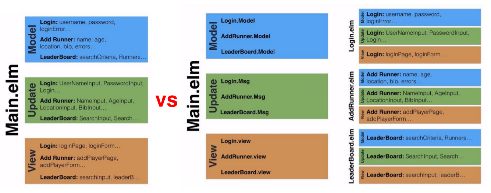

# Elm

Install Elm  
`sudo npm install -g elm`

Install Atom packages  


Build  
`elm-make Main.elm --output=../public/main.js`  

## App Build Order  

1. Connect modules / Navigation
2. Login
3. Saving Token
4. Logout
5. Lock/Control Access to Pages
6. Individual Pages (Modules)  

# The Elm Architecture  



There are 3 main wiring parts between modules.

## ChildModule.elm
```elm
module ChildModule exposing(..)
```

## Main.elm

### 1. Model

The `Main` module doesn't need to know the details of `ChildModule`'s model. It just needs to know that the `ChildModule` has a model, which is exposed and can be referenced by using `ChildModule.Model`. The initial value can be referenced as well with `ChildModule.initModel`.

So we just need to create a `childModule` field of type `ChildModule.Model`.

```elm  
import ChildModule

type alias Model =
    { page : Page,
    , childModule : ChildModule.Model
    }

initModel : Model
initModel =
    { page = ChildModulePage
    , childModule = ChildModule.initModel
    }
```

### 2. Update  

When the message is of type `ChildModuleMsg` i.e. originating from an outside module, we pull out the included message and put it into the identifier `cmMsg`.  

The `Main` module doesn't know how to handle this message directly, but the `ChildModule`'s **update function** does (for any message in that module), so we just call it to deal with the `ChildModule`'s **model**.  

To do this, we update the model by setting the `childModule` field to the value returned by calling the `ChildModule`'s **update function** and passing it the two parameters, the **message** `cmMsg` and the **current model** for the child module `model.childModule`

```elm  
type Msg
    = ChangePage Page
    | ChildModuleMsg ChildModule.messages

update : Msg -> Model -> Model
update msg model =
    case msg of
        ChangePage page ->
            { model | page = page }

        ChildModuleMsg cmMsg ->
            { model | childModule = ChildModule.update cmMsg model.childModule }
```
### 3. View  

This is a **GOTCHA** part due to the different `Html Msg` types. We need to transform the html capable of generating `ChildModule` messages into `Html` capable of generating `Main` messages by using `map`.  

The first parameter for the `map` function is a transformation function, which is the `ChildModuleMsg`'s type constructor that acts as a function.

The second parameter is the `ChildModule`'s view function with the **current model** as an argument, hence the tuple.  

**In other words, we are transforming any message coming from the child view, into main messages by using map.**  

```elm
view : Model -> Html Msg
view model =
    let
        page =
            case model.page of
                ChildModulePage ->
                    Html.map ChildModuleMsg (ChildModule.view model.childModule)
    in
        div [] [ page ]

```
