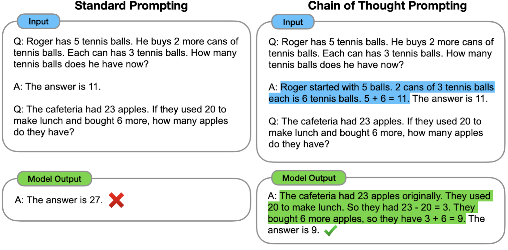
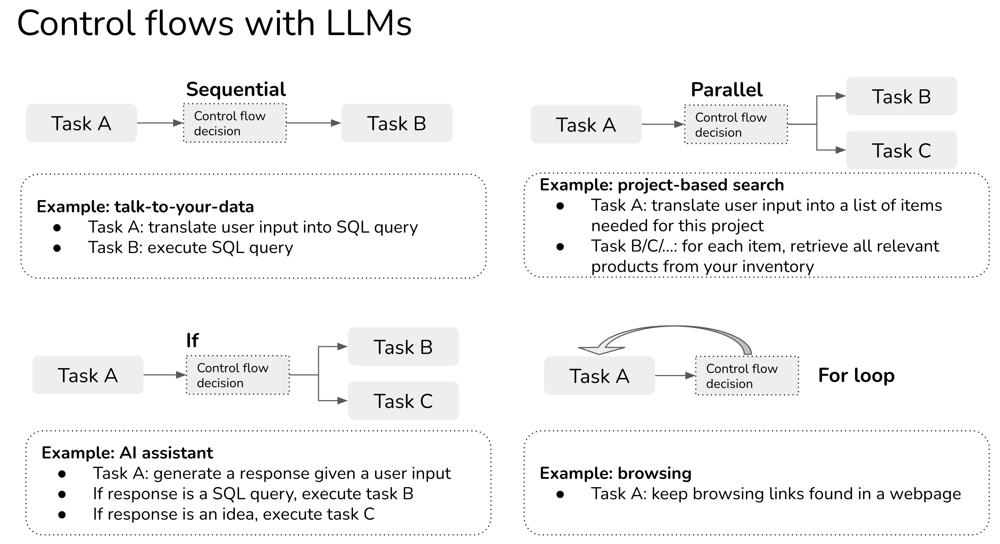

So many things just boil down to very creative rearrangement of prompts.

Prompting is VERY finnicky, it's very sensitive to the way that you prompt.

# Prompt engineering

How to communicate with LLM to steer its behavior for desired outcomes without updating the model weights.

"Prompt engineering" describes a rigorous discipline that aims to utilize prompting as a way to build reliable functionality for real-world applications. It differs from ChatGPT-style prompting because the prompts generated through prompt engineering are usually meant to be used repeatedly in high-volume, diverse situations in order to solve a specific problem reliably for an application.

# Blind prompting

"Blind Prompting" is a term I am using to describe the method of creating prompts with a crude trial-and-error approach paired with minimal or no testing and a very surface level knowedge of prompting. Blind prompting is not prompt engineering.

# Transactional vs Interactive Prompting

Prompt engineering is primarily about transactional prompting, and a considerable amount of confusion or negativity arises when an individual tries to apply it to interactive prompting.

Interactive prompting is ChatGPT-style prompting where you're having more of a discussion with the language model. If the model returns an unclear response, you can use the pre-existing context to make clarifications and guide the model towards the correct response. Further, interactive prompting is driven primarily by a human being.

Transactional prompting treats the language model more like a function in a programing language: you give it some input and desire some output. This isn't limited to a single prompt, you may chain prompts or perform "agent"-like behaviors here. The point is that you're treating the language model transactionally for a very specific problem, usually at high volume, and driven by software.

# General advice

Choice of prompt format, training examples, and the order of the examples can lead to dramatically different performance,

-   Be assertive, rather than defensive.
-   Be clear and concise, instead of repetitive and long.
-   Try to give tricky gotcha examples where the model is likely to fail.
-   Give diverse and relevant examples.
-   Extract information while offloading tasks to code. Ex. Instead of having the AI write SQL queries, have the AI extract the user's interest and then input that into a SQL query tool.
-   You can also use it to write and execute code Ex.
    -   Task 1: convert natural language input from user to SQL query [LLM]
    -   Task 2: execute SQL query in the SQL database [SQL executor]
    -   Task 3: convert the SQL result into a natural language response to show user [LLM]
-   Put the examples in random order to avoid majority label bias and recency bias.
-   Order the examples from shortest to longest.
-   Describe the task requirement in details, trying to be specific and precise.
-   Break the task into smaller tasks.
-   Avoid saying "not do something", but rather specify what to do.
-   Separate reasoning steps with `newline \n` symbol, which works better than `step i`, period `.` or semicolon `;`.
-   Changing `Q:` to `Question:` is found to be helpful.

# Test set i.e. examples

```
Q: Dinner with Alice next Tuesday at Taco Bell
A: next Tuesday

Q: CorpConf on 11/4
A: 11/4

Q: 1:1 with Bob tomorrow at 10 AM
A: tomorrow
```

We only have three demonstrations. In reality, you probably want at least a dozen. The more demonstrations you have the better testing you can do, but also the more expensive it becomes due to token usage. At a certain size, it is often more economical to fine-tune a language model.

1. Extract only one piece of information. Do not extract any other info than the time.
2. Do not transform the output. Don't use the model to turn the extracted informtaion into dates. Use date libraries for that ex. tomorrow = date.
3. Keep the output as simple and flexible as possible. Perform normalization operations in your application. Performing too much "output shaping" in the LLM early on makes it difficult to separate an LLM's ability to perform some core task (information extraction in this case) from its ability to structure the output.

# Zero-shot prompting

Zero-shot learning is to simply feed the task text to the model and ask for results.

The goal is to come up with some good zero-shot prompts. The zero-shot prompts can be transformed into few-shot and those can be further transformed into chain of thought. And each of those can be further turned into batched prompts and so on.

```
Identify the date or day mentioned in the given text and provide it as the output.

Identify the date or day mentioned in the given event description.

Determine the date or day from each input and provide the output accordingly as a single word or date.
```

These are all reasonable prompts. Given any educated human, every prompt would likely yield very high accuracy. But language models are not human, so we can't automatically expect equivalent performance. I've Very reasonable prompts can have abysmal performance.

```
Text: i'll bet the video game is a lot more fun than the film.
Sentiment:
```

# Testing

This has to be done per-model.

With a set of candidate prompts as well as a demonstration set, we can now measure accuracy. Run through each demonstration and perform the following prompt template:

```
{{prompt}}. Q: {{input}} A:
```

Always test zero-shot first. I want to get a baseline accuracy metric. From there, you can then test few-shot and compare not only different candidates but different prompting types.

```bash
# subset of test set, much larger than real test set

Question: Macbook
Answer: Apple

Question: Android
Answer: Google

Question: Cup
Answer: n/a

Question: 777
Answer: Boeing

Question: Civic
Answer: Honda

Question: Model S
Answer: Tesla

Question: Plate
Answer: n/a

# Possible prompts

Find the company associated with each product and if there is non, write 'n/a'.
# accuracy: 23%

For each input, write the name of the manufacturer that is most commonly associated with it. Write 'n/a' if there is no company associated with it. Output only the company. Do not explain anything.
# accuracy: 55%

Write the name of the company or manufacturer that is most commonly associated with it; if there is no such company or manufacturer, write 'n/a'.
# accuracy: 92%

Identify the company most commonly associated with the given product or write 'n/a' if there is no specific association.
# accuracy: 96%
```

# Reverse testing

Ask the model to give you examples for the desired output, and use the same examples in the prompt to see if they give the same result.

# Few-shot prompting

Few-shot learning presents a set of high-quality demonstrations, each consisting of both input and desired output, on the target task. As the model first sees good examples, it can better understand human intention and criteria for what kinds of answers are wanted. Therefore, few-shot learning often leads to better performance than zero-shot. However, it comes at the cost of more token consumption and may hit the context length limit when input and output text are long.

```
Identify the date or day mentioned in the given text and provide it as the output.

Q: Dinner with Alice next Tuesday at Taco Bell.
A: next Tuesday

Q: 1:1 with Bob tomorrow at 10 AM.
A: tomorrow

Q: CorpConf on 11/4.
A:
```

```
Text: (lawrence bounces) all over the stage, dancing, running, sweating, mopping his face and generally displaying the wacky talent that brought him fame in the first place.
Sentiment: positive

Text: despite all evidence to the contrary, this clunker has somehow managed to pose as an actual feature movie, the kind that charges full admission and gets hyped on tv and purports to amuse small children and ostensible adults.
Sentiment: negative

Text: for the first time in years, de niro digs deep emotionally, perhaps because he's been stirred by the powerful work of his co-stars.
Sentiment: positive

Text: i'll bet the video game is a lot more fun than the film.
Sentiment:
```

```
Given a text, give it a controversy score from 0 to 10.

Examples:

1 + 1 = 2
Controversy score: 0

Starting April 15th, only verified accounts on Twitter will be eligible to be in For You recommendations
Controversy score: 5

Everyone has the right to own and use guns
Controversy score: 9

Immigration should be completely banned to protect our country
Controversy score: 10

The response should follow the format:

Controversy score: { score }
Reason: { reason }

Here is the text.
```

# Instruction prompting

The purpose of presenting few-shot examples in the prompt is to explain our intent to the model; in other words, describe the task instruction to the model in the form of demonstrations. However, few-shot can be expensive in terms of token usage and restricts the input length due to limited context length. So, why not just give the instruction directly?

```
Please label the sentiment towards the movie of the given movie review. The sentiment label should be "positive" or "negative".

Text: i'll bet the video game is a lot more fun than the film.
Sentiment:
```

```
Definition: Determine the speaker of the dialogue, "agent" or "customer".
Input: I have successfully booked your tickets.
Ouput: agent

Definition: Determine which category the question asks for, "Quantity" or "Location".
Input: What's the oldest building in US?
Ouput: Location

Definition: Classify the sentiment of the given movie review, "positive" or "negative".
Input: i'll bet the video game is a lot more fun than the film.
Output:
```

# Chain-of-Thought prompting (CoT)

Prompt the model to explain or explain step-by-step how it arrives at an answer.

Generate a sequence of short sentences to describe reasoning logics step by step, known as reasoning chains or rationales, to eventually lead to the final answer. The benefit of CoT is more pronounced for complicated reasoning tasks. Simple tasks only benefit slightly from CoT prompting.

Few-shot CoT. It is to prompt the model with a few demonstrations, each containing manually written (or model-generated) high-quality reasoning chains.

```
Question: Tom and Elizabeth have a competition to climb a hill. Elizabeth takes 30 minutes to climb the hill. Tom takes four times as long as Elizabeth does to climb the hill. How many hours does it take Tom to climb up the hill?
Answer: It takes Tom 30*4 = <<30*4=120>>120 minutes to climb the hill.
It takes Tom 120/60 = <<120/60=2>>2 hours to climb the hill.
So the answer is 2.
===
Question: Jack is a soccer player. He needs to buy two pairs of socks and a pair of soccer shoes. Each pair of socks cost $9.50, and the shoes cost $92. Jack has $40. How much more money does Jack need?
Answer: The total cost of two pairs of socks is $9.50 x 2 = $<<9.5*2=19>>19.
The total cost of the socks and the shoes is $19 + $92 = $<<19+92=111>>111.
Jack need $111 - $40 = $<<111-40=71>>71 more.
So the answer is 71.
===
Question: Marty has 100 centimeters of ribbon that he must cut into 4 equal parts. Each of the cut parts must be divided into 5 equal parts. How long will each final cut be?
Answer:
```

Zero-shot CoT. Use natural language statement like `Let's think step by step` to explicitly encourage the model to first generate reasoning chains and then to prompt with `Therefore, the answer is` or a similar statement `Let's work this out it a step by step to be sure we have the right answer`.

```
Question: Marty has 100 centimeters of ribbon that he must cut into 4 equal parts. Each of the cut parts must be divided into 5 equal parts. How long will each final cut be?
Answer: Let's think step by step.
```

In chain of thought prompting (below, right), the model is prompted to produce intermediate reasoning steps before giving the final answer to a multi-step problem.

Whereas standard prompting asks the model to directly give the answer to a multi-step reasoning problem, chain of thought prompting induces the model to decompose the problem into intermediate reasoning steps, in this case leading to a correct final answer.



# Self-Ask

A method to repeatedly prompt the model to ask following-up questions to construct the thought process iteratively. Follow-up questions can be answered by search engine results

```
Question: Who lived longer, Theodor Haecker or Harry Vaughan Watkins?

Are follow up questions needed here: Yes.

Follow up: How old was Theodor Haecker when he died?
Intermediate answer: Theodor Haecker was 65 years old when he died.

Follow up: How old was Harry Vaughan Watkins when he died?
Intermediate answer: Harry Vaughan Watkins was 69 years old when he died.

So the final answer is: Harry Vaughan Watkins.
```

# Control Flow

In the example above, sequential is an example of a control flow in which one task is executed after another. There are other types of control flows such as parallel, if statement, for loop.

-   Sequential: executing task B after task A completes, likely because task B depends on Task A. For example, the SQL query can only be executed after it’s been translated from the user input.
-   Parallel: executing tasks A and B at the same time.
-   If statement: executing task A or task B depending on the input.
-   For loop: repeat executing task A until a certain condition is met. For example, imagine you use browser action to get the content of a webpage and keep on using browser action to get the content of links found in that webpage until the agent feels like it’s got sufficient information to answer the original question.



In traditional software engineering, conditions for control flows are exact. With LLM applications (also known as agents), conditions might also be determined by prompting.

For example, if you want your agent to choose between three actions search, SQL executor, and Chat, you might explain how it should choose one of these actions as follows (very approximate), In other words, you can use LLMs to decide the condition of the control flow!

```
You have access to three tools: Search, SQL executor, and Chat.

Search is useful when users want information about current events or products.

SQL executor is useful when users want information that can be queried from a database.

Chat is useful when users want general information.

Provide your response in the following format:

Input: { input }
Thought: { thought }
Action: { action }
Action Input: { action_input }
Observation: { action_output }
Thought: { thought }
```

**Talk-to-your-data** is the most popular enterprise application (so far). Many, many startups are building tools to let enterprise users query their internal data and policies in natural languages or in the Q&A fashion. Some focus on verticals such as legal contracts, resumes, financial data, or customer support. Given a company’s all documentations, policies, and FAQs, you can build a chatbot that can respond your customer support requests.

The main way to do this application usually involves these 4 steps:

Organize your internal data into a database (SQL database, graph database, embedding/vector database, or just text database)
Given an input in natural language, convert it into the query language of the internal database. For example, if it’s a SQL or graph database, this process can return a SQL query. If it’s embedding database, it’s might be an ANN (approximate nearest neighbor) retrieval query. If it’s just purely text, this process can extract a search query.
Execute the query in the database to obtain the query result.
Translate this query result into natural language.

# Cost

For example, you may find that the few-shot variant performs best, but its only 4% more accurate on the test set and requires 200% more tokens (effectively doubling the cost for current API-driven models). You may determine for your business that its worth being 4% less accurate for half the cost.

Test different models. Sometimes, using more tokens on a lower cost model will save significant money vs. low-token usage on a higher cost model.
