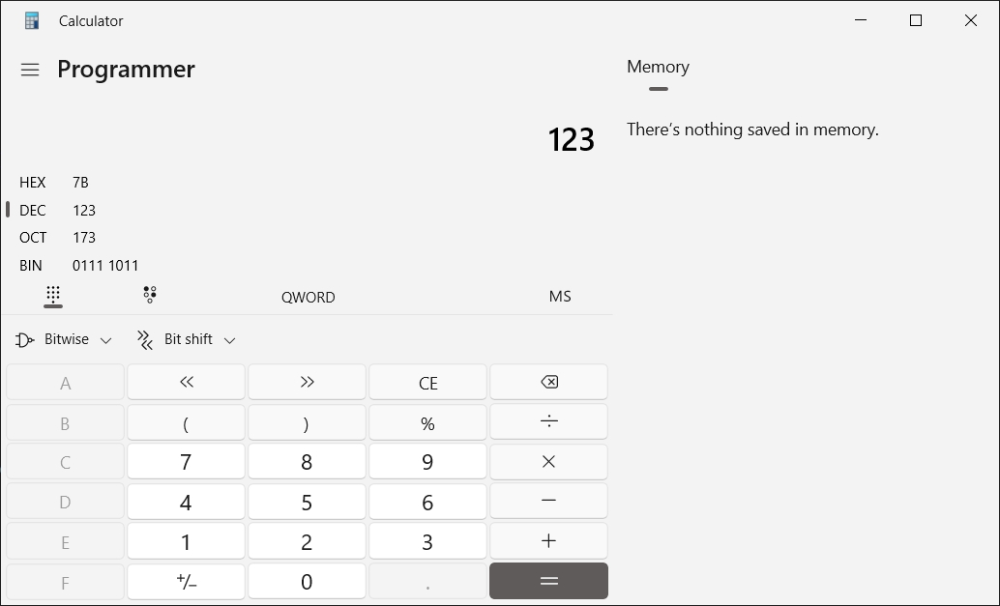

# Converting

Windows has a cool calculator for conversions, you just choose the `Programmer` mode.

# Bases

> A way to represent the same binary data in different ways i.e. characters. base = how bytes are represented.

The number `123` represented in various bases.

These are the most used in computer science.

| Base   | Name            | Digits Used         | 123 in this Base | Where It's Used                                                                                      |
| ------ | --------------- | ------------------- | ---------------- | ---------------------------------------------------------------------------------------------------- |
| **2**  | **Binary**      | 0, 1                | **01111011**     | Computers, logic circuits, programming (e.g., `0b01111011` in JavaScript)                            |
| **8**  | **Octal**       | 0–7                 | **173**          | Early computing, UNIX file permissions (`chmod 755`), aviation transponders                          |
| **16** | **Hexadecimal** | 0–9, A–F            | **7B**           | Memory addressing in computers, web colors (`#7B5A5A`), assembly programming memory addresses `0xFF` |
| **64** | **Base-64**     | 0–9, A–Z, a–z, +, / | **MTIz**         | Data encoding (e.g., email attachments, URLs, images in web development)                             |

These have other use cases.

| Base   | Name            | Digits Used      | 123 in this Base | Where It's Used                                                         |
| ------ | --------------- | ---------------- | ---------------- | ----------------------------------------------------------------------- |
| **3**  | **Ternary**     | 0, 1, 2          | **11100**        | Theoretical computing, balanced ternary systems, quantum computing      |
| **4**  | **Quaternary**  | 0, 1, 2, 3       | **1323**         | DNA sequencing (A, T, C, G), some ancient counting systems              |
| **5**  | **Quinary**     | 0, 1, 2, 3, 4    | **1443**         | Some old counting systems, used by some cultures (e.g., tally marks)    |
| **6**  | **Senary**      | 0, 1, 2, 3, 4, 5 | **323**          | Some dice games, music theory (hexachords)                              |
| **10** | **Decimal**     | 0–9              | **123**          | Everyday numbers, finance, science                                      |
| **12** | **Duodecimal**  | 0–9, A, B        | **A3**           | Old British currency (12 pence = 1 shilling), time (12 hours per cycle) |
| **20** | **Vigesimal**   | 0–9, A–J         | **63**           | Mayan numerals, some languages (French: **quatre-vingts** for 80)       |
| **60** | **Sexagesimal** | 0–59             | **2:03**         | Time (60 seconds, 60 minutes), angles (360 degrees), Babylonian math    |

# base-2 (Binary)

> 1, 0

Most basic representation. 1 byte is 8 binary characters or bits.

| Base-2 | 27 | 26 | 25 | 24 | 23 | 22 | 21 | 20 |
| :----- | :------------ | :------------ | :------------ | :------------ | :------------ | :------------ | :------------ | :------------ |
| Value  | 128           | 64            | 32            | 16            | 8             | 4             | 2             | 1             |
| Binary | 0             | 1             | 1             | 1             | 1             | 0             | 1             | 1             |

123  
= 64 + 32 + 16 + 8 + 2 + 1  
= 26 + 25 + 24 + 23 + 21 + 20  
= 01111011 (binary)

# base-10 (Decimal)

> 0, 1, 2, 3, 4, 5, 6, 7, 8, 9

The number system we use in everyday life.

| Base-10 | 103 | 102 | 101 | 100 |
| :------ | :------------- | :------------- | :------------- | -------------- |
| Value   | 1000           | 100            | 10             | 1              |
| Decimal | 0              | 1              | 2              | 3              |

123  
= 100 + 20 + 3  
= 1\*100 + 2\*10 + 3\*1  
= 1\*102 + 2\*101 + 3\*100  
= 123 (decimal)

# base-16 (Hexadecimal)

> 0123456789ABCDEF

| 0   | 1   | 2   | 3   | 4   | 5   | 6   | `7` | 8   | 9   | A   | `B`  | C   | D   | E   | F   |
| :-- | :-- | :-- | :-- | :-- | :-- | :-- | :-- | :-- | :-- | :-- | :--- | :-- | :-- | :-- | :-- |
| 0   | 1   | 2   | 3   | 4   | 5   | 6   | `7` | 8   | 9   | 10  | `11` | 12  | 13  | 14  | 15  |

Encodes 1 byte (8 bits) into 2 hex characters.

| Base-16 | 163 | 162 | 161 | 160 |
| :------ | :------------- | :------------- | :------------- | -------------- |
| Value   | 4096           | 256            | 16             | 1              |
| Decimal | 0              | 0              | 7              | B (11)         |

123  
= 112 + 11  
= 7\*16 + 11\*1  
= 7\*161 + 11\*160  
= 7B (hex)  
= 7Bh  
= 0x7B

> Hexadecimal numbers have either a `0x` prefix or an `h` suffix. So either `0x7B` or `7Bh`.

Ex. The number `9999` is represented like this:

| Base-16 | 163 | 162 | 161 | 160 |
| :------ | :------------- | :------------- | :------------- | -------------- |
| Value   | 4096           | 256            | 16             | 1              |
| Decimal | 2              | 7              | 0              | F (15)         |

9999  
= 8192 + 1792 + 15  
= 2\*4096 + 2\*256 + 15\*1  
= 2\*163 + 7\*162 + 15\*160  
= 270F (hex)  
= 270Fh  
= 0x270F

# base-64

> 0123456789ABCDEFGHIJKLMNOPQRSTUVWXYZabcdefghijklmnopqrstuvwxyz+/

123  
= 22 + 29 + 18 + 61  
= 7\*16 + 11\*1  
= 7\*161 + 11\*160  
= 7B (hex)  
= 7Bh  
= 0x7B

---

ex. Encode an image binary as text.

Encodes 3 source bytes (24 bits) into 4 base-64 characters.

I was curious how on EARTH base64 can convert 3 input bytes into 4 output bytes for just 33% space growth (whereas hex converts 1 input byte into 2 output bytes for 100% space growth). Why specifically 3 input bytes?

The answer is:

3 bytes = 3 x 8 bits = 24 bits.

Why that magic "24 bits" number? Well, base 64 represents the numbers 0 to 63. How are those represented in binary? With 000000 (0) to 111111 (63).

Bingo! Each base64 character represents 6 bits of input data using a single output byte (a single character such as "Z", etc).

So 24 bits (3 full bytes of input) / 6 bits (base64 alphabet) = 4 bytes of base64. That's it!

You may think "Why not base128 (7 bits of input = 8 bits of output), at just 14% size growth when encoding?". The answer for that is that base64 is the best we can find, since the lower 128 ASCII characters aren't all printable. Many are control characters such as NULL etc.

There are obviously ways to create other systems such as perhaps "base81" etc, since you can do anything you want if you create a custom encoding algorithm. But the beauty of base64 is how it encodes data so cleanly in chunks of 6 bits. So that encoding scheme became popular.
