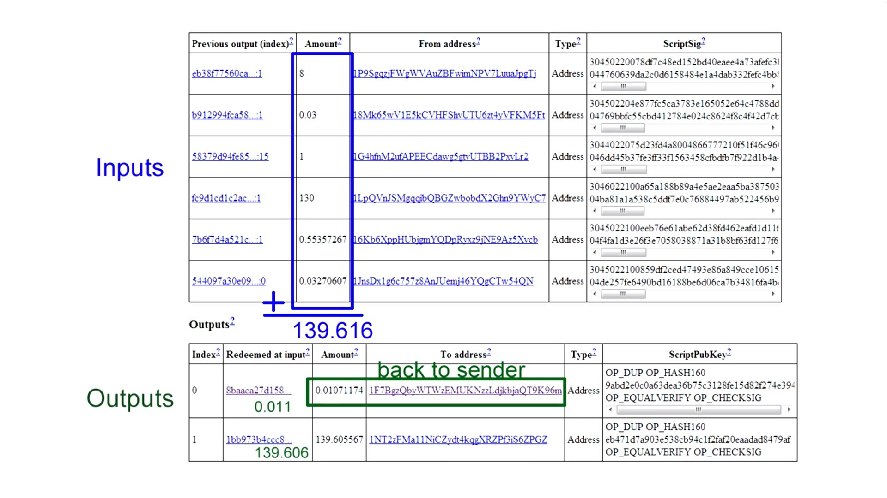

# Overview

The whole thing can be summarized as death of the middleman.

Hash = Unique string of characters representing any value  
Wallet (Private/Public key) = Identity  
Blockchain = Decentralized database  
Ethereum = Infrastructure for runnig blockchain apps  
Smart-contract = Self-executing code on a blockchain  
IPFS = P2P protocol like torrents
MetaMask = Browser extension that connects to wallet and allows interaction with DApps

# Hashing

A hashing algorithm compresses ANY data into a single string of characters, called a `hash`.

The data can range from empty, to all the books in the world... and it would still result in the same length string.

It's impossible to convert a hash back to the original value.

The most popular hashing algorithm is `SHA-256`, which outputs a value 256 bits long.

```bash
# data
hello

# hash
2cf24dba5fb0a30e26e83b2ac5b9e29e1b161e5c1fa7425e73043362938b9824
```

A single different character completely changes the hash.

```bash
# data
hello!

# hash
ce06092fb948d9ffac7d1a376e404b26b7575bcc11ee05a4615fef4fec3a308b
```

# Private/Public Key

These values are mathematically tied, where the public key is derived from the private, and not the reverse.

## Private key

You don't need a central authority to get one. You can just make up your own. Only you know it, and protect it.

```
104919795919952275347884100610276964082252207442738227310480997395085948872695
```

## Public key

Derived from a public key. Everyone knows it.

```
04ac3e5eeb3622baa743e3662f16d7552f20079f5daf7dde5bd58ea80495ef495966281ae2d7fe37fe749410e09fd8d315e6193ddb429c1f21af24688f4d7b7ee8
```

## Signature

Used to verify the authenticity of something.

Created by the Elliptic Curve Digital Signature Algorithm (ECDSA) and "Mathematical Trap Door".

Let's say we want to send a `message`.

```
Hello world!
```

We use the `message` and the sender's `private key` to create a `signature`. The `signature` depends on the `message`, so it's different for every one i.e. can't be reused.

```bash
sign(message, privateKey) = signature

3044022003d1dc8ee81f09a79979d9fd687deed50aaa4f5408c1359fd979b9baa2edd12f022037e5a69f82437ca7cb82c97012f1d297f3e57de335b90fd67e40cb3bac457b35
```

We then compare the `signature` to the sender's `public key` to verify that the one who signed/sent it had access to the `private key` i.e. is the author.

```
verify(message, signature, publicKey) = true/false
```

You can think of the `private key` as the true password, and the `signature` as an intermediary that proves you have the password without requiring you to reveal it.

# Wallet

Anyone can create a wallet i.e. a public/private key pair (asymmetric encryption). You can derive the public key from the private, but not the reverse. Wallets can be created offline, and then accessed later with the private key.

**Public key** = wallet address = bank account number  
**Private key** = proof of ownership

The blockchain only holds wallet transactions, it does not have all the wallets in existence, thus, wallets don't "exist" until they are written on the blockchain.

You can transfer coins to a wallet that doesn't exist, i.e. destroying them, unless someone can generate the private key for the wallet.

Wallets i.e. storing your public/private key pair can be:

-   hot (app) least secure
-   cold (hardware)
-   paper (offline) most secure

Ex. Paper wallet:

1. Create public/private keys offline
2. Print them out
3. Destroy digital keys
4. Add coins to wallet i.e. public key

## 12-word recovery phrase

12 words used to conveniently recover a private key, which are generated in conjunction with your private/public key pair. Not all wallets provide a 12-word phrase.

When you submit a 12-word phrase to a wallet software, it interprets the words into representing your private key. You could say that your 12-word phrase is your private key.

# MetaMask

Browser extension that connects to wallet and allows interaction with DApps

# Blockchain

The death of the middleman.

A system that lets a group of computers maintain data.

It's decentralized/P2P database that's:

-   Distributed - Everyone has a copy
-   Immutable - Past data can't be changed
-   Permissionless - No single authority

The system is designed so that no trust is needed. It's protected by math.

Ideal for trustless systems:

-   Decentralized applications (DApps)
-   Monetary transactions
-   Transfer of value
-   Voting systems
-   Verification of trusted data (identity, property, reputation, credibility...)
-   Public Key Verification

Some blockchains: Cosmos, Ethereum, Filecoin, EOS, Polkadot...

## How it works

It's a linked list of blocks that can contain any data, called tokens. Example, Bitcoin stores transactions.

A block is connected to the previous block via the hash of the previous block's contents. This guarantees nothing can be changed without breaking the whole chain.

To change anything in block 42, you will invalidate the current hash, which will invalidate the next block, and so on. Meaning, you'd have to redo all the intensive calculations.

```
+-------+-------------+       +-------+-------------+       +-------+-------------+
| block | 42          |       | block | 43          |       | block | 44          |
+-------+-------------+       +-------+-------------+       +-------+-------------+
| nonce | 26486       |       | nonce | 82590       |       | nonce | 40596       |
+-------+-------------+       +-------+-------------+       +-------+-------------+
| token | foo         |       | token | bar         |       | token | baz         |
+-------+-------------+       +-------+-------------+       +-------+-------------+
| prev  | 00006908f50 |   |---| prev  | 00008ccb2fc |   |---| prev  | 000029942f0 |
+-------+-------------+   |   +-------+-------------+   |   +-------+-------------+
| hash  | 00008ccb2fc |---|   | hash  | 000029942f0 |---|   | hash  | 0000f79349c |
+-------+-------------+       +-------+-------------+       +-------+-------------+
```

# Cryptocurrency vs Token

Cryptocurrencies and tokens are blockchain-based digital assets.

Cryptocurrencies have their own blockchains, whereas tokens are built on an existing blockchain.

| Blockchain | Cryptocurrency |
| ---------- | -------------- |
| Bitcoin    | BTC            |
| Ethereum   | ETH            |
| Solana     | SOL            |
| Cardano    | ADA            |

On Ethereum, all tokens are contracts, but not all contracts are tokens.

While crypto tokens, like cryptocurrency, can hold value and be exchanged, they can also be designed to represent physical assets or more traditional digital assets, or a certain utility or service.

For instance, there are crypto tokens that represent tangible assets such as real estate and art, as well as intangible assets such as processing power or data storage space.

Tokens are also frequently used as a governance mechanism for voting on specific parameters like protocol upgrades and other decisions that dictate the future direction of various blockchain projects.

The process of creating crypto tokens to serve these various functions is known as tokenization.

# Bitcoin

Bitcoin is a "ledger" or more accurately, a giant list of transactions, in a blockchain

It's also its own currency.

Process:

1. Sender sends coins to address.
2. Wallet signs transaction using sender's private key.
3. Transaction is propagated and validated by network nodes.
4. Miners include the transaction in the next block to be mined.
5. Miners do proof of work by calculating hashes.
6. The miner who solves the hash propagates the new block to the network.
7. Nodes verify the result and propagate the block.
8. Receiver gets confirmations with each new block created.

## Transactions (Txn)

Maximum transactions per block is 2,400.

To send money, you broadcast to the network that your account should decrease, and increase for the recipient.

The blockchain is used to order transactions. The transaction chain keeps track of how ownership changes.

Transactions in the same block are considered to have happened at the same time. Transactions that are not yet in a block are called unconfirmed/unordered.

Nodes in the network:

1. Listen for broadcasted unconfirmed transactions.
2. Verify each transactions' unique digital signature.
3. Gather `inputs` i.e. past incoming transactions to determine the balance.
4. Check every transaction ever made to see if the `inputs` are not already spent. While it may seem time consuming, it's made fast with an index of unspent transactions.
5. Add the transaction to their copy of the ledger.
6. Pass the transaction to the other nodes.
7. Solve for hash i.e. mine.

"Money" never leaves the blockchain. It simply changes ownership i.e. wallets. The blockchain tells you how much money you have.

There are no account balances in bitcoin, so to know if the sender has the money, previous blocks are checked for transactions where the sender receives money. These reference transactions are called `inputs`.



**RULE:** Each input must be used up completely in a transaction. This can lead to a different input amount than the transaction one. In this case, the remaining amount is sent back to the sender.

Each transaction can only be used once as an input. This prevents the "double spend" problem where somene can use the inputs in multiple transactions.

## Mining i.e. solving a hash i.e. creating a block

One block is created every 10 minutes.

This part is called proof of work, an easy to verify way that work has been done, without redoing it.

Nodes collect unconfirmed transactions in a block and broadcast it to the network as a suggestions for the next block.

This leads to multiple different next blocks, so how does the network decide which one should be chosen?

The first node to solve a complex math problem broadcasts their block, and gets to have their group of transactions accepted as the next in the chain. Also, they receive a block reward i.e. bitcoin.

The math problem in question is guessing a random number, that is hashed along with the entire content of a block, until the resulting hash meets a certain criteria, usually a bunch of leading zeros. The number of zeros is periodically changed so that it always takes 10 minutes to solve. The more miners, the more zeros i.e. harder to mine.

When a block is solved, all the transactions that are not included in it are returned to the unconfirmed pool, ready to be added anew.

# Ethereum

Infrastructure/Platform for runnig decetralized apps utilizing a blockchain, built with the Solidity language.

It provides a huge network of nodes running it, that you'd have to create otherwise.

It helps connect people directly without a private 3rd party, via a "decentralized super computer" comprised of all the nodes in the network.

The currency used to incentvize the network is called Ether (ETH)

## Solidity

Contract-oriented, high-level, compiled language for building smart contracts, that runs on the Ethereum Virtual Machine (EVM).

```solidity
pragma solidity ^0.5.1;

contract MyContract {
    string public value = "myValue";

    function set(string memory _value) public {
        value = _value;
    }
}

```

# Exchange

# Token

# Smart Contract

Self-executing code on a blockchain, publicly accessible to anyone.

# IPFS - InterPlanetary File System

P2P filesystem protocol similar to torrents.

# NFT - Non-Fungible Tokens

# Other

coinbase = FIAT to crypto exchange

The bought crypto sits in the exchange, similar to money in a bank.

You can move the crypto to a wallet.

Bitcoin uses proof of work i.e. you get transaction verification based on spent electricity.
Ethereum uses proof of stake i.e. you get transaction verification based on risked stake.
