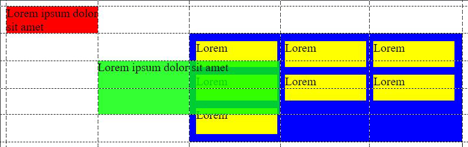

```bash
# vendor prefixes
webkit   - Safari
moz      - Firefox
o        - Opera
ms       - Internet Explorer
```

# Position: Relative vs Absolute

`position: relative` places an element relative to its current position without changing the layout around it.

`position: absolute` places an element relative to its parent's position and changing the layout around it.

### Position absolute but relative to parent

Why is `#parent { position: relative; }` required?

Because the spec says **absolutely** positioned elements are positioned **relative** to the **first positioned** parent, which means any parent that doesn't have a position value of static.

```html
<div id="parent">
    <div id="child1"></div>
    <div id="child2"></div>
</div>
```

```css
#parent {
    position: relative;
}

#child1 {
    position: absolute;
    top: 0;
}

#child2 {
    position: absolute;
    bottom: 0;
}
```

# BEM

http://getbem.com/introduction/

_"There are only two hard problems in Computer Science: cache invalidation and naming things"_ — Phil Karlton

**BEM** is a CSS naming convention and it stands for Block, Element and Modifier.

```
.block__element--modifier
```

-   **Block** - Standalone entity that is meaningful on its own.
    -   header, container, menu, checkbox, input
-   **Element** - A part of a block that has no standalone meaning and is semantically tied to its block.
    -   menu item, list item, checkbox caption, header title
-   **Modifier** - A flag on a block or element. Use them to change appearance or behavior.
    -   disabled, highlighted, checked, fixed, size big, color yellow

```html
<div class="menu">
    <a class="menu__item menu__item--active" href="/foo">foo</a>
    <a class="menu__item" href="/bar">foo</a>
    <a class="menu__item" href="/baz">foo</a>
</div>
```

```html
<div class="form">
    <input class="form__input" href="/foo" />
    <button class="form__button form__button--save">Submit</button>
    <button class="from__button form__button--delete">Cancel</button>
</div>
```

BEM CSS unambiguously defines which CSS belongs to a piece of interface and so using it gives answers to questions "Can I remove this piece of code?" and "What happens and which interface parts will be affected if I change this piece of code?".

# Grid

Grid works pretty much like a table i.e. you define a grid with columns and rows, and then assign each child element a position in the grid.

The positions are the lines at which the elements start or end. A grid with 5 columns and 5 rows is actually 6 lines across (5 columns) and 6 lines over (rows).

```html
<div id="container">
    <div id="box1">Lorem ipsum dolor sit amet</div>
    <div id="box2">
        <div class="box">Lorem</div>
        <div class="box">Lorem</div>
        <div class="box">Lorem</div>
        <div class="box">Lorem</div>
        <div class="box">Lorem</div>
        <div class="box">Lorem</div>
        <div class="box">Lorem</div>
    </div>
    <div id="box3">Lorem ipsum dolor sit amet</div>
</div>
```

```css
#container {
    display: grid;
    grid-template-columns: 1fr 1fr 1fr 1fr 1fr; /* 5 columns, 6 lines */
    grid-template-rows: repeat(5, 1fr); /* shorthand for 5 rows, 6 lines */
}
#box1 {
    background: red;
    grid-column-start: 1; /* start at column line 1 */
    grid-column-end: 2; /* end at column line 1 */
    grid-row-start: 1; /* start at row line 1 */
    grid-row-end: 2; /* end at rown line 1 */
}
#box2 {
    grid-column: 3/-1; /* start at column line 3, end at -1 (last) */
    grid-row: 2/-1; /* start at row line 2, end at -1 (last) */
    display: grid; /* Nested grid */
    grid-template-columns: repeat(3, 1fr); /* With separate columns */
    grid-gap: 10px; /* Space between columns and rows */
    padding: 10px;
    background: blue;
}
#box3 {
    background: rgba(0, 255, 0, 0.8);
    grid-column: 2/4; /* start at column line 2, end at 4 */
    grid-row: 3/5; /* start at row line 3, end at 5 */
}
.box {
    background: yellow;
}
```

This CSS would result in:  


# Flexbox

This is for 1 dimension only, unlike the 2 dimensional grid. Flexbox can either make a row, or a column.

It's not a choice of either flex or grid, but rather about combining them. Ex. A login form can be placed in the grid, but the inputs in it can flow with flex.

```css
.class {
    display: flex;
    flex-direction: column;
}
```

# Selectors

```CSS
#menuItem:hover .menuSubItems {
    /* On the menu item hover, change all elements with the menuSubItems class. */
}

#categories > ul > li {
    /* Change the lis only if they belong to the ul belonging to #categories. */
}

.menuItem ul, li {
    /* Change all uls and lis belonging to the menuItem class. */
}
```

# Animation

The animations work by flowing from a set of CSS rules, to the ones from the animation.

```css
.fadeInOut {
    opacity: 0;
    /* Use the effect, and last for 2 sec. The effect name can be anything*/
    animation: fadeInOut 2s linear forwards;
    -webkit-animation: fadeInOut linear forwards;
}

/* Fast fade in, long display, fast fade out */
@keyframes fadeInOut {
    20% {
        opacity: 1;
    } /* @ 20% of 2 sec be fully visible */
    80% {
        opacity: 1;
    } /* @ After 80% of 2 sec start fading */
}

@-webkit-keyframes fadeInOut {
    20% {
        opacity: 1;
    }
    80% {
        opacity: 1;
    }
}
```

# Fixed table header

```html
<div id="table">
    <table>
        <thead>
            <th>Header 1</th>
            <th>Header 2</th>
        </thead>
        <tbody>
            <tr>
                <td>Data 1</td>
            </tr>
            <tr>
                <td>Data 2</td>
            </tr>
            <tr>
                <td>Data 3</td>
            </tr>
        </tbody>
    </table>
</div>
```

#### CSS only

```css
th {
    position: sticky; /* This makes a header fixed/sticky */
    top: 0px; /* Won't work without this */
}
```

#### Javascript only

```javascript
document.getElementById("table").addEventListener(
    "scroll",
    function () {
        var translate = "translate(0," + this.scrollTop + "px)";
        this.querySelector("thead").style.transform = translate;
    },
    false
);
```
