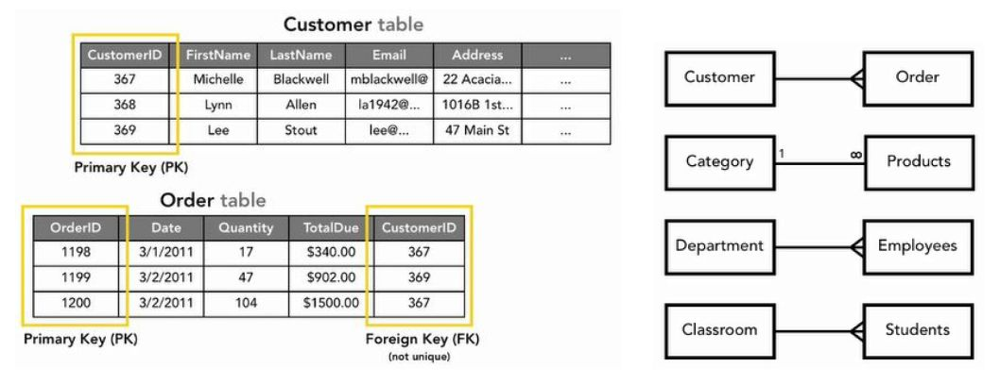
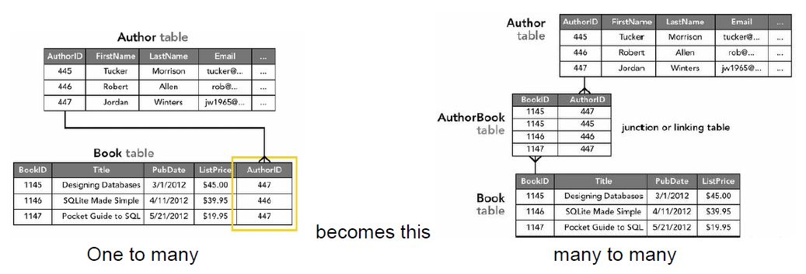
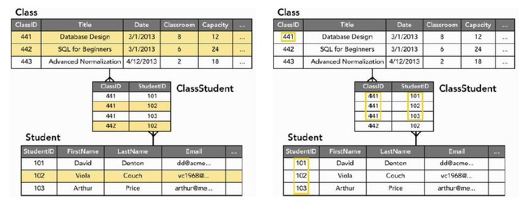
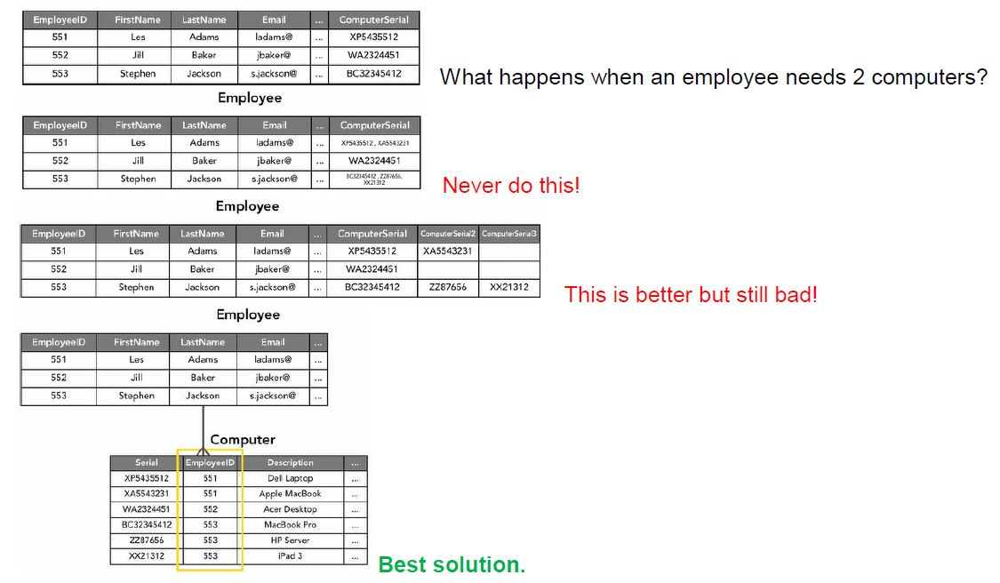
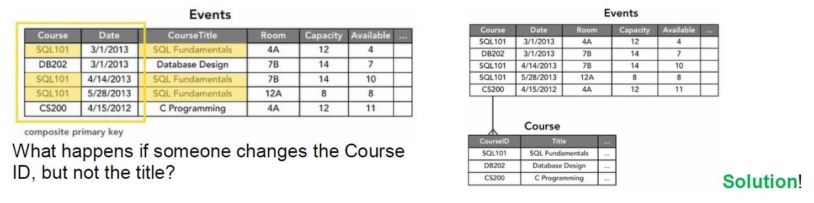
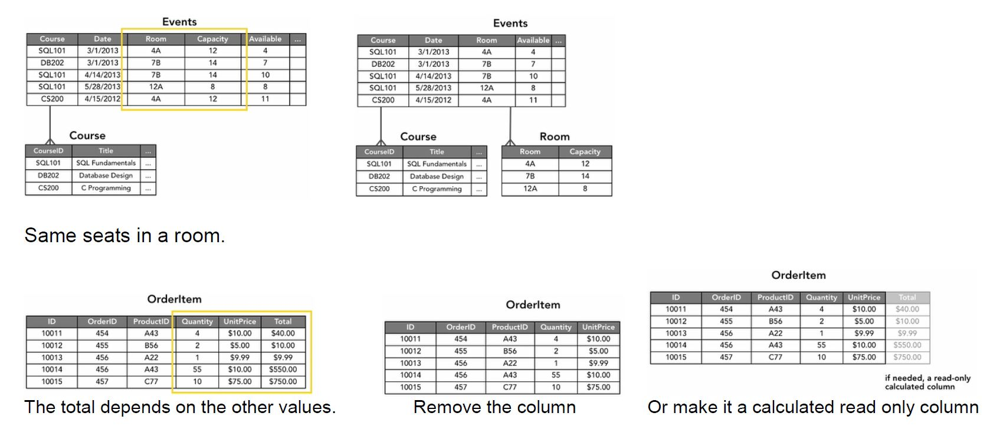

# Terminology

-   **Relational Database Management System (RDBMS)** - MySQL, SQL Serverm Postgresql
-   **schema** - database creation blueprint with column definitions.
-   **database** - company_name
-   **namespace** - client1.orders, client2.orders... sales.documents, legal.documents...
-   **table** - orders, documents...
-   **row**

# Best practices

### Naming Convention

-   **Singular form**. Both tables and columns.
-   Be consistent! Doesn't matter if you use camelCase or snake_case. Use whatever the front-end uses.
-   Avoid abbreviations or prefixes.
-   Use unique names that cannot collude with SQL/RDBMS reserved words (avoid name, order, percent...) **or** use a trailing underscore.
-   Do not use the table name followd by “id” (e.g. client_id) as your PK. id is more than enough and everyone will understand.
-   Never use capital letters in your table or field names. Ever.

### Performance

-   Always foreign key to IDs, rather than column values.
-   Try to stick to `where` clauses on indexed columns, instead of `like`.
-   Don't go crazy with `joins`.
-   Don't use varchar(255). Try to use the lowest number possible.

# Design

Relational databases are designed to work with large tables, not with large numbers of tables.  
https://stackoverflow.com/a/53816164/3878760

With proper table structures and indexing, MySQL will comfortably handle millions of rows in any table. The "Table-per-?" model is never a Good Idea and invariably comes back to haunt you (usually when you need to summarise across all those tables)  
https://dba.stackexchange.com/a/264965

In general, it is better to store all rows in a single table rather than in multiple tables. To speed queries, you should use facilities such as indexes and partitions. What I would say instead is that storing entities across multiple tables just makes managing the database trickier, so why bother? I would recommend that you store such data in a single table, perhaps partitioned by month.  
https://stackoverflow.com/a/66614149/3878760

# RAM usage

SQL engines will consume as much memory as you will allow.

The reason for this is that the engine caches the data in RAM, so that it can access if faster than it could if it needed to read the data from the disk every time a user needed it.

# Table Relationships

**Look both ways (From each perspective) when trying to determine the relationship.**

## One to Many - 90%

## Many to Many - 10%

## One to One - 0%

Not a thing.If one row points to only one row, you might as well join the tables.

Sometimes you think you have a one-to-one relationship, but you don’t. Look both ways (from each perspective) to avoid this.

# Normalization

Taking your database design through these 3 steps will vastly improve the quality of your data.

There are more than 3 Normal Forms, but usually 3 is the norm. There are more than 6.

## First Normal Form (1NF)

Each of the columns and tables should contain one and only one value without it repeating.

Usually every 1NF problem is solved by creating a new table. One of the signs for the need is when columns start having the same name with a number differentiating them. Computer1, Computer2…

## Second Normal Form (2NF)

Any non-key field should be dependent on the entire primary key i.e. “Can I figure out any of the values in the row from just part of the composite key?”. Only a problem when dealing with composite keys.

## Third Normal Form (3NF)

No non-key field is dependent on any other non-key field i.e. “Can I figure out any of the values in this row from any of the other values?”.

## Denormalization

Sometimes tables intentionally break normalization, and some only seem like they do.

Creating a new table for phones and emails would complicate things needlessly. The same goes for the area codes.

