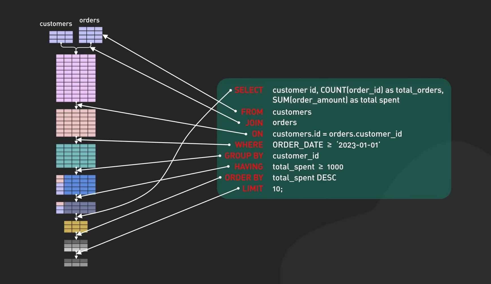

# Execution order



# Design

Relational databases are designed to work with large tables, not with large numbers of tables.  
https://stackoverflow.com/a/53816164/3878760

With proper table structures and indexing, MySQL will comfortably handle millions of rows in any table. The "Table-per-?" model is never a Good Idea and invariably comes back to haunt you (usually when you need to summarise across all those tables)  
https://dba.stackexchange.com/a/264965

In general, it is better to store all rows in a single table rather than in multiple tables. To speed queries, you should use facilities such as indexes and partitions. What I would say instead is that storing entities across multiple tables just makes managing the database trickier, so why bother? I would recommend that you store such data in a single table, perhaps partitioned by month.  
https://stackoverflow.com/a/66614149/3878760

# Performance

-   Always foreign key to IDs, rather than column values.
-   Try to stick to `where` clauses on indexed columns, instead of `like`.
-   Don't go crazy with `joins`.
-   Don't use varchar(255). Try to use the lowest number possible.

# Execution Order

# Start with filtered data sets

# Use CTEs

# Use indexes

# Efficient queries

Databases are rarely CPU bound. Their 'compute' activity is generally very low. That being said, each case is different - and it is feasible that you are the exception rather that the rule. CPU _cores_ make a difference though. Specifically, in relation to how many open connections you allow to the DB simultaneously. So if you have an 8-core CPU, and you allow 8 simultaneous connections to the DB - each one will get access to a whole core on their own. If you allow 32 simultaneous connections, each one will get a 1/4 share of a core. So more cores gives you the ability to run multiple queries simultaneously.

Why would that matter, you may ask? Because a typical modern application will usually create a pool of connections to the DB. Then, when an incoming request for data is made, it will queue up for access to the connection pool. Once it is granted access - only then will it be able to execute the query and fetch data. What if you have 2 connections in your pool. But the first query in your application is a very long query (like some sort of ad-hoc report). Then the next query goes to connection-2, and all is well - it moves along. BUT, suppose the next query is also a long query (another ad-hoc report), so it binds up time on connection-2 (connection-1 is still working on the first report). Now _all_ of your connections to the DB are busy on those 2 reports. Nothing else gets done until one of those reports finishes (or times out). The more simultaneous connections you allow, the less likely you are to run into this scenario.

OK, so now you understand the value of 'more CPU' (not speed, but cores). What about more memory (faster memory would be almost irrelevant - assuming a modern bare minimum speed and not something from the 1980s)? When you fire up a query, a lot of the work for a modern DB is done "in memory", so you need sufficient memory that each of your simultaneous connections has plenty in order to complete the queries it will be running. Too little memory will have a compound effect of slowing down your queries and backing up your connections (due to slower queries). If you have significantly too little memory, some queries will not even run.

Storage I/O (faster storage) can also make a huge difference in DB performance. An SSD based DB will be significantly faster than a 'spinny disc' DB in nearly all cases, but especially READ performance. There are ways to mitigate this difference (RAID with redundant discs), but even with the mitigations, SSDs will perform better almost always. That being said, if everything else is waaay underpowered, even the best disc I/O will be nearly unnoticeable. The DB is a 'system' and the whole system is only as fast as the slowest link.

Another concern is Network I/O. I've seen a lot of DB systems where the application lives on app servers and the DB is a separate host that is shared across several different app servers. Imagine a case of a busy DB with 10 app servers hitting it. All 10 app servers have 10Gbps network interfaces, and the DB also has a 10Gbps network interface. Now, if each app server queries the DB and sucks down a large BLOB data record - you are going to saturate your DB server's network interface trying to deliver BLOBs of data to 10 different app servers.

The last point I want to make - nearly all DB performance issues are the result of poor DB normalization and query generation - and not related (explicitly) to the hardware running the DB. I can fire up a DB on the biggest, baddest, fastest super computer and and write a terrible query that will make it slow. I can run the same DB on a laptop and write an efficient query that will be blazing fast - and return the same data. Often times, people looking to 'improve DB performance by buying hardware' are really looking to compensate for badly designed table relationships and queries. The most significant thing in making most SQL DBs are indices. A good index can take a 20 second query and "fix" it to 10ms. And setting up indices isn't that hard. The problem is, indices take a lot of extra disc space, and require regular maintenance. Oh, and they aren't a 'magic wand' that will fix a poorly normalized DB, or resolve a badly structured query.

Now, for an example from my career. I was a Director of Professional Services for a team that built large websites for our clients. I was called out to help one of our teams that was experiencing severe performance issues on one of our client's builds. When I got there, I spent some time working with the team to see the symptoms they were experiencing. They were pointing out that the issue didn't appear in their development environment, but as soon as they tried to fire it up in production, the system would slow to a crawl and everything stopped working. I took a look at some of their code and saw a snippet where they did a SQL request to get a list of customers. Then, in a separate code fragment, they would take the results of the first query, and in a "loop" do a subsequent series of queries to get data for each customer found in the first query. I immediately understood the issue: in their development environment, they had ~10 customers in the dev database. But in production, they had 100s of millions of customers (this was a large web platform). Their first query, in development, returned a maximum of 8–10 records, which then bloomed into several dozen follow-on queries in the 'while' loop. But in production, their first query returned several thousand customer records, which bloomed into 100s of thousands of follow-on queries. I asked them why they didn't just get all the data they needed from the first query (using a join in SQL), and they said: "we didn't know how to do that"… Changing that code logic fixed the issue.

Likewise, I've seen many cases where the developer lazily does a "select _ from …" pattern in their code. The '_' means - bring me all the columns for this query. Then, in the code, they only use a small subset of the returned columns to perform the code operation. This lazy effort causes extra work for the DB. First, there's a lot of extra disc I/O from fetching the columns that aren't used. Second, that data has to be transmitted from the DB to the app server over the network - wasting network bandwidth (and time). Lastly, the data is ingested (usually in memory) by the app server, taking up a larger than needed memory footprint for the app server. All this for data that is essentially discarded after it is fetched from the DB. It's like packing all of your trash when you move to a different home. What a waste… It is far better to specify exactly which columns your code will need in the returned data - and then you save all the wasted space/effort/bandwidth.

Lastly, if you are having performance issues with a DB - checking the "slow query logs" is a good place to start. See which queries show up there the most (or take the longest times) and work on fixing those one at a time. Review the log and build a list of the worst offenders. Fix the 'easiest to fix' out of the top-10 first. Then the next easiest, etc. until you have cleaned your system up. There isn't a silver bullet that gets you out of a bad design, but there is a path to fixing it that will help…

Robin Wilson

https://www.quora.com/To-improve-the-performance-in-a-SQL-server-is-it-better-to-have-a-faster-CPU-faster-memory-just-more-memory-or-faster-storage

# How to Think Like the Engine - Brent Ozar

https://training.brentozar.com/p/how-to-think-like-the-engine

SQL Server works with 8KB pages i.e. chunks of data, kinda like excel sheets. 1 page = 1 logical read.

To show how many 8K pages the executed query read, turn on the statistics with the command below.

```sql
set statistics io, time on;
```

When you select data, it starts going through each page and does work.

Number of columns or rows returned DOES NOT affect speed. Speed mostly comes down to the number of pages needed to be read, less = faster. CPU and Memory are less important for speed.

> Clustered Index = Pages ordered by the primary key i.e. ID.

Index = A literal copy of a table, but sorted by a specific column.

Small indexes help a small number of queries. Queries usually need more than 1-2 columns. Large indexes also are bad, because they slow everything down due to IO processes i.e. updates become slower.

If the only copy of the data is the Clustered Index, and you are not returning one specific ID, you are doing FULL TABLE SCANS.

SQL Server DOES NOT cache query results. It caches pages. If 5 people run the same query, it runs 5 separate times.

ORDER BY is VERY expensive, around 4 times than a regular select.

> Non-Clustered Index = A copy of a table with sorted data ahead of time. It only stores the necessary columns, so it's smaller.

RULE: Do not have an order by, if you don't have a top??? Research this.

RULE: Don't index hot columns i.e. columns that are updated regularly.

RULE: You want as fex indexes as possible that support your workload. No indexes, every select scans tables. Too many indexes, Delete/Update/Insert queries do too many writes to update the indexes. As a general rule, for each table, aim for less than 5 indexes total, with 5 columns or less per index.

Index SEEK means jump to one area and start reading. Index SCAN means start at either end of the index. Neither seek nor scan refers to how much data we'll read.

It's totally possible to have a slow seek and fast scan depending on the data you are looking for.

WHERE without a supporting index = table scan.

ORDER BY without a supporting index = CPU work to rebuild the pages.

> Key lookup = Two index approach where you get the primary keys from an index, and then you look-up the rest of the data from the original table.

Hoverin on key lookup in the execution plan shows which columns had to be fetched (Output List). Adding these to an index will prevent this and improve speed.

Be aware that key lookups don't happen once, but happend for EACH ID (imagine it's a stack of executions in the execution plan). You can check how many time it executed by hovering over it.

RULE: Execution plans are read from right to left, top to bottom.

SQL Server uses statistics to predict how much data it will process, and it then chooses the execution plan that has the lowest cost (query bucks, an arbitrary grading by Microsoft)

Query optimization:

-   Read the execution plan left to right, top to bottom, and look for the first place where estimates vs actual are very different and work on that.
-   Key lookup is chosen when the index doesn't have enough columns (so data must be retrieved). Add those columns to an index to prevent fetching and improve speed.
-   When creating wider indexes, make sure to just get the right columns on the page, and make sure that the first column is something that you are searching for. Aim for 5 indexes per table, each with 5 columns.

Creating an index. The primary key (Id) is always included by default, so you can leave it out. The first column determines the order.

This query...

```sql
SELECT Id, DisplayName, Location FROM dbo.Users
WHERE LastAccessDate >= '202-01-01'
    AND LastAccessDate < '2012-02-01'
ORDER BY LastAccessDate;
```

Is drastically improved by this index. The first column is the one the index is ordered by, so the WHERE and ORDER are much more efficient.

```sql
CREATE INDEX IX_LastAccessDate_Id_DisplayName_Location
on dbo.Users(LastAccessDate, Id, DisplayName, Location)
```

# How I Use the First Responder Kit - Brent Ozar

> If you run sp_Blitz and you do what the high priorities say... And then you run sp_BlitzFirst to find out why performance is bad, read the URL advice and follow the instructions... You won't need me - Brent Ozar

https://training.brentozar.com/p/how-i-use-the-first-responder-kit

| Procedure                   | Description                         |
| --------------------------- | ----------------------------------- |
| sp_Blitz                    | Server-wide health check.           |
| sp_BlitzFirst               | Performance check.                  |
| sp_BlitzCache               | Find the queries causing the waits. |
| sp_BlitzWho, sp_WhoIsActive | What's running now.                 |
| sp_BlitzLock                | Analyzing deadlocks.                |
| sp_BlitzIndex               | Checking indexes that help queries. |
| sp_DatabaseRestore          | Restore databases.                  |

Everything here has a link column for further research.

### Quick reference

```sql
sp_Blitz @CheckServerInfo = 1 -- Health check
sp_BlitzFirst @SinceStartup = 1 -- Top wait stats
sp_BlitzCache @SortOrder = 'avg duration', @MinutesBack = 90 -- Top 10 queries causing those wait stats
```

# sp_Blitz

Overall health check. Is the server configured optimally.

Does all kinds of checks, and orders them by priority. Level 1-50 are fireable offenses.

> DBAs don't get fired because a server is slow. They get fired if a server is down, and they can bring it back.

Use when:

-   Taking over a new SQL Server.
-   Before signing off that a server is read for production.
-   When you come back from vacation.
-   DON'T use on a scheduled basis.

Show extra data under `Server Info`.

```
sp_Blitz @CheckServerInfo = 1
```

### CHECKDB

Check for data corruption.

It's essential to run CHECKDB on a regular basis to find errors if they exist because if there's corruption, we need to fix it before our last good backups disappear.

```sql
-- Look for dbi_dbccLastKnownGood for the time it last ran.
DBCC DBINFO('StackOverflow') WITH TABLERESULTS;

-- The corruption check
DBCC CHECKDB('StackOverflow') WITH NO_INFOMSGS, ALL_ERRORMSGS;
-- 40 min execution time
```

# sp_BlitzFirst

Performance health check. Find the top server bottlenecks.

Check for performance issues as of **right now**, it helps with **everything is on fire** problems.

It takes a snapshot, and then another one after 5 seconds, and it compares the two. You can increase the gap as shown below.

```sql
sp_BlitzFirst @ExpertMode = 1, @Seconds = 60
```

A great way to use this is to set an Agent Job that runs the check every 15 minutes. Use this setting:

```
EXEC dbo.sp_BlitzFirst
@OutputDatabaseName = 'DBAtools',
@OutputSchemaName = 'dbo',
@OutputTableName = 'BlitzFirst',
@OutputTableNameFileStats = 'BlitzFirst_FileStats',
@OutputTableNamePerfmonStats = 'BlitzFirst_PerfmonStats',
@OutputTableNameWaitStats = 'BlitzFirst_WaitStats',
@OutputTableNameBlitzCache = 'BlitzFirst_BlitzCache',
@OutputTableNameBlitzWho = 'BlitzFirst_BlitzWho'
```

You can then query the tables to check what happened in the past.

```sql
sp_BlitzFirst @SinceStartup = 1
```

Base the stats on the complete server uptime. Good when you don't have an Agent Job history.

### Wait types

Use the result of this to solve with sp_BlitzCache.

```
sp_BlitzFirst @sinceStartup = 1, @OutputType = 'Top10'
```

A quick wait types report (try to have at least 24 hours of hours sample/wait time). Solve the top wait times first for the most improvement. There are links explaining each one.

# sp_BlitzCache

Find the queries causing the top bottlenecks (wait types).

It shows the top 10 most resource-intensive queries.

IMPORTANT: Run it after finding your top wait times with `sp_BlitzFirst @sinceStartup = 1, @OutputType = 'Top10'`.

By default it shows the most expensive by CPU usage, but the problem might be of another wait type, so modify the @SortOrder parameter based on your top wait type.

Based on your top wait in sp_BlitzFirst, here's a decoder ring for the 6 most common wait types, and how you should use sp_BlitzCache's @SortOrder parameter:

| wait type                      | sort         | description                                                                                                                            |
| ------------------------------ | ------------ | -------------------------------------------------------------------------------------------------------------------------------------- |
| CXPACKET, CXCONSUMER, LATCH_EX | CPU, READS   | Queries going parallel to read a lot of data or do a lot of CPU work.                                                                  |
| LCK%                           | DURATION     | Locking, so look for long-running queries, and look for the warning of "Long Running, Low CPU." That's probably a query being blocked. |
| PAGEIOLATCH                    | READS        | Reading data pages that aren't cached in RAM.                                                                                          |
| RESOURCE_SEMAPHORE             | MEMORY GRANT | Queries can't get enough workspace memory to start running.Not available in older versions of SQL.                                     |
| SOS_SCHEDULER_YIELD            | CPU          | CPU pressure.                                                                                                                          |
| WRITELOG, HADR_SYNC_COMMIT     | WRITES       | Writing to the transaction log for delete/update/insert (DUI) work.                                                                    |

```sql
sp_BlitzCache @SortOrder = 'READS'
```

It returns two results:

1. The top 10 queries by your sort order.
2. Explanations of the "Warnings" column.

IMPORTANT: Always check the bottom result first, and focus on priority 1 warnings. Read the URL explanations. Fix that first, or you're wasting time.

Look at the columns to the right for Execution, Total Reads, Total CPU etc.

A lot of times, over-night maintenance jobs will turn up as the most expensive queries. You can filter those out like this:

```sql
sp_BlitzCache @SortOrder = 'avg duration', @MinutesBack = 90 -- How many minutes since 8AM (start of work) have passed?
```

# sp_BlitzIndex

Analyzes desing issues with indexes. This is not a quick-fix script.

Index tuning is the fastest way to make queries go faster without buying hardware or spending time in development. Indexing is as much an art as a science, though: there are a lot of vague guidelines, and sometimes you have to break those guidelines in order to get better performance. sp_BlitzIndex is about analyzing your database's overall issues, understanding which indexes are just holding you back, and which indexes Clippy wants to add.

```sql
-- returns prioritized findings based on the D.E.A.T.H. optimization method.
sp_BlitzIndex

-- Inventory of existing indexes, good for copy/paste in Excel for offline analysis. Has a @SortOrder parameter for things like rows, size, reads, writes, lock time...
sp_BlitzIndex @Mode = 2, @SortOrder = 'rows'
```

You can tune indexes with the D.E.A.T.H. method:

-   Dedupe.
-   Eliminate Overlaps and unused indexes.
-   Add desperately needed indexes.
-   Tune indexes for specific queries.
-   Heaps i.e. Clustered indexes.

Look for `Est. benefit per day` above 1,000,000 as these are worth solving.

Ex. A finding of `Index Suggestion: High Value Missing Index` and a usage of `27,425 uses, Impact: 100%; Avg query cost: 810` says that this index should be created because it will speed up the query by 100%. SQL Server, under definition, gives just the columns in the table, and NOT the order they should be in. Look for the Size column to try and be around the 5 indexes with 5 columns per index, per table best practice.

If you have this query:

```sql
SELECT * FROM Phonebook WHERE LastName = 'Ozar';
```

And these indexes:

```
LastName, FirstName, MiddleName INCLUDE Address, PhoneNumber

LastName, PhoneNumber
```

You are better off with just using the first one.

### One table analysis

```sql
EXEC dbo.sp_BlitzIndex @DatabaseName='DATABASE_NAME', @SchemaName='dbo', @TableName='TABLE_NAME';
```

Results:

-   1st: Indexes we already have.
-   2nd: Desperately needed indexes.
-   3rd: Table structure.
-   4th: Foreign keys
-   5th: Table statistics. Histogram (how pages are batched) for query tuning.

### Usage stats

The amount of times the index made the query go:

-   Reads = FASTER
-   Writes = SLOWER (because of the INSERT/UPDATE/DELETE to keep the index in sync)

Remove indexes that have 0 reads, or a low read high write ratio.

Before you do any tuning, you want to server to have been up for at least 1 business cycle i.e. a full month. If the business is the same all the time (like a stock exchange), a day is enough. Avoid longer than a month.

This is an Excel friendly way to see the indexes.

### Index tuning example workflow

Create a change script:

```sql
-- The DROP and CREATE statements are generated for copying in the sp_BlitzIndex report.

/* Merge these 3 indexes into 1:

    The CURRENT definitions of the 3 indexes.

    into this new one:
*/

CREATE INDEX DownVotes_DisplayName_LastAccessDate ON dbo.Users(DownVotes, DisplayName, LastAccessDate)
GO
DROP INDEX [Index_DownVotes] ON [StackOverflow].[dbo].[Users];
DROP INDEX [DownVotes] ON [StackOverflow].[dbo].[Users];
DROP INDEX [IX_DV_LAD_DN] ON [StackOverflow].[dbo].[Users];
GO

/* Undo script (if you make a mistake and want to revert):

    The CREATE queries for the ORIGINAL 3 indexes.
*/
```

# sp_BlitzLock

Analyzes recent deadlocks, and groups them by table, query, app, login...

SQL Servers deadlock monitor wakes up every 5 seconds, looks for this scenario, and when it finds it, it kills the query that's easiest to roll back, called the victim.

Run when:

-   When sp_Blitz warns you about a high number of deadlocks per day.
-   When users complain about deadlock errors.

```sql
sp_BlitzLock
```

Usage:

1. Run with no parameters.
2. Jump to the bottom result set.
3. Identify the 1-3 tables involved in most deadlocks and tune their indexes.
4. Identify the top 1-3 queries, tune them, make them more SARGable, make their transactions short and sweet, change their isolation level.

To avoid deadlocks, you want to use tables in the same order everywhere. Otherwise, deadlocks happen like this (executed in sequence):

**LEFT SIDE**

```sql
BEGIN TRAN

-- Run 1st
UPDATE dbo.Lefty
    SET Numbers = Numbers + 1;
GO

-- Run 3rd -- BLOCKING HAPPENS HERE, NOT DEADLOCK!
UPDATE dbo.Righty
    SET Numbers = Numbers + 1;
GO
```

**RIGHT SIDE**

```sql
BEGIN TRAN

-- Run 2nd
UPDATE dbo.Righty
    SET Numbers = Numbers + 1;
GO

-- Run 4th - DEADLOCK HAPPENS HERE!!!!!!
UPDATE dbo.Lefty
    SET Numbers = Numbers + 1;
GO
```

# sp_BlitzWho

It lists currently runnig queries, sorted from longest running, to shortest.

Useful in EMERGENCIES.

Use when:

-   When people are complaining that SQL Server is slow.

sp_WhoIsActive is a similar script, used when the server is so slow, sp_BlitzWho doesn't respond.

```sql
sp_BlitzWho @ExpertMode = 1 -- Show extra columns like logical reads, CPU usage
```
