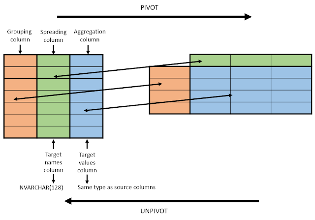

# Pivot

In order for the pivoting to work, we must **only use the columns needed**, instead of all of them. This results in repeating rows.

### **Data**

Here is some example data, obtained by the given query.

| product | yearSold | revenue       |
| ------- | -------- | ------------- |
| shoes   | 2018     | 33924978.2497 |
| shirts  | 2018     | 34362105.196  |
| hats    | 2018     | 25119529.9395 |
| shoes   | 2019     | 6947797.012   |
| shirts  | 2019     | 8070039.2266  |
| hats    | 2019     | 5780623.5762  |

```sql
SELECT
    product,
    yearSold,
    revenue
FROM sales
GROUP BY
    yearSold,
    product
```

### **Result**



| product | 2019 | 2018 |
| ------- | ---- | ---- |
| shoes   | 694  | 3392 |
| shirts  | 807  | 3436 |
| hats    | 578  | 2511 |

### **Approach 1 - FROM**

```sql
SELECT
    product,  -- grouping column
    [2019],   -- spreading value 1
    [2018]    -- spreading value 2
FROM (
    SELECT
        product,      -- grouping column
        yearSold,     -- spreading column
        revenue       -- aggregation column
    FROM sales
    GROUP BY
        yearSold,
        product
) PivotData
    PIVOT (
        SUM(revenue)   -- aggregation function (aggregation column)
        FOR yearSold   -- spreading column
        IN (
            [2019],    -- spreading value 1
            [2018])    -- spreading value 2
        ) piv
```

### **Approach 2 - WITH (CTE)**

```sql
WITH PivotData AS (
    SELECT
        product,
        yearSold,
        revenue
    FROM sales
    GROUP BY
        yearSold,
        product
)

SELECT
    product,
    [2019],
    [2018]
FROM PivotData
    PIVOT (
        SUM(revenue)
        FOR [year]
        IN (
            [2019],
            [2018])
        ) piv
```

# Dynamic Pivot

-   Define variables
-   Define columns (**must be strings**)
-   Define SQL query
-   Execute the query

The column definition can also be done with this:

```sql
SELECT STRING_AGG(PIVOT_COLUMN, ',')
```

### **Ex. Columns: warehouses, Rows: products**

```sql
-- Variables
DECLARE @cols AS NVARCHAR(MAX),
    @query  AS NVARCHAR(MAX);

-- Get the distinct warehouses and form a comma-separated string.
SELECT @cols = STRING_AGG(QUOTENAME(warehouse), ',')
FROM (
    SELECT DISTINCT warehouse FROM warehouse_stock
) AS DistinctWarehouses;

SET @query = N'SELECT product, ' + @cols + ' FROM
            (
                SELECT product, stock_level, warehouse
                FROM warehouse_stock
           ) AS SourceTable
            PIVOT
            (
                SUM(stock_level)
                FOR warehouse IN (' + @cols + ')
            ) AS PivotTable';

-- Execute the dynamic SQL
EXEC sp_executesql @query;
```

### **Ex. Columns: years, Rows: shops**

```sql
-- variables
DECLARE @sql AS varchar(max)
DECLARE @pivot_list AS varchar(max) -- Leave NULL for COALESCE technique
DECLARE @select_list AS varchar(max) -- Leave NULL for COALESCE technique

-- columns
SELECT
	-- [2017], [2018], [2019], [2020]
    @pivot_list = COALESCE(@pivot_list + ', ', '') + '[' + PIVOT_COLUMN + ']',
	--ISNULL([2017], 0) as [2017], ISNULL([2018], 0) as [2018], ISNULL([2019], 0) as [2019], ISNULL([2020], 0) as [2020]
    @select_list = COALESCE(@select_list + ', ', '') + 'ISNULL([' + PIVOT_COLUMN + '], 0) as [' + PIVOT_COLUMN + ']'
FROM (
	SELECT
		cast(year(addate) as nvarchar(4)) as PIVOT_COLUMN
	FROM tHE_Move M
	where addate >= '01.01.2017'
	group by year(addate)
--	order by year(addate) asc -- doesn't work -- It works if SELECT TOP 100 or something
) as PIVOT_COLUMNS

-- query
SET @sql = '
; WITH PivotData AS (
    select
		shop,
		y AS PIVOT_COLUMN,
		sum(revenueNoVAT) revenueNoVAT
	from (
		SELECT
			SS.acName2 shop,
			year(m.addate) y,
			MI.anPVVATBase revenueNoVAT
		FROM tHE_MoveItem MI
			JOIN tHE_Move M ON MI.acKey = M.acKey
			JOIN tHE_SetSubj SS ON M.acIssuer = SS.acSubject
		WHERE m.acDocType in (
			' + '''3210''' + ',
			' + '''3220''' + ',
			' + '''3230''' + ',
			' + '''3240''' + '
		)
	) t1
	group by
		shop,
		y
)
SELECT shop, ' + @select_list + '
FROM PivotData
    PIVOT (
		sum(revenueNoVAT)
		FOR PIVOT_COLUMN
		IN (' + @pivot_list + ')
    ) piv
order by shop desc
'

-- @pivot_list
-- [2017], [2018], [2019], [2020]
-- @select_list
--ISNULL([2017], 0) as [2017], ISNULL([2018], 0) as [2018], ISNULL([2019], 0) as [2019], ISNULL([2020], 0) as [2020]

-- execution
EXEC (@sql)
```

### **Ex. Columns: shops, Rows: years**

```sql
-- variables
DECLARE @sql AS varchar(max)
DECLARE @pivot_list AS varchar(max) -- Leave NULL for COALESCE technique
DECLARE @select_list AS varchar(max) -- Leave NULL for COALESCE technique

-- columns
SELECT
    @pivot_list = COALESCE(@pivot_list + ', ', '') + '[' + PIVOT_COLUMN + ']',
    @select_list = COALESCE(@select_list + ', ', '') + 'ISNULL([' + PIVOT_COLUMN + '], 0) AS [' + PIVOT_COLUMN + ']'
FROM (
    SELECT
		distinct SS.acName2 as PIVOT_COLUMN
	FROM tHE_Move M
		JOIN tHE_SetSubj SS ON M.acIssuer = SS.acSubject
	WHERE m.acDocType in (
		'3210',
		'3220',
		'3230',
        '3240'
	)
) AS PIVOT_COLUMNS

-- query
SET @sql = '
; WITH PivotData AS (
    select
		ym,
		shop AS PIVOT_COLUMN,
		sum(revenueNoVAT) revenueNoVAT
	from (
		SELECT
			SS.acName2 shop,
			concat(year(m.addate), ' + '''-''' + ', RIGHT(' + '''00''' + ' + CONVERT(varchar(2), DATEPART(MONTH, m.addate)), 2)) ym,
			MI.anPVVATBase revenueNoVAT
		FROM tHE_MoveItem MI
			JOIN tHE_Move M ON MI.acKey = M.acKey
            JOIN tHE_SetItem SI ON MI.acIdent = SI.acIdent
			JOIN tHE_SetSubj SS ON M.acIssuer = SS.acSubject
		WHERE m.acDocType in (
			' + '''3210''' + ',
			' + '''3220''' + ',
			' + '''3230''' + ',
			' + '''3240''' + '
		)
	) t1
	group by ym, shop
)
SELECT ym, ' + @select_list + '
FROM PivotData
    PIVOT (
        sum(revenueNoVAT)
        FOR PIVOT_COLUMN
        IN (' + @pivot_list + ')
    ) piv
order by ym desc
'

-- execution
EXEC (@sql)
```

### Example 4

```sql
SET @sql = NULL;
SET @textColumns = NULL;
SET @numberColumns = NULL;
SET @dateColumns = NULL;

SELECT
  GROUP_CONCAT(
	DISTINCT CONCAT('max(IF(f.uid = ''', f.uid, ''', dt.value, NULL))', f.uid)
  ) INTO @textColumns
FROM dataText dt
	left join field f on f.id = dt.fieldId
    left join entity e on e.id = f.entityId
where e.uid = 'XirQSpRrPP';

SELECT
  GROUP_CONCAT(
	DISTINCT CONCAT('max(IF(f.uid = ''', f.uid, ''', dn.value, NULL))', f.uid)
  ) INTO @numberColumns
FROM dataNumber dn
	left join field f on f.id = dn.fieldId
    left join entity e on e.id = f.entityId
where e.uid = 'XirQSpRrPP';

SELECT
  GROUP_CONCAT(
	DISTINCT CONCAT('max(IF(f.uid = ''', f.uid, ''', dd.value, NULL))', f.uid)
  ) INTO @dateColumns
FROM dataDate dd
	left join field f on f.id = dd.fieldId
    left join entity e on e.id = f.entityId
where e.uid = 'XirQSpRrPP';

SET @sql = CONCAT('
	select
		r.id,
		r.uid,
		', @textColumns, ',
		', @numberColumns, ',
        ', @dateColumns, '
   from record r
		left join entity e on e.id = r.entityId
		left join field f on f.entityId = e.id
		left join dataText dt on dt.recordId = r.id
		left join dataNumber dn on dn.recordId = r.id
        left join dataDate dd on dd.recordId = r.id
	where e.uid = ''XirQSpRrPP''
	group by
		r.id,
		r.uid
');

PREPARE stmt FROM @sql;
EXECUTE stmt;
DEALLOCATE PREPARE stmt;
```
