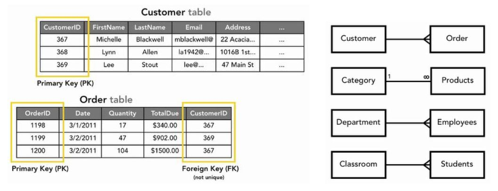
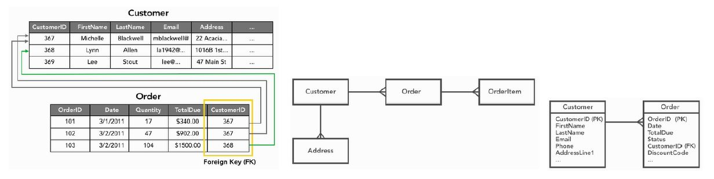
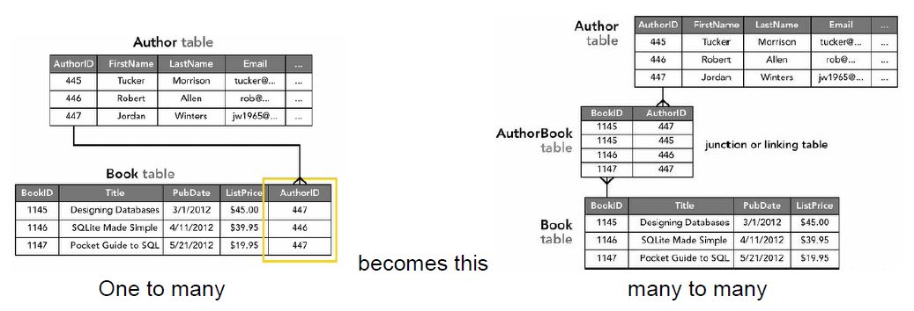
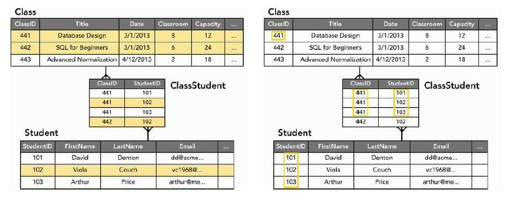
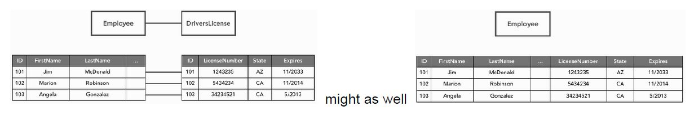
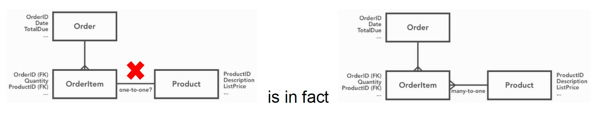
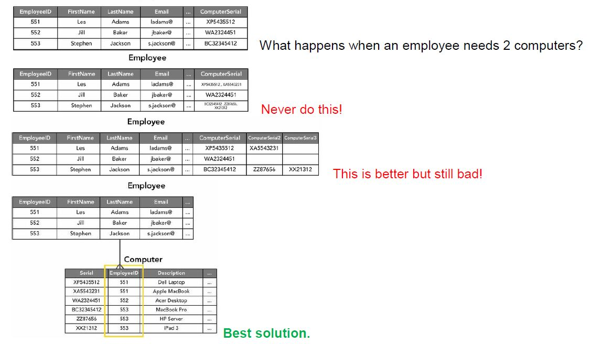
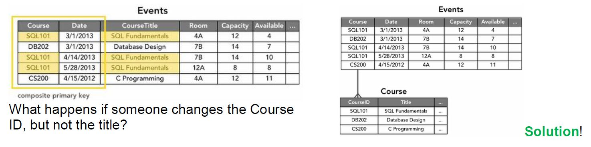
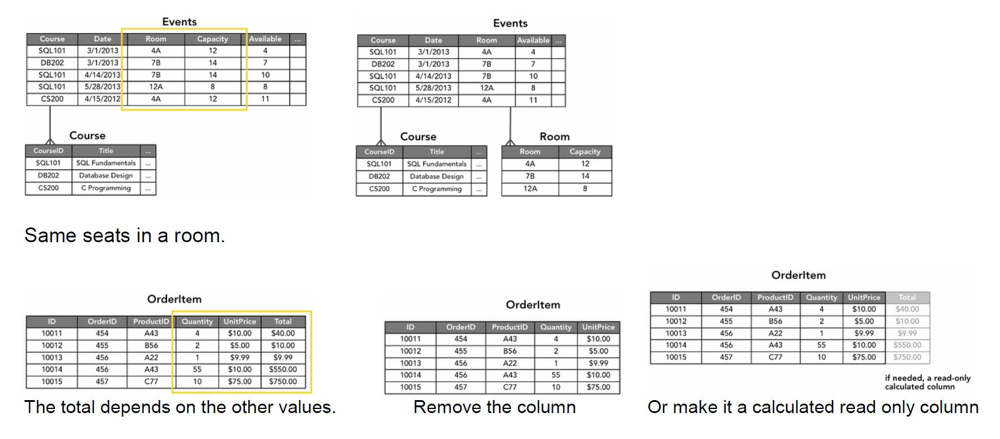
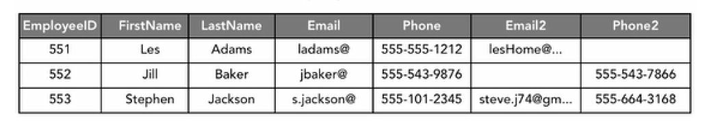

# Table Relationships

**Look both ways (From each perspective) when trying to determine the relationship.**

## One to Many - 90%

## Many to Many - 10%

## One to One - 0%

Not a thing.If one row points to only one row, you might as well join the tables.

Sometimes you think you have a one-to-one relationship, but you don’t. Look both ways (from each perspective) to avoid this.

# Normalization

Taking your database design through these 3 steps will vastly improve the quality of your data.

There are more than 3 Normal Forms, but usually 3 is the norm. There are more than 6.

## First Normal Form (1NF)

Each of the columns and tables should contain one and only one value without it repeating.

Usually every 1NF problem is solved by creating a new table. One of the signs for the need is when columns start having the same name with a number differentiating them. Computer1, Computer2…

## Second Normal Form (2NF)

Any non-key field should be dependent on the entire primary key i.e. “Can I figure out any of the values in the row from just part of the composite key?”. Only a problem when dealing with composite keys.

## Third Normal Form (3NF)

No non-key field is dependent on any other non-key field i.e. “Can I figure out any of the values in this row from any of the other values?”.

## Denormalization

Sometimes tables intentionally break normalization, and some only seem like they do.

Creating a new table for phones and emails would complicate things needlessly. The same goes for the area codes.

