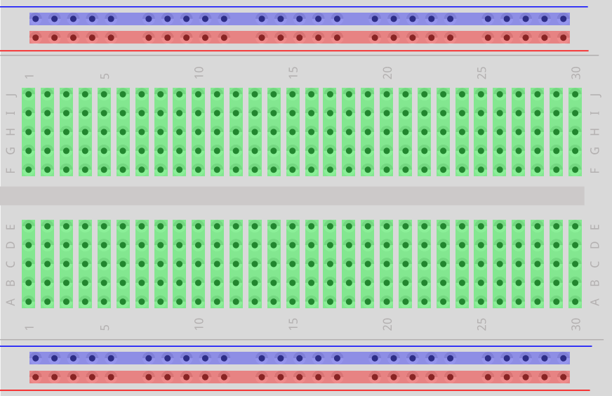

# Terminology

#### Circuit

Your circuit is the collection of all the connections you’ve made, using wires, resistors, LEDs, buttons, GPIO and other pins, etc.

It can be closed (like when you press a button, and a signal is able to traverse from one end to the other), or it can be open (a button is not pressed, or there’s some other break in the circuit).

An open circuit is like a long train of dominos, where you've removed 4 or 5 from the middle. You can try sending a signal from one end, but it's never going to bridge the gap.

#### Firmware

A set of programs and routines that are built into the device running them. They are typically essential for the basic operation of the device and are not usually accessible by the user.

#### Serial

Data sent over time, most often one single bit after another. All the protocols are serial protocols.

#### Bus

A set of wires which transfer data. One wire can carry one bit: a 0 (low voltage) or 1 (high voltage). A bus is just a collection of wires, so a 4-bit bus has four wires and can carry four bits.

#### Relay

It's an electronic switch. Instead of manually flipping it, it's done via a 5V signal. It can be open (NO) or closed (NC) by default, so the signal would od the opposite. Ex. Arduino sends a signal to the relay to close the circuit for turning on a lamp.

#### Abbreviations

**Baud** - Measure for communication speed over a data channel. Equivalent to bits per second.

**VIN** - Voltage that is currently supplied to the board.

**VCC** - Input pin on the board if you want to power it from a pin instead of a port.

**COM** - Common connection for relay or transistor outputs. When the output is activated, the PLC will energize the relay or transistor, effectively connecting the NO (normally open) pin to the COM (common) pin..  
**NO** - Normally open relay.  
**NC** - Normally closed relay.

#### PWM

Pulse Width Modulation, or PWM, is a technique for getting analog results with digital means. Digital control is used to create a square wave, a signal switched between on and off. This on-off pattern can simulate voltages in between full on (5 Volts) and off (0 Volts) by changing the portion of the time the signal spends on versus the time that the signal spends off.

# GPIO - General Purpose Input Output

Used to interact with the real world.

Each GPIO pin has two states. You can call them on or off, high or low, 1 or 0, etc. A pin is set "high" when it's outputting 3.3v or reading in 3.3v, and "low" when it's off.

Output pins are like switches that the Raspberry Pi can turn on or off (like turning on/off a LED light). But it can also send a signal to another device.

Input pins are like switches that you can turn on or off from the outside world (like a on/off light switch). But it can also be a data from a sensor, or a signal from another device.

## Floating

The pins receive surrounding noise from other electronic devices, which interferes with the regular signals. This is called a **floating pin**.

This also happens with with other modules such as a switch on a breadboard.

To prevent this, we need to use a **pull-up resistor** i.e. pull the pin up to a voltage when nothing happens (switch is off)

Micro-controllers have built-in pull-up resistors.

### Pull Down

When you have a circuit that connects 3.3v to a GPIO pin, it'll read HIGH when the circuit is closed. When it's open, it could read anything. You need a "pull down" resistor connecting your circuit to ground, so that it reads LOW when the circuit is open. (I'll show this in effect later.)

### Pull Up

Similarly, if you have a circuit connecting your GPIO pin to ground when it's closed, it'll read LOW. You need a "pull up" resistor so that, when it's open, it defaults to the HIGH state.

# Communication Protocols

**I2C** - Easiest and most expandable bus. Raspberry has two I2C buses, bus 0 and bus 1. Capable of expanding the Rpi to thousands of output ports. Programming is very easy.

**SPI** - Only 2 chip select lines so max number of devices is very limited. Bus is faster and can be driven over longer cable runs than I2C. Programming more difficult. Device selection very limited unless you are willing to solder SMD.

**UART (RS-232)** - Welcome to the 1970s. Lever shifters are a must. No intelligence at all. Pretty boring stuff actually.

## I2C - Inter-Integrated Circuit

It's a bus that allows easy communication between components which reside on the same circuit board.

It's a synchronous protocol, and it's the first we see which has some "intelligence" in it; the other ones dumbly shifted bits in and out, and that was that.

I2C uses only 2 wires, one for the clock (SCL) and one for the data (SDA). That means that master and slave send data over the same wire, again controlled by the master who creates the clock signal.

I2C doesn't use separate Slave Selects to select a particular device, but has addressing. The first byte sent by the master holds a 7 bit address (so that you can use 127 devices on the bus) and a read/write bit, indicating whether the next byte(s) will also come from the master or should come from the slave.

After each byte, the receiver must send a "0" to acknowledge the reception of the byte, which the master latches with a 9th clock pulse.

If the master wants to write a byte, the same process repeats: the master puts bit after bit on the bus and each time gives a clock pulse to signal that the data is ready to be read.

If the master wants to receive data it only generates the clock pulses. The slave has to take care that the next bit is ready when the clock pulse is given.

This protocol is patented by NXP (formerly Phillips), to save licensing cost, Atmel using the word TWI (2-wire interface) which exactly same as I2C, so any AVR device will not have I2C but it will have TWI.

Two or more signals on the same wire may cause conflicts, and you would have a problem if one device sends a "1" while the other sends a "0". Therefore the bus is wired-OR'd: two resistors pull the bus to a high level, and the devices only send low levels. If they want to send a high level they simply release the bus.

-   SDA - Serial data
-   SCL - Serial clock

## SPI - Serial Peripheral Interface

The SPI bus is a serial communication protocol for controlling and communicating with almost any digital electronic device that accepts a clocked serial stream of bits. SPI is typically used for short distance communication and most commonly found in embedded devices.

A master sends a clock signal, and upon each clock pulse it shifts one bit out to the slave, and one bit in, coming from the slave. Signal names are therefore SCK for clock, MOSI for Master Out Slave In, and MISO for Master In Slave Out.

By using SS (Slave Select) signals the master can control more than one slave on the bus. There are two ways to connect multiple slave devices to one master, one is mentioned above i.e. using slave select, and other is daisy chaining, it uses fewer hardware pins (select lines), but software gets complicated.

-   MISO - Master Input, Slave Output
-   MOSI - Master Output, Slave Input
-   SCLK - Serial Clock
-   SS - Slave Select

## UART - Universal Asynchronous Receiver-Transmitter (Serial)

A computer microchip used for translation between parallel and serial data.

The UART functions to convert parallel data from PC bus lines to serial data for transmission via line drivers to RS-232, RS-422, and RS-485 devices.

UART is responsible for sending and receiving a sequence of bits. At the output of a UART these bits are usually represented by logic level voltages. These bits can become RS-232, RS-422, RS-485, or perhaps some proprietary spec.

This is, essentially, a serial communications interface. The "universal" part means that it can be configured to support many different specific serial protocols. The term is generic, and does not represent a specific standard. At minimum it means that it has a TX and an RX line, which sends a serial data stream and receives a serial data stream.

It's one of the most used serial protocols. Most controllers have a hardware UART on board. It uses a single data line for transmitting and one for receiving data.

Most often 8-bit data is transferred, as follows:  
- 1 start bit (low level)
- 8 data bits
- 1 stop bit (high level)

The low level start bit and high level stop bit mean that there's always a high to low transition to start the communication. That's what describes UART. No voltage level, so you can have it at 3.3 V or 5 V, whichever your microcontroller uses.

Note that the microcontrollers which want to communicate via UART have to agree on the transmission speed, the bit-rate, as they only have the start bits falling edge to synchronize. That's called asynchronous communication.

-   TxD - Transmitter, carries data from DTE to DCE.
-   RxD - Receiver, carries data from DCE to DTE.

**TTL** (Transistor Transistor Logic) is not a protocol. It's an older technology for digital logic, but the name is often used to refer to the 5 V supply voltage, often incorrectly referring to what should be called UART.

### RS-232

A standard defining the signals (serial communication transmission of data) between two devices, defining the signal names, their purpose, voltage levels, connectors and pinouts.

-   DTE (data terminal equipment) ex. computer terminal.
-   DCE (data communication equipment) ex. modem.

# Breadboard

Red - Power  
Blue - Ground  
Green - Tie-points (Do not cross the trench)  
Trench - Middle

# Components

#### Resistor

#### Capacitor

#### Diode

#### Transistor
