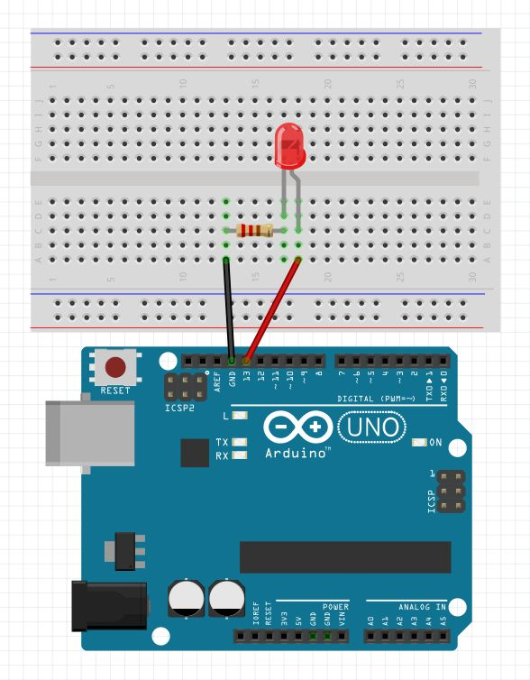

# Arduino

**Arduino** is a development board utilizing an **AVR ATMEGA328** MCU (microcontroller). An MCU can't do much unless it's in a circuit.

The more professional option is to use a separate development board/launchpad for the MCUs. The idea is to plug in the MCU into it, program it, and take it out to be soldered in a circuit, rather than use the whole board like the Arduino.

Other popular microcontrollers: 8051, PIC, AVR, ARM, MSP

Microcontrollers have application specific small processing power while microprocessors have general purpose large processing power.

Microcontrollers have built in RAM, ROM and other peripherals in a single chip. Microprocessors have only the CPU, and other peripherals, RAM, ROM should be connected externally.

# Programming

Unlike most previous programmable circuit boards, the Arduino does not need a separate piece of hardware (called a programmer) in order to load new code onto the board – you can simply use a USB cable.

The Arduino IDE uses a simplified version of C++.

Arduino basically works by setting something upfront once and then by trapping execution in an infinite loop.

The code **will not** compile without `setup()` and `loop()`.

```c
void setup() {
  // Setup code, run once
}

void loop() {
  // Main code, run repeatedly
}
```

# Setup

We can select the type of board we are working with at tools > board, or add ones with the boards manager.

We define the way we are connecting to the board via a port at tools > port. It changes each time the board is disconnected.

# Upload

The code is compiled and uploaded into the chip via the USB cable. The built-in small LED light will blink in the frequency of the loop to indicate that it's working.

# Serial Monitor

We can see what Arduino outputs via tools > serial monitor. If we are getting weird characters, we need to set the **baud** value to the correct one.

# Pull-up resistor

Instead of adding resistors manually, we can use the built-in functionality.

```c
pinMode(button, INPUT_PULLUP)
```

# digitalWrite vs analogWrite

`digitalWrite` will set the specified pin to one of two states - HIGH/LOW, which equate to 5v (3.3v on some boards) and ground respectively.

`analogWrite` can vary by the type of output used. It will set the pin to a periodic high/low signal, where the percentage of the signal spent high is proportional to the value written. Ex. `analogWrite(PIN, 255)`.

pinMode(buzzerPin, OUTPUT);

# Simple blinking LED example

```c
int LED = 12;

void setup() {
  pinMode(LED, OUTPUT);
}

void loop() {
  digitalWrite(LED, HIGH);
  delay(100);
  digitalWrite(LED, LOW);
  delay(100);
}
```



# Cop Car

```c
int LED_RED = 12;
int LED_BLUE = 13;
int BUZZER = 10;

void setup() {
  pinMode(LED_RED, OUTPUT);
  pinMode(LED_BLUE, OUTPUT);
  pinMode(BUZZER, OUTPUT);
}

void loop() {
  tone(BUZZER, 200, 250);
  digitalWrite(LED_RED, HIGH);
  delay(500);
  digitalWrite(LED_RED, LOW);

  tone(BUZZER, 400, 250);
  digitalWrite(LED_BLUE, HIGH);
  delay(500);
  digitalWrite(LED_BLUE, LOW);
}
```
