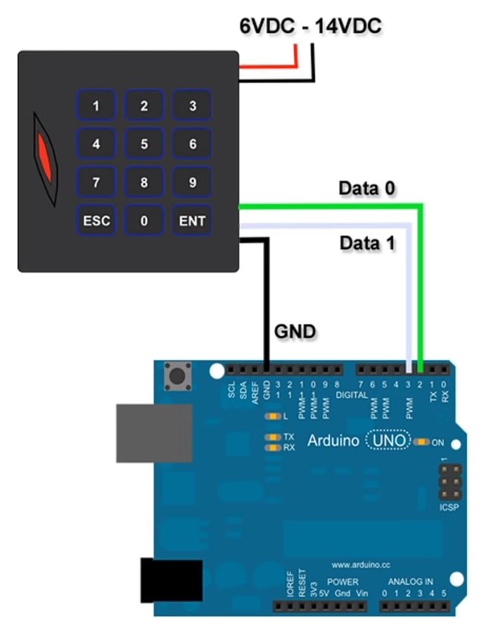

# Standards

| Family              | AKA  | Frequency | Protocol       | Storage     | Writable | Reader         |
| ------------------- | ---- | --------- | -------------- | ----------- | -------- | -------------- |
| Low Frequency (LF)  | RFID | 125 kHz   | EM4100         | UID 4 bytes | No       | RDM6300, RC522 |
| High Frequency (HF) | NFC  | 13.56 MHz | Mifare Classic | UID 4 bytes | 1 KB     | PN532          |

The UIDs are hard-coded by the manufacturer and cannot be changed.

All cards contain a chip and an antenna. They are passive i.e. get the energy from the reader.

# Wiegand

This is a transmission protocol which connects the RFID reader with a controller.

The Wiegand interface has two data lines, DATA0 and DATA1. These lines are normally held high at 5V.

-   When a 0 is sent, DATA0 drops to 0V for a few µs.
-   When a 1 is sent, DATA1 drops to 0V for a few µs.

There are a few ms between the pulses.

It transmits the UID in 2 formats:

-   W26 - Transports only first 3 bytes of the UID.
-   W34 - Transports the whole UID (4 bytes). Connect brown wire to ground to get this format.

If the correct UIDs are not transported via serial, the D0 and D1 may need to be swapped.



# Read Wiegand

```javascript
function bitCount(int_type) {
    let count = 0;
    while (int_type) {
        int_type &= int_type - 1;
        count += 1;
    }
    return count;
}

let raw = 0x21a6616; // 10000110100110011000010110

let FAC_PAR_MASK = 0x2000000; // 10000000000000000000000000
let FACILITY_MASK = 0x1fe0000; // 01111111100000000000000000
let CARD_MASK = 0x1fffe; // 00000000011111111111111110
let CARD_PAR_MASK = 1; // 00000000000000000000000001

let facility = (raw & FACILITY_MASK) >> 17;
let card = (raw & CARD_MASK) >> 1;

let fac_par = (raw & FAC_PAR_MASK) >> 25;
// even parity
let fac_par_ok = (bitCount(facility) + fac_par) % 2 == 0;

let card_par = raw & CARD_PAR_MASK;
// odd parity
let card_par_ok = (bitCount(card) + card_par) % 2 == 1;

if (fac_par_ok && card_par_ok) {
    console.log("Both parity bits ok, successful read.");
    console.log("Facility:", facility);
    console.log("Card:", card);
} else {
    if (!fac_par_ok) console.log("Facility parity check failed!");
    if (!card_par_ok) console.log("Card parity check failed!");
}
```
