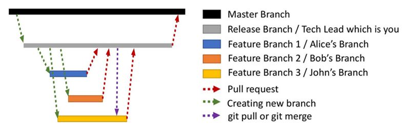

# Overview

A commit in a git repository records a snapshot of all the files in your directory. It's like a giant copy and paste, but even better!

Git wants to keep commits as lightweight as possible though, so it doesn't just blindly copy the entire directory every time you commit. It can (when possible) compress a commit as a set of changes, or a "delta", from one version of the repository to the next.

# Rules

1. Create a Git repository for every new project.
2. Create a new branch for every new feature.
3. Use Pull Requests to merge code to Master.



[Source 1](https://www.freecodecamp.org/news/follow-these-simple-rules-and-youll-become-a-git-and-github-master-e1045057468f/)
[Source 2](https://www.freecodecamp.org/news/how-to-use-git-efficiently-54320a236369/)
[Source 3](https://pathof.dev/blog/making-sense-of-git-and-github)

# Quick Edit

Download from repository and set user.

```git
git clone URL
git config user.name "NAME"
git config user.email "EMAIL"
```

Make changes and upload back.

```git
git status
git add .
git commit -m "MESSAGE"
git push origin master
```

A previously cloned repo on a server can now pull just the changes (clone is used only the first time to create the local repo).

`git pull` - (`git fetch` + `git merge`)

Github repo > Clone to local > Push to Github > Pull changes to server

# Tips

Master branch = Timeline

`HEAD` = Last commit on current branch.

HEAD is the symbolic name for the currently checked out commit -- it's essentially what commit you're working on top of.

Commit messages should be in the present tense instead of past. They should tell what a commit does instead of what happened. Ex. Add new module vs Added new module.

Git uses vi as the default editor.

# Setup

```bash
# Initialize an empty repo inside a .git hidden directory.
git init
```

## Git Ignore

This is a list of files/folders to be ignored in commits. To use it, create a `.gitignore` file in the working directory, **NOT** inside `.git`.

Each line in the file is a new ignore rule. Ex. To ignore `node_modules/`, just add that as one line.

If the ignoring is added after committing the files to be ignored, they need to be untracked. Use `git rm -r --cached .` to untrack everything, and the `git add/git commit`. **Careful as this can lose progress to files.**

Also, pattern matching can be used to ignore specific files in specific places. Ex. `*.txt` ignores all text files, while `routes/*.js` ignores all javascript files in that folder. To ingore a folder, use `FOLDER/`.

Finally, use `#` to comment.

# Workflow

it's generally considered good practice to avoid merges where possible.

A good workflow is to leave the `master` for production and do all the coding in a separate `develop` branch. The `develop` branch can expand into `feature` branches which would later be merged back. When a certain stable version is reached in `develop`, it can be merged with `master` along with a version tag.

Additonal brances such as `release` and `hotfix` can be introduced between the `master` and `develop` ones.

If a branch is not shown, it's due to fast-forwarding i.e. no changes were made in the branch being merged into, hence the simpler merge log.

# Example Project

```
*   e67ccc4 (HEAD -> master) Merge branch 'header'
|\
| * ce37b16 (header) Fix original header
* |   707692c Merge branch 'footer'
|\ \
| * | 2dc6e90 (footer) Expand footer
| * | fd61a63 Create footer.html
* | | 8083e87 Add fifth bla in CAPS
* | | 8d56117 Add fourth bla in index.html
* | | 86c50f0 Added third bla in index.html
|/ /
| | * 26326bb (header2) Fix header2 version
| | * d83bebc Modify header into version 2
| |/
| * c2d4091 Create header.html
|/
* 9524ae9 Create index.html
```

# Help

```bash
# List all the commands.
git help

# Explain a specific command.
git help COMMAND
```

# Configuration

```bash
# Setting up owner of changes for all repos. Github contributions count only with the github email.
git config --global user.name "NAME"
git config --global user.email "EMAIL"
```

# Diff (See Changes)

```bash
# Commit history.
git log

# Show unstaged differences since last commit.
git diff

# Show differences after staging.
git diff --staged

# Show differences between current and specific commit.
git diff HASH

# A visual tree with branch names included.
git log --oneline --decorate --all --graph

# Add the "tree" alias as a shortcut.
git config --global alias.tree "log --oneline --decorate --all --graph"
```


# Staging

```bash
# What changed since last commit?
git status

# Stage an untracked file for committing.
git add FILENAME

# Multiple files.
git add FILENAME FILENAME

# A folder.
git add FOLDER/

# All specific file types.
git add *.js

# ... in a folder.
git add FOLDER/*.js

# ... in whole project.
git add "*.js"

# Track everything.
git add .

# Unstage files.
git reset HEAD FILENAME
```

# Committing

Each commit moves the HEAD further up the timeline.

```bash
# Commit changes with inline message.
git commit -m "MESSAGE"
```

If the `-m` is ommited, the screen will move to the `vi` text editor, which can be exited with `:q`.

### Tagging (Versioning)

A reference to a specific commit, used mostly for release versioning.

```bash
# Create tag.
git tag -a v0.0.1 -m "Version 0.0.1"

# List tags.
git tag

# Open a specific version.
git checkout v0.0.1

# Push tags to remote repo.
git push --tags
```

# Undo

DON'T DO THESE AFTER PUSHING!

```bash
# Revert a file to the last commit version.
git checkout -- FILENAME

# UNDO commit and move everything back to staging. The carrot on the HEAD means move to the previous commit.
git reset --soft HEAD^

# DELETE the last 2 commits.
git reset --HARD HEAD^^

# DELETE everything after the specified commit.
git reset --HARD HASH

# Change last commit with overriding message.
git commit --amend -m "MESSAGE"

# Force change on GitHub. Git interprets the "^" after the hash as the parent of this very commmit, and the "+" as a force push.
git push origin +hash^:master
```

# Remote

A project can have multiple remotes ex. origin, test, production...

```bash
# Add a remote i.e. bookmark a repo i.e. This NAME = this URL. The name is usually "origin", but it can be anything.
git remote add NAME URL

# List all remotes.
git remote -v

# Check a remote.
git remote show origin

# Remove a remote.
git remote rm NAME
```

# Push

Define which local branch (usually master) to push to which repository (usually origin). It asks for user and pass.

```bash
# git push -u REPO_NAME BRANCH_NAME
git push -u origin master
```

`-u` remember the repo and the branch, so that only `git push` can be used.

# Clone

```bash
# Create a local repository from a remote one.
git clone URL

# ... with a different name.
git clone URL NEW_NAME
```

# Pull

Used to update the local repo with the latest changes. Should be done often.

```bash
git pull
```

Behind the scenes, this creates an origin/master branch which is automatically merged into the master one, unless there is a merge conflict.

## Pull Requests

**This is a GitHub feature which is a request to merge two related code bases together.** This uses the Git merge functionality under the hood to ensure that code bases we merge code bases without conflicts.

Once someone completes a feature, they don’t immediately merge it into master. Instead, they push the feature branch to the central server and file a pull request asking to merge their additions into master.

This gives other developers an opportunity to review the changes before they become a part of the main codebase.

You can think of pull requests as a discussion dedicated to a particular branch.

For example, if a developer needs help with a particular feature, all they have to do is file a pull request. Interested parties will be notified automatically, and they’ll be able to see the question right next to the relevant commits.

Once a pull request is accepted, the actual act of publishing a feature is much the same as in the Centralized Workflow. First, you need to make sure your local master is synchronized with the upstream master. Then, you merge the feature branch into master and push the updated master back to the central repository.


Cloning does:

-   Download entire repo into a new local one.
-   Add "origin" remote, pointing to the clone URL.
-   Check out initial branch. (Set head to master)

# Branch

**Do not mess with the master**. The master branch is deployable production code, meant to be stable. Instead, work on new features in separate branches, which would then be `merged` or `rebased` into master. 

**Branches are local**, meaning they cannot be worked on at the same time.

Branches in Git are incredibly lightweight as well. They are simply pointers to a specific commit -- nothing more. This is why many Git enthusiasts chant the mantra: **branch early, and branch often**.

Because there is no storage / memory overhead with making many branches, it's easier to logically divide up your work than have big beefy branches.

A branch essentially says "I want to include the work of this commit and all parent commits."

Switching branches will only show the files in that branch.

#### Create

```bash
# Create new branch. HEAD still on master (Use checkout to switch).
git branch <name>

# Create AND move to a branch.
git checkout -b <branch_name>

# Create a remote branch. Usually origin.
git push <repo_name> <branch_name>
```

#### Navigate

```bash
# Check which branch we are on.
git branch

# Check remote branches.
git branch -r

# Move to a specific branch (Set HEAD from master to <branch_name>). This is like switching timelines.
git checkout <branch_name>
```

#### Delete

```bash
# Delete a branch.
git branch -d <branch_name>

# Delete a remote branch
git push <repo_name> --delete <branch_name>
```

## Merge

**The merging is done from the perspective of where we merge `INTO`.**

Merging in Git creates a special commit that has two unique parents. A commit with two parents essentially means "I want to include all the work from this parent over here and this one over here, and the set of all their parents."

Move (checkout) to the branch (master) you want to merge into, and use:

```bash
git merge BRANCH_NAME
```

`master` now points to a commit that has two parents. If you follow the arrows up the commit tree from master, you will hit every commit along the way to the root. This means that master contains all the work in the repository now.

Merging is very easy if the master branch is not modified. This is fast-forwarding.

If both branches were modified, a commit is created to do the merge. (Vi editor opens for the message)

```
0
|\
2 1  - 2 master, 1 branch
|/
3    - master assimilates branch
```

## Rebase

**The "merging" is done from the perspective of where we merge `FROM`.**

The second way of combining work between branches is rebasing. Rebasing essentially takes a set of commits, "copies" them, and plops them down somewhere else i.e. it serializes the history if you do not want a lot of branches in the final history.

While this sounds confusing, the advantage of rebasing is that it can be used to make a nice linear sequence of commits. The commit log / history of the repository will be a lot cleaner if only rebasing is allowed.

Move (checkout) to the branch (BRANCH_NAME) you want to merge from, and use:

```bash
git rebase master
```

**This makes it look like two features were developed sequentially, when in reality they were developed in parallel.**

```
0
|\
1 1  - 1 branch
|
2    - 2 master
|
3    - branch (1) was added to the original timeline.
```

# Example Workflows

## Work on a new admin feature, fix a bug in master, and merge the new admin feature.

Create a new branch and add features. Each commit moves the HEAD.

```
git checkout -b admin

git add admin/dashboard.html
git commit -m "Add dashboard"

git add admin/users.html
git commit -m "Add user admin"
```

Fix bugs on master. Move to the master branch, check that we are on it and pull the latest changes from the remote. Push changes to remote.

```
git checkout master

git branch

git pull

git add store.rb
git commit -m "Fix store bug"

git add product.rb
git commit -m "Fix product"

git push
```

Move back to the admin feature to finish changes. When done, move to master branch and merge with admin.

```
git checkout admin

git checkout master

git merge admin
```

What the timeline (master) looks like. \* = commit.

```
*    - Merge
|\
| *  - Admin feature
* |  - Bug fix
* |  - Bug fix
| *  - Admin feature
|/
*    - Last commit before branch
```

# Useful

While we all used git (and Github) in college to collaborate and save code, we mainly stuck to the the basic "add, commit, push" flow and didn't really go outside of that much, mainly because we didn't know it all that well at the time. But looking back after 2+ years of using [git] in a professional environment, here was out shortlist of things we wish we knew git could do (in order of importance)

1. **git reset HEAD**  
   If you could learn one thing about git besides how to commit and push, this would be it. When you commit to git, those commits generate a log that is identified by a commit hash. By using the command `git reset HEAD <commit-hash>` (there are other variants, this is the most straightforward), you can essentially go back in time in your code. What this is great for is if you are in a point in your project where you are pretty certain _you're going to fuck something up_, committing is like doing a quick save in a video game right before a boss fight. Something goes wrong, reset to the last commit.

2. **Branching and Pull Request Workflow**  
   In college we all worked off a single branch pushing our code up to save it. While this worked, the occasional push by a teammate who didn't properly test their code caused our project to crash and one of us having to fix it (this usually happened <12 hours before deadlines). Branching and pull requests would have eliminated that. Not only are they working on a different branch so pushing up won't mess with the original copy. When they want to merge their code, going through a PR (pull request) process will involve the code getting reviewed by another person to make sure it all works.

3. **git init**  
   When I first started with git I always thought that you had to have a remote somewhere to use it (ie on github or gitlab). As I have learned that is not the case, you can initialize a git repository in any directory and commit any files, you are only restricted from pushing until you add a remote (duh). This is great to pair with the 1st tip, even if you are working by yourself. Having the ability to go back if you mess something up is essential.

TBH that's really it. Git is a _very_ complex application that even I haven't fully learned yet. However, it has a fairly easy learning curve letting you take advantages of the most important bits quickly. If you have any questions feel free to post below and I'll be happy to answer best I can.
