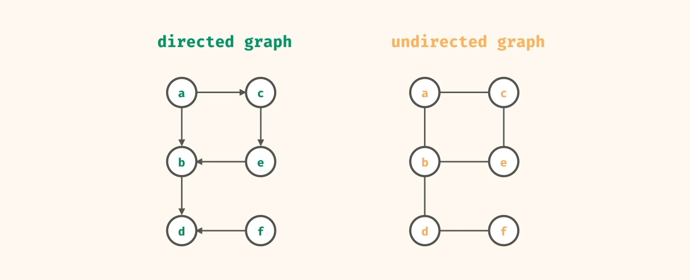
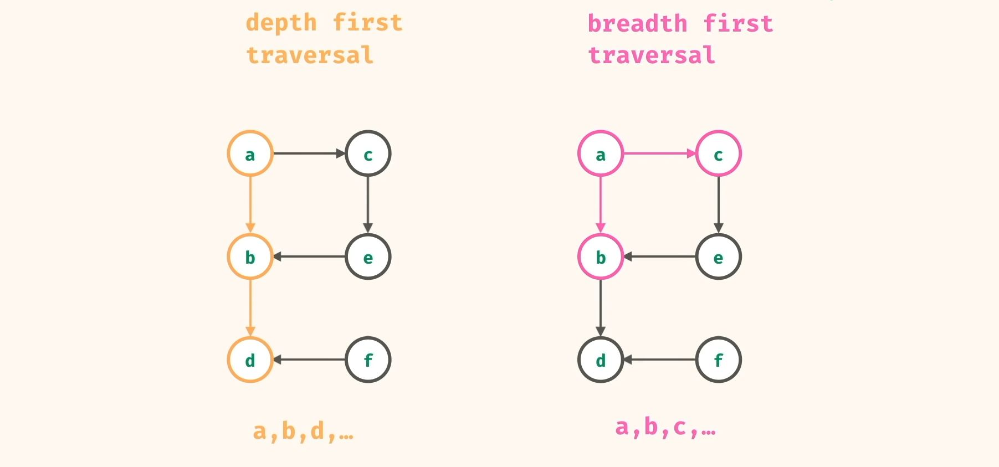
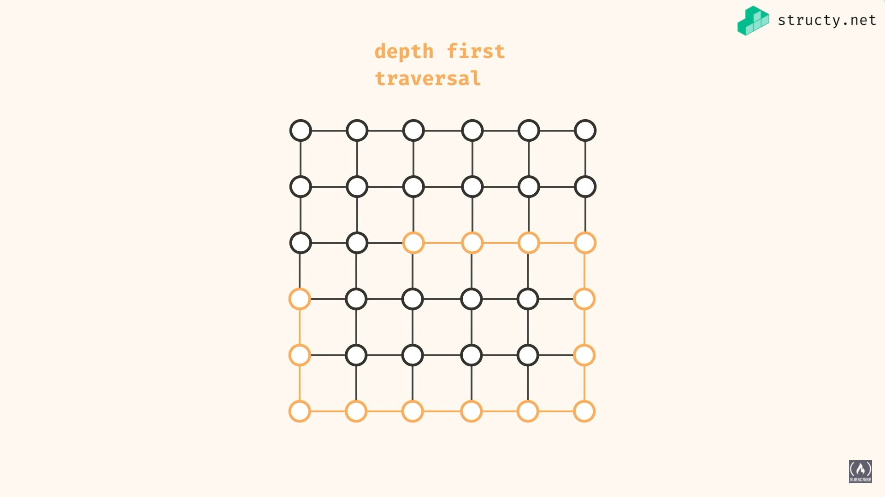
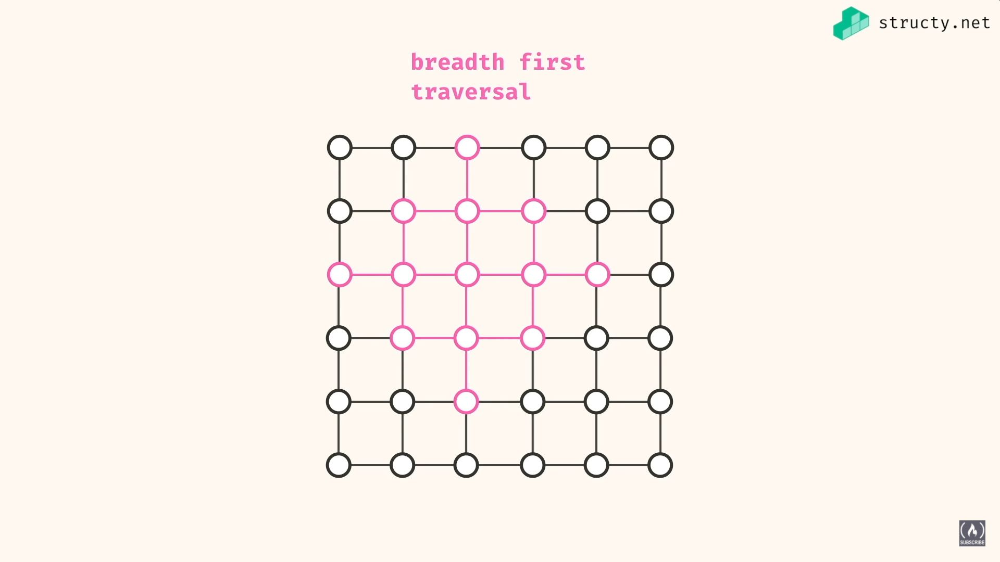

# Graphs

A graph is a non-linear data-structure for describing relationships between `nodes (vertices)` via `edges`.

A `node (vertex)` is a single value, and an `edge` is the connection between those values (nodes).

Ex. In Instagram, every `user` is a `node`, and every `follow` is an `edge`. Instagram is a `directed` graph i.e. follows go one way, while Facebook is `undirected` as a friendship goes both ways.

Ex. In Google Maps, every intersection is a `node`, and every road is a `weighted edge` (distance).



# Adjacency list

The best way to represent graphs programatically is with the `hash map` data structure i.e. an `object`.

```js
let graph = {
    a: ["b", "c"], // neighbors
    b: ["d"],
    c: ["e"],
    d: [],
    e: ["b"],
    f: ["d"],
};
```

# Traversal algorithms

They show if we can travel to some node.



## Depth first traversal

Exploring one direction as far as possible before switching directions.

Best data structure: **Stack** (FILO)



### Iterative

```js
function depthFirst(graph, source) {
    const stact = [source];

    while (stack.length > 0) {
        const current = stack.pop();
        console.log(current);

        for (let neighbor of graph[current]) {
            stack.push(neighbor);
        }
    }
}

depthFirst(graph, "a"); // abdfce
```

### Recursive

```js
function depthFirst(graph, source) {
    console.log(source);
    for (let neighbor of graph[source]) {
        depthFirst(graph, neighbor);
    }
}

depthFirst(graph, "a"); // abdfce
```

## Breadth first traversal

Explore all directions evenly.

Best data structure: **Queue** (FIFO)



### Iterative

```js
function breadthFirst(graph, source) {
    const queue = [source];

    while (queue.length > 0) {
        const current = queue.shift();
        console.log(current);

        for (let neighbor of graph[current]) {
            queue.push(neighbor);
        }
    }
}

depthFirst(graph, "a"); // abcedf
```

# Airports example

```js
// Data
const airports = "PHX BKK OKC JFK LAX MEX EZE HEL LOS LAP LIM".split(" ");

const routes = [
    ["PHX", "LAX"],
    ["PHX", "JFK"],
    ["JFK", "OKC"],
    ["JFK", "HEL"],
    ["JFK", "LOS"],
    ["MEX", "LAX"],
    ["MEX", "BKK"],
    ["MEX", "LIM"],
    ["MEX", "EZE"],
    ["LIM", "BKK"],
];

// Graph
const adjacencyList = new Map();

// Add node
function addNode(airport) {
    adjacencyList.set(airport, []);
}

// Add edge, undirected
function addEdge(origin, destination) {
    adjacencyList.get(origin).push(destination);
    adjacencyList.get(destination).push(origin);
}

// Poplating the graph
airports.forEach(addNode);
routes.forEach((route) => addEdge(...route));

console.log(adjacencyList);

/*

Map(11) {
    'PHX' => [ 'LAX', 'JFK' ],
    'BKK' => [ 'MEX', 'LIM' ],
    'OKC' => [ 'JFK' ],
    'JFK' => [ 'PHX', 'OKC', 'HEL', 'LOS' ],
    'LAX' => [ 'PHX', 'MEX' ],
    'MEX' => [ 'LAX', 'BKK', 'LIM', 'EZE' ],
    'EZE' => [ 'MEX' ],
    'HEL' => [ 'JFK' ],
    'LOS' => [ 'JFK' ],
    'LAP' => [],
    'LIM' => [ 'MEX', 'BKK' ]
}

*/

// Find all possible routes to determine most efficient one
function breadthFirstSearch(startingAirport, destinationAirport) {
    let visited = new Set();
    let queue = [startingAirport];

    while (queue.length > 0) {
        console.log("queue:", queue);
        let airport = queue.shift(); // mutates queue // 'PHX'

        let destinations = adjacencyList.get(airport); // [ 'LAX', 'JFK' ]

        console.log("airport:", airport, "-----> destinations:", destinations);
        console.log("-------------------------");

        for (let destination of destinations) {
            // 'BKK' == 'BKK'
            if (destination == destinationAirport) {
                console.log("\n");
                console.log(`********************************************`);
                console.log(`Found ${destinationAirport} via ${airport}`);
                console.log(`********************************************`);
                console.log("\n");
            }

            if (!visited.has(destination)) {
                visited.add(destination); // { 'LAX' }, { 'LAX', 'JFK' }

                queue.push(destination); // 'LAX'
                console.log("            ADD", destination, ">", queue);
            } else {
                console.log("ALREADY VISITED", destination);
            }
        }
        console.log(`\n`);
    }
}

breadthFirstSearch("PHX", "BKK");
// PHX > LAX > MEX > LIM > BKK
// PHX > LAX > MEX > BKK

// Find the first route
function depthFirstSearch(startingAirport, destinationAirport, visited = new Set()) {
    console.log(startingAirport);

    visited.add(startingAirport);

    let destinations = adjacencyList.get(startingAirport);

    for (let destination of destinations) {
        if (destination == destinationAirport) {
            console.log("found");
            return;
        }

        if (!visited.has(destination)) {
            depthFirstSearch(destination, destinationAirport, visited);
        }
    }
}

depthFirstSearch("PHX", "BKK");
```
