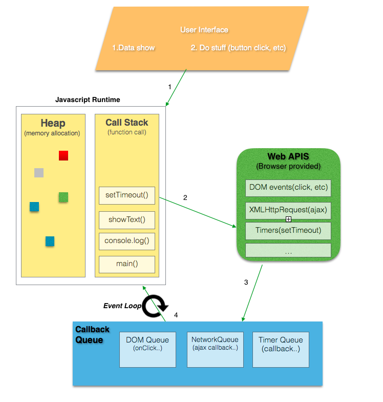

# Language

The complete JavaScript implementation is made up of three distinct parts:

-   The Core (based on ECMAScript spec)
-   The Document Object Model (DOM)
-   The Browser Object Model (BOM)

## ECMAScript

ECMA-262 describes it like this:

```
ECMAScript can provide core scripting capabilities for a variety of host environments, and therefore the core scripting language is specified... apart from any particular host environment.
```

A Web browser is considered a host environment for ECMAScript, but it is not the only host environment. A list of other host environments listed here.

Apart from DOM and BOM, each browser has its own implementation of the ECMAScript interface.

## Document Object Model (DOM)

The Document Object Model (DOM) is an application programming interface (API) for HTML as well as XML.

The DOM maps out an entire page as a document composed of a hierarchy of nodes like a tree structure and using the DOMAPI nodes can be removed, added, and replaced.

### DOM level 1

Consisted of two modules: the DOM Core, which provided a way to map the structure of an XML-based document to allow for easy access to and manipulation of any part of a document, and the DOM HTML, which extended the DOM Core by adding HTML-specific objects and methods.

### DOM Level 2

Introduced several new modules of the DOM to deal with new types of interfaces:

-   DOM Views — describes interfaces to keep track of the various views of a document (that is, the document before CSS styling and the document after CSS styling)
-   DOM Events — describes interfaces for events
-   DOM Style — describes interfaces to deal with CSS-based styles
-   DOM Traversal and Range — describes interfaces to traverse and manipulate a document tree

### DOM Level 3

Further extends the DOM with the introduction of methods to load and save documents in a uniform way (contained in a new module called DOM Load and Save) as well as methods to validate a document (DOM Validation). In Level 3, the DOM Core is extended to support all of XML 1.0, including XML Infoset, XPath, and XML Base.

Note that the DOM is not JavaScript-specific, and indeed has been implemented in numerous other languages. For Web browsers, however, the DOM has been implemented using ECMAScript and now makes up a large part of the JavaScript language.

Other DOMs

-   Scalable Vector Graphics (SVG)
-   Mathematical Markup Language (MathML)
-   Synchronized Multimedia Integration Language (SMIL)

## Browser Object Model (BOM)

Browsers feature a Browser Object Model (BOM) that allows access and manipulation of the browser window. Using the BOM, developers can move the window, change text in the status bar, and perform other actions that do not directly relate to the page content.

Because no standards exist for the BOM, each browser has its own implementation.

# Event Loop



Based on [Philip Roberts' talk](https://www.youtube.com/watch?v=8aGhZQkoFbQ).

The Javascript runtime only knows of the `heap` and `call stack`.

The rest of the functionality, like async stuff, is provided in the form of `WebAPIs` by the browser/Node.

For async operations, the `callback` is offloaded into a separate `queue`, which is emptied by the `event loop` one by one as soon as the `stack` becomes empty.

Without the `event loop` the stack would be blocked during the whole duration of the async operaiton, basically freezing the app.

# Hoisting

Both variable and function declarations are hoisted to the top on code execution, meaning that their order is irrelevant i.e functions can be called before they are declared.

# Variables

```javascript
var a;     // Regular.
let c;     // Block scoped.
const b;   // Immutable.
```

# Functions

Functions are first class objects - a function is a regular object of type `function`. The function object type has a constructor: `Function`.

There are several ways to declare a function.

The difference is how the function interacts with the external components (the outer scope, the enclosing context, object that owns the method, etc) and the invocation type (regular function invocation, method invocation, constructor call, etc).

## Function declaration

**Hoisted**. Available immediately after parsing, before any code is executed.

The function declaration creates a variable in the current scope with the identifier equal to function name. This variable holds the function object.

```javascript
function foo() {}
foo();
```

Use them when a function expression is not appropriate or when it is important that that a function is hoisted.

## Function expression

**Not hoisted.** Available only after the variable assignment is executed.

```javascript
// Named
let bar = function foo() {};
bar();
foo(); // undefined
```

Use them when you are doing recursion or want to see the function name in the debugger.

```javascript
// Anonymous
let foo = function() {};
foo();

let bar = foo();
bar(); // Error: not a function.
```

Use them when you want to pass a function as an argument to another function or you want to form a closure.

## IIFE - immediately Invoked Function Expression

```javascript
(function() {
    // ...
})();
```

Use them for the module pattern.

## ES6

Binds `this` automatically.

```javascript
let foo = () => {};
```

Use them when you want to lexically bind the `this` value.

## Function constructor (Avoid this)

```javascript
let foo = new Function();
```

## Other

-   Use function declaration generators `function* foo(){}` when you want to exit and then re-enter a function.
-   Use function expression generators `let foo = function* [name](){}` when you want to exit and then re-enter a nested function.

## Function parameters vs arguments

An argument is the value supplied to the parameter.

```javascript
function foo(bar) {
    // bar is a parameter
    console.log(bar);
}

foo("baz"); // baz is an argument.
```

# Useful

## Truthy / Falsy

Strings with at least one letter and numbers larger than zero are `truthy`.

```javascript
console.log(true && "foo"); // foo
console.log(true && "foo" && 1); // 1
```

# Debugging

```javascript
// Write to console
console.log();

// Show DOM element
console.dir();

// Display the call stack of a function
console.trace();

// Track execution time
console.time("point"); // undefined
console.timeEnd("point"); // point: 1337.42 ms

// Count the number of executions
console.count("foo"); // foo: 1
console.count("foo"); // foo: 2
console.countReset("foo"); // undefined
console.count("foo"); // foo: 1

// Avoid if-else statements
function greaterThan(a, b) {
    console.assert(a > b, { message: "a is not greater than b", a: a, b: b });
}
greaterThan(2, 1); // a is not greater than b, a: 2, b: 1

// Heap size
console.memory;

// Display a table. Takes an array of objects.
console.table(array);
```
