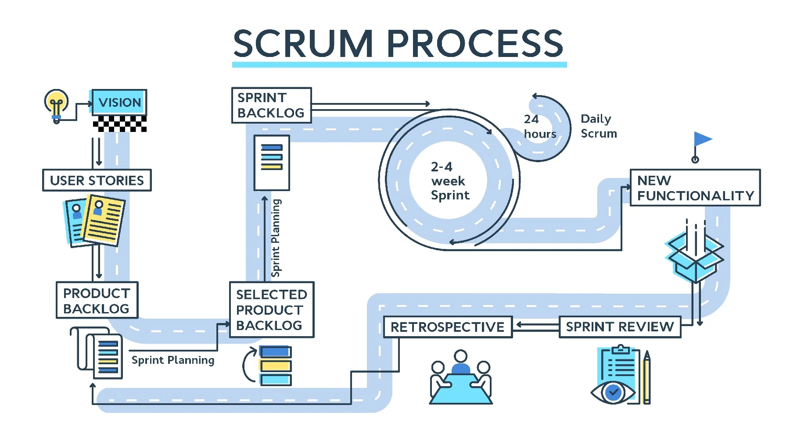

# General

```
Being "agile" is about building things in small chunks, learning, and then iterating.
```

Agile is methodology, with a set of values and principles, which the Waterfall methodology does not conform to.

Scrum and Kanban are Agile frameworks.

# Summary

The core principles of agile really boil down to:

-   Talk to each other.
-   Talk to you customers.
-   Aim for high quality code.
-   Deploy frequently.

In the real world almost no one follows any of these methodologies exactly. In practice, it looks like this:

-   **Sprints**: Work is broken up into 2-week blocks, in which people commit to what will be accomplished and work to get those tasks done by the end of the sprint.

-   **Standup meetings**: Daily meetings where the participants of a sprint discuss their status updates, blockers, progress, etc. The goal being to get a good summary of what everyone else is working on.

-   **Sprint planning**: time when work is pulled in for the next sprint and estimated.

-   **Retrospectives**: meeting to review the successes and areas for improvement from the previous sprint.

The general philosophy is that by working in short sprints with regular collaboration and communication, more can be accomplished and the team can respond to changing requirements and unexpected events more easily.

# Agile Manifesto

**Individuals and interactions** over processes and tools.  
**Working software** over comprehensive documentation.  
**Customer collaboration** over contract negotiation.  
**Responding to change** over following a plan.

1. Our highest priority is to satisfy the customer
   through early and continuous delivery
   of valuable software.

2. Welcome changing requirements, even late in
   development. Agile processes harness change for
   the customer's competitive advantage.

3. Deliver working software frequently, from a
   couple of weeks to a couple of months, with a
   preference to the shorter timescale.

4. Business people and developers must work
   together daily throughout the project.

5. Build projects around motivated individuals.
   Give them the environment and support they need,
   and trust them to get the job done.

6. The most efficient and effective method of
   conveying information to and within a development
   team is face-to-face conversation.

7. Working software is the primary measure of progress.

8. Agile processes promote sustainable development.
   The sponsors, developers, and users should be able
   to maintain a constant pace indefinitely.

9. Continuous attention to technical excellence
   and good design enhances agility.

10. Simplicity--the art of maximizing the amount
    of work not done--is essential.

11. The best architectures, requirements, and designs
    emerge from self-organizing teams.

12. At regular intervals, the team reflects on how
    to become more effective, then tunes and adjusts
    its behavior accordingly.

# Organize




**Waterfall**: This is the original software project management system. You figure out what you need to do, how long it's going to take, who is going to do it, build a big [Gantt chart](http://en.wikipedia.org/wiki/Gantt_chart) of all the steps and dependenecies and you're set. You know what you're going to build, when it's going to be done, and how much it's going to cost. Great, huh?

**Agile**: agile is a reaction to Waterfall. Waterfall works if you can meet all the criteria above. But in software it turns out to be really, really hard.

First off, what are you going to build? In Waterfall you need to know exactly what it is up front - if you see part of the software working and it sparks an idea for a feature that people will love, too bad. It's not on the plan, it's not getting built. Also, if you missed something crucial to the success of the project in the planning phase that feature isn't going to be built. Too bad.

Next, how long is it going to take? For [a number of reasons, humans suck at estimating how long something is going to take](http://blog.muonlab.com/2012/04/12/why-you-suck-at-estimating-a-lesson-in-psychology/). Especially in software - since you never do the exact same thing twice (if you did the second time you would copy/paste the first one). So basically the time estimates given in Waterfall are almost always wrong.

Agile, at its core, is a set of [values](http://agilemanifesto.org/) and [principles](http://agilemanifesto.org/principles.html) on how software should be developed. It isn't a set of practices but a mindset for approaching software development. If a methodology is agile, it should be in line with these values and principles.

**Scrum**: this is a set of practices that support the agile mindset. Scrum breaks work into small chunks called "sprints" where software is developed for just a few weeks and handed over to the client for review and potentially inspiring changes for the future of the project. It breaks features into stories about how a person would use the feature - with the idea that if you can't explain who is going to use a feature you shouldn't build it. It asks people to compare the size of work for features instead of estimating time with the expectation that [people are better at comparing than estimating](http://guide.agilealliance.org/guide/relative.html). It also defines a number of roles and meetings to make sure there is a continuous feedback cycle to the entire team.

[The Wikipedia article](http://en.wikipedia.org/wiki/Scrum_(software_development%29) has a lot more information about the roles and meetings that should be happening in Official Scrum. Many teams adopt Scrum as a starting point and adapt the process to meet their needs, so it may not mirror what's happening on any given Scrum team.

**Kanban**: this is a simpler process focused on making sure that work is visualized and that problems in the process become highly visible quickly. "Kanban" is a Japanese word referring to a board with cards on it, which Kanban teams use to visualize the state of the work. It focuses on getting the most important thing done as quickly as possible and moving things to done.

There are a lot of teams that have combined Kanban and Scrum into what's referred to as "Scrum-ban" which picks the practices of both that are most successful for the team.

**Kanban:** You've missed the Limiting WIP aspect, which is really, really important as it turns it from a push system to a pull system, makes the constraints obvious and allows for _change_. Kanban done well is a change management process, not a project management process (which is why you can easily apply it to Scrum). The "kanban" is the signal that more work can be pulled.

There's a bit more than that. Scrum is about deadlines. Kanban is about flow. The focus of scrum is the sprint. The velocity is computed by story points, focus factors yadda yadda. In Kanban, you work "on demand" and "pull in" what's next. Your velocity is automatically adjusted to how much you can process through the kanban pipe, without the yadda yadda.

---

**Software:** People like new stuff! And when we do something that's new, we often make lots of discoveries. Sometimes that means it takes longer than we thought it would.

**Waterfall:** We write down everything we're going to discover so that we know exactly how long our software is going to take to write. We make a plan based on what we wrote down. We follow the plan. If it goes wrong, we yell at people. This never works, because we never know what we're going to discover. (Most people who say they're doing Waterfall don't do this completely because it really would never work. They put some extra time for discoveries and accept they'll make them. But sometimes even that isn't enough.)

**Agile:** A bunch of people got together in 2001 and found that their projects were working when hardly anyone else's were. Most people were doing Waterfall back then. They realised that writing lots of pieces of paper wasn't as useful as actually making something and showing it to people to see what they thought. Sometimes people were paying money based on those pieces of paper, but that was mostly because nobody trusted anyone back then. They realised that actually showing people working code (which is what they really wanted) was a better way to get people to trust you than pieces of paper (which is not what they wanted). Scrum is one of the things that came from that meeting, but there are also similar ideas like DSDM and XP. They're all "Agile".

**Scrum:** We plan for two weeks at a time. We work out what we're going to do, then we do it, and then we show it to people and see what they think. We look back at what we discovered and what we want to do differently next time.

**Kanban:** When we learn something from what we discover, over time, we forget what we learnt - especially when we're discovering lots of things all at once! So we try to make sure we use what we learnt as quickly as we can, and we try not to do too much all at once so that we're not holding on to tons of thoughts that we're likely to forget (this is called "limiting work in progress"). We look back to see if there are any ways we can do fewer things all at once, or wait around for less time. Sometimes if we need to know something to write the code and we can't get hold of the person who knows it, we move on to something else, but Kanban teams try not to do that - they'll wait instead until that person is available, and try to find ways to make it quicker next time. In Kanban we also don't plan as much as Scrum, but we do use the history of our project to work out how much we can do, and we help people trust us by showing them that. Lots of people start with Scrum and then move to Kanban, but you can start doing Kanban even if you're in Waterfall, just by looking to see if there are ways of doing fewer things at once and ways of discovering and learning more quickly.

---

Every answer I've read so far is missing aspects of each, so this will seem at first a rehash, but I'm genuinely trying to produce an answer that explains this more comprehensibly in a small amount of space.

This is a big topic. I'll miss bits. But at least you'll have an understanding of what software development is.

The purpose of software development is to take an idea for how a finished piece of software will behave and go through a process that produces the correct finished piece of software. That seems like an oxymoron, but it's actually very hard, and quite subtle to do well.

So, let's go back in time and figure out where we started.

**Waterfall** is the name given to the process where we literally go through each step of development in order and we wait until each step is complete before passing it onto the next stage. Those stages are:

-   Specification - what do we want the software to do?
-   Design - how do we want to do it?
-   Development - the process of taking the specification and design documents and turning it into running software
-   Integration - making this piece of software talk to everything else it needs to talk to (other software, hardware, etc.)
-   QA/Testing & debugging - checking that the finished software product conforms to the specification and design documents, and fixing bits of the software when it doesn't
-   Installation - delivery to the customer
-   Maintenance - dealing with customer support issues

This model cascades the product down, hence the name. It is very good for situations when the entire design and specification is unlikely to change. It is inspired by the construction industry and borrows a great deal from the manufacturing industry - these were the most mature processes we had back in the 1950s and 1960s when we first started to form teams of people to write software together for people who did not understand how to produce software.

Actually it's worth pointing out that software developers regularly had to steal ideas on process from others ("software design patterns" are stolen from architecture), and that nearly all of them failed as a result. I'll come back to that.

Unfortunately in the software space lots of people realised at the testing/debugging stage there were things that the designers/specifiers had "forgotten", and taking this back through was _very_ expensive.

For many years there was much consternation about this and a lot of discussion. We spent time as an industry working out whose fault this was, and ultimately we identified two core reasons:

1. It was impossible for people to understand the design and specification of what they wanted until they saw it. You can look at the diagrams for a building or a car or a rocket and "get it". That's much, much harder to do with an interactive tool where people can click on different things in different orders and increase entropy in ways you as a designer never expected. In short: people are hard to predict, and to please.
2. There were external factors at play. If you are in a business where you have many competitors, it could be that in the 12 months from design until installation your competitor has produced something that makes your software irrelevant.

So, lots of people discussed a way forward, and eventually a sort of model formed which is perhaps best encapsulated in the Agile Manifesto](http://agilemanifesto.org). What the manifesto does not make clear is that in order to achieve the things it valued it did not just throw away the entire waterfall process but compressed it.

**Agile** development normally follows exactly the same process as Waterfall except instead of doing each step for the entire product before proceeding to the next step, it follows the process for just one or two features.

Most developers do not believe me when I say this, but when they stand back and think about it, and realise that continuous integration and deployment are automated qa/testing and "installation" steps they sort of get it. The "maintenance" is often a customer sign-off and discussion about what's next.

This means you can have a conversation on a Monday about a feature and see it shipped by Friday. Sometimes even sooner (same day is possible for a team on fire).

The business advantage of this is that you don't need to sit down and work out 500 features you might want in 12 months time. You just need to figure out what a handful of things you want this Friday.

Now, this sounds great, but in fact it needs a bit of discipline. Small iterations like this often mean the specification or design can be rushed and is incomplete. The fact that the time limits are so tight means that a system being down or a co-workers' work not being ready can lead to a developer being "blocked".

To bring order to the chaos, we needed an agile process. Enter...

**SCRUM** which is about a team coming together to "pass the ball" when problems occur and emphasises communication between the person in charge of the specification (the "product owner"), the team and amongst team members. Features of the SCRUM process include:

-   A period of time in which a group of features will be developed called a Sprint
-   A sprint planning meeting where the entire time discusses those features for the next sprint and estimates the time taken to produce them
-   Daily scrum meetings where each team member discusses what they did yesterday, what they plan to do today and what they are blocked on (if anything)
-   At the end of the sprint, a review meeting where a discussion is had to figure out what went well, what didn't and how to fix it. The method has an in-built process for self-improvement

The biggest complaints of SCRUM from developers is that it feels like meeting overload - the sprint planning meeting is often many hours long, once a week or fortnight. The review meeting normally takes at least 1-2 hours. The daily meetings are normally limited to 10-15 minutes, but they can feel disruptive.

The real danger though is that often a developer will get blocked on a feature and start work on something else until they're unblocked and 90% of the time those features are still there at the end of the sprint unfinished.

What to do? Enter...

**Kanban** which is based on systems thinking and sees development as a production line. A developer is required to reduce Work-In-Progress (WIP), and so when they get blocked, the team moves to unblock them as soon as possible. There is no sprint planning, simply a weekly (shortish) meeting to talk through priorities in most teams, and people in the process are responsible for pulling work off the pile and pulling it through and on to the next stage. The team is motivated to see a feature get through to being deployed and functional rather than leaving it to rot on the blocked pile.

In reality, most teams borrow ideas from these process and others (XP, for example), and merge them into a process that works well for their team, their customers and their product.

My team is Kanban, but we like daily stand ups from SCRUM. We don't pair program (XP), very often, but will do sometimes. We like to see a feature complete a gate and be passed over clearly through each stage which is more waterfall.

Feel free to ask questions if you have any.

---

Waterfall: We'll figure out everything we're going to do, do it, and make sure we did it, in that order. Once we have a plan, deviations are bad. We'll know how long it will take because we'll decide that up front.

Scrum: Someone who knows what needs to be done will tell us every two weeks what the next most important thing is to build. We'll let them see it on the same schedule. We'll know how long it takes by estimating what we're working on this cycle (sprint) and averaging out our velocity with how much we have left to build.

Kanban: The most critical thing for our organization is getting ideas to market as quickly as possible. So we'll visualize our process and be vigilant about removing delays from getting work from ideas to production. We'll measure the actual time work takes, and pull work only when we have capacity - like an interstate which has traffic meters on the on-ramps.

Agile - A meaningless term which generally means teams are doing some form of some of the practices above. May also refer to the Agile Manifesto. No "Agile Methodology" exists, though there are agile methods such as Scrum, XP, Crystal, etc

---

Waterfall: Plan your work and work your plan. Surprises cause chaos and delays and cost overruns.

Agile: Get started quickly and expect surprises. Can't tell you with much accuracy when we'll be done or how much it will cost up front.

Scrum: A methodology for being agile focused on working in short sprints and reassessing after each one.

Kanban: A different methodology for being agile focused on always doing the most important thing first and reassessing frequently.

---

Agile - school of thought that you should collaborate more, respond to change quickly. Work is developed in iterations. You try to deliver small amounts of value over time instead of Big Bang at the end. IMHO - you sacrifice advance planning, forecasting in order to adapt to new requirements or requests

Scrum - one of the most popular agile methods. Very prescriptive in process, works very well in IT(less so other industries)

Lean - mindset that focuses on eliminating waste. Originated in manufacturing, applicable other places.

Kanban - focuses on workflow, basis for tools like trello, asana. Literally means signboard, because it emphasizes visually tracking work in the flow

Waterfall - the “opposite” of agile in most arguments. It’s the mindset that you finish one thing before doing the next. Works well in construction. Basis for concepts like critical path method, earned value management.

Interesting note: the man who coined the term “waterfall” said it was an inefficient method (Royce).
Modern academics prefer “plan based project management” to waterfall to denote you have a forecast you attempt to stick to (not necessarily that you follow a plan or that one phase of the project must be finished”

Edit: spacing for readability

---

Waterfall - another name for Prince2 or PMP/traditional project management school of thought. We call it waterfall because the workflow often ends up resembling a waterfall with distinct stages and a distinct handoff that also typically acts a point of no return. (Manage by Stages, Manage by Exception, etc.) Everyone that takes software development seriously agrees that prince2's principles are fundamentally flawed for software. Many PMs make the mistake of focusing too much on how what they know and what agile teaches are the same rather than what they should be doing different.

Lean - an alternative to waterfall/prince2/project management. Rather than manage by stages, or by exception: Lean looks to manage by eliminating waste, deferring commitment, Optimizing the whole, Respecting People, etc. this is the source material for Agile. The source material for Lean is the toyota production system. In a nutshell: Japan is a small country and they don't have a lot of space. This forced them to be very efficient and they needed a strategy to help them employ 'just-in-time' manufacturing at scale. Toyota Production System was born. Other companies wanted to realize the benefits of just-in-time. Lean became the translation because we don't have the same problem of space that japan does. Agile takes this a step further and translates it into software development.

Agile - With lean as a foundation, agile is another alternative to waterfall and lean. Agile takes lean concepts a step further and makes them more specific for software. As it turns out, an iterative approach works well for more than just software, but software is our roots. one of the core differences between agile and waterfall is funding and how we think about costs.

Scrum - A by-the-book approach to agile. Great for teams that are learning agile as it acts as training wheels and helps you build a learning framework. it's a 'team first' approach, which isn't always appropriate if your organization is especially heavy handed with Prince2/PmP

Kanban - this is a context heavy term and it will depend on who you talk to and what you're talking about. What it usually refers to is a system similar to scrum but is more pure lean than Agile but because of how the system is built it doesn't really care if you're using waterfall, lean, or agile. it can be used regardless. At it's core, Kanban is a visualization framework that shows you where work is. in an automotive plant, it's used by supply chain to facilitate just-in-time. By knowing where the cars are in the assembly line and how long they are expected to be at each stage you can predict when and where you need specific parts. Eliminating the need to keep an inventory. For us in software, we don't have an inventory of parts we have an inventory of tickets. I often compare kanban (and other lean/agile tools) to a radio: It's a tool that doesn't really care how you use it. but to use it to it's maximum effect you need a good strategy.

Agile is the desired strategy.

Lean is the foundation of that strategy / history lesson for agile and core fundamentals/things to build as a foundation. If Agile is Calculus, Lean is Algebra.

Waterfall is the strategy we're moving away from / history lesson of what not to do. To keep my math analogy this is sort of like Geometry.

Scrum is a toolkit and set of instructions to carry out an agile strategy / what you should do if you don't know what you're doing.

Kanban is a tool and set of instruction to visualize your workflow and can be used independent of strategy. / what you use so you can see what's going on and help build a frame of reference for good vs bad.

> Agile doesn’t work for all projects

Agile isn't designed to work with projects. That's the whole point: Thinking in terms of projects doesn't work.

Working with projects is a strategy. Agile teaches us to move away from that strategy. Why do you think so many struggle with the funding concepts in agile? They don't know how to think of funding other than projects, which is fundamentally flawed for developing software. _that's the whole point._

&#x200B;

> all org. cultures, or all environments.

You got me here. Agile isn't appropriate for all organizations. but if you're here and you're looking at agile it's most likely because waterfall/prince2/pmp isn't working for you. Or at least someone at your org thinks there is a gap.

OP is talking about a B2B SaaS company. Not a department within a larger org. Agile is the desired strategy. that doesn't make it the only viable strategy; you're right. in some ways it may be easier or more convenient to do things inefficiently because there's simply no need to be the absolute best of the best. IF you have space for a warehouse, why not use it? it provides a nice buffer if something goes wrong and makes your system more resilient because it can absorb the mistake. just because JIT is the desired strategy doesn't mean we're going to give up the safety having an onsite warehouse provides. I agree here, as agile isn't the only strategy I employ. It's just the primary one.

Many companies, especially companies that are not pure software companies, will continue to use projects even though they are inefficient and not desirable for developing software. I'm in this situation now, but we're actively working to change this so we can have more freedom/agility in how we work/what we can provide for our customers. But none of that will change the fact that we aren't primarily a software company and we will continue to use projects for our primary business.

But... for a B2B SaaS, i bet the customers don't want to pay based on projects. it's more likely a subscription/yearly fee and possibly a startup/onboarding cost. the onboarding part will likely need to be run like a traditional project, that just makes sense. but everything after that point is going to fall flat if managed by projects. Agile funding methods give the customer a lot more freedom to get what they want while the teams focus on making it cheap to provide it.

---

Few people know this, but before Toggl Track became a successful time tracking app, we used to build software for other companies.

One of the biggest, persisting issues we had, was the gap between how clients see software development and how development works out in practice. Endless negotiations over budgets are perhaps the most obvious symptom here, but the divide is wider than that.

## Agile development - where does the client involvement stop?

The Waterfall model, where development follows a linear path from nailing down requirements to delivery and maintenance, seems all but gone these days. Unless you're working on particularly big projects, you're better off following an agile development methodology.

The agile mindset is grounded in the fact that clients often don't know what exactly they want from a piece of software. Agile teams work in a transparent manner and keep the client involved in the development process to make sure the end result matches their actual needs as closely as possible.

It's like buying a suit from the shop rather than online - you won't ever know if it fits or how it looks on you until you try it out. And ideally, you'd have a tailor make it fit your shape.

Buying software from an agile team is like getting a tailored suit.

Except that the client wants to pay for a stock suit and if something needs fitting, they want to hold the thread while you needle away.

## How to protect your development time

While agile development is about transparency and cooperation, you still need to protect your time. Here's a few things that you may have heard clients say:

"Can I sit with you so we can work on this together?"
"Can we squeeze in (this huge feature) real quick, it's very small and shouldn't be very hard."
"I have a friend who could do this in a day, could we do this at half price?"
"Can we go back to the first version? Also we shouldn't pay for this if we won't be using the code."
These scenarios can cost you a lot of time and money if you don't stand your ground. Your first line of defense is a good project management system.

If you need to be able to respond to unexpected issues or maintenance stuff, use a Kanban board. A Kanban board is essentially a to-do list that imposes a strict limit on how many work items can be in progress at a given time. It's a great system for keeping your team from getting overwhelmed by interruptions - if an unexpected issue occurs you can prioritise it, but otherwise it goes into the queue.

If you don't need to worry about maintenance or if the project isn't made up of many interconnected parts, you can use a Scrum system. Scrum limits a team to working on a highly specific goal in sprints lasting typically between 2-4 weeks. Its whole idea is to keep the team fully focused on their goal.

Both Scrum and Kanban rely on discipline to work, so make sure your client knows you're not using either just to annoy them.

---

To me, a central point of agile is recognising that developers can't predict with 100% accuracy how long tasks will take. That there are always problems with third-parties or other external influences. That different people work at different rates. Traditional software development has already tried to estimate these things. The result is developers being asked to do the impossible, then punished for not succeeding by having to work late and weekends to meet deadlines.

Agile turns the problem around. It makes the timelines a business problem and basically commits developers to working diligently, professionally and communicating back to the business on progress. Developers do not commit to have any level of functionality completed within any set timescale. If the business has a deadline, then they can see how the project unfolds and make decisions to change deadlines, change scope or increase team size (with the usual caveats).

Unfortunately a lot of agile is scrum that is really run as iterative waterfall. A pre-planned deadline with sprints. Developers are held to complete the work planned in each sprint. This is antiquated, and possibly a result of poor language prior to the 2011 iteration of the Scrum Guide (committed vs forecast).

Perhaps the problem is that software development is still treated as a 'build' process. It makes it sounds like we do a bit of planning and then the rest is all just typing. People see it like a production line - dream up the project, put some developers on the line with QA behind them and after so many months out pops working software.

The reality is that software development is more akin to a research activity. You have some people that work on the problem, and whilst we generally know the steps we need to go through, the details of each one need to be worked out as we go. Some avenues of development turn out to be wrong and we need to step back and follow a different route. Often things don't work as expected. Just as research is generally unpredictable, so is software development.

If your process doesn't recognise that, then for all but the most simplistic software you will have trouble.
