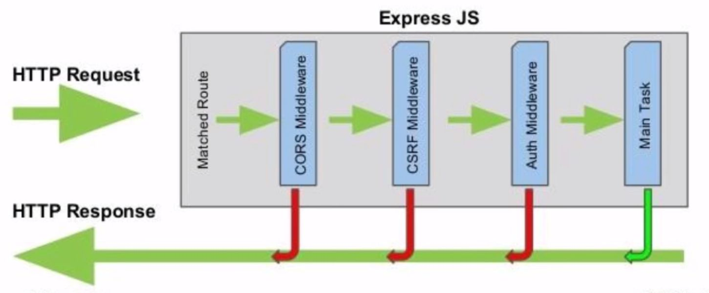

_A stack of functions, executed before the final request handler is made._

**Middleware functions** are functions with access to the `req` and `res` objects. They can...

-   Execute any code.
-   Make changes to the `req` and `res` objects.
-   End the response cycle.
-   Call the next middleware in the stack, by using `next()`.

The functions do something, then pass the results to the next middleware in the chain.

Express has built-in ones, but we can also make custom ones.

```js
// Loggin middleware
function log(req, res, next) {
    console.log(new Date(), req.method, req.url);
    next(); // MUST USE THIS
}
```

```js
// This will make a log before EACH request in the app.
app.use(log);

app.get("/", (req, res) => {
    res.write("Hello World!");
    res.end;
});
```

```js
// This will make a log before THIS request ONLY.
app.get("/", log, (req, res) => {
    res.write("Hello World!");
    res.end;
});
```

### Authentication example

```js
app.post("/upload", auth.isAuthenticated(), controller.upload);
```



# App Setup

**app.js**

```js
let express = require("express");
let middleware = require("./middleware.js");
let api = require("./api");

let app = express();

// Allow requests from all domains and localhost
app.all("/*", function (req, res, next) {
    res.header("Access-Control-Allow-Origin", "*");
    res.header("Access-Control-Allow-Headers", "X-Requested-With, Content-Type, Accept");
    res.header("Access-Control-Allow-Methods", "POST, GET");
    next();
});

app.use(bodyParser.urlencoded({ extended: false }))
    .use(express.static("./app/public"))
    .use(api);

module.exports = app;
```

**server.js**

```js
const app = require("./app.js");

const PORT = process.env.PORT || 3000;

app.listen(PORT, () => {
    console.log(`listening on port: ${PORT}`);
});
```

# Error Handling

**middleware.js**

```js
let errorHandler = (err, req, res, next) => {
    // Log error message in our server's console
    console.error("ERROR:", err);

    // If err has no specified error code, set error code to 'Internal Server Error (500)'
    if (!err.statusCode) err.statusCode = 500;

    // All HTTP requests must have a response, so let's send back an error with its status code and message
    res.status(err.statusCode).send(err);
};

module.exports = { errorHandler };
```

**server.js**

```js
app.use(middleware.errorHandler);
```

**api.js**

**IT'S CRUCIAL TO INCLUDE THE `next` KEYWORD!** This passes data down the chain.

```js
const express = require("express");
const router = express.Router();
const pool = require("../pool.js");

// note the async keyword
// note the next keyword
router.get("/api/endpoint", async function (req, res, next) {
    try {
        let query = `
            select * from product
        `;

        var rows = await pool.query(query);
        res.status(200).send(rows);
    } catch (err) {
        next(err); // note the next usage
    }
});

module.exports = router;
```

# 404

**middleware.js**

```js
let wrongRoute = (req, res, next) => {
    let error = new Error("404 Not found.");
    error.status = 404;
    next(error);
};

module.exports = { wrongRoute };
```

**server.js**

```js
app.use(middleware.wrongRoute);
```

# MySQL Pool

`createConnection` creates a single connection lasting until you close it. You can pass that connection around by reference and re-use it, or you can close it on demand.

`createPool` creates a place where connections get stored. When you request a connection from a pool, you are either given a connection that is currently not being used or a new connection. If you’re at the connection limit, it will wait until a connection is available before it continues. Pooled connections do not need to be manually closed, they can remain open and be re-used.

this library ensures that connections are auto-released after each query.

In fact, `pool.query()` is a shortcut for `pool.getConnection()` + `connection.query()` + `connection.release()`.

```js
let mysql = require("mysql");
let pool = mysql.createPool({
    connectionLimit: 10,
    host: "localhost",
    user: "matt",
    password: "password",
    database: "my_database",
});

// This is just for checking the connection. Can be completely avoided.
pool.getConnection((err, connection) => {
    if (err) {
        if (err.code === "PROTOCOL_CONNECTION_LOST") {
            console.error("Database connection was closed.");
        }
        if (err.code === "ER_CON_COUNT_ERROR") {
            console.error("Database has too many connections.");
        }
        if (err.code === "ECONNREFUSED") {
            console.error("Database connection was refused.");
        }
    }
    // We also ensure that the connection we’ve just created is released back into the pool.
    if (connection) connection.release();
    return;
});
module.exports = pool;
```

Perform queries with the database like so:

```js
const express = require("express");
const router = express.Router();
const pool = require("../pool.js");

// note the async keyword
router.get("/api/endpoint", async function (req, res) {
    try {
        let query = `
            select * from product
        `;

        var rows = await pool.query(query);
        res.status(200).send(rows);
    } catch (err) {
        throw new Error(err);
    }
});

module.exports = router;
```
