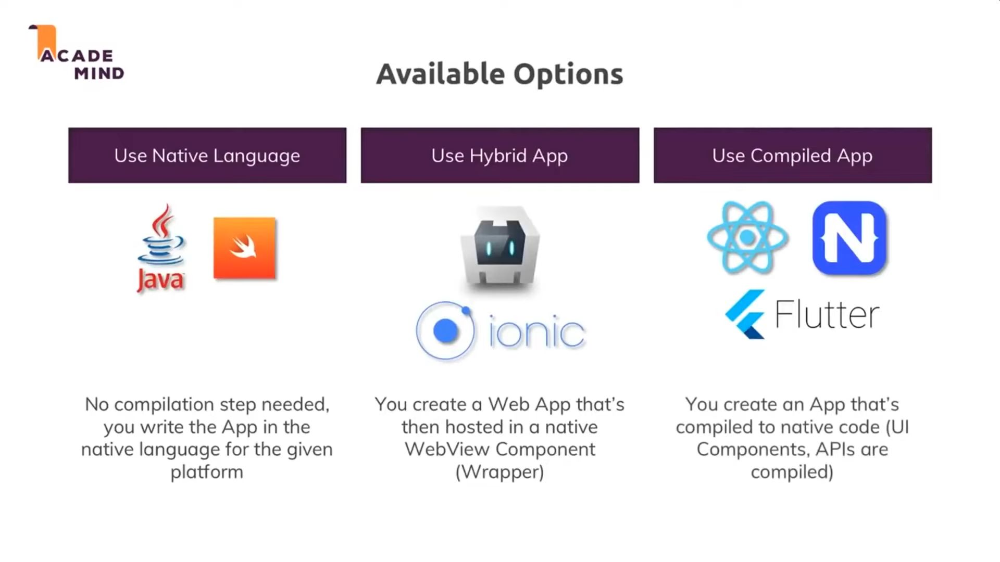
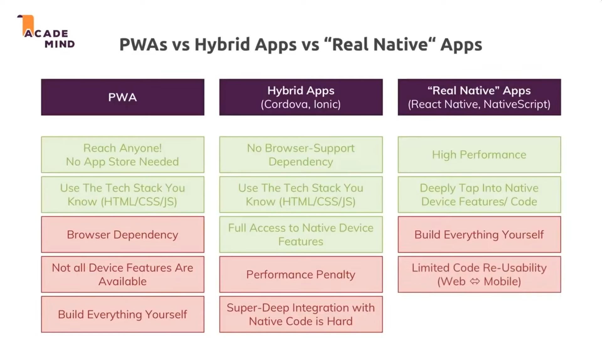
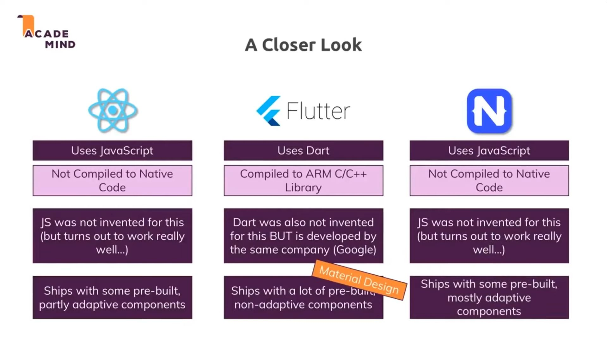
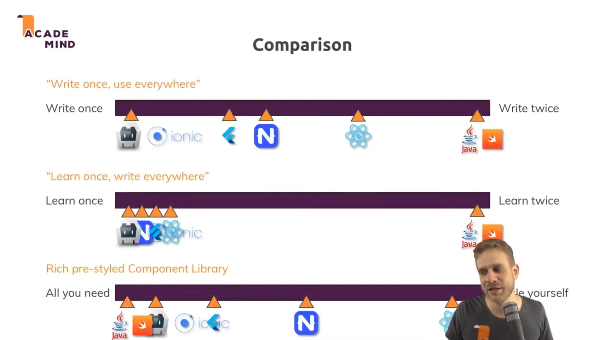
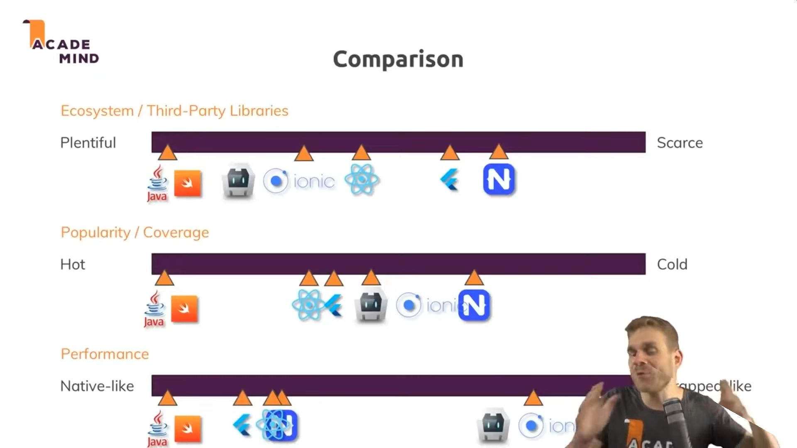
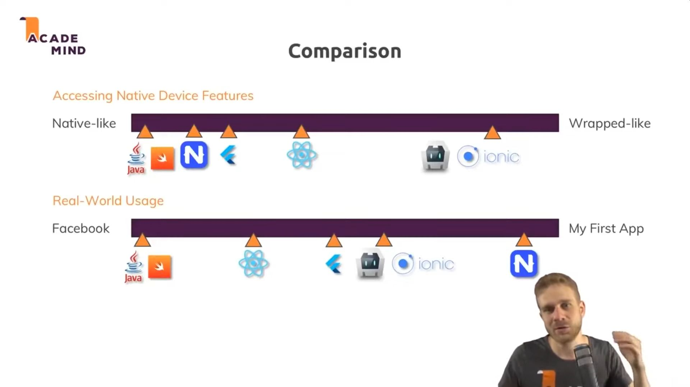

# Summary

> **Developers want mobile websites. Consumers want apps.**

1. Hybrid - Same codebase for web app and mobile app. Good for device functionalities and app stores.
2. PWA - Same codebase for web app and mobile app. Good for B2B apps, that don't live in app stores.
3. Compiled - XML, different codebase from web app. Native feel.
4. Native - Use when performance is imperative ex. video games

# Overview

[Source](https://youtu.be/vl12yhSh_Pg)

# Native

No compilation needed, as the app is written in the native language.

-   Kotlin/Java - Android (Google) 77% share
-   Swift/Objective-C - iOS (Apple) 19% share

# Compiled

**Only** the UI components are compiled to their native equivalents. The rest runs in the language runtime. No access to HTML/CSS.

-   React Native (Facebook) - Javascript
-   Native Script - Javascript
-   Flutter (Google) - Dart

## Nativescript

**NativeScript has access to 100% of the platform APIs.**

Nativescript (similar to React-Native) allows you to develop a mobile application in Javascript and XML (or JSX). These frameworks allow you to generate a native mobile application.

The UI uses native components from the platform to create a performant slick interface. The Javascript logic code runs inside a JS engine (V8 for Android) bundled with the application.

This has the downside of making the app pretty large but you can make cross platform, highly performant mobile apps. The JS code can also access phone functionality through bridging code in the framework.

# Hybrid / WebView / Web Native

A web app ran natively via a WebView (stripped down native browser), allowing access to hardware functionalities. Like Electron, but for mobile devices.

> **A Hybrid app cannot communicate with native device features directly, so it uses a bridge which wraps native code in a Javascript API which can be accessed by the web app.**

## Native Bridge / Hybrid app runtime

-   Cordova (Apache)- PhoneGap successor (open source)
    -   PhoneGap (Adobe) - Cordova predecessor (paid)
-   Capacitor (Ionic) - Cordova alternative

Cordova is the older version of Capacitor and it's predecessor.

Capacitor is what takes that JavaScript and makes it into an app. Capacitor is what creates the bridge between the web and native functionality. It also provides the tooling to build the native apps.

Capacitor is required to create/package and run your web (Ionic app) as a native Android/iOS app. Without Capacitor, you can only run the Ionic app in a web browser. Correct, Capacitor is required to use native functionality in your Ionic app like the camera, push notifications, native storage, etc...

> You can do your view code using Capacitor, and call out to NativeScript when you need to do any native API access that Capacitor plugins might be missing.

## Component library / UI framework

-   Ionic - Web components (stencil.js). Based on Cordova. Gives a native look.

Ionic uses **web components**, so it's frameword agnostic i.e. you can use Angular, React, Vue, Svelte or vanilla Javascript.

Ionic is the framework that makes your app - buttons, tabs, pages etc., and all the things that make it look like an app. This is all done In JavaScript. Ionic is the toolkit that provides the UI components.

# PWA

Enables mobile devices to add a website or web application to a smartphone's home screen and be able to interact with it like a native app, which can work offline.

# Comparison

# Usage

-   Native apps 90%
-   Browser apps 10%
