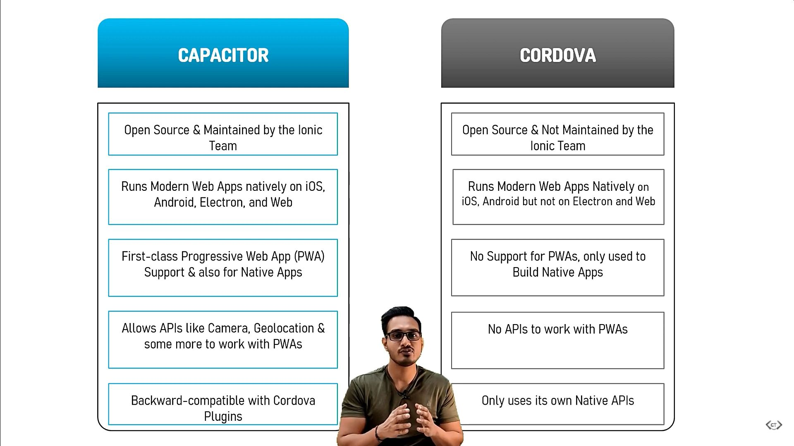

It's a standalone tools, which can work with any Javascript framework.

Capacitor is what takes that JavaScript and makes it into an app. Capacitor is what creates the bridge between the web and native functionality. It also provides the tooling to build the native apps.

Capacitor is required to create/package and run your web (Ionic app) as a native Android/iOS app. Without Capacitor, you can only run the Ionic app in a web browser. Correct, Capacitor is required to use native functionality in your Ionic app like the camera, push notifications, native storage, etc…



# Setup

1. Install the Javascript framework of choice.

2. Install capacitor in the same directory.

As a scaffolding...

```
npm init @capacitor/app
```

...or in an existing app.

```
npm i @capacitor/core
npm i -D @capacitor/cli
```

Requirements:

-   A `package.json` file.
-   A separate directory for built web assets such as `dist` or `www`.
-   An `index.html` file at the root of your web assets directory.

3. Initialize the app i.e. Capacitorconfigutation

```
npx cap init
```

4. Install platforms i.e. add to `package.json`

```
npm i @capacitor/android @capacitor/ios
```

5. Create Android/iOS native projects

```bash
npx cap add android
npx cap add ios

# npx cap add electron
```

6. Sync web code to native project

`npx cap sync` will copy your built web application, by default `www`, to your native project and install the native projects dependencies.

You can customize what folder is copied over by modifying the `webDir` variable in your Capacitor Config file that is created during `npx cap init`.

```
npx cap sync
```

# Compiling

> Capacitor does not have a build or compile command, nor will there ever be one. After sync, you are encouraged to open your target platform's IDE: Xcode for iOS or Android Studio for Android, for compiling your native app.

> Capacitor does not offer a way to build native apps on the command line. Platform-specific tooling (or in the IDE) should be used instead, which provides a faster, more typical experience that follows the standards of app development for that platform.
