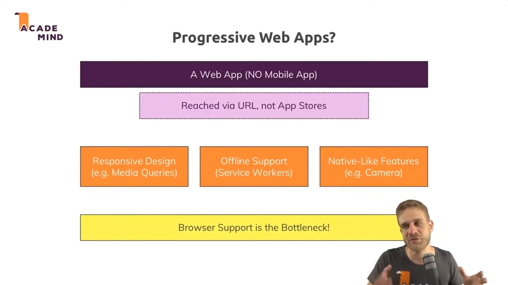

Technology developed by Google in 2015 enables mobile devices to add a website or web application to a smartphone's home screen and be able to interact with it like a native app, which can work offline.

PWAs use the browser technology from the browser it was installed from.

Mobile app users spend 87% of time in native apps, compared to 13% in browser apps.

This happens because:

-   Push notifications help engagement.
-   Icons for fast access.
-   Access native devices like camera.
-   Offline work.

PWA's live on the web, have native capabilities i.e installable and push notifications.

A progressive web application (PWA) is a type of application software delivered through the web, built using common web technologies including HTML, CSS and JavaScript. It is intended to work on any platform that uses a standards-compliant browser, including both desktop and mobile devices.

PWA's offer:

-   Offline work
-   Push notifications
-   Phone app

They have no access to the phone capabilities, such as camera.

Browser > Add to home screen

To become a PWA, the app needs:

-   Service worker - js program serving as a mediator between the app vs network and cache.
-   Manifest - JSON file containing the settings for the phone app (icon, name...).

Direct deployment. Send the app directly to the user, rather than have them download it from a store.
