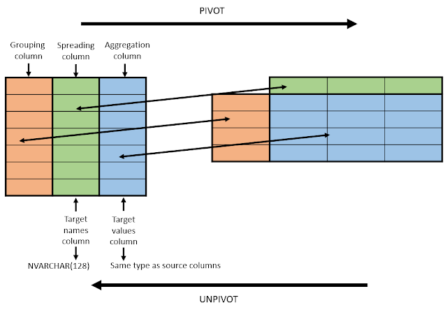

# Declare Variables

```sql
DECLARE @date DATETIME = '07.01.2019'
```

# UPDATE from SELECT / TABLE

```sql
-- select
UPDATE product
SET product.price = t2.newPrice
FROM (
    SELECT sku, newPrice
    FROM pricelist
) t2
WHERE
    product.sku = t2.sku

-- table
UPDATE product
SET product.price = t2.newPrice
FROM t2
WHERE product.sku = t2.sku
```

# INSERT from SELECT
```sql
-- Whole table
INSERT INTO table2
SELECT * FROM table1
WHERE condition;

-- Specific columns
INSERT INTO table2 (column1, column2, column3, ...)
SELECT column1, column2, column3, ...
FROM table1
WHERE condition;
```

# DELETE from LEFT JOIN
```sql
DELETE t1 -- Just from table1. DELETE t1, t2 for both tables
FROM table1 t1
	LEFT JOIN table2 t2
		ON t1.id = t2.id
WHERE 
	t1.criteria = 'foo'
	AND t2.criteria = 'bar'
```

# Partition By

We use this to make a "sub-query" i.e. select n-th item from a table for further use.

### Data

``` sql
SELECT 
    clientID,
    invoiceDate,
    revenue
FROM sales
```

| clientID | invoiceDate | revenue |
|---|---|---|
1017 | 2019-01-31 | 6574.65
116  | 2018-02-05 | 5593.22
1211 | 2018-01-15 | 3637.80
116  | 2018-02-16 | 1848.00
1211 | 2018-01-09 | 15615.65
1017 | 2019-02-14 | 1386.00
1211 | 2018-02-09 | 16145.72
116  | 2018-02-13 | 2784.51
1211 | 2018-03-28 | 8844.64


### Data with PARTITION BY

In this case, we want to have the latest sale for each client. We can achieve this by partitioning the data i.e. ordering the sales for each client in descending order based on the date. We can then select only the desired row with `rowNumber`.

``` sql
SELECT 
    ROW_NUMBER() OVER (PARTITION BY clientID ORDER BY invoiceDate DESC) rowNumber,
    clientID,
    invoiceDate,
    revenue
FROM sales
```

| rowNumber | clientID | invoiceDate | revenue |
|---|---|---|---|
1 | 1017 | 2019-02-14 | 1386.00
2 | 1017 | 2019-01-31 | 6574.65
1 | 116  | 2018-02-16 | 1848.00
2 | 116  | 2018-02-13 | 2784.51
3 | 116  | 2018-02-05 | 5593.22
1 | 1211 | 2018-03-28 | 8844.64
2 | 1211 | 2018-02-09 | 16145.72
3 | 1211 | 2018-01-15 | 3637.80
4 | 1211 | 2018-01-09 | 15615.65

### Result

```sql
SELECT 
    lastSale.clientID, 
    lastSale.invoiceDate, 
    lastSale.revenue
FROM (
    SELECT 
        ROW_NUMBER() OVER (PARTITION BY clientID ORDER BY invoiceDate DESC) rowNumber,
        clientID,
        invoiceDate,
        revenue
    FROM sales
) lastSale
WHERE lastSale.rowNumber = 1
```

We only get the first row for each client i.e. the last sale (sorted by descending invoice date).

|acReceiver | adDate | sales|
|---|---|---|
1017 | 2019-02-14 | 1386.00
116  | 2018-02-16 | 1848.00
1211 | 2018-03-28 | 8844.64

# CTE - Common Table Expression

It defines a temporary result set which can be used in a SELECT statement. 

```sql
-- CTE
WITH Employee_CTE (EmployeeNumber, Title) AS (
    SELECT 
        NationalIDNumber,
        JobTitle
    FROM HumanResources.Employee
)
-- Query using CTE
SELECT EmployeeNumber,
       Title
FROM Employee_CTE
```

# Rollup (Total Row)

`ROLLUP` is a subclause of the `GROUP BY` clause which provides a shorthand for defining multiple grouping sets. Unlike the `CUBE` subclause, `ROLLUP` does not create all possible grouping sets based on the dimension columns; the `CUBE` makes a subset of those.

When generating the grouping sets, `ROLLUP` assumes a hierarchy among the dimension columns and only generates grouping sets based on this hierarchy.

The `ROLLUP` is often used to generate subtotals and totals for reporting purposes.

```sql
SELECT
    brand,
    category,
    SUM(sales) sales
FROM
    sales.sales_summary
GROUP BY
    ROLLUP(brand, category)
```

This will result in

|brand | category | sales| |
|---|---|---| --- |
Honda | cars | 100 | 
Honda  | bikes | 200 |
Honda | NULL | 300 | Subtotal
BMW | cars | 400 |
BMW  | bikes | 500 |
BMW | NULL | 900 | Subtotal
NULL | NULL | 1200 | Grand Total

# Pivot

In order for the pivoting to work, we must **only use the columns needed**, instead of all of them. This results in repeating rows.


### Data
Here is some example data, obtained by the given query.

| product | yearSold | revenue |
|---|---|---|
shoes | 2018 | 33924978.2497
shirts | 2018 | 34362105.196
hats | 2018 | 25119529.9395
shoes | 2019 | 6947797.012
shirts | 2019 | 8070039.2266
hats | 2019 | 5780623.5762

```sql
SELECT
    product,
    yearSold,
    revenue
FROM sales
GROUP BY
    yearSold,
    product
```

### Approach 1 - FROM



```sql
SELECT 
    product,  -- grouping column
    [2019],   -- spreading value 1
    [2018]    -- spreading value 2
FROM (
    SELECT
        product,      -- grouping column
        yearSold,     -- spreading column
        revenue       -- aggregation column
    FROM sales
    GROUP BY
        yearSold,
        product
) PivotData
    PIVOT ( 
        SUM(revenue)   -- aggregation function (aggregation column)
        FOR yearSold   -- spreading column
        IN (
            [2019],    -- spreading value 1
            [2018])    -- spreading value 2
        ) piv
```

| product | 2019 | 2018|
|---|---|---|
shoes | 694 | 3392
shirts | 807 | 3436
hats | 578 | 2511

### Approach 2 - WITH (CTE)

```sql
WITH PivotData AS (
    SELECT
        product,
        yearSold,
        revenue
    FROM sales
    GROUP BY
        yearSold,
        product
) 
SELECT product, [2019], [2018]
FROM PivotData
    PIVOT ( SUM(revenue) FOR [year] IN ([2019], [2018]) ) piv
```

# Dynamic Pivot

```sql
DECLARE @sql AS varchar(max)
DECLARE @pivot_list AS varchar(max) -- Leave NULL for COALESCE technique
DECLARE @select_list AS varchar(max) -- Leave NULL for COALESCE technique

SELECT @pivot_list = COALESCE(@pivot_list + ', ', '') + '[' + PIVOT_CODE + ']'
        , @select_list = COALESCE(@select_list + ', ', '') + 'ISNULL([' + PIVOT_CODE + '], 0) AS [' + PIVOT_CODE + ']'
FROM (
    SELECT
		distinct SS.acName2 as PIVOT_CODE
	FROM tHE_Move M
		JOIN tHE_SetSubj SS
			ON M.acIssuer = SS.acSubject
	WHERE m.acDocType in (
		'3210',
		'3220',
		'3230',
        '3240',
        '3450',
        '3250',
        '3260',
        '3270',
        '3540',
        '3460',
        '3280',
        '3290',
        '3310',
        '3320',
        '3440',
        '3330',
        '3340',
        '3350',
        '3360',
        '3370',
        '3380',
        '3390',
        '3410',
        '3470',
        '3420',
        '3430',
        '3480',
        '3490',
        '3520',
        '3530',
        '3560',
        '3610',
        '2540',
        '2740',
        '2730' 
	)
) AS PIVOT_CODES

SET @sql = '
;WITH PivotData AS (
    select
		ym,
		shop AS PIVOT_CODE,
		sum(revenueNoVAT) revenueNoVAT
	from (
		SELECT
			SS.acName2 shop,
			SI.acName product,
			m.addate,
			concat(year(m.addate), ' + '''-''' + ', RIGHT(' + '''00''' + ' + CONVERT(varchar(2), DATEPART(MONTH, m.addate)), 2)) ym,
			MI.anPVForPay revenueVAT,
			MI.anPVVATBase revenueNoVAT,
			MI.anQTY * MI.anStockPrice totalCost,
			MI.anPVVATBase - MI.anQTY * MI.anStockPrice AS totalProfit
		FROM tHE_MoveItem MI
			JOIN tHE_Move M
				ON MI.acKey = M.acKey
			JOIN tHE_SetItem SI
				ON MI.acIdent = SI.acIdent
			JOIN tHE_SetSubj SS
				ON M.acIssuer = SS.acSubject
		WHERE m.acDocType in (
			' + '''3210''' + ',
			' + '''3220''' + ',
			' + '''3230''' + ',
			' + '''3240''' + ',
			' + '''3450''' + ',
			' + '''3250''' + ',
			' + '''3260''' + ',
			' + '''3270''' + ',
			' + '''3540''' + ',
			' + '''3460''' + ',			
            ' + '''3280''' + ',
			' + '''3290''' + ',
			' + '''3310''' + ',
			' + '''3320''' + ',
			' + '''3440''' + ',
			' + '''3330''' + ',
			' + '''3340''' + ',
			' + '''3350''' + ',
			' + '''3360''' + ',
			' + '''3370''' + ',
			' + '''3380''' + ',
			' + '''3390''' + ',
			' + '''3410''' + ',
			' + '''3470''' + ',
			' + '''3420''' + ',			
            ' + '''3430''' + ',
			' + '''3480''' + ',
			' + '''3490''' + ',
			' + '''3520''' + ',
			' + '''3530''' + ',
			' + '''3560''' + ',
			' + '''3610''' + ',
			' + '''2540''' + ',
			' + '''2740''' + ',
			' + '''2730''' + ' 
		)
	) t1
	group by ym, shop
) 
SELECT ym, ' + @select_list + '
FROM PivotData
    PIVOT ( sum(revenueNoVAT) FOR PIVOT_CODE IN (' + @pivot_list + ')) piv
order by ym desc
'
-- select @sql

EXEC (@sql)
```