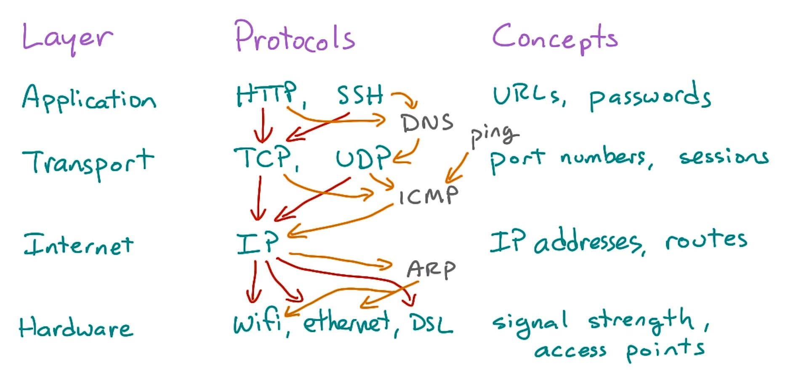

# Setup

Tools used for networking.

```bash
sudo apt-get update && sudo apt-get upgrade
sudo apt-get install netcat-openbsd tcpdump traceroute mtr
```

# Theory

Create a basic program that sends a string to the specified ip/port.

Create a second program that listens on that ip/port and prints out any received strings.

Congratulations you now know how every network works. The rest is security, data verification/validation, optimization.

## HTTP / TCP Model

Each of these depends on the one below. Some of these don't belong on a specific layer.



HTTP = Hypertext Transfer Protocol  
TCP = Transmission Control Protocol

All traffic is split up into messages called packets, sent between two computers in a stream, with the addresses of the sender and recipient in each one.

HTTP is needed so that communicating systems can understand each other. TCP just provides "envelopes" that can transfer bytes around the network.

An application protocol assigns structure and meaning to the contents of the envelopes.

**If you speak English and I send you a letter written in French, you'll still get the letter, but you won't understand it.**

HTTP is implemented in browsers and web servers, while TCP in the operating system.

#### Simple HTTP Request

```bash
# HTTP header
GET /posts/1 HTTP/1.1
Host: jsonplaceholder.typicode.com

# Manual request - Returns header and body
printf 'GET /posts/1 HTTP/1.1\r\nHost:jsonplaceholder.typicode.com\r\n\r\n' | nc jsonplaceholder.typicode.com 80

# Just the body
curl jsonplaceholder.typicode.com/posts/1
```

## Ports

Listening on a port is like waiting for a phone call on a specific phone number.

Ports let servers distinguish one service from another on the same host and wait for someone to connect.

Normally a server has well known ports for it's applications. ex. HTTP uses `port 80` and SSH uses `port 22`. The client initiates a connection, and it's associated with an arbitrary port on its end.

Only one program can listen to a port in a given moment. Once started, the program can start child processes to listen for multiple connections on the same port i.e. a web server.

The port range that a normal (non-root) user can listen on is `1024` through `65535`. Root access (including sudo) can listen on ports down to 1.

If the other side doesn't pick up, an RST (Reset packet) error message is sent back.

# DNS

It's basically a phonebook for IP addresses.

An `A Record` is matched with an IP address, so when someone looks for `www.google.com`, the A record is referenced and the IP address is sent back to the user.

The DNS resolver i.e. client code is built into the OS.

**CNAME** - Canonical Name i.e. alias for a domain.  
**AAAA** - IPv6 equivalent to an A record.  
**NS** - DNS Name server. The NS record for a particular domain specifies which DNS has the records.

# Tools

## ping

It sends individual packets to test if traffic can get from one address to another, and back.

```bash
ping 8.8.8.8

# send 5 packets
ping -c 5 google.com
```

#### unknown host

```bash
sudo vim /etc/resolv.conf
# Add nameserver 8.8.8.8
```

## lsof

The `lsof` utility lists open files, including network sockets (listening or connected).

```bash
# List only network sockets
lsof -i
```

## nc / netcat

`netcat` is a tool for manually talking to servers, by connecting to a port and sending a string over it. It's a thin wrapper over TCP.

```bash
nc en.wikipedia.org 80
nc localhost 22
nc gmail-smtp-in.l.google.com 80
```

To illustrate, we can use two terminals to talk to each other. Anything typed at the second console will be concatenated to the first, and vice-versa. This is a simple TCP server. The connection is ended with `CTRL` + `d`.

```bash
# terminal 1
nc -l 3456 # listen for an incoming connection on port 3456
# typed text

# terminal 2
nc 127.0.0.1 3456 # connect to the machine and port being listened on
# typed text
```

Commands can be sent via a `pipe`.

```bash
echo 'message' | netcat server 80
```

`netcat` doesn't know anything about forming HTTP request, but in combination with `printf` and `piping`, it can be done.

```bash
printf 'HEAD / HTTP/1.1\r\nHost: google.com\r\n\r\n' | nc google.com 80

printf 'GET /posts/1 HTTP/1.1\r\nHost:jsonplaceholder.typicode.com\r\n\r\n' | nc jsonplaceholder.typicode.com 80
```

## host

Used for looking up records in the DNS.

```bash
# Returns all the records
host google.com

# Returns just the A record
host -t a google.com
```

## dig

Similar to `host` in showing DNS records, but in a way more readable for scripts and closer to the way they are stored in the DNS configuration files.

```bash
dig google.com
```

# Static server

This will start a static web server on port `8000`. The command has to be run in the directory with the `index.html` file.

```bash
python -m SimpleHTTPServer 8080
```

# Networking

**Gateway** is the router address we are talking to in order to connect to the rest of the network/internet.

`127.x.x.x` - Your computer.  
`192.168.0.x` - Local address created by a router.

`ifconfig` - Check IP address.  
`ping 8.8.8.8` - Ping IP address.  
`netstat -tupln` - Check open ports.

`cat etc/network/interfaces` - Shows the interfaces brought up after booting.

`/etc/hosts` is used to simulate a domain for an IP address. Add `127.0.0.1 domain.com` to avoid typing the IP address.
