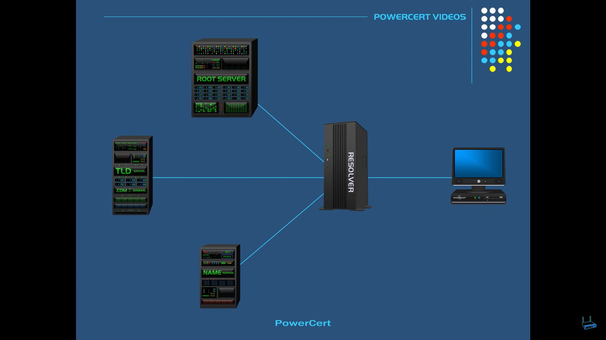

# HTTP - Hypertext Transfer Protocol


HTTP is implemented in browsers and web servers.

HTTP is needed so that communicating systems can understand each other.

Simple HTTP Request

```bash
# HTTP header
GET /posts/1 HTTP/1.1
Host: jsonplaceholder.typicode.com

# Manual request - Returns header and body
printf 'GET /posts/1 HTTP/1.1\r\nHost:jsonplaceholder.typicode.com\r\n\r\n' | nc jsonplaceholder.typicode.com 80

# Just the body
curl jsonplaceholder.typicode.com/posts/1
```

# DNS - Domain Name System

It Converts domain names into IP addresses. It's basically a phonebook for IP addresses. It's easier to remember `google.com` than `123.456.789.255`.

An `A Record` is matched with an IP address, so when someone looks for `www.google.com`, the A record is referenced and the IP address is sent back to the user.

The DNS resolver i.e. client code is built into the OS.

**CNAME** - Canonical Name i.e. alias for a domain.  
**AAAA** - IPv6 equivalent to an A record.  
**NS** - Name server. Specifies which DNS has the records.



Steps

1.  Web browser, if unable to find IP in cache, sends query to resolver server/ISP
2.  The resolver server will check it's own cache and if unable to find the IP sends a query to a level below to root server
3.  The root server is the top/root level of DNS hierarchy and 13 sets strategically spread around the world with each a unique IP and operated by 12 organizations
4.  The root server does not know the IP address of the domain is but knows (how?) where to send the resolver to help it find the IP address so the root server directs the resolver to the TLD/ top level domain server for the .com domain.
5.  The resolver will now ask the TLD server for the IP of the domain. The TLD servers stores address information for top level domains like .com, .org, etc. The TLD won't know what the IP for the domain is but will direct the resolver to the Authoritative Name Server.
6.  The resolver then asks the Authoritative Name Server for the IP of the domain. The authoritative name servers are responsible for knowing everything about the domain 1. including the IP address. They're the final authority. The name server will respond to the query from the resolver with the IP address of the domain.
7.  Then finally, the resolver will tell the computer the IP address for the domain and finally the computer can retrieve the page using the IP. Important to note, once the resolver gets the IP of the domain it stores it in it's cache so that it doesn't have to go through the whole process (DNS walking the tree) for future queries of the same domain.

# DDNS - Dynamic Domain Name System

Makes local devices accessible over the internet.

It's a service that maps your router's dynamic IP addresses to a host ex. `myhomepc.ddns.org`. Whenever the router's address changes, the service is notified and the address is updated. The host acts as a static IP address.

The IP updating can be done in 3 ways:

-   Router's built-in functionality (best)
-   App running on device, provided by DDNS service
-   Crontab

**NOTE:** In reality, you don't need a DDNS service to connect to a local device. You need the service only because the router's IP address changes. If you had a static IP address, you wouldn't need a DDNS.

### Setup

1. Choose DDNS service
2. Open account
3. Choose domain/host
4. Configure DDNS in the router to periodically update the DDNS service.
5. Configure port forwarding in the router to direct all internet connections to local device (home server). Ex: `myhomepc.ddns.org:8123` > `192.168.100.55:8123`


### Example - Cameras

#### 1. Connect all devices

Connect everything via Ethernet (LAN)

1. Connect POE switch to router.
2. Connect all cameras to switch.
3. Connect DVR to switch.

#### 2. Setup camera IP addresses

All devices have a default IP address. Ex. Dahua's cameras have `192.168.1.108`.

To change the address to ex. `192.168.100.15`, you need to:

1. Temporarily change the PC's dynamic IP address to a static one on the same subnet as the camera ex. `192.168.1.2`.
2. Access the camera via its IP address `192.168.100.15`, log into it, and change it directly. Alternatively, you can use Dahua's `configtool`.
3. Change the PC's static IP address back to a dynamic one.

#### 3. Add the cameras in the DVR

Access the DVR via its IP address and add the cameras with their new static IP addresses.

#### 4. Setup DDNS

1. Choose DDNS service
2. Open account
3. Add host, ex. `cameras.ddns.org`.

#### 5. Setup router

1. Configure DDNS rule to map the router's dynamic IP address to the DDNS's host `cameras.ddns.org`.
2. Configure port forwarding in the router to direct all internet connections to the DVR. Ex: `cameras.ddns.org:80` > `192.168.100.55:8000`

#### 6. Setup DVR manager

1. Add the DDNS `cameras.ddns.org` host in the DVR manager to gain access to all the cameras.

### Example - SQL Server

Your SQL Server will have to be visible to the server from which you host your website.

I'm assuming you want to access the data in SQL Server to generate some content for your website.

There are 2 simple ways to do this:

-   Static IP - Ask your ISP for a static IP address for your local network, you can use this in the connection string. This is preferable & more stable, since it will always be in sync.

-   Dynamic DNS - If your ISP won't give you a static address or you don't want to pay for it. You sign up with a DDNS service provider, they give you a domain name, like ferrysqlserver.ddns.org, and your network is visible to the internet via that name. Some routers support DDNS, otherwise you may have to run a service application that keeps your external ip address in sync with your DDNS provider.
    Once you have either of those working, your network is now available to the internet, but nothing is likely accessible. What you have done so far is to create a path from an internet name to your local router.

To make SQL Server accessible, you need to find out which ports your SQL Server uses (default is 1433). It's possible you may need to open other ports as well if you connect to SQL in a different way.

On your router, find the port forwarding options, and enable port forwarding to the local network ip address of your SQL Server, for port 1433.

This step maps connections from the internet to port 1433 of your router, and forwards those connections to port 1433 of your SQL Server.
