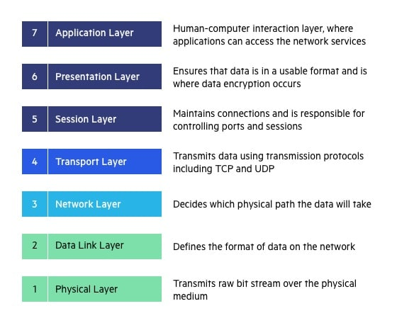
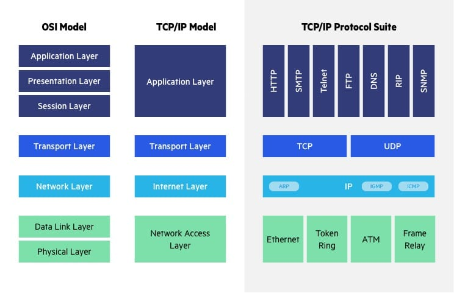
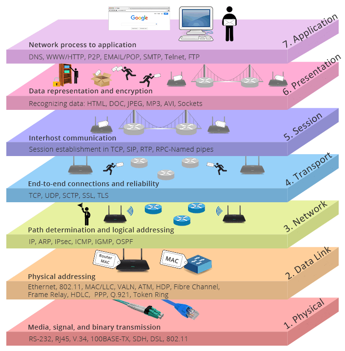
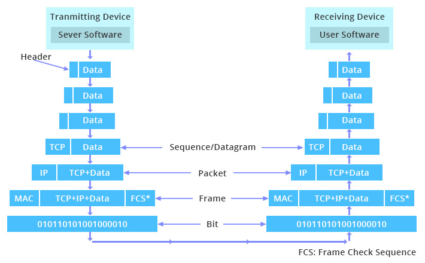

# ELI5

Create a basic program that sends a string to the specified ip/port.

Create a second program that listens on that ip/port and prints out any received strings.

Congratulations you now know how every network works. The rest is security, data verification/validation, optimization.

# Analogy

### **Highway**

Think of IP as a sort of high-way that allows other protocols to get on and find their way to other computers. TCP and UDP are the "trucks" on the highway, and the "load" they are carrying are protocols such as HTTP, File Transfer Protocol (FTP) and more.

IP is required to connect all networks;

TCP is a mechanism that allows us to transfer data safely and

HTTP which utilizes TCP to transfer its data, is a specific protocol used by Web servers and clients.

### **Postal service**

One might regard TCP or UDP as the equivalent of the US Postal Service, while HTTP is the equivalent of one business letter template.

If you are writing to an unknown person, as business letter format is a good, generic way to transmit the "WHO, HOW, WHAT, WHEN, AND WHERE" of your message, but it is NOT the only format that is allowed by the USPS.

That is, if you are writing to a business associate or loved one, you might forgo the formalities and instead go with a more efficient format, like a billing invoice or love letter or greeting card, but the USPS, like TCP or UDP, will still be there for you, carrying the letters back and forth.

# Models

The OSI Model is a logical and conceptual model that defines network communication used by systems open to interconnection and communication with other systems. On the other hand, TCP/IP helps you to determine how a specific computer should be connected to the internet and how you can be transmitted between them.

OSI model helps you to standardize router, switch, motherboard, and other hardware, whereas TCP/IP helps you to establish a connection between different types of computers.

Each layer handles a very specific task and interacts only with layers directly above or below. When a layer breaks, it takes all the above with it. Always try to specify the problematic layer for better support.

# OSI

Textbook 7 layer model - Open Systems Interconnect (OSI)

1. Physical
2. Data Link
3. Network
4. Transport
5. Session
6. Presentation
7. Application

# TCP/IP

Real-world 5 layer model

1. Physical
2. Datalink
3. Network
4. Transport
5. Application

# Diagrams

