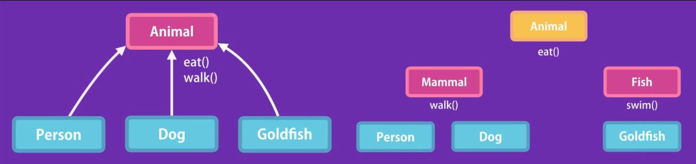

# Objects

-   **Every object has a constructor property, which reference the function used to create it.**
-   All functions are objects, and they have properties and methods.
-   A function defined as the property of an object, is called a method to the object.

`Value types` or `Primitives` are copied by their value. Number, String, Boolean, Symbol, undefined, null.

`Reference types` or `Objects` are copied by their reference. Object (Function, Array)

## Literal

Should be used only for objects without behaviour.

```javascript
let obj = {
    foo: "bar",
    baz: function() {
        console.log("baz");
    }
};
```

## Factory

Identical to `constuctors`.

```javascript
function createFoo(param) {
    // camelCase
    return {
        foo: param,
        baz: function() {
            console.log("baz");
        }
    };
}

let obj = createFoo("bar");
```

## Constructor

Identical to `factories`. **Every object has a constructor property, which references the function that was used to create it.** So, `obj` would reference `Foo` as the constructor, and `Foo` references `Object`.

```javascript
// Function declaration
function Foo(param) {
    // PascalCase
    this.foo = param;
    this.baz = function() {
        console.log("baz");
    };
}

let obj = new Foo("bar");
```

```javascript
//Function expression
let Foo = function(param) {
    this.foo = param;
    this.baz = function() {
        console.log("baz");
    };
};

let obj = new Foo("bar");
```

## Prototype

```javascript
function Foo() {}

Foo.prototype.foo = "bar";
Foo.prototype.baz = function() {
    console.log("baz");
};

let obj = new Foo();
```

## Class

**Not hoisted.** Syntactic sugar over prototypical inheritance.

```javascript
class Foo {
    constructor(param) {
        this.foo = param;
        this.bar = function() {}; // Constructor (instance) method.
    }
    baz() {
        console.log("baz"); // Prototype method.
    }
}

let obj = new Foo("qux");
```

## Singleton

A design pattern ensuring that a class has only one instance.

```javascript
let obj = new function() {
    this.foo = "bar";
    this.baz = function() {
        console.log("baz");
    };
}();
```

# Properties

Properties can be added dynamically, which makes Javascript very powerful, compared to Java or C# where the class has to be refactored.

```javascript
function Foo(param) {
    // PascalCase
    this.foo = param;
}

let obj = new Foo("bar");
obj.baz = "baz";
obj["qux-1"] = "qux"; // obj.qux-1 = "qux" is an illegal operation.

console.log(obj); // { foo: "bar", baz: "baz", qux-1: "qux" }
delete obj["qux-1"]; // { foo: "bar", baz: "baz" }
```

## Checking properties

```javascript
// Object instance members
console.log(Object.keys(myObj));

// Object instance + prototype members
for (let key in myObj) console.log(key);

// List all member name-value pairs of an object
the name-value pair of the current key.
Object.keys(myObj).forEach(key => {
    console.log(key, myObj[key]);
});

// List only properties. Object.keys can't do this.
for (let key in myObj){ //
    if(typeof myObj[key] !== "function")
        console.log(key, myObj[key]);
}

// Check existence of property or method
"keyname" in myObj; // true/false

// Check existence of property
myObj.hasOwnProperty("foo"); // true
```

## Comparing Objects / Properties

```javascript
// Returns an array of object key-value pairs that are different
function diffObject(oldObj, newObj) {
  let diffs = [];
  
  for (var key in oldObj) {
    if (oldObj[key] != newObj[key]) {
      diffs.push({
        id: newObj.id, 
        [key]: newObj[key]
      })
    }
  }
    
  return diffs;
}

// Returns an array of objects { id, property, value } that are different
function diffObject2(oldObj, newObj) {
  let foo = [];
  
  for (var key in oldObj) {
    if (oldObj[key] != newObj[key]) {
      foo.push({
        id: newObj.id, 
        property: key,
        value: newObj[key]
      })
    }
  }
    
  return foo;
}

// Returns a boolean, FALSE if they are different
function isSameObject(obj1, obj2) {
  let isSame = true;
  
  for (var key in obj1) {
    if (obj1[key] != obj2[key]) {
      isSame = false;
      break;
    }
  }
    
  return isSame;
}
```

# new

When we use the `new` operator to call a function, this happens:

1. An empty object `{}` is created.
2. Sets `this` to point to the empty object.
3. Returns the object from the `Foo` function. No need for a return statement.

```javascript
function Foo(param) {
    this.foo = param;
    this.baz = function() {
        console.log("baz");
    };
}

var obj = new Foo("bar"); // Proper invocation
var obj = Foo("bar"); // If we omit the `new` keyword, `this` references the global object.

var obj = new Foo.prototype.constructor("bar"); // also valid
```

# this

The `object` that is executing the current function.

If a function is a `method`, i.e. belonging to an `object`, `this` returns a reference to the current `object` calling it.

If a function is a regular one i.e. outside of an `object`, it returns a reference to the `window` (browser) or `global` (node) `object`.

99% of the problems occur with callbacks, because they are executed as regular functions i.e. not as methods, meaning `this` is not what it seems as the functions are executed by the window/global object.

```javascript
const video = {
    title: "Title",
    tags: ["a", "b", "c"],
    showTags: function() {
        this.tags.forEach(function(tag) {
            // Callback
            console.log(this.title + " " + tag); // This refers to the window object, not the video
        });
    }
};

video.showTags(); // undefined a, undefined b, undefined c
```

We need to bind the anonymous callback to the corresponding object.

```javascript
const video = {
    title: "Title",
    tags: ["a", "b", "c"],
    showTags: function() {
        this.tags.forEach(
            function(tag) {
                console.log(this.title + " " + tag);
            }.bind(this)
        ); // The binding is done here
    }
};

video.showTags(); // Title a, Title b, Title c
```

# Encapsulation

Group related variables and functions together to reduce complexity and increase reusability.

## Procedural

```javascript
let baseSalary = 30000;
let overtime = 10;
let rate = 20;

function getWage(baseSalary, overtime, rate) {
    return baseSalary + overtime * rate;
}
```

## OOP

```javascript
let employee = {
    baseSalary = 30000,
    overtime = 10,
    rate = 20,
    getWage: function(){
        return this.baseSalary + this.overtime * this.rate;
    }
}

employee.getWage();
```

# Abstraction

Hide details, show essentials. Provide a simple interface for interaction, without revealing the inner complexity and avoiding breaking changes.

```javascript
function Foo(param) {
    this.a = param;
    this.b = "b";
    let c = "c"; // Not part of the object; local variable.

    this.bar = function() {
        // ...
    };

    this.baz = function() {
        let d = "d";
        this.bar();
    };
}

const obj = new Foo("a");
```

## Private properties and methods

Use `this` only for things you want to make public. The convention of naming private properties and methods is to prefix them with `_` i.e. `_foo`.

```javascript
function Foo(param) {
    this.a = param; // public
    let _b = "b"; // Converted to private. No longer part of object.
    let _c = "c"; // Already private.

    let _bar = function() {
        // Converted to private.  No longer part of object.
        console.log("private method");
    };

    this.baz = function() {
        let d = "d";
        _bar(); // No longer needs this.
    };
}

const obj = new Foo("a");
obj.baz(); // private method
```

## Getters / Setters

```javascript
function Foo() {
    let _privateVar1 = "bar";
    let _privateVar2 = "baz";

    this.getPrivateVar1 = function() {
        // Don't use this.
        return _privateVar1;
    };

    Object.defineProperty(this, "privateVar2", {
        get: function() {
            return _privateVar2;
        },
        set: function(value) {
            _privateVar2 = value;
        }
    });
}

var obj = new Foo();

obj.getPrivateVar1(); // via method
obj.privateVar2; // computed property
```

## Closure

Determines what variables will be accessible to an inner function. Not to be confused with scope. Scope is temporary, closure is permanent.

For the `baz` function, `d` is in the scope and will be destroyed after running, but `b`, `c` and `bar()` will stay in memory and be available because they are part of the closure of the `baz` function.

# Inheritance

-   Do not use it just for the sake of it.
    -   Needlessly complicates things.
    -   Fragile code.
    -   Constant refactoring.
-   Avoid creating inheritance hierarchies. Do not go more than one level.
-   Favor composition (mixins) over inheritance.

 \* Introducing a fish breaks the hierarchy.

It eliminates redundant code, and classical inheritance is when a `child` class takes on the properties and behaviour of a `parent` class. Ex. a `Circle` and a `Square` inherit from `Shape`, **rather than have their own duplicate behaviours**. The `Circle` and `Square` have a `IS-A` relationship with `Shape`.

## Prototype

However, Javascript doesn't have classes, there are only objects, so the inheritance is `prototypical`, from `parent` object to `child` object.

**The constructor uses the prototype to create objects.**

The default prototype of every object is `Object` (root object), unless specified. The prototype of `Circle` is `Shape`, which has a prototype of the root object.

Every object has a prototype, except the root object. When running a method or checking a property, **the javascript engine walks up the prototype chain until it finds it.**

## Prototype vs Instance members

If there are thousands of instances, a lot of memory can be saved if the method is not defined in every `instance`.

We can define the method in the `prototype` of the object, so only one definition can be used. The method will not be found in the instance, but it will be in the prototype chain.

**Use this only when there are a lot of instances. Otherwise use instance members, because it exposes private properties needlesly. Premature optimization is the root of all evil.**

```javascript
// Instance members
function Circle(radius) {
    this.radius = radius;
    this.draw = function() {
        console.log("draw");
    };
}

// Prototype members. Can be done after instantiation.
Circle.prototype.move = function() {
    console.log("move");
};

const c1 = new Circle(1);
c1.draw(); // Instance method, many copies.
c1.move(); // Prototype method, one copy.
```

## Prototypical inheritance

**IMPORTANT:** When inheriting from a prototype, the instance members are not included. This is why we need to inherit from an instance, rather than a prototype. The instance includes both the instance and prototype members.

The child **must** first inherit from the parent, before getting its own prototype behaviour. Otherwise it will overwrite it after inheriting.

```javascript
function Shape() {
    this.shape = function() {
        console.log("shape");
    };
}

Shape.prototype.duplicate = function() {
    console.log("duplicate");
};

function Circle(radius) {
    this.radius = radius;
    this.draw = function() {
        console.log("draw");
    };
}

// Circle.prototype = Object.create(Object.prototype); // DEFAULT
// Circle.prototype = Object.create(Shape.prototype); // c.shape() won't work! Not included in the Shape prototype.

// Proper inheritance
Circle.prototype = new Shape(); // c.shape() works.

Circle.prototype.move = function() {
    console.log("move");
};

const c = new Circle();

c.draw(); // draw
c.move(); // move
c.duplicate(); // duplicate
c.shape(); // shape. Won't work with Object.create();
```

## Resetting the prototype constructor

Whenever you reset the prototype, reset the constructor as well, because it can lead to unexpected behaviour when getting the constructor dynamically in a function.

```javascript
new Circle.prototype.constructor(); // Shape // same as new Circle
Circle.prototype.constructor = Circle;
new Circle.prototype.constructor(); // Circle
```

## Super constructor

Used to initialize inherited properties.

```javascript
function Shape(color) {
    this.color = color;
}

function Circle(radius, color) {
    // Shape(color) // This will set it to the global object
    Shape.call(this, color); // super
    this.radius = radius;
}
```

## extend()

We can use intermediate function inheritance to avoid duplicate code.

```javascript
function extend(Child, Parent) {
    // Child.prototype = Object.create(Parent.prototype);
    Child.prototype = new Parent(); // To include instance members.
    Child.prototype.constructor = Child;
}

extend(Circle, Shape); // Circle inherits form Shape.
extend(Square, Shape);
```

# Composition

Used to assign behaviours to objects, rather than creating inheritance hierarchies. Uses the ES6 `assign` operator.

```javascript
const canEat = {
    eat: function() {
        console.log("eating");
    }
};

const canWalk = {
    walk: function() {
        console.log("walking");
    }
};

const canSwim = {
    swim: function() {
        console.log("swimming");
    }
};

function Person() {}

Object.assign(Person.prototype, canEat, canWalk);
const person = new Person(); // { eat: f, walk: f }

function GoldFish() {}

Object.assign(GoldFish.prototype, canEat, canSwim);
const goldfish = new GoldFish(); // { eat: f, swim: f }
```

## Mixins

Functions that make composition more readable.

```javascript
// Avoid source1, source2... Puts all arguments in an array with rest operator.
function mixin(target, ...sources) {
    // Convert an array into arguments with spread operator.
    Object.assign(target, ...sources);
}

mixin(Person.prototype, canEat, canWalk);
mixin(GoldFish.prototype, canEat, canSwim);
```

# Polymorphism

Eliminate ugly if/switch statements by changing the behaviour of the same method, based on the object. Ex. If we loop through an array of shapes and we call a method.

```javascript
function Shape() {}

Shape.prototype.duplicate = function() {
    console.log("duplicate");
};

function Circle() {}

// extend(Circle, Shape);
Circle.prototype = new Shape(); // To include instance members.
Circle.prototype.constructor = Circle;

Circle.prototype.duplicate = function() {
    console.log("duplicate circle");
};

const s = new Shape();
const c = new Circle();

s.duplicate(); // duplicate
c.duplicate(); // duplicate circle
```

# Class

**Classes are objects, because they are syntactic saugar over constructor functions, which are objects.**

They are not hoisted i.e. can't be used before declaring them.

The body of a class is executed in `strict mode` by default, which makes the javascript engine more sensitive and do more error checking, and make silent failure into exceptions, while preventing global `this` bindings.

## Static methods

Available on the class itself, not the object instance. Used to create utility functions not specific to a specific object. Ex. `Math.random()`

```javascript
class Circle {
    constructor(radius) {
        this.radius = radius;
    }

    // Instance method
    draw() {
        console.log("circle");
    }

    // Static method
    static parse(str) {
        const radius = JSON.parse(str).radius;
        return new Circle(radius);
    }
}

const circle = new Circle(1);
const circle2 = Circle.parse('{ "radius": 1 }');
```

## Private properties

### Symbol

This is a primitive type in ES6 used for creating unique identifiers. Everytime `Symbol()` is called, we get a new unique identifier. **It is not a constructor function.**

Symbols can be used to create semi-private properties and methods. Why semi? Because they are not impossible to access, just cumbersome via symbols.

```javascript
const _radius = Symbol();

class Circle {
    constructor(radius) {
        this[_radius] = radius;
    }
}
```

### WeakMap

This is essentially a dictionary, where keys are objects and values can be anything. The keys are weak, meaning if there are no references to them, they are garbage collected.

```javascript
const _radius = new WeakMap();
const _move = new WeakMap();

class Circle {
    constructor(radius) {
        _radius.set(this, radius);
        _move.set(this, () => {
            console.log("move"); // Need to use .bind(this) without arrow function.
        });
    }

    draw() {
        console.log(_radius.get(this));
        _move.get(this)(); // Need to execute it after fetching.
    }
}

const c = new Circle(1);
c.draw(); // 1
```

### Getters / Setters with WeakMap

```javascript
const _radius = new WeakMap();

class Circle {
    constructor(radius) {
        _radius.set(this, radius);
    }

    get radius() {
        return _radius.get(this);
    }

    set radius(value) {
        if (value <= 0) throw new Error("Invalid radius.");
        _radius.set(this, value);
    }
}

const c = new Circle(1);
c.draw(); // 1
```

### Example

```javascript
const _stack = new WeakMap(); // private property.

class Stack {
    constructor() {
        _stack.set(this, []); // set private property to empty array.
    }

    // avoid duplicate _stack.get(this) with a getter.
    get stack() {
        return _stack.get(this);
    }

    // this.stack === _stack.get(this) thanks to getter.
    get count() {
        return this.stack.length;
    }

    push(item) {
        return this.stack.push(item);
    }

    pop() {
        let items = this.stack;
        if (items.length === 0) throw new Error("Stack is empty.");
        items.pop();
    }

    peek() {
        let items = this.stack;
        if (items.length === 0) throw new Error("Stack is empty.");
        return items[items.length - 1];
    }
}

const s = new Stack();
console.log(s.stack); // []
s.push("a");
s.push("b");
s.push("c");
console.log(s.stack); // ["a", "b", "c"]
s.pop();
console.log(s.stack); // ["a", "b"]
console.log(s.peek()); // "b"
console.log(s.count); // 2
```

## Inheritance

With the new ES6 Class, we inherit by using `extends`, which is also syntactic sugar over prototypical inheritance. This resets the constructor for us behind the scenes.

If the `Parent` class has a constructor, and the `Child` also needs one, then the `Parent` constructor must be called inside the `Child` constructor, in order to initialize the inherited properties.

This is done with the `super` keyword, which references the `Parent` object, so we then call its constructor with `super()` as a function.

```javascript
class Shape {
    constructor(color) {
        this.color = color;
    }

    move() {
        console.log("move");
    }
}

class Circle extends Shape {
    constructor(color, radius) {
        super(color);
        this.radius = radius;
    }

    draw() {
        console.log("draw");
    }
}

const c = new Circle("red", 1);
```

## Method overriding (Polymorphism)

We simply change the method implementation in the `Child`. We can still access the `Parent` method by using `super`.

```javascript
class Shape {
    move() {
        console.log("move");
    }
}

class Circle extends Shape {
    move() {
        // Overriden method.
        super.move(); // parent method.
        console.log("circle move");
    }
}

const c = new Circle("red", 1);
c.move(); // move // circle move
```
