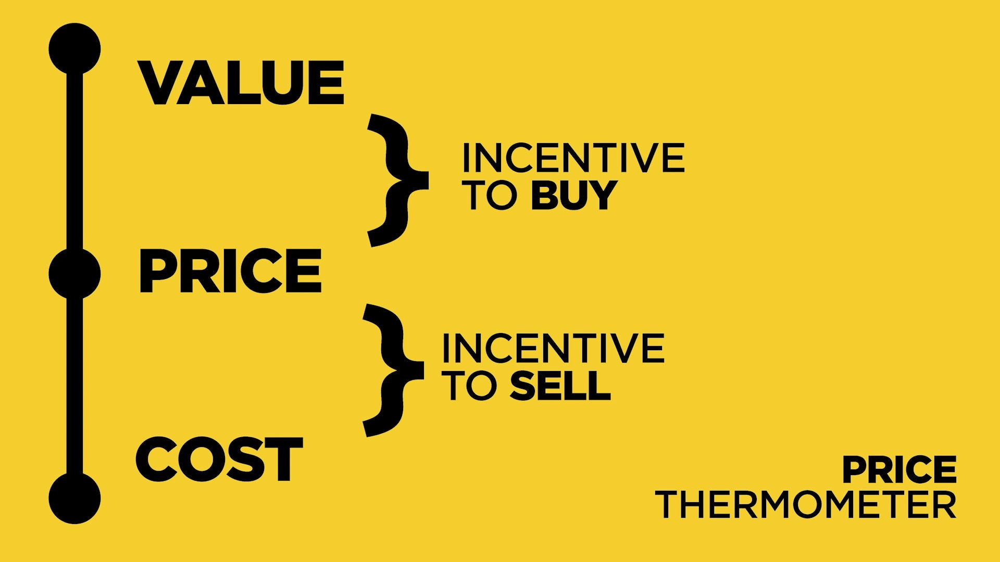
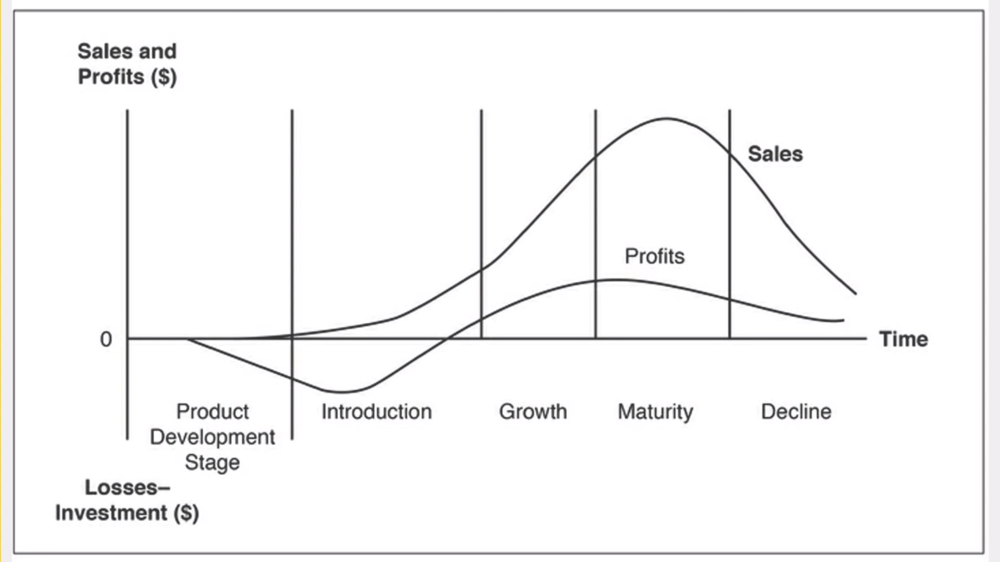
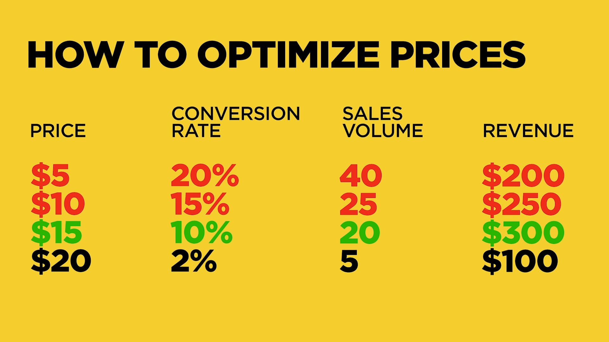
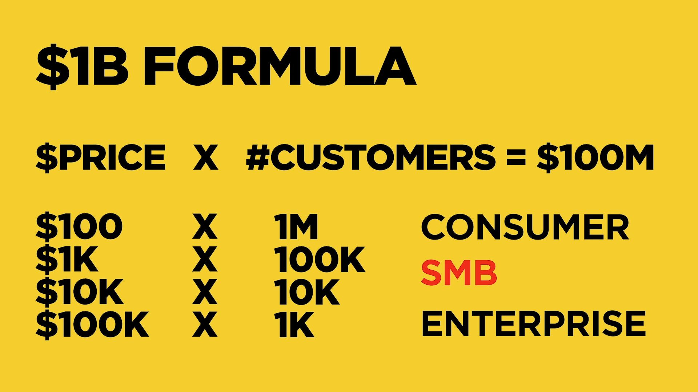
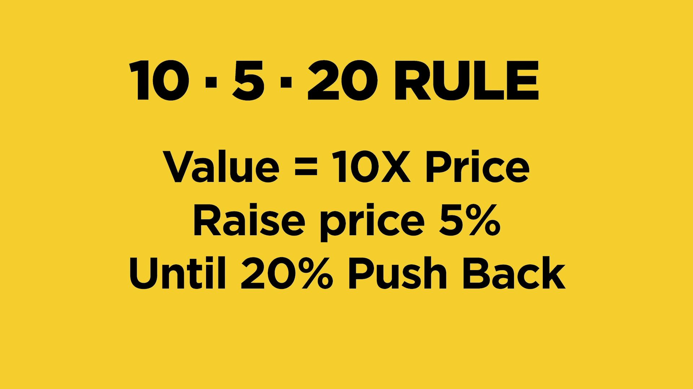

[Kevin Hale - Startup Pricing 101](https://www.youtube.com/watch?v=jwXlo9gy_k4)

There are two ways to get to the price:

1. Cost based
2. Value based - strive for this one

# 4 common mistakes

1. Prices are too low

2. Underestimate costs

3. Don't understand your value

    - Either they don't understand your value, or you're unable to convince them.

4. Focus on wrong customers
    - _"If I build a better product, and charge half the competitors' price, I win..."_ You are looking for people that won't base their decision on price alone.

# Product lifecycle

Startups live in the 1st and 2nd stage, and the customers there are not mainstream, they're early adopters.

_"Studies indicated that demand does not begin to accelerate untils the first 2%-5% of potential buyers adopt the product"_

# Price optimization

Red = Lost opportunities (Happens at discount/tiered pricing)

What would the business look like if you're a billion dollar company i.e. $100M in sales **annually**, or $8M **monthly**.

SMB = **The `danger zone`, where a lot of companies are in and they struggle. They treat money like consumers, but act like an enterprise.**

| Type       | Annual | Monthly |
| ---------- | ------ | ------- |
| Consumer   | \$100  | \$8     |
| **SMB**    | \$1K   | \$83    |
| **SMB**    | \$10K  | \$833   |
| Enterprise | \$100K | \$8,333 |

| Type          | Annual             | Monthly       |
| ------------- | ------------------ | ------------- |
| Self-serve    | \< \$2,000         | \< \$166      |
| Transactional | \$2,000 - \$10,000 | \$166 - \$833 |
| Enterprise    | \> \$25,000        | \> \$2,083    |

**The numbers are ANNUAL**

The price determines the acquisition strategy.

-   Self-serve (Same day conversions)

    -   All marketing is inbound. No ads.
    -   Support is self-serve.
    -   No sales team.

-   Transactional (1 - 3 months sales cycle)

    -   Marketing generates leads.
    -   Support SLAs for training/onboarding.
    -   Inside sales, SDR, demo presenter.

-   Enterprise (6 - 12 months sales cycle)
    -   Branding.
    -   Phone support, customer support.
    -   Sales managers, territories.

Charge $100 for customer's percieved value of $1,000. Raise prices by 5% until you start losing 20% of customers.

# Pricing studies

https://neilpatel.com/blog/5-psychological-studies/

### Comparative Pricing

# Pricing Your Product

[Pricing Your Product - Sequoiacap](https://www.sequoiacap.com/article/pricing-your-product/)

## Increase perceived value

Usually, companies fixate on the gap between how much their products cost to make and how much they charge for them. But you should also focus on the gap between your price and how much value customers think it delivers, a concept known as perceived value.

Companies often assume that if sales are slow they need to cut prices. But more often, Dearing says, **“If nobody’s buying my product, it’s because the gap between price and perceived value either doesn’t exist or it’s not large enough.”**

## Let your price tell a story

The price you set for a product also influences its perceived value. That’s why people assume that a $50 bottle of wine is better than a $10 one.

“Premium pricing communicates a premium product”

Too much choice can be overwhelming. People would rather buy nothing than choose the wrong option. Similarly, variable pricing that slides upwards with more usage can scare potential customers. They'll often walk away if they can't easily figure out the right product to buy or if they're forced to make projections about future costs.

## Design for snap judgments

There’s another reason why traditional economics aren’t a good way to set price: people don’t act rationally.

In fact, in many cases the decision to buy something is a split-second one people make before the parts of their brains that apply logic and reason kick in. To do this people take shortcuts, falling back on a judgment they've already made instead of making the effort to evaluate the value of something new.

Instead of trying to determine the value of the shoes—a difficult problem that would require the person to assess the material, the stitching and other factors—the customer substitutes a question that's easier to answer: How much would a high-school student or a businessman spend on shoes? That becomes the baseline for deciding whether the loafers are expensive or a bargain.

## Decoy pricing

The Economist magazine once offered three subscription packages: an online one for $59; a print one for $125; and a combined print and online subscription also for \$125.

The ad caught the eye of a professor, who asked 100 of his students which subscription they would choose. Eighty-four chose the combo and 16 chose the online only. No one chose the print only subscription.

But when the print-only option was eliminated and students were just given a choice between the $59 online subscription and the $125 combined one, 68 chose the cheaper option.

The print-only subscription doesn’t have a lot of value as a package. But it influences the way customers make snap judgments.

These “decoy” packages make other—often more expensive—ones look good by providing a clearly inferior choice. There’s no obvious way to determine whether the online subscription or print-and-online combination is a better value. But compared with the print-only one, the combo is clearly a better deal. The reference point makes people more inclined to pick it.

Similarly, a company may use a decoy to make an expensive product look affordable. A common tactic is enterprise software that costs, say, $500 a month for up to 10 users, $1,000 a month for up to 25 users but just \$1,200 for unlimited users.

**Tip:** People tend to overvalue things they already have, a pattern known as the endowment effect. This is something that enterprise companies should be particularly aware of. It’s going to take an extra effort to get a customer to rip out something they already have even if what you’re selling is demonstrably better. That’s one reason why it’s easier to sell to a greenfield customer than to win one away from a competitor.
