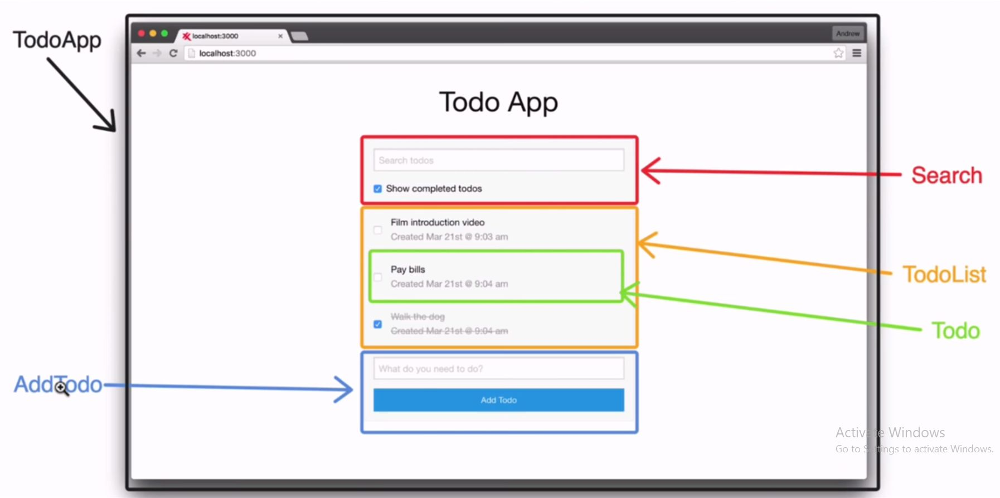

React is a library that only takes care of rendering the view while making sure it's in sync with the state.

# React Create App

Zero-configuration setup, creates all the boilerplate for you.

```bash
sudo npm i -g create-react-app
create-react-app app-name
```

It will install:

-   Lightweight development server
-   Webpack (bundler)
-   Babel (transpiler)

It also enables hot module reloading, which means we don't have to re-build and refresh after each change.

`react-scripts` in `package.json` is the magic behind `create-react-app` because it's the thing that abstracts all the `webpack` and `babel` configuration.

**Available commands:**

```bash
npm start        # Starts the development server.
npm run build    # Bundles the app into static files for production.
npm test         # Starts the test runner.
npm run eject    # Removes all the configuration abstractions.
```

### Errors

You appear to be offline. Falling back to the local Yarn cache.

```bash
sudo apt-get remove yarn && sudo apt-get purge yarn

npm config set registry "https://registry.npmjs.org"
```

### Eject

This will permanently remove this tool and add all the abstracted dependencies in `package.json` and the config files will appear. This allows detailed configurations.

```bash
npm run eject
```

# Hello World

```javascript
// React object from module.
import React from "react";
import ReactDOM from "react-dom";

const element = <h1>Hello World</h1>; // JSX expression

ReactDOM.render(element, document.getElementById("app"));
```

# JSX

It's syntactic sugar for creating HTML elements with javascript, instead of using templating engines. It's not a string, but an expression.

```jsx
class App extends Component {
    render() {
        return (
            <div className="App">
                <h1>Hello World!</h1>
            </div>
        );
    }
}
```

Without JSX...

```javascript
class App extends Component {
    render() {
        return React.createElement("div", { className: "App" }, React.createElement("h1", null, "Hello World!"));
    }
}
```

Since the compiled JSX makes a call to `React.createElement`, we need to import `React`, even if we don't use the object directly.

This returns an `Object`, a React element, which is part of the virtual-DOM.

The call to the function is the reason why we need one parent element, as Babel gets confused with multiple.

### Fragments

If we don't want to return a reduntant `div` element, we can use a `fragment` i.e. a "ghost" element.

```jsx
<React.fragment>
    <h1>Hello World</h1>
</React.fragment>
```

# Virtual-DOM

Lightweight in-memory representation of the UI. Instead of re-building the DOM on each change, the virtual DOM sees the changes and it just updates the changed parts in the real DOM.

Whenever the state of the React element object changes...

-   React gets a new React element.
-   Compares it to the previous one to see the changes.
-   Update just the changed parts in the real DOM.

The DOM updating is done by the `render()` method in the `react-dom` module. It takes the object returned from JSX and renders the HTML inside the referenced div.

# Components

A piece of UI. A javascript class that has some state to be displayed and a render method.



**counter.jsx**

```javascript
import React, { Component } from "react";

class Counter extends Component {
    render() {
        return (
            <div>
                <div>Counter</div>
                <button>Increment</button>
            </div>
        );
    }
}

export default Counter;
```

**index.js**

```javascript
import React from "react";
import ReactDOM from "react-dom";
import Counter from "./components/counter";

ReactDOM.render(<Counter />, document.getElementById("root"));
```

### Functional Components

They are **stateless** components i.e. they don't need to be a `class`. Use them when there is no state i.e. when there are props passed in.

**Class component**

```javascript
import React, { Component } from "react";

class UserItem extends Component {
    render() {
        const { userName, userImg } = this.props.user;

        return (
            <div>
                <h1>{userName}</h1>
            </div>
        );
    }
}

export default Counter;
```

**Functional component**

`render()` and `this` are no longer needed.

They can have state, only via `React Hooks`.

```javascript
import React from "react";

// function UserItem(props) {...
const UserItem = (props) => {
    const { userName, userImg } = props.user;

    return (
        <div>
            <h1>{userName}</h1>
        </div>
    );
};

export default Counter;
```

# State

`State` is data that is local/private to a component.

**It's a good idea to have as many presentational components as possible, and manage state in a select few ones.**

Components can have a state, which is an object that determines how that components renders and behaves. Also, we can have "Application level" state (shared between components
) with **Redux** or the built-in **Context-API**.

1. **The component owning the state should be the one modifying it.**

2. **Both the state and mutating methods should reside in the parent component, to be passed to the child.**

3. **If two components need to share the same state, then the state needs to be lifted one level up to their parent component.**

`setState` is used for updating the state AND re-rendering the view i.e. syncing the DOM with the virtual DOM.

The method takes an object, and merges or overwrites the state object with it.

**If we update the state directly, React is unaware of the change, and nothing is rendered.**

# Props

`Props` includes data and methods that we give to a component.

## Drilling

Props, with state and methods, are repeatedly passed from parent component to child, with them always being located at the top most component.

In order to pass values from the bottom up i.e. from child to parent components, we need to `.bind(this)`.

```javascript
render() {
    const { id } = this.props.todo;
    return (
          <button onClick={this.props.delTodo.bind(this, id)}>x</button>
    )
}
```

## Destructuring

In order to avoid boilerplate like `this.props.todo.title`, we can destructure them at the child component using them like this.

```javascript
render(){
    const { id, title} = this.props.todo;
    return (
        <div>{ title }</div> // rather than this.props.todo.title
    )
}
```

# Events

Events are used to make the components do something. The naming convention is to prefix the function with `handle`.

```javascript
class Foo extends Component {
    handleSomething() {
        console.log("Something handled"); // Something handled
        console.log(this.props); // TypeError: Can't read props of undefined
    }

    render() {
        return <button onClick={this.handleSomething}>Do something</button>;
    }
}
```

When we click the button, the function will be called, but the props will not work. while `this` can be used inside the lifecycle methods due to it refering to the component.

The `this` inside the `handleSomething` function refers to the function itself. To make it work, we need to bind `this`, either with `.bind(this)` or with an **arrow function**.

`onClick={this.handleSomething}` results in `undefined`, because `this` references the global object and React runs in `strict mode`.

### Arrow function

```javascript
class Foo extends Component {
    state = {
        bar: "bar",
    };

    handleSomething = () => {
        console.log(this.state.bar);
    };

    render() {
        return <button onClick={this.handleSomething}>Do something</button>;
    }
}
```

### bind()

Since we cannot use `onClick={this.handleSomething("value")}`, we need to use an arrow function.

```javascript
class Foo extends Component {
    state = {
        bar: "bar",
    };

    handleSomething() {
        console.log(this.state.bar);
    }

    render() {
        return <button onClick={this.handleSomething.bind(this)}>Do something</button>;
    }
}
```

## Event arguments

### Class Component

```javascript
class Foo extends Component {
    state = {
        bar: "bar",
    };

    handleSomething = (argument) => {
        console.log(argument);
    };

    render() {
        return <button onClick={() => this.handleSomething("baz")}>Do something</button>;
    }
}
```

### Functional Component

```javascript
import React from "react";

const ExampleComponent = () => {
    function sayHello(name) {
        alert(`hello, ${name}`);
    }

    return <button onClick={() => sayHello("James")}>Greet</button>;
};

export default ExampleComponent;
```

Pass the event

```javascript
return (
    <button value="blue" onClick={(e) => changeColor(e.target.value)}>
        Color Change
    </button>
);
```

# Refs

Refs provide a way to access DOM nodes or React elements created in the render method.

When a ref is passed to an element in render, a reference to the node becomes accessible at the current attribute of the ref.

```javascript
function CustomTextInput(props) {
    // textInput must be declared here so the ref can refer to it
    let textInput = React.createRef();

    function handleClick() {
        textInput.current.focus();
    }

    return (
        <div>
            <input type="text" ref={textInput} />

            <input type="button" value="Focus the text input" onClick={handleClick} />
        </div>
    );
}
```

# CSS

```javascript
class Foo extends Component {
    render() {
        return <div style={{ fontSize: 30, fontWeight: "bold" }}>Some text</div>;
    }
}
```

```javascript
class Foo extends Component {
    styles = {
        fontSize: 10,
        fontWeight: "bold",
    };

    render() {
        return <div style={this.styles}>Some text</div>;
    }
}
```

# Todo App

**App.js**

```javascript
import React, { Component } from "react";
import { BrowserRouter as Router, Route } from "react-router-dom";
import Header from "./components/layout/Header";
import Todos from "./components/Todos";
import AddTodo from "./components/AddTodo";
import About from "./components/pages/About";
import uuid from "uuid";
import axios from "axios";

import "./App.css";

class App extends Component {
    state = {
        todos: [],
    };

    componentDidMount() {
        axios.get("https://jsonplaceholder.typicode.com/todos?_limit=10").then((res) => this.setState({ todos: res.data }));
    }

    // Toggle Complete
    markComplete = (id) => {
        this.setState({
            todos: this.state.todos.map((todo) => {
                if (todo.id === id) {
                    todo.completed = !todo.completed;
                }
                return todo;
            }),
        });
    };

    // Delete Todo
    delTodo = (id) => {
        axios.delete(`https://jsonplaceholder.typicode.com/todos/${id}`).then((res) =>
            this.setState({
                todos: [...this.state.todos.filter((todo) => todo.id !== id)],
            })
        );
    };

    // Add Todo
    addTodo = (title) => {
        axios
            .post("https://jsonplaceholder.typicode.com/todos", {
                title,
                completed: false,
            })
            .then((res) => {
                res.data.id = uuid.v4();
                this.setState({ todos: [...this.state.todos, res.data] });
            });
    };

    render() {
        return (
            <Router>
                <div className="App">
                    <div className="container">
                        <Header />
                        <Route
                            exact
                            path="/"
                            render={(props) => (
                                <React.Fragment>
                                    <AddTodo addTodo={this.addTodo} />
                                    <Todos todos={this.state.todos} markComplete={this.markComplete} delTodo={this.delTodo} />
                                </React.Fragment>
                            )}
                        />
                        <Route path="/about" component={About} />
                    </div>
                </div>
            </Router>
        );
    }
}

export default App;
```

**Todos.js**

```javascript
import React, { Component } from "react";
import TodoItem from "./TodoItem";

class Todos extends Component {
    render() {
        return this.props.todos.map((todo) => <TodoItem key={todo.id} todo={todo} markComplete={this.props.markComplete} delTodo={this.props.delTodo} />);
    }
}

export default Todos;
```

**TodoItem.js**

```javascript
import React, { Component } from "react";

export class TodoItem extends Component {
    render() {
        const { id, title } = this.props.todo;
        return (
            <div>
                <p>
                    <input type="checkbox" onChange={this.props.markComplete.bind(this, id)} /> {title}
                    <button onClick={this.props.delTodo.bind(this, id)}>x</button>
                </p>
            </div>
        );
    }
}

export default TodoItem;
```

**AddTodo.js**

```javascript
import React, { Component } from "react";

export class AddTodo extends Component {
    state = {
        title: "",
    };

    onSubmit = (e) => {
        e.preventDefault();
        this.props.addTodo(this.state.title);
        this.setState({ title: "" });
    };

    onChange = (e) => this.setState({ [e.target.name]: e.target.value });

    render() {
        return (
            <form onSubmit={this.onSubmit} style={{ display: "flex" }}>
                <input type="text" name="title" placeholder="Add Todo ..." value={this.state.title} onChange={this.onChange} />
                <input type="submit" value="Submit" className="btn" style={{ flex: "1" }} />
            </form>
        );
    }
}

export default AddTodo;
```

# Hooks

Used to simplify code by allowing to use state without writing a class i.e. functional components.

**Sharing (stateful) logic between components becomes easier.**

Hooks are functions that let you “hook into” React state and lifecycle features from function components. Hooks don’t work inside classes — they let you use React without classes.

Classes, in addition to making code reuse and code organization more difficult, can be a large barrier to learning React. You have to understand how `this` works in JavaScript, which is very different from how it works in most languages. You have to remember to `bind` the event handlers.

-   Only call Hooks **at the top level**. Don’t call Hooks inside loops, conditions, or nested functions.
-   Only call Hooks **from React function components**. Don’t call Hooks from regular JavaScript functions.

## State Hook

`useState` is a built-in **Hook** used to add state to function component. `useState()` **ALWAYS** returns an array with exactly two elements, which we can rename with array destructuring.

-   The first variable is the value. Similar to `this.state`.
-   The second variable is a function to update that value. Similar to `this.setState`.

The final part to useState is the argument that we pass to it. **The `useState` argument is the initial state value**. In the case of our counter, we started at 0.

**IMPORTANT:** The update function overwrites the whole state, rather than merge it with the old one as in `class` components with `this.setState()`. In order to avoid using `spread` operators, we can simply define multiple `useState` hooks.

```javascript
import React, { useState } from "react";

function JustAnotherCounter() {
    const [count, setCount] = useState(0);

    return (
        <div>
            <h1>{count}</h1>
            <button onClick={() => setCount(count + 1)}>Count Up To The Moon</button>
        </div>
    );
}
```

vs

```javascript
import React, { Component } from "react";

class JustAnotherCounter extends Component {
    state = {
        count: 0,
    };

    setCount = () => {
        this.setState({ count: this.state.count + 1 });
    };

    render() {
        return (
            <div>
                <h1>{this.state.count}</h1>

                <button onClick={this.setCount}>Count Up To The Moon</button>
            </div>
        );
    }
}
```

`useState` returns a pair: the **current state** value and a **function** that lets you update it. You can call this function from an event handler or somewhere else. React will preserve this state between re-renders.

It’s similar to `this.setState` in a class, except it doesn’t merge the old and new state together.

The only argument to `useState` is the initial state, only used during the first render. In the example, it is 0 because our counter starts from zero. Unlike `this.state`, the state here doesn’t have to be an object — although it can be if you want.

You may be unfamiliar with the line with the `useState() `syntax. **This uses destructuring assignment for arrays**. This is similar to how we would pull props out an object with object destructuring.

We can declare multiple hooks in the same component.

```javascript
function ExampleWithManyStates() {
    const [age, setAge] = useState(42);
    const [fruit, setFruit] = useState("banana");
    const [todos, setTodos] = useState([{ text: "Learn Hooks" }]);
}
```

## Effect Hook

`useEffect` hook mimics lifecycle methods like `componentDidMount()`, which is available only in class components.

**It takes a function as an argument, which is executed EACH TIME AFTER the DOM has been rendered.**

**It also takes a second argument, an array of dependencies i.e. variables which decide if the effect runs on their update.**

You’ve likely performed data fetching, subscriptions, or manually changing the DOM from React components before. We call these operations **“side effects”** because they can affect other components and can’t be done during rendering.

The **Effect Hook**, `useEffect`, adds the ability to perform side effects from a function component. It serves the same purpose as `componentDidMount`, `componentDidUpdate`, and `componentWillUnmount` in React classes, but **unified into a single API**.

When you call `useEffect`, you’re telling React to run your “effect” function after flushing changes to the DOM. Effects are declared inside the component so they have access to its props and state. By default, React runs the effects after every render — including the first render.

Ex. this component sets the document title after React updates the DOM:

```javascript
function DoSomethingCrazy() {
    useEffect(() => {
        console.log("i have arrived at the party!");
        document.title = "preesent";
    });

    return <div>stuff goes here</div>;
}
```

vs

```javascript
import React, { Component } from "react";

class DoSomethingCrazy extends Component {
    componentDidMount() {
        console.log("i have arrived at the party!");
        document.title = "present";
    }

    render() {
        return <div>stuff goes here</div>;
    }
}
```

**Since `useEffect()` runs every time a component renders, how do we get it to only run once, on mount? The Effect Hook can take a second argument, an array. It will look through the array and only run the effect if one of those values has changed.**

```javascript
// INFINITE LOOP
useEffect(() => {
    fetchData(); // runs endlessly
}); // <--- because we didn't specify when to run

// componentDidMount: runs once, pass an empty array.
useEffect(() => {
    fetchData(); // runs only once
}, []);

// componentDidUpdate: runs on changes.
useEffect(() => {
    fetchData(); // runs if count changes
}, [count]);

// componentWillUnmount(). To run something before a component unmounts, we just have to return a function from useEffect()
useEffect(() => {
    fetchData();

    // clean up, runs just before re-rendering.
    return () => {
       console.log("Cleaning up...")
     };
}, , [count]);

// shouldComponentUpdate
export default React.memo(Component);
```

## Context Hook

`useContext` just uses the Context object -- which you have created before -- to retrieve the most recent value from it. Using the React Hooks instead of Context API's Consumer component, makes the code more readable, less verbose, and doesn't introduce a kinda artificial component -- the Consumer component -- in between.

**src/ThemeContext.js**

```javascript
import React from "react";

const ThemeContext = React.createContext(null);

export default ThemeContext;
```

**src/ComponentA.js**

```javascript
import React from "react";
import ThemeContext from "./ThemeContext";

const A = () => (
    <ThemeContext.Provider value="green">
        <D />
    </ThemeContext.Provider>
);
```

**src/ComponentC.js** - child of Component D

```javascript
import React from "react";
import ThemeContext from "./ThemeContext";

const C = () => {
    const color = React.useContext(ThemeContext);
    return <p style={{ color }}>Hello World</p>;
};
```

...instead of using **Consumer** with **Context API**

**src/ComponentC.js** - child of Component D

```javascript
import React from "react";
import ThemeContext from "./ThemeContext";

const C = () => <ThemeContext.Consumer>{(color) => <p style={{ color }}>Hello World</p>}</ThemeContext.Consumer>;
```

`useContext` lets you reference and destructure contexts in a really elegant way. Say you want to show a user's name if they're logged in, with the render prop approach it's something like:

```js
<AuthContext.Consumer> {({ isLoggedIn } => { return (<div> {isLoggedIn && <span>i'm logged in</span>} </div>) })}
</AuthContext.Consumer>
```

...with `useContext`, you can do...

```js
const { isLoggedIn } = useContext(AuthContext);

// Condtionally render anywhere in the body of your component without all the Context.Consumer business.
{isLoggedIn && ...}
```

## Reducer Hook

`useReducer` lets you manage local state of complex components with a reducer i.e. offload the mutating functions outside of a component.

This is the same as Redux (Elm) with dispatching an action and a payload.

```javascript
function Todos() {
    const [todos, dispatch] = useReducer(todosReducer, defaultValue);
    // ...
```

## Custom Hooks

Example for a `useHttp` hook.

```javascript
import { useState, useEffect } from "react";

export const useHttp = (url, dependencies) => {
    const [isLoading, setIsLoading] = useState(false);
    const [fetchedData, setFetchedData] = useState(null);

    //   fetch('https://swapi.co/api/people')
    useEffect(() => {
        setIsLoading(true);
        console.log("Sending Http request to URL: " + url);
        fetch(url)
            .then((response) => {
                if (!response.ok) {
                    throw new Error("Failed to fetch.");
                }
                return response.json();
            })
            .then((data) => {
                setIsLoading(false);
                setFetchedData(data);
            })
            .catch((err) => {
                console.log(err);
                setIsLoading(false);
            });
    }, dependencies);

    return [isLoading, fetchedData];
};
```

# Todo App with Hooks

```javascript
import React, { useState, useEffect } from "react";
import ReactDOM from "react-dom";

function GitHubUsers() {
    const [users, setUsers] = useState([]);

    useEffect(() => {
        fetch("https://api.github.com/users")
            .then((response) => response.json())
            .then((data) => {
                setUsers(data); // set users in state
            });
    }, []); // empty array because we only run once

    return (
        <div className="section">
            {users.map((user) => (
                <div key={user.id} className="card">
                    <h5>{user.login}</h5>
                </div>
            ))}
        </div>
    );
}

const rootElement = document.getElementById("root");
ReactDOM.render(<GitHubUsers />, rootElement);
```

# Todo App with Hooks 2

```javascript
import React, { useState } from "react";
import "./App.css";

function Todo({ todo, index, completeTodo, removeTodo }) {
    return (
        <div className="todo" style={{ textDecoration: todo.isCompleted ? "line-through" : "" }}>
            {todo.text}

            <div>
                <button onClick={() => completeTodo(index)}>Complete</button>
                <button onClick={() => removeTodo(index)}>x</button>
            </div>
        </div>
    );
}

function TodoForm({ addTodo }) {
    const [value, setValue] = useState("");

    const handleSubmit = (e) => {
        e.preventDefault();
        if (!value) return;
        addTodo(value);
        setValue("");
    };

    return (
        <form onSubmit={handleSubmit}>
            <input type="text" className="input" value={value} onChange={(e) => setValue(e.target.value)} />
        </form>
    );
}

function App() {
    const [todos, setTodos] = useState([
        {
            text: "Learn about React",
            isCompleted: false,
        },
        {
            text: "Meet friend for lunch",
            isCompleted: false,
        },
        {
            text: "Build really cool todo app",
            isCompleted: false,
        },
    ]);

    const addTodo = (text) => {
        const newTodos = [...todos, { text }];
        setTodos(newTodos);
    };

    const completeTodo = (index) => {
        const newTodos = [...todos];
        newTodos[index].isCompleted = true;
        setTodos(newTodos);
    };

    const removeTodo = (index) => {
        const newTodos = [...todos];
        newTodos.splice(index, 1);
        setTodos(newTodos);
    };

    return (
        <div className="app">
            <div className="todo-list">
                {todos.map((todo, index) => (
                    <Todo key={index} index={index} todo={todo} completeTodo={completeTodo} removeTodo={removeTodo} />
                ))}
                <TodoForm addTodo={addTodo} />
            </div>
        </div>
    );
}

export default App;
```

# Context API

Used to avoid prop drilling i.e. passing state beyond 2-3 levels.

Context provides a way to pass data through the component tree without having to pass props down manually at every level. Context is designed to share data that can be considered “global” for a tree of React components, such as the current authenticated user, theme, or preferred language.

**Context is primarily used when some data needs to be accessible by many components at different nesting levels. Apply it sparingly because it makes component reuse more difficult.**

Used for state management, similar to `Redux`, but not the same, as it's inteded for low frequency updates i.e. state changes that don't occur multiple times per second.

**Reducer** is the function executed when an **action** is dispatched.

Context is just a javascript object, which can be given to any component and its children. There can be more than one.

We create context with this function.

```javascript
React.createContext({}); // takes a default value as the first argument.
```

Adding context to a class based component will only work in the render function and will not be available in the lifecycle functions. Use functional components instead.

## Simple Example

```javascript
import React, { Component } from "react";

// first we will make a new context
const MyContext = React.createContext();

// Then create a provider Component
class MyProvider extends Component {
    state = {
        name: "Wes",
        age: 100,
        cool: true,
    };
    render() {
        return (
            <MyContext.Provider
                value={{
                    state: this.state,
                    growAYearOlder: () =>
                        this.setState({
                            age: this.state.age + 1,
                        }),
                }}
            >
                {this.props.children}
            </MyContext.Provider>
        );
    }
}

const Family = (props) => (
    <div className="family">
        <Person />
    </div>
);

class Person extends Component {
    render() {
        return (
            <div className="person">
                <MyContext.Consumer>
                    {(context) => (
                        <React.Fragment>
                            <p>Age: {context.state.age}</p>
                            <p>Name: {context.state.name}</p>
                            <button onClick={context.growAYearOlder}>🍰🍥🎂</button>
                        </React.Fragment>
                    )}
                </MyContext.Consumer>
            </div>
        );
    }
}

class App extends Component {
    render() {
        return (
            <MyProvider>
                <div>
                    <p>I am the app</p>
                    <Family />
                </div>
            </MyProvider>
        );
    }
}

export default App;
```

## Class Based Example

**context/shop-context.js**

```javascript
import React from "react";

export default React.createContext({
    products: [
        { id: "p1", title: "Gaming Mouse", price: 29.99 },
        { id: "p2", title: "Harry Potter 3", price: 9.99 },
        { id: "p3", title: "Used plastic bottle", price: 0.99 },
        { id: "p4", title: "Half-dried plant", price: 2.99 },
    ],
    cart: [],
});
```

**context/GlobalState.js**

```javascript
import React, { Component } from "react";

import ShopContext from "./shop-context";

class GlobalState extends Component {
    state = {
        products: [
            { id: "p1", title: "Gaming Mouse", price: 29.99 },
            { id: "p2", title: "Harry Potter 3", price: 9.99 },
            { id: "p3", title: "Used plastic bottle", price: 0.99 },
            { id: "p4", title: "Half-dried plant", price: 2.99 },
        ],
        cart: [],
    };

    addProductToCart = (product) => {
        console.log("Adding product", product);
        const updatedCart = [...this.state.cart];
        const updatedItemIndex = updatedCart.findIndex((item) => item.id === product.id);

        if (updatedItemIndex < 0) {
            updatedCart.push({ ...product, quantity: 1 });
        } else {
            const updatedItem = {
                ...updatedCart[updatedItemIndex],
            };
            updatedItem.quantity++;
            updatedCart[updatedItemIndex] = updatedItem;
        }
        setTimeout(() => {
            this.setState({ cart: updatedCart });
        }, 700);
    };

    removeProductFromCart = (productId) => {
        console.log("Removing product with id: " + productId);
        const updatedCart = [...this.state.cart];
        const updatedItemIndex = updatedCart.findIndex((item) => item.id === productId);

        const updatedItem = {
            ...updatedCart[updatedItemIndex],
        };
        updatedItem.quantity--;
        if (updatedItem.quantity <= 0) {
            updatedCart.splice(updatedItemIndex, 1);
        } else {
            updatedCart[updatedItemIndex] = updatedItem;
        }
        setTimeout(() => {
            this.setState({ cart: updatedCart });
        }, 700);
    };

    render() {
        return (
            <ShopContext.Provider
                value={{
                    products: this.state.products,
                    cart: this.state.cart,
                    addProductToCart: this.addProductToCart,
                    removeProductFromCart: this.removeProductFromCart,
                }}
            >
                {this.props.children}
            </ShopContext.Provider>
        );
    }
}

export default GlobalState;
```

**App.js**

```javascript
import React, { Component } from "react";
import { BrowserRouter, Route, Switch } from "react-router-dom";

import GlobalState from "./context/GlobalState";
import ProductsPage from "./pages/Products";
import CartPage from "./pages/Cart";
import "./App.css";

class App extends Component {
    render() {
        return (
            <GlobalState>
                <BrowserRouter>
                    <Switch>
                        <Route path="/" component={ProductsPage} exact />
                        <Route path="/cart" component={CartPage} exact />
                    </Switch>
                </BrowserRouter>
            </GlobalState>
        );
    }
}

export default App;
```

**Cart.js**

```javascript
import React, { Component } from "react";
// import { connect } from 'react-redux';

import ShopContext from "../context/shop-context";
import MainNavigation from "../components/MainNavigation";
// import { removeProductFromCart } from '../store/actions';
import "./Cart.css";

class CartPage extends Component {
    static contextType = ShopContext;

    componentDidMount() {
        console.log(this.context);
    }

    render() {
        return (
            <React.Fragment>
                <MainNavigation
                    cartItemNumber={this.context.cart.reduce((count, curItem) => {
                        return count + curItem.quantity;
                    }, 0)}
                />
                <main className="cart">
                    {this.context.cart.length <= 0 && <p>No Item in the Cart!</p>}
                    <ul>
                        {this.context.cart.map((cartItem) => (
                            <li key={cartItem.id}>
                                <div>
                                    <strong>{cartItem.title}</strong> - ${cartItem.price} ({cartItem.quantity})
                                </div>
                                <div>
                                    <button onClick={this.context.removeProductFromCart.bind(this, cartItem.id)}>Remove from Cart</button>
                                </div>
                            </li>
                        ))}
                    </ul>
                </main>
            </React.Fragment>
        );
    }
}

export default CartPage;
```

**Products.js**

```javascript
import React, { Component } from "react";

import ShopContext from "../context/shop-context";
import MainNavigation from "../components/MainNavigation";
import "./Products.css";

class ProductsPage extends Component {
    render() {
        return (
            <ShopContext.Consumer>
                {(context) => (
                    <React.Fragment>
                        <MainNavigation
                            cartItemNumber={context.cart.reduce((count, curItem) => {
                                return count + curItem.quantity;
                            }, 0)}
                        />
                        <main className="products">
                            <ul>
                                {context.products.map((product) => (
                                    <li key={product.id}>
                                        <div>
                                            <strong>{product.title}</strong> - ${product.price}
                                        </div>
                                        <div>
                                            <button onClick={context.addProductToCart.bind(this, product)}>Add to Cart</button>
                                        </div>
                                    </li>
                                ))}
                            </ul>
                        </main>
                    </React.Fragment>
                )}
            </ShopContext.Consumer>
        );
    }
}

export default ProductsPage;
```
