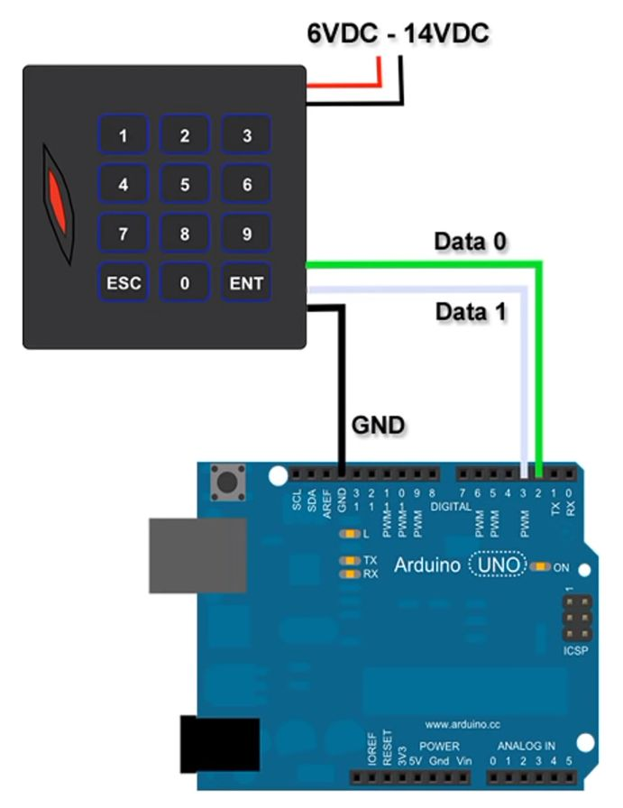

# Standards

| Family | Frequency | Protocol| Storage | Writable | Reader
|---|---|---|---|---|---|
Low Frequency (LF) | 125/134 kHz | EM4100 | UID 4 bytes | No | RDM-6300 (Coil antenna)
High Frequency (HF) | 13.56 MHz | Mifare Classic | UID 4 bytes | 1 KB | MFRC-522 (Loop antenna)
Ultra High Frequency (UHF) | 868 MHz | 1386.00 |

The UIDs are hard-coded by the manufacturer and cannot be changed.

All cards contain a chip and an antenna. They are passive i.e. get the energy from the reader.

# Wiegand

This is a transmission protocol which connects the RFID reader with a controller.

It transmits the UID in 2 formats:  

- W26 - Transports only first 3 bytes of the UID.
- W34 - Transports the whole UID (4 bytes). Connect brown wire to ground to get this format.

If the correct UIDs are not transported via serial, the D0 and D1 may need to be swapped.

