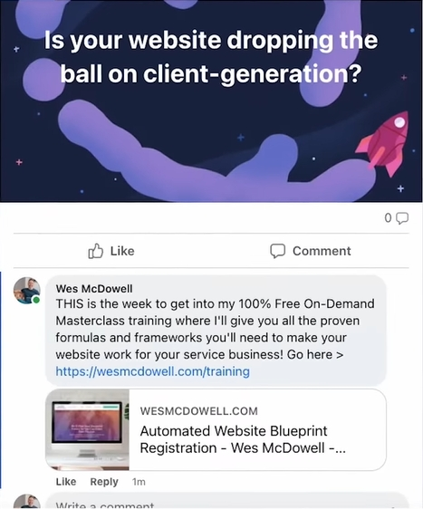

# Ad Creatives

> Know your target audience

It's not about targeting their interests, but rather designing the best creative. You can't really write a good ad until you know what pain points your audience has.

There are 4 different ad categories:

-   **Value** - Pieces of content useful to your audience. Ex. Do this, don't do that...
-   **Demonstration** - Show how your product works. Understand the process = More likely to buy.
-   **Testimonial** - Proof that it worked for others.
-   **CTA** - Take an action ex. Signup, book meeting, purchase... You can have multiple CTAs at once.

Match the size of the ask with the complexity of the offer (Always test though)

-   Big ask (ex. book meeting, expensive product) = video
-   Impulse purchases = pictures.

Order of ad interaction by audience:

1. Ad Creative - Grabs attentions
2. Headline - Contextualizes ad creative
3. Primary Text - Provides more info

Order of ad creation:

1. Headline - Describes the offer
2. Primary Text - Provides more info
3. Ad Creative - Grabs attentions

Make a list of reasons why someone might buy your offer.

Headline - clearly explain your offer

**Primary text**

-   Callout method, when targeting is not easy, include the filtering in the description by addressing specific sub-audiences. Ex. Interior decorating vs people that moved recently.
-   Benefit rich description
-   Tone - Be playful for less "serious" businesses.
-   Call to action
-   Length - The ad copy size should be proportional to the size of the ask. Smaller ask = shorter copy. Shorter is usually better.

```
Headline: Mouthwateringly Good, Low-Calorie Cakes

Primary text:

Our signature Rainbow Cake smothered in white chocolate buttercream frosting & topped with fresh fruit... but the best bit?

It's only 150 calories per slice AND we're currently offering a 10% discount 🤯😋

Seriously 🤗

Click Shop Now to brighten up your day 🌈
```

Try to use the appropriate image size depending on the placement (ex. portrait for stories). Otherwise, use a square.

# Ad formulas

**Ad fomula #1 - The primer ad**

Instead of focusing on the specifics of the product/service, educate the viewers on the "why" behind it.

It's good for offers that require a little education.

Ex. A finacial advisor wouldn't explain which services he offers, but rather use a primer ad to educate the potential customers on why managing their money wisely can have a huge impact in the long run.

**Ad formula #2 - Stealth ads**

Create a text only ad (that look like images), the ones that are full screen, not top descriptions. Add a comment below it for the explanation and CTA.

"Image": Is your website dropping the ball on client generation?
Comment: THIS is the week to get into my 100% Free On-Demand Masterlass training where I'll give you all the proven formulas and frameworks you'll need to make your website work for your service business! Go here > https://domain.com

Use this existing post from the Facebook page AS THE AD.

"pin the comment" (stays on yop) by going to account / settings & privacy / settings / privacy / public posts / comment ranking (turn ON)



**Ad formula #3 - Long-form founder's story**

People want to hear a good story, a behind the scenes look for the motivation and creation.

These can be done as a video (reel) as well!


**Ad formula #4 - Testimonial**

Do not praise the product/service directly ex. "This product changed my life!"

This sounds like an ad, and people don't respond to them. People are more likely to respond to a story.

Ex. "How I resolved my bloating with natural ingredients", "How I finally got my dog to stop jumping on my friends.", "How I did this..."

Structure:

-   Audience callout (10% of copy) -"Calling all my gym girlies", "This is for my business travelers", "Hello home chefs"... These are qualifiers to form an instant connection with your ideal client.
-   Problem/pain (35%) - Share a story experiencing the problem.
-   The offer (10%) - Here's what solved my problem and why it's cool.
-   Benefits (40%) - NOT features, how the product made a positive impact.
-   CTA (5%) - "Click here to buy", "Signup here"

# Creatives

> The lower the cost of what you're selling and the more people already understand it, the shorter the ad copy needs to be.

**Read order**

1. Image
2. Headline
3. Description


**Value formula**

People never buy the thing you are selling. They buy the result, the feeling.


Source: $100M Offers - Alex Hormozi

The more you maximize the top part, and minimize the bottom, the more valuable the offer will seem.

-   What **dream outcome** can someone get as a **result**?
-   How **likely** are they to get that **result**?
-   How **long** will it take?
-   How much **effort** do they need to put into it?


**1. Image**

Use a great image to capture eyeballs and stop people scrolling.

Use a video if possible, as it works better.

**2. Headline**

Keep it simple and clear.

"A Sparkling Clean Home, On-Demand! Starting at $99"

**3. Primary text**

Write out the formula as text in a few sentences.

Phrase the **desired** outcome as a **question**. ex. "Want a floor-to-ceiling sparkling clean home, but don't have the time?"

```
Want a floor-to-ceiling sparkling clean home, but don't have the time?

Our experienced house cleaning pros will do the job right, GUARANTEED, every time.

It's as easy as SCHEDULING your service today, then enjoying that clean feeling as soon as tomorrow - All with ZERO work on your part.
```

**Benefits as bullet points**

Improve it further by adding bullets for the benefits. Start with the features and phrase them as benefits.

| Feature                    | Benefit                                                          |
| -------------------------- | ---------------------------------------------------------------- |
| A dedicated cleaner        | Get a consistent cleaning every time                             |
| Included cleaning products | Never have to worry about stocking up or running out of anything |
| Online scheduling          | A seamless, effortless experience                                |

Write them out with this "3D benefits" formula:

```
Emoji Benefit - Feature
```

```
✨ Enjoy a consistent clean - With dedicated cleaner each and every time.

🧼 No stocking up or running out - Our pros come prepared with all the cleaning products they need.

📅 Seamless, effortless scheduling - It's all online, so you can schedule your time whenever it works for you.
```

**Testimonial**

Add a quick snippet mentioning the parts from the value equation.

```
"I don't remember the lsat time my house was this clean! Super thorough, easy to schedule and fast." - Monica ⭐⭐⭐⭐⭐
```

**Call to Action (CTA)**

```
Click here to schedule your top-to-bottom home cleaning today: https://domain.com/schedule
```


# Use AI to write copy

1. Discover pain points

> "You're a marketing expert doing research for a facebook ad you want to run for a landscaping company in Tempe Arizona. Before you can write the ad, you need to reasearch about the biggest pain points people in Tempe have with their lawns and landscaping. What are the 10 biggest pain points, in order, and what exact words are they using when they express those pain points?"

2. Write hooks

> "Now I want you to act as an expert copywriter and Facebook ads expert to create 2 different hooks for each of the pain points and challenges."

Do not directly use they copy. Tweak it to your own taste.

---

**Prompts**

```
What are some powerful or evocative words associated with pizza?

What problems might pizza solve for its customers who are mostly single males ages 21-45 living in Chicago?

What desires might pizza solve for the same customers?

Focus on desires number 1, 8 and 9, and using the power words you generated earlier, write 5 compelling facebook ad headlines for Mike's Pizza for our ideal customer. The offer is 2 for 1 pizzas for first time customers.

Rewrite them to be no longer than 40 characters each.

I like number 1 and 3. Now write the copy to support those headlines, using a variety of proven ad copywriting frameworks. Write 5 versions.


Now do it again, except make each a script for a 15-30 second video ad. Write them in first person as the owner of Mike's Pizza.
```
