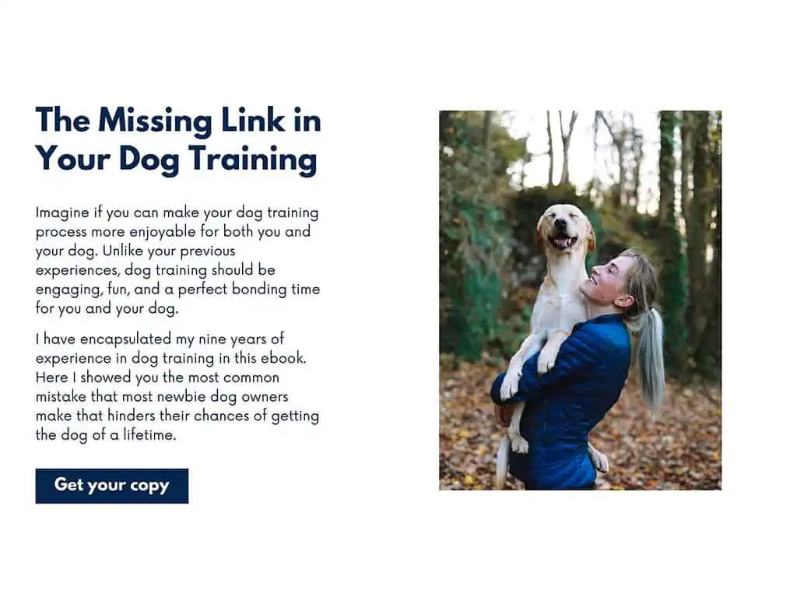
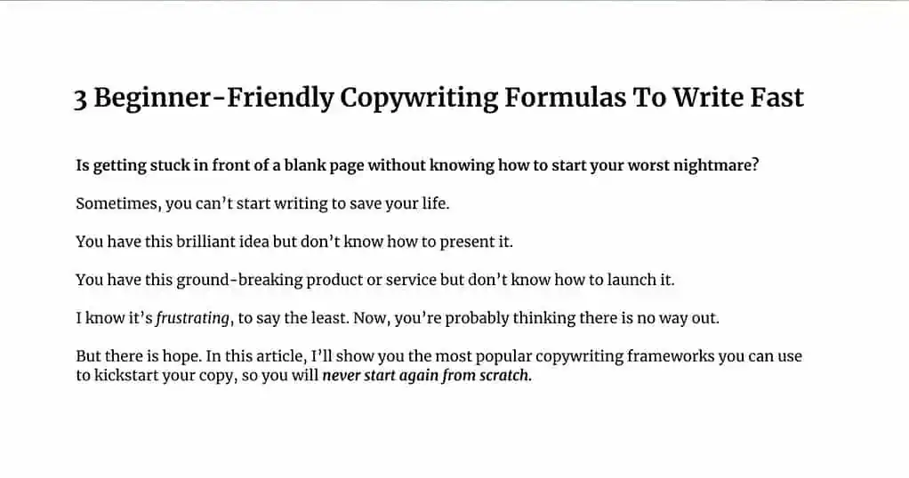
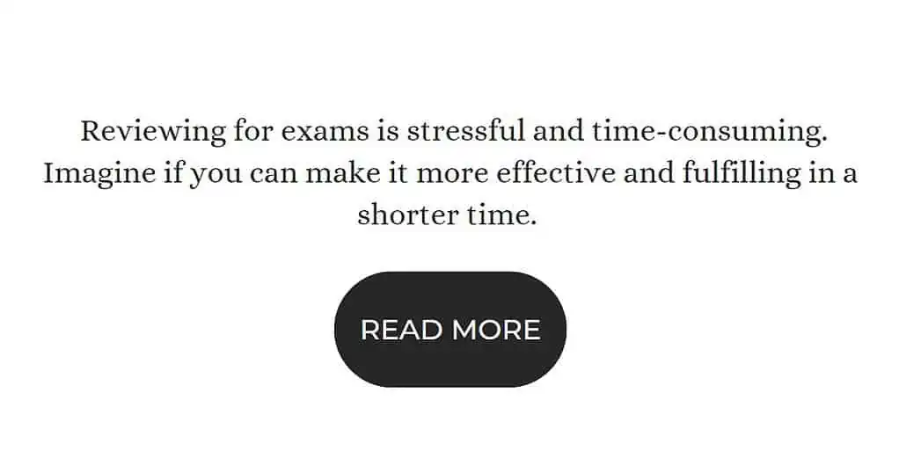
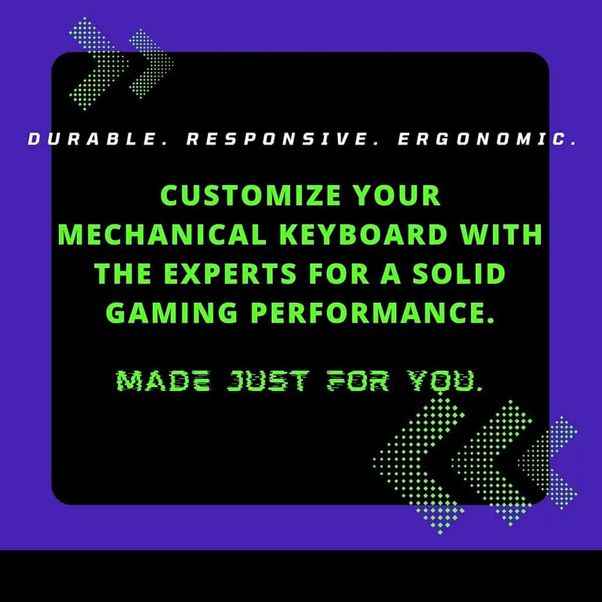
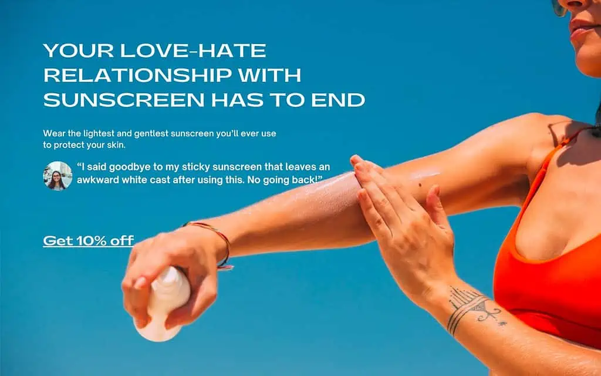
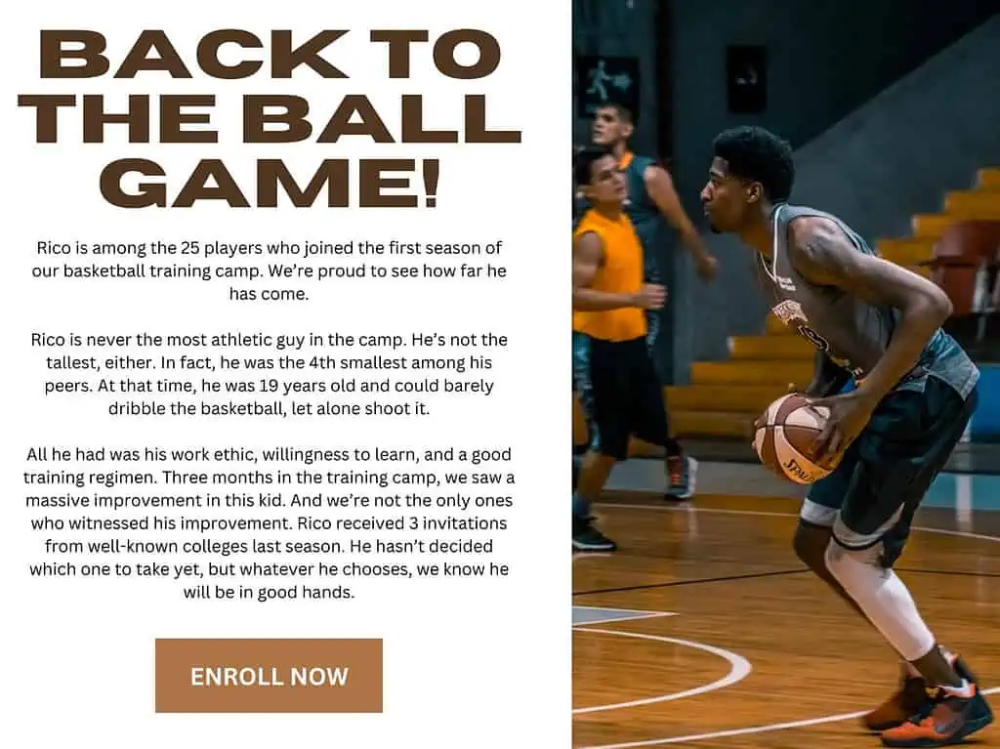
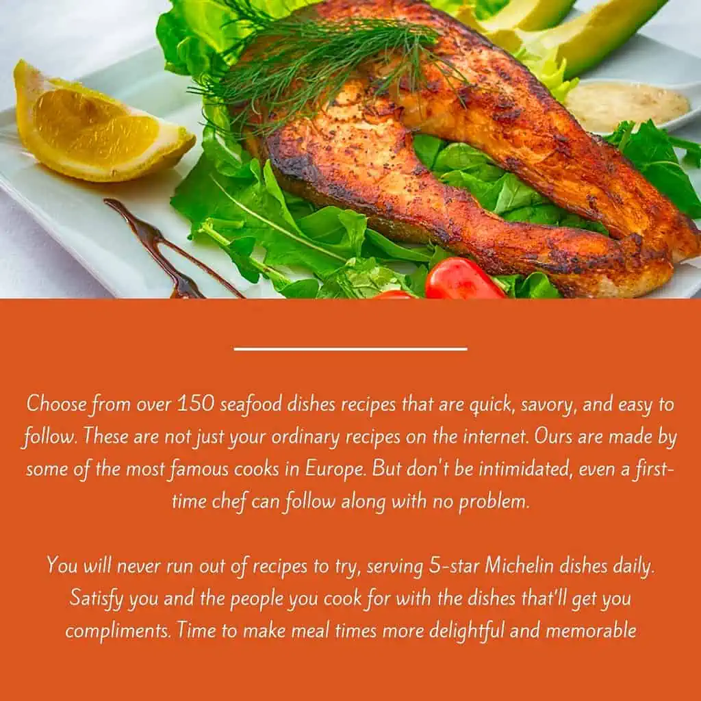
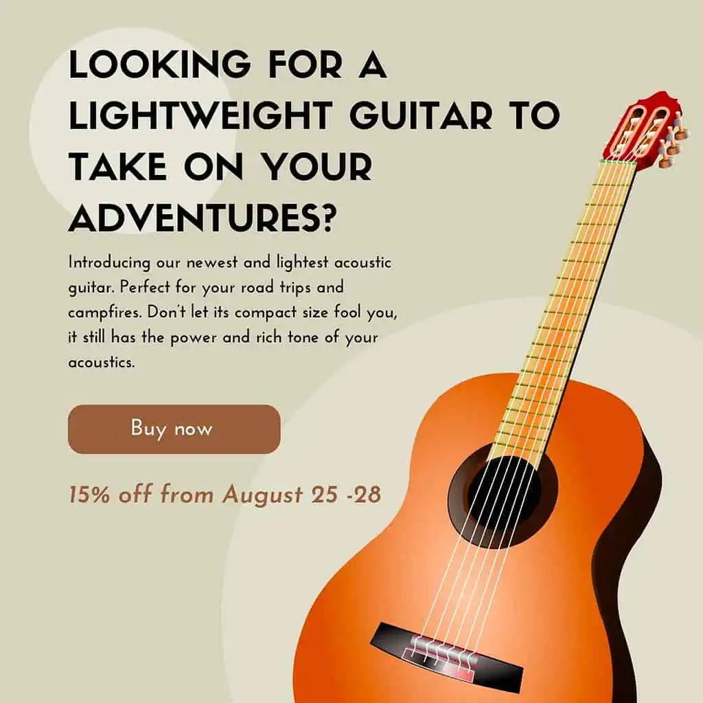

-   [AIDA - Attention, Interest, Desire, Action](#aida---attention-interest-desire-action)
-   [PAS - Problem, Agitate, Solution](#pas---problem-agitate-solution)
-   [BAB - Before, After, Bridge](#bab---before-after-bridge)
-   [4Cs](#4cs)
-   [So What?](#so-what)
-   [PPPP - Problem, Promise, Proof, Proposal](#pppp---problem-promise-proof-proposal)
-   [SSS - Star, Story, Solution](#sss---star-story-solution)
-   [FAB - Feature, Advantage, Benefit](#fab---feature-advantage-benefit)
-   [SLAP - Stop, Look, Action, Purchase](#slap---stop-look-action-purchase)

# AIDA - Attention, Interest, Desire, Action

The classic and most popular. The gold standard and basis for all other frameworks.

| Term      | Description                                                                                                            | Copy                                                                                                                                                                                                                   |
| --------- | ---------------------------------------------------------------------------------------------------------------------- | ---------------------------------------------------------------------------------------------------------------------------------------------------------------------------------------------------------------------- |
| Attention | Grab your reader's attention with a striking hook                                                                      | The Missing Link in Your Dog Training Process                                                                                                                                                                          |
| Interest  | Spark their interest by providing exciting and fresh information                                                       | Imagine if you can make your dog training process more enjoyable for both you and your dog. Unlike your previous experiences, dog training should be engaging, fun, and a perfect bonding time for you and your dog    |
| Desire    | Turn that interest into desire by proving what you were saying is true and offer them an irresistible opportunity      | I have encapsulated my nine years of experience in dog training in this ebook. Here I showed you the most common mistake that most newbie dog owners make that hinders their chances of getting the dog of a lifetime. |
| Action    | Encourage your readers to take action by telling them what they will get once they engage with your product or service | Get your copy                                                                                                                                                                                                          |

Grabbing your reader's attention is key in the AIDA framework. Make sure to hook your reader with a headline that stands out. A good headline formula could be novel, controversial, and big. This is the foundation of direct response copywriting.



# PAS - Problem, Agitate, Solution

The "pessimistic" framework.

Start with a problem, then intensify it to make it worse. Intensify your reader's problem.

People want to reduce pain over seek pleasure.

| Term     | Description                            | Copy                                                                                                                                                                                                                                                                                                 |
| -------- | -------------------------------------- | ---------------------------------------------------------------------------------------------------------------------------------------------------------------------------------------------------------------------------------------------------------------------------------------------------- |
| Problem  | Identify your reader's GENUINE problem | Is getting stuck in front of a blank page without knowing how to start your worst nightmare?                                                                                                                                                                                                         |
| Agitate  | Intensify the problem                  | Sometimes, you can't start writing to save your life. You have this brilliant idea but don't know how to present it. You have this ground-breaking product or service but don't know how to launch it. I know it's frustrating, to say the least. Now, you're probably thinking there is no way out. |
| Solution | Give your solution to the problem      | But there is hope. In this article, I'll show you the most popular copywriting frameworks you can use to kickstart your copy, so you will never start again from scratch.                                                                                                                            |

The bigger the problem, the stronger the drive to take your solution. Your goal is to find a common and THE BIGGEST problem your target audience has and provide your solution to it.



# BAB - Before, After, Bridge

The "optimistic" framework, opposite of PAS. Create the most POSITIVE world possible.

Concise and short-form used in emails, social media posts, and ads.

Example for an email.

| Term   | Description                                                                              | Copy                                                              |
| ------ | ---------------------------------------------------------------------------------------- | ----------------------------------------------------------------- |
| Before | Pinpoint your reader's problem                                                           | Reviewing for exams is stressful and time-consuming               |
| After  | Paint a picture of the reader's world without the problem.                               | Imagine making it more effective and fulfilling in a shorter time |
| Bridge | Tell how your product or service is the bridge between their problematic and ideal world | Read more                                                         |

Make the "after" as desirable as possible. The more realistic, attainable, and desirable the "after" can get, the more effective this framework will be.



# 4Cs

More of a checklist.

-   **Clear** - Your copy must convey a point that can be easily understood by your readers.
-   **Concise** - No time for expressing your words that don't add value. Go STRAIGHT TO THE POINT.
-   **Compelling** - If you're boring as heck, no one will even look at your product. (Yes, even if it's life-changing). Entice your readers!
-   **Credible** - Prove that you're an expert in your industry. Be knowledgeable. DO YOUR RESEARCH.

```
Durable. Responsive. Ergonomic.

Customize your mechanical keyboard with the experts for a solid gaming performance.

Made just for you.
```

Keep your goal in mind. Say what your target audience wants to read, not what you want to say.



# So What?

Your readers don't care about how good your offering is. They only care about the BENEFIT they'll get from your product or service.

How can you show them the true benefits of your product?

You must ask yourself, "So what?" and answer it in your copy.

```
Our newest branch in San Francisco, California, is finally open!

So what does it mean to you, you ask? That means you'll have access to the same high-quality gym equipment and best Crossfit trainers, all closer to your home. Less friction to going to the gym and more time to improve your health.

Take a Look.
```

You should focus on the reader's benefit, not your product's features. Empathy is king in this copywriting framework.


# PPPP - Problem, Promise, Proof, Proposal

Most website sales and landing pages on the internet use this copywriting framework.

That's because this framework is perfect for storytelling and objection handling.

Similar to the AIDA framework, it works by proving your product or service is what the readers need.

It works by solving a problem they have, painting a picture of their life with your solution, then proving what you're saying is true by providing facts.

| Term     | Description                                                                                                                                                 | Copy                                                                                                       |
| -------- | ----------------------------------------------------------------------------------------------------------------------------------------------------------- | ---------------------------------------------------------------------------------------------------------- |
| Problem  | A pain point that a reader currently has.                                                                                                                   | Your love-hate relationship with sunscreen has to end                                                      |
| Promise  | A benefit of a solution and how it will change the reader's life.                                                                                           | Wear the lightest and gentlest sunscreen you'll ever use to protect your skin.                             |
| Proof    | Proofs to back up your claims. These facts need to be certain and objective for them to be believable. You can use case studies, testimonials, and figures. | "I said goodbye to my sticky sunscreen that leaves an awkward white cast after using this. No going back!" |
| Proposal | Once they are convinced, encourage the reader to take action immediately.                                                                                   | Get 10% off                                                                                                |

Backing your claims with facts is key to making this copywriting framework successful. Be specific, use numbers, statistics, and testimonials to make your promise more convincing.



# SSS - Star, Story, Solution

The "relatability" framework.

The SSS formula builds trust by telling your readers they can achieve their goals. And most importantly, you can help them do that.

| Term     | Description                                                                                 | Copy                                                                                                                                                                                                                                                                                                                                                                                           |
| -------- | ------------------------------------------------------------------------------------------- | ---------------------------------------------------------------------------------------------------------------------------------------------------------------------------------------------------------------------------------------------------------------------------------------------------------------------------------------------------------------------------------------------- |
| Star     | Introduce someone who has achieved your target audience's goals                             | Rico is among the 25 players who joined the first season of our basketball training camp. We're proud to see how far he has come.                                                                                                                                                                                                                                                              |
| Story    | Tell the struggles the star has faced. Ideally, they are the same obstacle your reader has. | Rico is never the most athletic guy in the camp. He's not the tallest, either. In fact, he was the 4th smallest among his peers. At that time, he was 19 years old and could barely dribble the basketball, let alone shoot it.                                                                                                                                                                |
| Solution | Present how the star solved the problem using your product or service.                      | All he had was his work ethic, willingness to learn, and a good training regimen. Three months in the training camp, we saw a massive improvement in this kid. And we're not the only ones who witnessed his improvement. Rico received 3 invitations from well-known colleges last season. He hasn't decided which one to take yet, but we know he will be in good hands whatever he chooses. |

Relatability is the key to writing copy based on the SSS copywriting framework. The more relatable it is to the masses, the more believable it is to your target audience.



# FAB - Feature, Advantage, Benefit

Communicating your value via a list of features.

| Term      | Description                                                                                               | Copy                                                                                                                                                                                                                                                                                           |
| --------- | --------------------------------------------------------------------------------------------------------- | ---------------------------------------------------------------------------------------------------------------------------------------------------------------------------------------------------------------------------------------------------------------------------------------------- |
| Feature   | List out the features of the product or service. The biggest feature should always come first.            | Choose from over 150 seafood dishes recipes that are quick, savory, and easy to follow. These are not just your ordinary recipes on the internet. Ours are made by some of the most famous cooks in Europe. But don't be intimidated. Even a first-time chef can follow along with no problem. |
| Advantage | Answer the question, "How would this feature give the reader an advantage over others who don't have it?" | You will never run out of recipes to try, serving 5-star Michelin dishes daily.                                                                                                                                                                                                                |
| Benefit   | What is the benefit a user gets by accepting your offer?                                                  | Satisfy you and the people you cook for with the dishes that'll get you compliments. Time to make meal times more delightful and memorable                                                                                                                                                     |

FAB works well on product descriptions because it's a feature-heavy copywriting framework. But be careful not to overdo the features without listing their benefits to the customer. Remember, people don't care about what you offer unless you show them how they will benefit.



# SLAP - Stop, Look, Action, Purchase

Make conversions quickly. Good for low-ticket sales. It encourages the reader to take action. IMMEDIATELY.

| Term     | Description                                                                                                                | Copy                                                                                                                                                                                         |
| -------- | -------------------------------------------------------------------------------------------------------------------------- | -------------------------------------------------------------------------------------------------------------------------------------------------------------------------------------------- |
| Stop     | Call your reader's attention with a STRIKING headline                                                                      | Looking for a lightweight guitar to take on your adventures?                                                                                                                                 |
| Look     | Offer your service or product and answer the question, "how would it benefit the reader?"                                  | Introducing our newest and lightest acoustic guitar. Perfect for your road trips and campfires. Don’t let its compact size fool you, it still has the power and rich tone of your acoustics. |
| Action   | Convert them while they're still hot                                                                                       | Buy now                                                                                                                                                                                      |
| Purchase | Crush all possible objections on why the reader will not purchase (offer discounts, show them customer testimonials, etc.) | 15% discount from August 25 -28                                                                                                                                                              |


