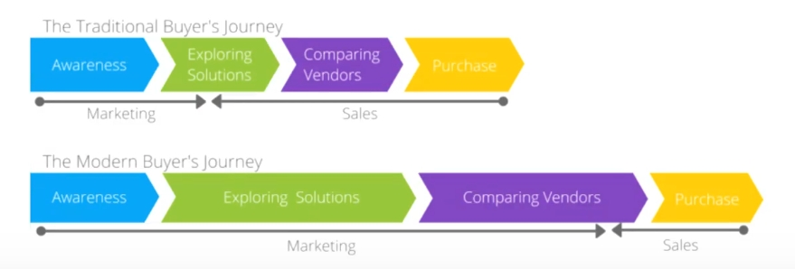

# Overview

Buyers go through 80% of the decision making process without ever talking to sales.

Marketing is so important because the buyer has already made up his mind when sales gets involved.



# Setup

**Accounts:**

-   Google
    -   Tag Manager
    -   Analytics
-   Facebook
    -   Fan page
    -   Facebook business account
    -   Facebook ad account
-   Instagram
    -   Profile

**Website:**

-   Install Google Tag Manager script

**Google Tag Manager:**

-   Google Analytics (Google tag)
    -   GA4 custom events
-   Facebook pixel (Data sources > dataset) (Custom HTML)
    -   Facebook custom conversions

**Facebook Ads Manager:**

-   Conversions campaign with broad audience
-   Lots of ads with UTM tags
-   Choose best performing ads

**Test performance**

-   Run campaign for 7-10 days to measure properly
-   Pause underperforming ad sets
-   Continuously reate new ad sets to test against the best perfomers

**Lookalike:**

-   Create **lookalike** audience from website visitors via pixel (updates automatically)
-   Create **lookalike** audience from customer list

**Remarketing:**

-   Create **custom** audience from pixel (updates automatically)
-   Conversions campaign with the best performing ads to custom audiences

# Targeting

The targeting works as `OR`, meaning it includes everyone that matches some of the criteria, **NOT** all of the criteria like `AND`.

**Audience types**

1. General audience for split testing
2. Custom audience from pixel
3. Lookalike audience based on pixel custom audience
4. Custom audience from customer list (emails)
5. Lookalike audience based on "Custom audience from customer list"

**Performance**

1.  Best:
    -   **Lookalike Audience** from existing customers (emails)
2.  Decent:
    -   Facebook page/business admins (digital activities)
    -   People who follow business content i.e. Forbes magazine
    -   People who follow competitors
3.  Unreliable:
    -   Small business owners (digital activities)
    -   Job titles ex. CEO, owner, founder...

**Notes:**

-   **Always click on suggestions when filtering**
-   **IMPORTANT: Exclude pixel audiences so that you ensure you are targeting new people**
-   Custom and lookalike audiences update automatically.
-   Lookalike audiences are COLD audiences.
-   WARM audience = Website visitors, email lists, page engagers, video viewers...
-   For lookalike audiences, choose 1% when targeting larger countries, and 10% for smaller countries.
-   Try to move away from interest based targeting towards lookalike audiences.

# Datasets (Pixels)

1. Create dataset under data sources.
2. Assign dataset to ad account (assign assets).
3. Setup Meta Pixel.
4. Disable ad blocker in target website to send first event.

# Objectives

**Campaging objectives don't really matter**. What they do is **determine the conversion options you have in the AD SET optimizaion and delivery** section, which are the actual objectives Facebook's algorithms is based on.

> **Conversions are twice as powerful as traffic. Always use this.**

-   **Conversion**
    -   Conversions - 90% of campagins should use this (Pixel required).
-   **Awareness**
    -   Brand Awareness - Top of mind, large budgets
    -   Reach - Small audience, high ad frequency
-   **Consideration**
    -   Traffic - When we can't track the end result i.e. conversions
    -   Engagement - People likely to like and comment

**Objective names**

| Old             | New                          |
| --------------- | ---------------------------- |
| Brand awareness | Awareness                    |
| Reach           | Awareness                    |
| Traffic         | Traffic                      |
| Engagement      | Engagement                   |
| App installs    | App promotion                |
| Video views     | Awareness, Engagement        |
| Lead generation | Leads                        |
| Messages        | Engagement, Leads            |
| **Conversions** | **Engagement, Leads, Sales** |
| Catalog sales   | Sales                        |
| Store traffic   | Awareness                    |

# Campaign Structure

```
- 1 Campaign pet product/offer.
    - 3-5 ad sets per campaign (1-2 interest per ad set).
        - 3-4 ads per ad set (duplicate across ad sets).
```

-   Put remarketing in a separate campaign.

**Test the ads and pick the best performer. Add new ads to test against the best performer. Repeat while iterating over different creatives, headlines and copy until you find the perfect ad.**

**Example**

1. Use a less salesy ad to get that cold traffic warmed up to the business.
2. Retarget with a second ad that sells.

```
Website/app - Conversions - COLD (leads, interests, admins, others)
    - Business interests (30-60 - Business, Owners, Management...)
    - Page admins (30-60 - Facebook/Business Page admins)
    - Website visitors pixel (Lookalike)
    - Users list (Lookalike)
    - Leads list (Emails)
    - Leads list (Lookalike)
    - Others (30-60)

Website/app - Conversions - WARM (Remarketing)
    - Website visitors pixel (Remarketing)
```

-   In remarketing and lookalike, exclude the Advantage+ option (reach people beyond audience)
-   Each ad set, in each campaign, has the same 4 ads.
-   In each ad set, exclude every other ad set.
-   Leads are a "customer list" of emails of businesses.
-   Users list is emails from your existing users.

**Or simply...**

```
Website/app - Awareness - COLD
    - General audience (18-65+) exclude visitors from pixel and users from list

Website/app - Conversions - WARM (Remarketing)
    - Website visitors pixel (Remarketing)
```

# Advertising Strategies

### Direct to offer (Sales, Short term) - Different audience, same ads

> Showing a specific product or service directly. Used a lot for eCommerce.

**Use one campaign per product range**

Ex. Shoes in one campaign, hats in another.

-   Turn on "Campaign Budget Optimization" (Advantage Campaign Budget) setting. This allocates more money to the better performing ad sets.
-   1 targeting option per **cold** ad set to test which one is the best.
-   3-4 ads per ad set max.

```
Objective: Sales
Campaign: Direct to Offer Campaign
    Ad sets:
    - Cold Audience Ad Set 1 (Interests)
        Ads: (diplicate in each other ad set)
        - Image Ad 1
        - Image Ad 2
        - Video Ad 1
        - Video Ad 2
    - Cold Audience Ad Set 2 (Interests)
    - Cold Audience Ad Set 3 (Lookalike)
    - Cold Audience Ad Set 4 (Lookalike)
    - Warm Audience Ad Set (Remarketing, more as a reminder)
```

Why is there a warm audience? Because the right amount of budget will be automatically calculated and assigned. This prevents overspending on a separate dedicated retargeting campaign.

---

### Lead Magnet strategy (Sales, Short term) - Different audience, same ads

> Offering something for free in exchange for an email address, in order to retarget them later.

Ex. A free SEO tutorial, and later sell them your services.

-   In warm audience, exclude all who have already taken the lead magnet with a custom audience.
-   The opt-in should be on the website, don't use Facebook's form.

There are two layers of retargeting:

1. Not opted-in the lead magnet, but visited website.
2. Opted-in for lead magnet, not taken next step.

```
Objective: Leads
Campaign 1: Lead Magnet Campaign
    Ad sets:
    - Cold Audience Ad Set 1 (Interests)
        Ads: (diplicate in each other ad set)
        - Image Ad 1
        - Image Ad 2
        - Video Ad 1
        - Video Ad 2
    - Cold Audience Ad Set 2 (Interests)
    - Cold Audience Ad Set 3 (Lookalike)
    - Cold Audience Ad Set 4 (Lookalike)
    - Warm Audience Ad Set (Remarketing) - Exclude opted in custom audience

Objective: Leads
Campaign 1: Retargeting Campaign
    Ad sets:
    - Retargeting Ad Set - Lead Magnet Opt Ins - Exclude Next Steppers (opted-in for lead magnet, but not sales converted)
        Ads:
        - Image Ad 1
        - Image Ad 2
        - Video Ad 1
        - Video Ad 2
```

---

### Omnipresent content (Brand, Long term) - Same audience, different ads

> Put **different** ads in front of the **same** people to build **awareness**.

Designed to build a brand, trust, relationships... Over a long period (takes months to really kick in). Works best with more expensive products, or large time investment from users i.e. audiences that need a lot of warming up.

Trying to put lots of ads (pieces of content) in front of a small audience again and again. Very effective long-term strategy.

Cheaper than conversion campaigns, and has a higher return, just over longer time.

Run alongside a conversion strategy.

The goal is to show all the ads to everyone. The ads here are content like blog posts, video tutorials, testimonials...

Used by expertize based businesses ex. coach, consultant...

This has the same audience with different ads vs the different audience same ads in the previous strategies.

-   **Do not turn on "Campaign Budget Optimization". This is important.**
-   **Turn off "Advantage Custom Audience".**
-   Works best with a warm audience (previously interacted with you), but can use cold. It's important to aim for an audience size of 50-100K.
-   Use manual ad placements. Deselect "Audience network", and only use feeds, stories and reels.
-   Set performance goal to "Maximize reach ads".
-   Each ad set has the same audience.
-   Have the same budget for each ad set.
-   Use a budget of $1/day/ad set.
-   Each ad has a frequency of 1 impression every 6 days.
-   Every 3-6 months create new ads to avoid ad fatigue.
-   This strategy does not need testing.
-   No end date.
-   Try to include all 4 categories of ads (value, demonstration, testimonials, CTA).

```
Objective: Awareness (Reach)
Campaign: Omnipresent Content Campaign
    Ad sets: (same audience)
    - Omnipresent Content Audience - Ad 1
        Ads:
        - How to video 1 (value)
    - Omnipresent Content Audience - Ad 2
        Ads:
        - How to video 2 (demonstration)
    - Omnipresent Content Audience - Ad 3
        Ads:
        - Testimonial 1 (testimonial)
    - Omnipresent Content Audience - Ad 4
        Ads:
        - Signup (CTA)
    - Omnipresent Content Audience - Ad 5
    - Omnipresent Content Audience - Ad 6
    - Omnipresent Content Audience - Ad 7
    - Omnipresent Content Audience - Ad 8
    - Omnipresent Content Audience - Ad 9
    - Omnipresent Content Audience - Ad 10
    - Omnipresent Content Audience - Ad 11
    - Omnipresent Content Audience - Ad 12
```
