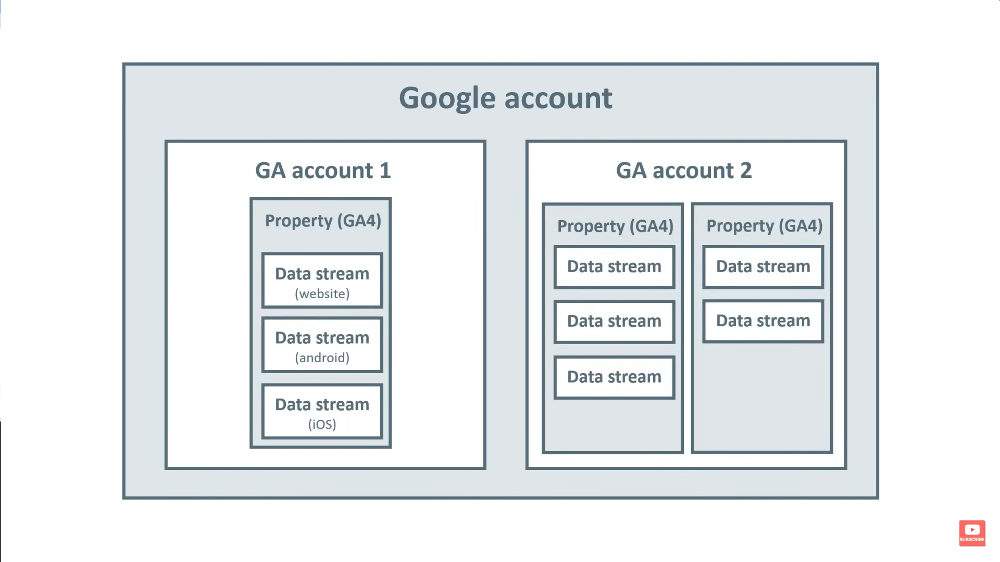

[Source](https://youtu.be/u_ECkoHVlZ8)

# Overview

> If you don't track conversions, you just have a really fancy hit counter.

Ex. Add items to shopping cart, fill out a lead-gen form, download coupons, find a phone number, completing a sale...

> It is **HIGHLY** recommended to use Google Tag Manager with Google Analytics.

| Google Analytics 4 (GA4)         | Universal Analytics (UA)  |
| -------------------------------- | ------------------------- |
| Everything is an event           | Page views and sessions   |
| Account > Property / Data Stream | Account > Property > View |
| Engagement                       | Bouces, Session duration  |
| Exploration (data drilling)      | 30 fixed reports          |
| Conversions (events)             | Goals                     |

# Install

You can insert this code manually in the `<head>`.

```js
<script async src="https://www.googletagmanager.com/gtag/js?id=G-XXXXXXXXX"></script>
<script>
    window.dataLayer = window.dataLayer || [];
    function gtag() {
        dataLayer.push(arguments);
    }
    gtag("js", new Date());

    gtag("config", "G-XXXXXXXXX");
</script>
```

Or via Google Tag Manager. In this case, you need to add this code as well, in order to be able to send custom events.

```js
<script>
  window.dataLayer = window.dataLayer || [];
  function gtag(){dataLayer.push(arguments);}
</script>
```

# Account

```
Google Account > GA Account > Property > Data Stream (generates new tracking ID)
```



**Create separate properties for each product. A web app and a website for the same product are separate properties.**

If you are an agency, then each client is a separate account. Do not store all client properties under one agency account.

Also, each business is a separate account, not a property.

```
- Google Account
    -   Company Name (GA account)
        -   Product 1 - Web app (property)
            -   Web app (data stream)
        -   Product 1 - Website (property)
            -   Website (data stream)
        -   Product 2 - Mobile app (property)
            -   Mobile app (data stream)
        -   Product 3 - Website (property)
            -   Website (data stream)
```

# Settings

Set data retention from 2 months to 14 months.

```
property > data settings > data retention.
```

Ignore internal traffic.

```
stream > configure tag settings > define internal traffic
```

If you have payment gateways, ignore their referral traffic.

```
stream > configure tag settings > list unwanted referral
```

# Reports

-   **Acquisition**
    -   User acquisition - **ONLY** the first session i.e. first visit source.
    -   Traffic acquisition - the other sessions.
-   **Engagement**
    -   Events - All events.
    -   Conversions - Only events marked as conversions.
    -   Pages - Which pages were visited. Use path (not title) as dimension.
    -   Landing pages - Pages where sessions started.
-   **Monetization**
    -   Ecommerce purchases - Track product purchases with revenue.
-   **Demographics** - Country, language, age, gender...
-   **Tech** - Browser, device, OS...

You can use comparisons to base the whole data on a specific dimension.

# Explorations

-   Free form (pivot table)
-   Funnel
-   Path (Sankey)

# Events

1. Automatically tracked (Default) - `first_session`, `session_start`, `user_engagement`.
2. Enhanced measurements (Extra automatically tracked events) - Scroll, download... (configured in data stream)
3. Recommended events - Predefined/standardized like `add_to_cart`, `signup`, `checkout`...
4. Custom events - Whatever you want. Check recommended events before creating a custom one.

# Custom events

These require to be linked with custom dimensions.

```
admin > property settings > data display > custom definitions
```

# Manual event sending

1. Ask developer to push a custom event to the Google Analytics data layer.

```js
gtag("event", "sign_up");
```

2. Check if the event is avaliable in the Tag Manager preview.
3. Create a custom trigger to use the custom event as a triggering condition.
4. Create a tag to send the event to Google Analytics, link it to the custom trigger.
5. Verify the event is sent via Google Analytics DebugView

# Admin DebugView

Track events in real time. Use it with Google Tag Manager to verify events are fired. These events take 24-48 hours to show up in reports.

```
admin > property settings > data display > DebugView
```

# Flow of data

```
Event > Data Layer > Tag > Google Analytics > Reports
```

1. **Event:** This is any user interaction with your website or app, like clicks, form submissions, pageviews, etc.

2. **Data Layer:** The event data is captured and stored here. The data layer is a JavaScript object that holds structured data about the event.

3. **Tag:** Using a tag management system like Google Tag Manager, tags are triggered based on the data in the data layer. These tags are responsible for sending the captured data to Google Analytics.

4. **Google Analytics:** Once the data arrives at Google Analytics, it is processed according to your GA setup and configurations.

5. **Data Stream:** In the context of Google Analytics 4 (GA4), a data stream refers to the flow of data from a specific source (like a website or app) into GA4. This step is more about the initial configuration of where the data is coming from and how it should be handled, rather than a step in the data flow process itself.

6. **Reports:** After processing, the data is available in various reports within Google Analytics, where you can analyze and derive insights.

# Data Layer vs Data Stream

1. **Collection and Structuring of Data in the Data Layer:** When a user interacts with a website (like clicking a button, completing a purchase, or navigating to a page), these interactions can be captured and stored in the data layer. The data layer collects and structures this information, ensuring it's formatted correctly before it's sent to Google Analytics.

2. **Sending Data from the Data Layer to Google Analytics:** The data in the data layer is then pushed to Google Analytics through various tracking codes or tags (like Google Tag Manager). These tags are designed to read the information from the data layer and send it to Google Analytics.

3. **Data Stream in Google Analytics:** Once the data reaches Google Analytics, it is processed according to the configurations set up for the specific data stream. A data stream in Google Analytics 4 (GA4) represents a source of data (like a website or mobile app) and is configured to handle the data it receives.

4. **Analysis and Reporting:** After the data is processed in the data stream, it becomes available in Google Analytics for analysis and reporting. This allows website owners and marketers to gain insights into user behavior, website performance, and other key metrics.

In this workflow, the data layer is critical for collecting and structuring the data on the website, while the data stream is responsible for defining how that data is handled once it reaches Google Analytics. The data layer ensures that the data sent to the data stream is accurate, comprehensive, and formatted correctly for analysis.

# Dimensions (Source/Medium)

Medium = Online, print, radio, in person.
Channels (Online) = Mobile, social media, website are not.

A medium is a pipe over which the message passes, not the environment in which the audience receives it.

**Source**

Traffic origin ex. search engine (Google), a social media platform (Facebook), or a specific website (nytimes.com).

**Medium**

General source category. If the source is Google, the medium might be `organic` (unpaid search traffic) or `cpc` (paid search traffic). Other common medium types are `email`, `social` and `referral`.

**Campaign**

Traffic from a specific marketing campaign or promotion. Ex. During a holiday sale, tag the URLs in your marketing materials with a campaign name like `holiday_sale_2023`.

# UTM Tags

These are dimensions in Google Analytics.

```
https://www.example.com?utm_source=newsletter&utm_medium=email&utm_campaign=summer_sale
```

-   **utm_source** - Which site sent the traffic (ex. Google, newsletter).
-   **utm_medium** - The type of link used, such as cost per click or email.
-   **utm_campaign** - A specific product promotion or strategic campaign (ex. spring_sale).
-   **utm_term** - Identifies search terms.
-   **utm_content** - What specifically was clicked to bring the user to the site, like a banner ad or a text link. It's often used for A/B testing and content-targeted ads.

**Example**

**1. Scenario**

-   You are promoting a "Winter Book Sale".
-   You're using an email newsletter to reach your audience.
-   The campaign includes a specific link to a landing page for the sale.
-   You want to track which book genre advertisement in the email is more effective.

**2. Base URL**

-   This is the URL of your landing page for the Winter Book Sale. Example: `https://www.bookstore.com/winter-sale`

**3. UTM Parameters**

-   **utm_source** - This identifies where the traffic is coming from. Since it's an email newsletter, you might use `newsletter`.
-   **utm_medium** - This is the marketing medium. In this case, it's `email`.
-   **utm_campaign** - This identifies the specific campaign. You could name it `winter_book_sale`.
-   **utm_term** - This is used for paid search to identify keywords. In a non-paid context like an email, it's less common, but you could use it to specify the target audience, like `young_adults`.
-   **utm_content** - This helps differentiate similar content within the same ad or link. Suppose you have two genre advertisements in the same email, like 'Science Fiction' and 'Mystery'. You could create two URLs, one with `utm_content=sci-fi` and another with `utm_content=mystery`.

**4. Complete UTM-Tagged URL**

```
https://www.bookstore.com/winter-sale?
utm_source=newsletter
&utm_medium=email
&utm_campaign=winter_book_sale
&utm_term=young_adults
&utm_content=sci-fi
```

**Examples**

```
https://www.domain.com/influencer?
utm_source=youtube&
utm_medium=paid-video&
utm_campaign=influencer_name
```
