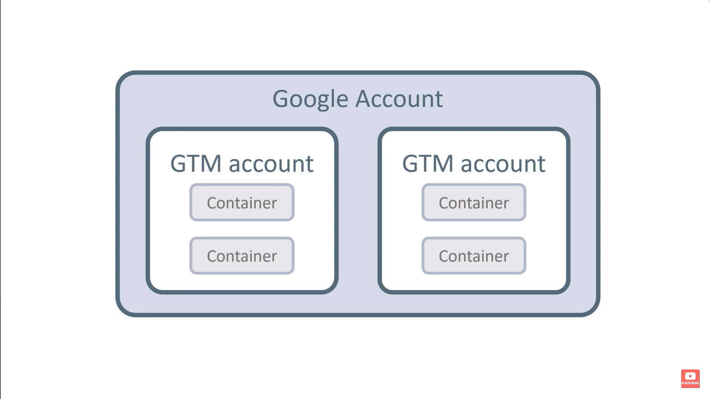
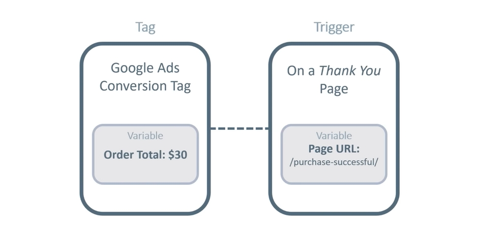

[Source](https://youtu.be/DiAgCihHW58)

Without coding:

1. Embed/inject javascript code.
2. Track events across many websites.

Super useful, even if you are a developer.

# Account



Container = Property in Google Analytics

Create a separate container for each website.

# Components



-   **Event** - An actual generic event like button click.
-   **Tag** - Micro code injections/embeds.
    -   Any javascript code, without actually coding it.
        -   Google Analytics.
        -   Facebook Pixel.
        -   Chatbot...
    -   Can send event meta-data to 3rd parties. Paired with Google Analytics properties.
        -   Google Analytics GA4 Event - Dedicated for Google Analytics.
        -   ~~Google Tag - General purpose, works for other Google services.~~

```
tags > new > tag configuration > Google Analytics > Google Analytics GA4 Event > Insert Tag ID (found in Google Analytics data stream)

triggering > Initialization - All Pages
```

-   **Trigger** - Tags are code just sitting there, waiting for directions what to do i.e. listen for the desired events to activate the tag script, while matching the conditions. Ex. specific button (.class_name). Triggers are not enabled by default, they need to be created, and then linked to tags.

```
triggers > new > trigger configuration > trigger type
```

-   **Variables** - Static content (URL pattern) or dynamically set values (order total).
-   **Templates** - Custom tags with specific fields for them.

Triggers and tags work together. Triggers listen for the specific signal, and the tag then performs the specific function.

# Settings

Enable all link clicks (not available by default). You can add other data (variables) to tags as well.

```
Variables > configure > clicks (tick checkboxes)
```

Put the measurement ID (data stream) into a variable.

# Workflow

1. Configure tags, triggers, variables.
2. Click preview (tag assistant) to verify events fire.
3. Check Google Analytics DebugView to verify events fired.
4. Submit and name the container configuration version.

# Manual event sending

1. Ask developer to push a custom event to the Google Analytics data layer.

```js
gtag("event", "sign_up");
```

2. Check if the event is avaliable in the Tag Manager preview.
3. Create a custom trigger to use the custom event as a triggering condition.
4. Create a tag to send the event to Google Analytics, link it to the custom trigger.
5. Verify the event is sent via Google Analytics DebugView
