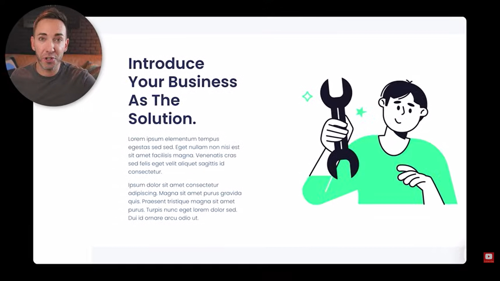

[SOURCE](https://youtu.be/g3cmNDlwGEg)

# 1. Navigation

Keep it simple, people are used to this layout. Make it sticky as you scroll. Logo, few links and CTA button.

# 2. Hero

1. **Headline** - What do you do? The big result your clients get.
2. **Sub-headline** - How do you make their lives better?
    - What the service is
    - Who is it for
    - How it's delivered
3. **Call to action (CTA)** - What do they need to do to get it? Be really clear what happens when it's clicked.
4. **Image** - Ideally show your client in their happy state. "This could be you if you use our service"

Clear and direct, don't be cute or clever.

# 3. Problem

What does your sevice fix?

It isn't about being negative, but showing that you unserstand them.

# 4. Solution

Focus on how you can help, not just who you are.

-   Briefly highlight your qualifications and experience.
-   Share a personal story how you understand their problem.
-   Really short explanations how your service solves their problem.
-   Showing your face here really helps.

# 5. Benefits

Show exactly what your users get. Focus on results, not just features.

Each benefit should paint a picture how your client's life is going to improve.

Benefit structure:

-   Title
-   Short description
-   Image

# 5. Action plan

Don't skip this!

# 6. Testimonials

Prove your worth.

Testimonial structure:

-   Short headline
-   Description.
    -   Before I was struggling with X.
    -   Now after using the service, I've achieved Y, and I feel Z.
-   Picture of client
-   5-star graphic

Show 3rd party review website scores.

# 7. FAQ

Handle objections, by turning them into questions, and answering them.

# 8. Call to action (CTA)

Repeat the same CTA from the hero.

