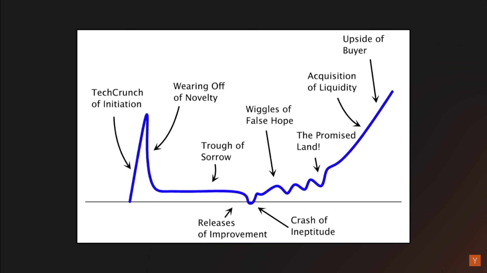

# Startup curve

# Product Market Fit - David Rusenko

[David Rusenko - How To Find Product Market Fit](https://www.youtube.com/watch?v=0LNQxT9LvM0)

Product Market Fit = Make something **a lot** of people want.

Startup Stages

Top early challenges at a startup:

-   Finding product market fit.
-   Hiring and building a world-class team.
-   Making money (distant 3rd)
-   Build an organization that scalably and repeatedly launches great products.

_It's a lot harder yo build a product a lot of people really really want, that it is to figure out how to make money from that product._

**The best companies create a market**

Market research won't help, as you need to find the hidden need. If it's obvious, then everyone would be doing it.

Everyone is going to tell you that the idea sucks.

What are your customers trying to do, and what substitues are there? Ex. For a website builder, substitues are coding, facebook page, agency...

"They are not trying to build a website... They're trying to grow their business."

Where are you customer pulling you? You shouldn't be pushing them towards a solution. When things are working and your customers are telling you non-stop "You need to do this", and you say "It's not our vision" and they hack it to do it anyway...

When you find people hacking your product to do something it wasn't meant to, pay attention and double down on that.

## Building a remarkable product

1. Have a great idea.
2. Talk to customers.
3. ???
4. PROFIT!

### Step 3

1. Talk to customers. Develop a market thesis.
2. Listen to their problems, not solutions.

    - "If you ask customers what they want, they'd say a faster horse. They don't know what they want until you show it to them" - Henry Ford
    - It's absolutely critical to talk to customers and understand their pain. Listen to their proposed solutions, but dig deeper. What underlying job are they trying to accomplish?

3. Rapid prototyping and user testing.

    - Building a fully functional product is the most expensive possible way to test your hypothesis.
    - Focus on getting toa functional prototype as quickly as possible that you ca get in front of users.
    - Don't worry about scaling, monetizing... It comes later.
    - Expect it will take 10x the number of iterations:
        - Keep your burn low.
        - Build a team that can do this quickly. (Outsourcing is difficult in the early days)

4. Build the solution to their problems.
5. Test the solution with them.

    - Make sure you're talking to your target customer. (Be open to change who they are)
    - Don't overthink it. Anecdotal is ok.
    - Most helpful tools:

        - Customer interviews (5-10)
        - UX testing sessions (3-5) **MOST IMPORTANT**

            1. Get someone to use your app in front of you.
            2. Encourage them to give honest feedback.
            3. Ask them to perform a task. (You can't touch the phone/keyboard)
            4. **DO NOT SAY OR DO ANYTHING**.
            5. Watch in extreme agony as they struggle to figure it out.

        - Metrics (Beware, never enough data to support behavior)

6. Did it work? If not, GOTO 1.
7. By the time you've reached this step, you've likely looped ~27 times.

## When to launch

Minimum ~~Viable~~ Remarkable Product

_Launch when your product is better than what's out there_ - Paul Buchheit

## Prioritization

1. Only one thing matters.

    - Focus only on the things that get you to your next stage. Don't go to conferences, don't write blog posts, don't read the news...

2. Optimize for learning.

    - Most people prioritize by creating a list sorted by cost x benefit. Instead, ask yourself _"What is our biggest unknown that would rewrite our priority list?"_

## When is product market fit achieved

By tracking 3 metrics

1. Returning usage. How many people go back on day 1, 3, 7, 30?
2. Track NPS (Would you recommend our product toa friend? 1 - 10). Good NPS is > 50%.
    - 9, 10 ratings are a plus (+). ex. 88%
    - 7, 8 ratings are discarded. ex. 12%
    - 0-6 ratings are a minus (-). ex. 8%
    - Total NPS is 80% = 88% - 8%.
3. Paying customer renewal rates.

Don't pay much attention to:

1. Sign-ups.
2. Conversion rate.

You'll know when you've achieved it when customers start beating a path to your door. When you don't have it, everything feels hard. When you have it, everything is easy and every move works - you're a genius. (The reality is somewhere in between)

## Scaling the team

**Don't scale the team past ~20 before product market fit.** Everything breaks at 23-25 people.

-   A moderate amount of micromanagement is healthy at this stage. You should be involved in everything important and know all there is to know about your customers, product, market, channels...
-   This helps make fast and quality decisions which is a huge advantage over larger orgs where this is distributed across many roles.
-   Don't delegate anything important - yet!

**Once you've achieved it, scale aggressively**

-   You've found/created a new market, but you're likely not the only one.
-   You're in a race to capture this new market. Advantages accrue to #1 - be that company.
-   Build the team aggressively, but thoughtfully.
-   You'll need to completely change the way you operate including doing a lot more delegating.
-   No more micromanagement!

**Never more than double the size of the company in any year**

# Product Market Fit - Michael Seibel

[The Real Product Market Fit by Michael Seibel](https://www.youtube.com/watch?v=FBOLk9s9Ci4)

Product Market Fit - Finding out what needs to be built

You've achieved it when customers are buying as fast as you can provide. Money is piling up, you're hiring like crazy...

Company building starts AFTER you've figured out how to solve a problem.

The only way you know you've made something customers want, is because they are using it in an explosive and destructive way.

Once you find product market fit, it's your company to fuck up.
