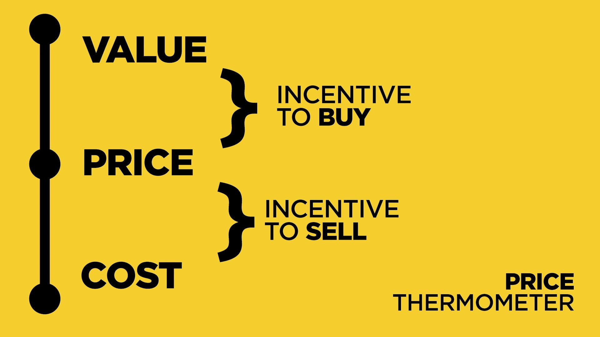
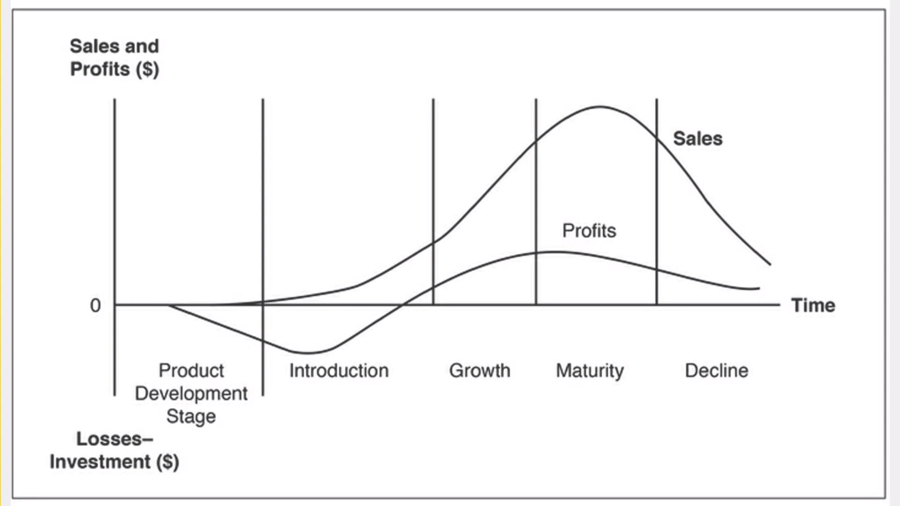
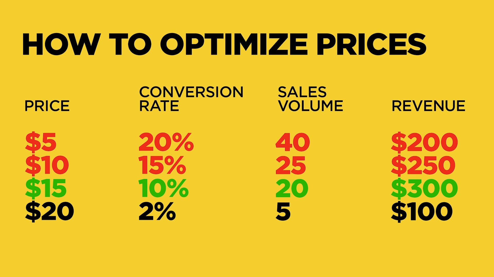
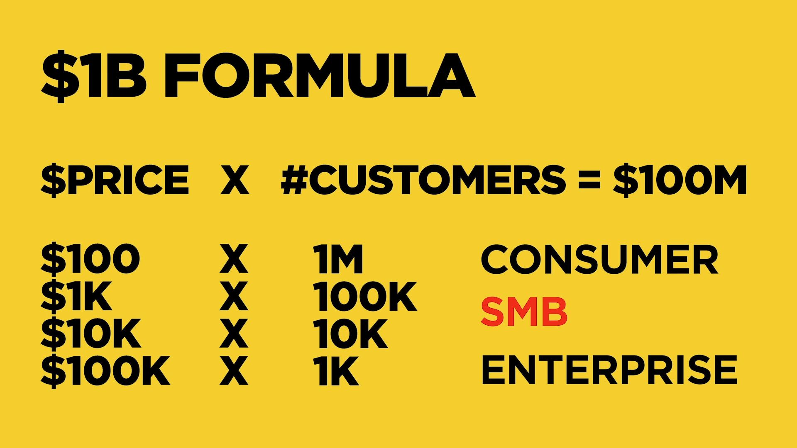
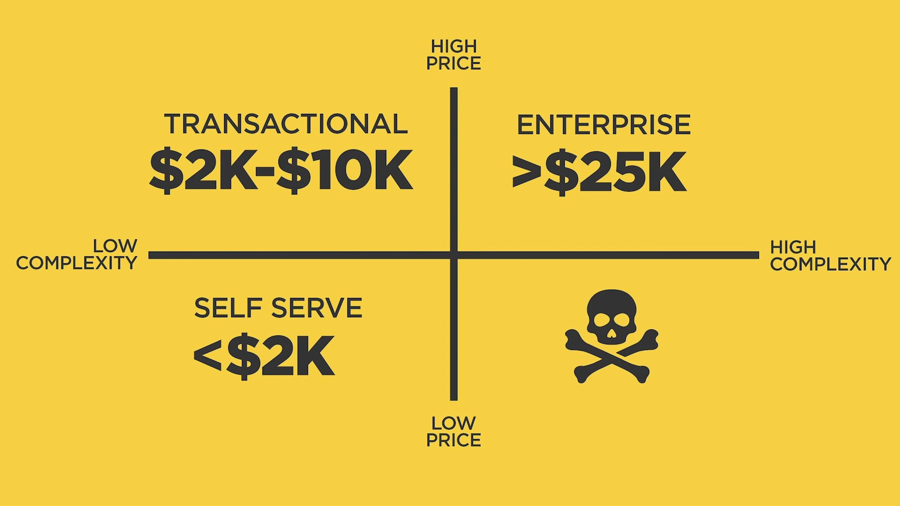
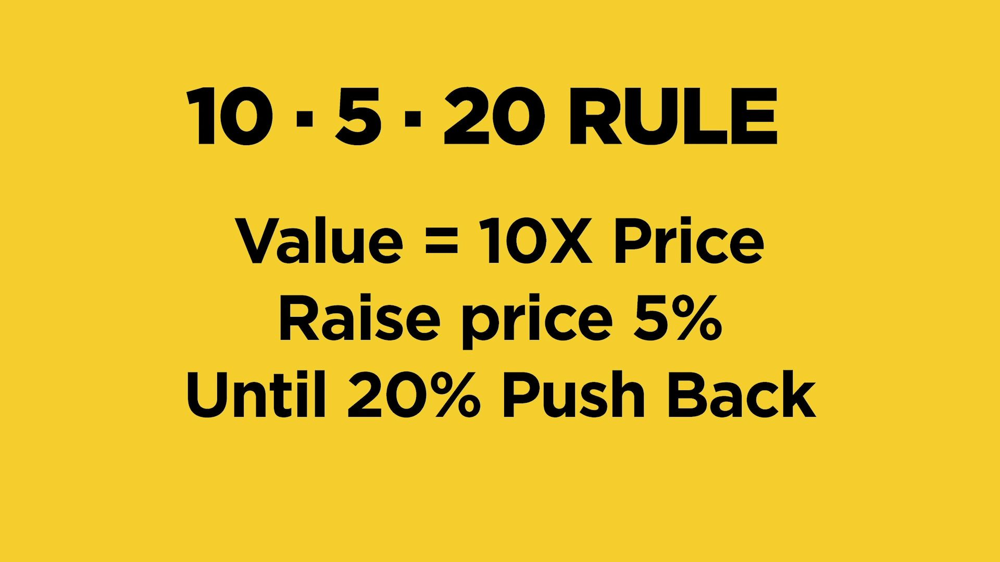

> # Never charge for time. Charge for outcome.

> # Never charge for benefits. Charge for results.

# Startup Pricing 101

[Kevin Hale - Startup Pricing 101](https://www.youtube.com/watch?v=jwXlo9gy_k4)



There are two ways to get to the price:

1. Cost based
2. Value based - strive for this one

# 4 common mistakes

1. Prices are too low

2. Underestimate costs

3. Don't understand your value

    - Either they don't understand your value, or you're unable to convince them.

4. Focus on wrong customers
    - _"If I build a better product, and charge half the competitors' price, I win..."_ You are looking for people that won't base their decision on price alone.

# Product lifecycle



Startups live in the 1st and 2nd stage, and the customers there are not mainstream, they're early adopters.

_"Studies indicated that demand does not begin to accelerate untils the first 2%-5% of potential buyers adopt the product"_

# Price optimization



Red = Lost opportunities (Happens at discount/tiered pricing)



What would the business look like if you're a billion dollar company i.e. $100M in sales **annually**, or $8M **monthly**.

SMB = **The `danger zone`, where a lot of companies are in and they struggle. They treat money like consumers, but act like an enterprise.**

| Type       | Annual | Monthly |
| ---------- | ------ | ------- |
| Consumer   | \$100  | \$8     |
| **SMB**    | \$1K   | \$83    |
| **SMB**    | \$10K  | \$833   |
| Enterprise | \$100K | \$8,333 |



| Type          | Annual             | Monthly       |
| ------------- | ------------------ | ------------- |
| Self-serve    | \< \$2,000         | \< \$166      |
| Transactional | \$2,000 - \$10,000 | \$166 - \$833 |
| Enterprise    | \> \$25,000        | \> \$2,083    |

**The numbers are ANNUAL**

The price determines the acquisition strategy.

-   Self-serve (Same day conversions)

    -   All marketing is inbound. No ads.
    -   Support is self-serve.
    -   No sales team.

-   Transactional (1 - 3 months sales cycle)

    -   Marketing generates leads.
    -   Support SLAs for training/onboarding.
    -   Inside sales, SDR, demo presenter.

-   Enterprise (6 - 12 months sales cycle)
    -   Branding.
    -   Phone support, customer support.
    -   Sales managers, territories.



Charge $100 for customer's percieved value of $1,000. Raise prices by 5% until you start losing 20% of customers.

# Pricing studies

https://neilpatel.com/blog/5-psychological-studies/

### Comparative Pricing

# Pricing Your Product

[Pricing Your Product - Sequoiacap](https://www.sequoiacap.com/article/pricing-your-product/)

## Increase perceived value

Usually, companies fixate on the gap between how much their products cost to make and how much they charge for them. But you should also focus on the gap between your price and how much value customers think it delivers, a concept known as perceived value.

Companies often assume that if sales are slow they need to cut prices. But more often, Dearing says, **“If nobody’s buying my product, it’s because the gap between price and perceived value either doesn’t exist or it’s not large enough.”**

## Let your price tell a story

The price you set for a product also influences its perceived value. That’s why people assume that a $50 bottle of wine is better than a $10 one.

“Premium pricing communicates a premium product”

Too much choice can be overwhelming. People would rather buy nothing than choose the wrong option. Similarly, variable pricing that slides upwards with more usage can scare potential customers. They'll often walk away if they can't easily figure out the right product to buy or if they're forced to make projections about future costs.

## Design for snap judgments

There’s another reason why traditional economics aren’t a good way to set price: people don’t act rationally.

In fact, in many cases the decision to buy something is a split-second one people make before the parts of their brains that apply logic and reason kick in. To do this people take shortcuts, falling back on a judgment they've already made instead of making the effort to evaluate the value of something new.

Instead of trying to determine the value of the shoes—a difficult problem that would require the person to assess the material, the stitching and other factors—the customer substitutes a question that's easier to answer: How much would a high-school student or a businessman spend on shoes? That becomes the baseline for deciding whether the loafers are expensive or a bargain.

## Decoy pricing

The Economist magazine once offered three subscription packages: an online one for $59; a print one for $125; and a combined print and online subscription also for \$125.

The ad caught the eye of a professor, who asked 100 of his students which subscription they would choose. Eighty-four chose the combo and 16 chose the online only. No one chose the print only subscription.

But when the print-only option was eliminated and students were just given a choice between the $59 online subscription and the $125 combined one, 68 chose the cheaper option.

The print-only subscription doesn’t have a lot of value as a package. But it influences the way customers make snap judgments.

These “decoy” packages make other—often more expensive—ones look good by providing a clearly inferior choice. There’s no obvious way to determine whether the online subscription or print-and-online combination is a better value. But compared with the print-only one, the combo is clearly a better deal. The reference point makes people more inclined to pick it.

Similarly, a company may use a decoy to make an expensive product look affordable. A common tactic is enterprise software that costs, say, $500 a month for up to 10 users, $1,000 a month for up to 25 users but just \$1,200 for unlimited users.

**Tip:** People tend to overvalue things they already have, a pattern known as the endowment effect. This is something that enterprise companies should be particularly aware of. It’s going to take an extra effort to get a customer to rip out something they already have even if what you’re selling is demonstrably better. That’s one reason why it’s easier to sell to a greenfield customer than to win one away from a competitor.

# Never Compete on Price

[Reddit source](https://old.reddit.com/r/Entrepreneur/comments/jepg60/never_compete_on_price_why_clients_pay_us_7500mo/)

In a way, you’re not just setting a price tag for what you built. You’re putting a price on yourself. _"What if no one else thinks I’m worth this much?"_, _"What if they laugh at me?"_... It’s these moments where the imposter syndrome, self-doubt, and fear start to take hold.

And because of that, our natural inclination is to dial back our pricing. Lower the bar — lower the risk. Undercut your competitors and avoid having a difficult conversation about why you’re worth more than someone else.

**Competing on price is a losing strategy.**

If you’re worried about the price you’re charging, it likely means:

-   You’re selling something of little value (commodity)
-   You haven’t defined the true value of what you sell
-   You haven’t communicated that value to your customers

Each of these problems leads to the same outcome — a race to the bottom.

**The value of the product is not measured by the time spent on making it. It’s not even measured by the deliverables it produces.**

**The value is measured by the outcome that it generates. The customer is not buying the product. It buys the outcome.**

Pricing is relative. Unless you’re selling a commodity, there is no fixed price for the work that you do. It’s worth what people are willing to pay, thus pricing is only limited by your ability to define your own value.

**You’re not selling an app. You’re selling growth.**

No one buys SaaS software because they get “1 login and 1 password”. They buy SaaS software because it saves them 10 hours/week of manual accounting work.

Anytime you’re presenting pricing to a potential customer, you should make sure that you are framing it with the value of your work and not the basics of the deliverable.

**Sell the benefits — not the features.**

You need to extract the value and turn it into a specific, desirable result that you can communicate to potential customers.

"Freelance coding" is a commodity. "Coding that Drives Business Growth" is a benefit.

**Your differentiator is not your price. It’s your ability to deliver the results.**

# How To Price For B2B

[How To Price For B2B - Tom Blomfield](https://youtu.be/4hjiRmgmHiU)

> It's more important to START signing deals, than to have the perfect pricing.

The first 2-3 customers are the hardest to close. Just get them closed ASAP.

Instead of over-analyzing pricing beforehand, learn from the first customers.

The first customers will only be a small fraction of your total revenue. You can always increase the price as the product evolves.

## 1. The value equation

> Charge 25% - 50% of the value delivered.

This accounts for 90% of the pricing.

Your product can do 3 things:

-   Save time.
-   Reduce cost.
-   Increase revenue.

Write down the expected value i.e. talk to your champion to figure out what they expect the product to do.

Write everthing down in detail and have the champion challenge the assumptions, because this is what he will use to justify the purchase to his superiors.

```
Ex. Customer Service tool

The company has 100 service agents, each paid $100k, i.e. total cost of $10m.

Your tool will save them 20% of the time, i.e. $2m of savings.

Your price is $700k i.e. 1/3 (33%) of the value delivered.
```

This approach is good because **it is a metric**. You can have the customer try the product for a month with limited scope to verify the value assumptions, and possibly adjust the pricing.

```
The customer can use 10 agents to test the product for a month to verify the 20% time savings.
```

## 2. Never start with cost

> In software, aim for gross margins of 80% - 90%.

You always end up underpricing yourself if you take the `cost + margin` approach. Cost should only serve as a floor.

```
$700k revenue - $200k cost = 71% gross margin
```

The only time you can price below cost is when trying to rapidly gain market share.

## 3. Competition

> Competing solely on pricing is a losing game. Engaging in a price war is a race to the bottom.

> Set your product apart with functionality and value.

Ask your champion what they pay for similar software.

> Pick a pricing strategy the customer is used to.

## 4. Simple pricing

Don't over-complicate it. Complex pricing kills the sales process.

## 5. Recurring revenue

Monthly/annual recurring revenue is preferable to usage-based pricing.

Usage-based pricing is good for testing purposes, i.e. start a customer with usage-based pricing for a month before moving to a commited recurring one.

```
If a used does $15k in usage-based pricing in the first month, offer them a flat $12k/month fee if they commit for a full year.
```

## 6. Contact sales for enterprise

> You are leaving money on the table without "contact sales".

The value equation is different for each customer.

You are over-pricing the product for a ton of customers who don't get much value, and under-pricing it for the ones that get a lot of value.

Have 1 or 2 cheaper plans for individuals and small-teams that contain the basic functionalities, which exclude the core functionalities the enterprises really want, like special reports, single sign-on etc. Enterprises sometiems pay 10 times more for this.

## 7. Pricing dictates sales channels

At this level, is there enough money to have a sales team?

> There is a 5:1 ration between new ARR and sales total compensation.

```
$100k sales rep should bring $500k in annual recurring revenue.
```

This $500k ARR can be comprised of:

-   5 x $100k - Hunting whales. Closing contracts every 3 months.
-   20 x $25k - $2,000 MRR. Closing 2 per month.
-   500 x $1,000 - $83 MRR. Closing 42 per month, 2 per day. This is not outbound sales, this is inside sales.

## 8. Demos, trials, pilots

> Have them sign an annual contract with a 30-60 days money back guarantee.

> Long trials are counter-productive.

Limit them to a couple of weeks, maximum of a month.

# 9. Just pick a number

> Increase it by 50% every time you pitch a new customer. When you start losing 25% of the deals, you're in the right ball-park.

If you are closing every single deal straight away, you are certainly under-pricing.
