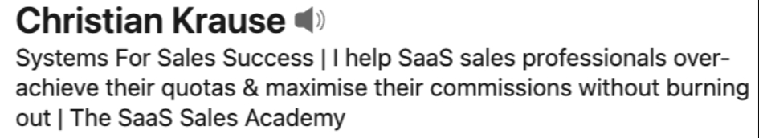
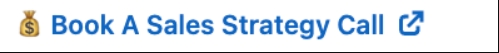
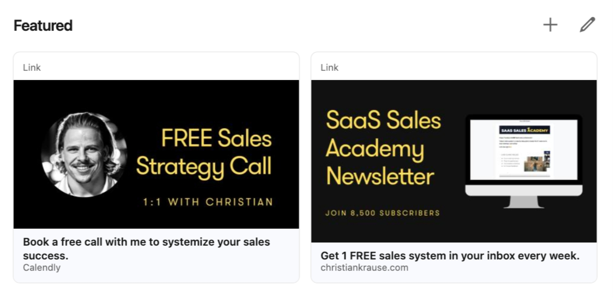
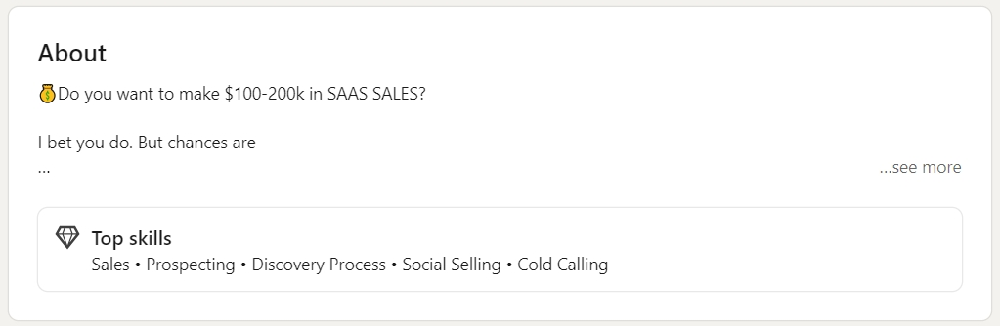
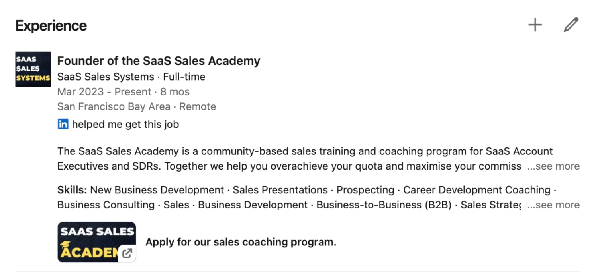
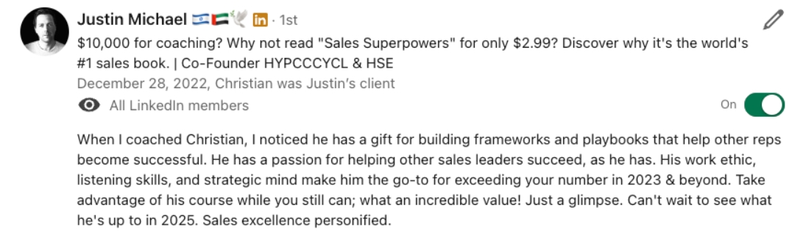
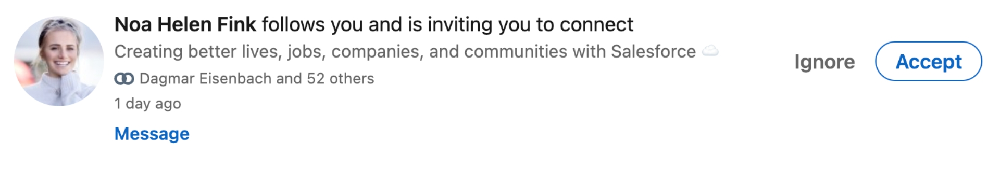

# Your LinkedIn Profile Is A Billboard

Your social selling success will depend on 2 factors:

1. How much your LinkedIn profile speaks to them
2. The quality of your outreach messaging

## 1. Headshot & Banner

This is the prime real estate of your profile. It's the first thing prospects see when they click on your profile.

-   Make sure your headshot is clean and professional. Use Secta.ai for a low-cost AI headshot (like mine).
-   Your banner should speak to your target buyers. Use a simple title + subtitle that tells your buyers about the outcome you can achieve for them.


_The banner speaks to the desires of the target prospects._

## 2. Headline

This is what prospects see right next to your name any time you post something or engage on their content.

-   Most sellers use (title)@(company). That's boring and not very attention grabbing.
-   I like this formula: I help ((target buyers)) ((achieve this outcome/result)) without ((this negative thing)). Instead of yet-another-sales rep, you position yourself as a subject matter expert.
-   Keep it short: prospects can only see the first 42 characters can on mobile (68 on desktop).



_Notice how I maximise the first 42 characters? Then I give more context who I help, how I help them and the bad thing to avoid._

## 3. Custom Button

What do you want prospects to do when they go on your profile?

-   Should they book a call with you?
-   Should they sign up for your event?
-   Should they start a free 30 day trial?

Whatever it is, don't assume they know it. TELL THEM.

No better way than doing that with a custom link. It sits right below your headshot and banner.



## 4. Featured Section

Same idea, except you have a lot more SPACE than with the custom button. What do you want your prospects to do?

Limit yourself to 3 call to action steps. Better 2. Best would be 1.

-   Use a 1920x1080 thumbnail. You can create it on Canva.
-   Use a title, and leave the description BLANK. If you do that, the thumbnail will link with 1 click, otherwise 2 clicks needed. (These small details matter!)



## 5. About Section

Most people talk about their pet and favorite football team. Don't be that person.

You have 2600 characters here, so use it! This is the perfect place for a classic sales letter.

I recommend the COSTAR formula.

-   Curiosity: get their attention with 1-2 catchy lines.
-   Obstacle: describe what keeps them from succeeding
-   Story solution: this is about social proof
-   Triple testimonial: your 3 best customer references
-   Articulate the offer: your product/service value proposition
-   Request - your call to action! what should the prospect do now?!



```
💰Do you want to make $100-200k in SAAS SALES?

I bet you do. But chances are

❌ your quota seems out of reach
❌ you think just working harder is the solution
❌ your company provides you with little sales training

If that’s you, you’re not alone.

🤯 83% of reps expect to miss their quota in 2023.

How can you be among the 17% that are hitting quota?

Or better yet, among the 5% that are making a $200k+ income?

This is why I created the SAAS SALES ACADEMY 🚀

As a member you get

✅ A comprehensive on demand sales training curriculum that covers the entire SaaS sales cycle end to end
✅ A library of done-for-you scripts, templates, sequences, pitch decks and other assets and frameworks
✅ Weekly live group coaching sessions & tactical tear downs, for example on cold calling
✅ A vibrant community of ambitious SaaS sellers with access to top performers
✅ Early access to annual sales masterminds in a tropical location
✅ Weekly live office hours for small group or 1:1 support

My name is Christian Krause.

Over the last 4.5 years I went through being an SDR, BDR and AE. During this time I have

🤝 coached and enabled hundreds of reps
💰 grown my personal income from $50-200k
🚀 built systems and frameworks for every part of the sales cycle
⭐️ sold 1,000+ online courses with 5-star reviews and testimonials

If you want to master the mindset, habits and skills required to make $100-200k in sales you have to take 100% ownership.

If you're ready for that, book your free strategy call with me:

https://calendly.com/christiankrause/discovery
```

## 6. Experience Section

Are you looking for a new job right now? If so, you wanna attract to potential hiring managers.

But if NOT, the only people you should attract is target buyers.

Design your experience section accordingly. Make it a marketing pitch, not a CV. Guide them to your website or a valuable asset.



## 7. Get Client Recommendations

Your manager & peers will give you a LinkedIn recommendation. ANYONE can do that (unless you got fired for harassment).

But what's 100x more powerful is recommendations from CLIENTS.

This sends a strong signal to your target buyers: you are competent and credible.

Homework: ask your 10 best clients for a recommendation, and offer to return the favor. I'm sure 2 or 3 of them will do it!



# Prospecting

1. 3-5 Soft Touches (likes & comments)
2. Blank connection request
3. Thank you & opener
4. Problem statement
5. Drill for pain 3x
6. Offer meeting

## 1. Warm Up Leads

People buy from people who they know, like and trust.

Step 1 of Social Selling is to become known.

Part of that is to optimise your LinkedIn profile.

The other half is to engage with your prospects on social before you send a connection request. I like to call this "soft touches".

Soft touches are meaningful contributions, such as likes and comments. Perform them either

-   directly on their LinkedIn content
-   indirectly on other people's content they have liked or commented.

Perform 3-5 soft touches. This will send a shockwave of notifications to your prospect's LinkedIn mobile app. This is how you become known.

Soft touches create reciprocity.

## 2. Connection Request

There's a debate as old as LinkedIn itself: personalise connection requests or nah?

The data is clear: blank connection requests outperform by 15%.

There's a few reasons for this:

-   Most people send generic crap or pitch slap.
-   Most messages seem salesy.
-   Most messages seem creepy.

Plus, it takes time to craft a meaningful message.

Better: warm them up with soft touches. Let your headshot and headline speak for itself. Now you see why LinkedIn profile optimisation is so important?



## 3. Thank you & Opener

The number 1 mistake I see on LinkedIn: pitch on the first message.

Imagine how you would greet someone at an expo. Would you blurb out your pitch? Probably not.

You'd ask how they're doing. You'd lead with curiosity and empathy. You'd be human.

Be casual, personable and conversational.

```
Hey Carter, thanks for liking yesterday's post about LinkedIn profile
optimisation. how are you getting on at Salesforce? congrats on
landing that new gig btw.
```

hey Carter, thanks for liking yesterday's post about LinkedIn profile
optimisation. how are you getting on at Salesforce? congrats on
landing that new gig btw

## 4. Problem statement

Problems come before solutions.

First, establish that a problem exists. Otherwise your pitch will fall on deaf ears. Ask problem-related questions. Be curious and & assumptive.

```
Thanks Michael! HCM is so relevant though - lots of untapped
potential!

How was the first 4 months in terms of onboarding and finding your
stride?
```

## 5. Acknowledge Objections

9 times out of 10 you will get an objection. Prospects want to protect their time, their money and their reputation.

It's important not to fight objections. This only creates more resistance.

Instead, acknowledge and appreciate the objection. Tell them "you're right". But then, peel one more layer of the onion. Look under the hood. Drill for pain (DFP). Repeat DFP up to 3 times.

## 6. Value Prop + Book Meeting

If you can get a prospect to respond to you 3 times or more, you can book a meeting with them. Guaranteed.

Once you established a problem, insert yourself as the solution. Give social proof. Offer something of value. And package that into a meeting.

```
I hear you. would you still be open to external help to become more
successful? internal constraints aside.
```
