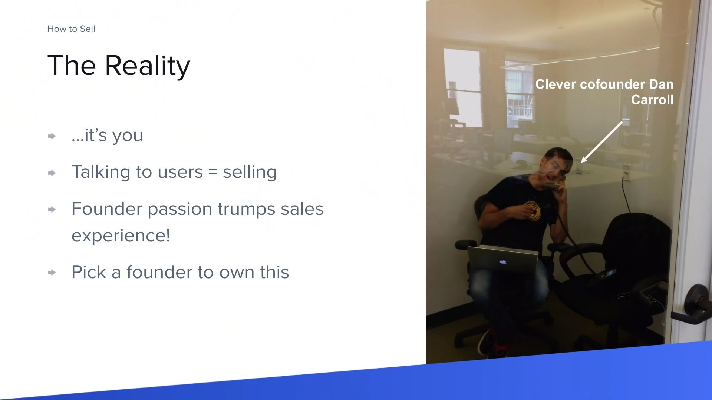
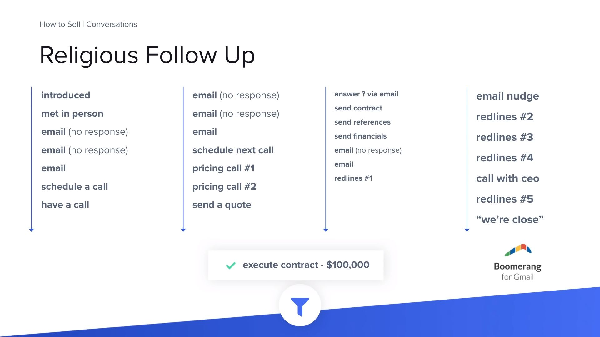

# Call to action (CTA)

Always end with a **call to action** (CTA). Never let the prospect dictate the next step. Never let it end with you waiting on them to act when they want.

# Important

Are you targeting executives? Directors? Managers? Lower level staff?

How your product works with each of those levels will be different because the expectations and needs of customers at these levels are all different.

**Remember, you’re not selling into a company, you’re selling into a role at the company.**

**People don’t buy products, they buy experiences involving products from people like them or people they aspire to be. People buy end results.**

People don’t like sales people but love implementation people. Your website should be doing all of the heavy lifting and you should be implementing really intelligent ways to collect data about interested parties so that you can customize your follow up with them.

It’s never about getting them on the phone to talk about their business, it’s always about what you can already know about their business and showing that you can provide value towards improving it.

# Do things that don't scale

> **MISTAKE:** All you need is a good product, and growth will take care of itself.

Startups don't take off by themselves. Founders make them take off. They have to manually recruit customers in the beginning, it is not enought o push a button on an advertising network. This is uncomfortable, and founders find many ways to avoid this.

Learning the tactics of sales is good. Realizing that it all comes down to you, and not just knowing how to do sales in theory, but actually doing it and wanting to succeed, is of utmost importance.

**Sales conversions**

Outbound sales is ultimately a numbers game. You cannot close 5 customers from 10 leads. You need a ton of data to confirm a product is bad before stopping with sales.


# How to Sell - Tyler Bosemy (Y Combinator)

[How to Sell - Tyler Bosemy](https://www.youtube.com/watch?v=xZi4kTJG-LE)




_You should be spending every moment, of every day, doing one of two things... Bulding product or talking to users_ - Paul Graham

You have 2 HUGE advantages: passion + deep expertize

Ideally, there should be a sales dedicated co-founder, doing it full-time.

## The almighty funnel

1. Prospecting - Who might be interested?
2. Conversations - Is this the right product for them?
3. Closing - How to not lose the deal.
4. Revenue

## Prospecting

Figure out who will even take your call.

-   Find the innovators (2.5%)
-   It's a numbers game! You have to find the innovators.
-   Reach out to > 100 companies.
-   Top 3 methods:
    -   Your network
    -   Conferences
    -   Cold emails

**You're gonna hear a lot of NO!**

### Conferences

-   Figure out what's out there.
-   Go to a few.
-   Get the list!
    -   Find out who's going to be there in advance.
    -   Do it with as many as possible.
    -   Email people in advance to setup a pitch.
    -   Schedule entire days in 30 min increments.

### Cold Emails

All you're trying to do is get a call or meet them i.e. move out of prospecting and start a converstaion

-   Short
-   To the point
-   Personalized
-   Actionable
-   Don't be to salesy.

```
John,

My name is Tyler and I'm the CEO of Clever.

My company has developed new technology that reduces the time spent doing SIS integrations by 80%.

I figured this might be of interest to you given the new middle school reading software Scholastic just released.

I'd love to get your feedback even if you're not in the market for this right now.

Do you have 20 minutes this week? I'm open Tuesday at 1 or 2pm ET if either may work.

Tyler
```

## Conversations


When you get them on the phone, remember to **SHUT UP AND LISTEN!**.

Number 1 sales tip: Sales is about listening.

Listening is what sales is at its core. If you can do that, the rest is easy. People think it's about being a battering ram and forcing someone to buy. Rather, it's about building relationships with people, understanding their problems and needs, and seeing if you can help them with your solution.

Ask questions:

    - Tell me about the problem you're having.
    - How do you solve it today?
    - What does your ideal solution look like?

### Religious Follow Up


_This is 2 months of work for closing a \$100,000/year customer_

...And this is for someone that wants to buy the product! It's not over till they say no.

The potential client has a lot on their mind that's not you. Being persistent is not rude if done the right way.

**In order to not be pushy, follow up a little under a week (5-6 days)**... As long as it's thoughful and personalized.

It's a lot of work to do sales well and it takes a lot of follow up. You have to have an inhumane willingness to just keep going.

**There's a lot of value in driving conversations towards yes/no quickly.** - In order to not waste time on "no-s".

Until you hear a no, you can follow up within reason. 8 unanswered emails... take a hint.

## Closing Traps

### Redlines

-   Final step is to send them an agreement. **HAVE IT READY!**
-   Use the open source YC contract template.
-   Don't waste time on minor legal points.

Redlining = Changes to an agreement

Usually when you send the contract, companies will want to change things.

Early customers are like mana from heaven, do not lose them by draggin on the process! Obviously don't sign something stupid.

### 1 more feature

"I want to buy, but only if you had this feature..."

-   Usually a polite pass.
-   Building it will not get you the sale!

Either sign a conditional agreement, or wait to hear demand from more customers.

### Free trials

"We want to try it for a month before buying"

-   Early on you need **commitment**, **validation** and **revenue**.
-   Free trial gets you **none** of these.

Instead, offer a first 30 days cancellation period on an annual contract.

If you're ever going to **not** charge someone, put together an invoice anyway, with a 100% one-time discount, so that there's a record of the "value" of the job.

## Looking forward


5 ways to build a big business:

    - Flea / Mice / Rabbits - Marketing
    - Deer - Inside Sales
    - Elephants - Field Sales

How much you're able to charge determines your approach on sales.

Prioritize the easiest sells i.e the most in need. Don't look for references, but rather for product validation.

Low pricing ex. \$50/month: Demand generation, Email campaigns, self-service sign-up flows, referral codes...

## Pricing

It's a really tough question.

Just start with something and iterate, as the market will respond.

More startups need to charge more.

Guess a reasonable number for you, if you close that sale, try doubling it next time and so on...

Be bold and confident about the price, but iterate in private.

# How to Get Users and Grow - Gustaf Alstromer

[How to Get Users and Grow - Gustaf Alstromer](https://www.youtube.com/watch?v=T9ikpoF2GH0)

# Startups = Growth

Some people think that if you build a product, and you put it out on the market, people will come and start using it. Not really.

**Don't have a growth team if you don't have product market fit** - It's super dangerous as it will kill the business.

# Sales Systemization

## 1. You don't have time.

> Implement 80/20 time management.

On average, sales people spend 28% of their time selling. It should be the reverse.


## 2. Your onboarding is product centric.

> Use prospect centric messaging.

Customers don't care what you do. They care what you can do for them.

Talk about their goals, challenges, pain points. Talk in their language, use their KPIs and understand their business impact.

## 3. You feel disorganised and overwhelmed.

> Follow a process driven sales approach.

**QAP - Quota Attainment Plan**

Break down annual quotas into daily activities for greater accountability. You will realize you are not doing enough.


## 4. You lack the pipeline to make quota.

> A Strong Prospecting Muscle

Don't focus on a few prospects. Constantly add new ones in the funnel.

Consistency is key, and should be done daily.

## 5. You get no replies or responses.

> Optimise for conversations, not meetings.

Languages is too complex, Emails too long, Bad deliverability due to external links...

Use the trigger, problem statement, validation (TPV) framework

-   **Trigger** - Observation from your research. Why you are reaching out to them, and why now? Attention grabber and instant relevancy.
-   **Problem statement** - Meat of the messaging. Addresses the business challenge you assume the prospect might have.
-   **Validation** - Instead of asking for time or pitching, just ask for validation. "Is this relevant at the moment?", "Is this a problem you're facing?"

You're not trying to sell or book a meeting. Your goal is to establish the prospect has a problem that you can solve.

```
To: ?
Subject: [Personalized to prospect, internal looking]

-- observed trigger
Sarah, saw you liked John Smith's linkedin post on how he books 1 meeting/day through outbound.

-- problem statement
If you could speed up the personalization piece (point 2)...

-- Soft CTA
...think it could help?

Kind regards
```

## 6. You are getting hammered with objections.

> Turn objections into discovery

Every single objection is an opportunity for discovery.

Make the propect feel heard.

```
A: I am not interested.
B: That is totally fine. Could you please help me understand... Is it that you already have a vendor in place?

A: Yes, we do.
B: That is awesome! It sounds that you are happy with the vendor. Mind sharing what they do great?

...
```

At some point, the prospect will reveal a pain point, because you turned the objection into discovery.

## 7. You struggle to create urgency.

> Quantify the GAP (Cost of Inaction)

Happens usually in the discovery stage.

-   No access to decision maker.
-   Prospect ghosts you.
-   Dead - no decision.
-   Long sales cycles.
-   Other projects.

These tell you the prospect perceives you as "nice to have" instead of a "must have".

Avoid waiting for 6 months to call back.

**GAP framework (cost of inaction)**

The greater the GAP, the more you can sell.

The GAP quantifies the gap between the prospect's present and future state. When done correctly, you can put dollar signs on it, which is basically the cost of inaction i.e. the opportunity cost of no buying the solution.

We need to establish a problem and show how much its costing the prospect every week/month/year for not deciding.

It's the only way to build business cases and get signed off by upper management.

```
Present state                             Future state
-------------                             -------------
Status quo                                Better ways to opeate
Painful problem                           Solutions to the problem
Business challenge          GAP           Focus on better business
-------------         ---$$$$$$$$$--->    -------------
Technical problems                        Techincal solutions
Inefficiencies                            Smooth processes
Manual work                               Automation
Time loss                                 Productivity
Bad data                                  Quality
```

```
Example: Say I sell sales coaching.

Problem --> not enough pipeline
Business impact --> 20% behind on growth targets
Root cause --> low prospecting activity in the sales team

By tackling the root cause with my coaching I can solve the problem and potentially make a 20% impact on the revenue numbers.

What's 20%? If they make $1M ARR a year, that's $200k. My 2-day coaching costs $20K. That's a 10X return! The prospect is listening 👀
```

Compelling event = a point in time at which your prospect needs a new solution in place, otherwise they will face financial consequences

Ask your prospects: when do they want a new solution in place? And why?

What's important: a painful problem is not always urgent. As a seller you need to create urgency by uncovering a driving force behind the deal.

No compelling event, no sale.

Example: We need the solution by November 1st because that's when the holiday season kicks in and we will lose a lot of sales if we do not have a new online shop system in place. --> Textbook compelling event.

## 8. You have no control of your deals.

> Set up Mutual Action Plans (MAPs)

-   Dead - no decision
-   Slipped into next quarter
-   No clear next steps
-   No access to decision maker
-   Ghosting
-   Blocked by legal
-   CFO on PTO

After establishing the problem and cost of indecision, you need to define the steps that will take them from their current state to the future state.

You reverse engineer from their desired live date to define all the meetings that will happen, their agenda, desired outcome, participants...

This provides an incredible amount of commitment. It is also a great qualification tool as it uncovers a lot of BS (red flags, friction). It will disqualify a lot of deals, which will allow you to focus on the real ones.


## 9. Prospects don't see the value.

> YOU are the differentiator.

This turns into a race to the bottom, just competing on pricing and being seen as a commodity.

The only solution is value selling i.e. your ability to persuade vs the product features.

You need to:

-   Demonstrate the technical value of the product.
-   Show the strategic value with a business MAP.
-   ROI calculation.

## 10. You are tired, overworked and unbalanced.

> Adopt high performance habits.

Healthy sleep, diet, exercise.
