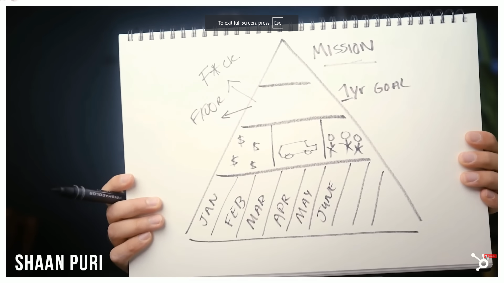

# Get shit done

[How Future Billionaires Get Shit Done](https://youtu.be/ephzgxgOjR0)

-   Creative work must to be done in 8-hour uninteruppted blocks.
-   TODO list first. Meetings, emails and slack second.
-   WRITE SHIT DOWN in meetings! Otherwise, it never happened.
-   Have visible KPIs, on a screen 24/7.
-   Willpower isn't enough. You need tools as well.
-   The two things that ridiculously de-risk your startup are:
    1. Talk to you customers.
    2. Build and launch products.
-   Pick one avenue and stick to it. An equally competent team that is all-in will always beat you.

## Maker vs Manager schedule

[Paul Graham's article](http://www.paulgraham.com/makersschedule.html)

### Maker schedule

```
Creative work must to be done in 8-hour uninteruppted blocks.
```

By creative we mean programmers, musicians, actors...

Eliminate meetings. Define a goal, and follow up each week on it instead.

The maker's schedule works for managers as well.

### Manager schedule

```
TODO list first. Meetings, emails and slack second.
```

Do everything in the TODO list before moving on to other things.

## Meetings

All advice for effective meetings can be summed up in one sentence...

```
WRITE SHIT DOWN! Otherwise, it never happened.
```

The worst thing is having meetings because nothing was written down from the last one.

Notebooks are good for ideas. Todo apps are a must.

Writing things in a notebooks = gone forever.

## Visible KPIs

```
Have  visible KPIs, on a screen 24/7.
```

Become obsessed with the numbers, so you know them by heart.

You should know instantly if you are having an up or down week.

## Distractions

```
Willpower isn't enough. You need tools as well.
```

Super productive people are agressively abnormal with protecting their time.

There are two sets of tools:

-   Organize your time better.
-   Protect your time.

## De-risking

The collection of mentors, startup events, tutorials... **It makes it look like your are doing work.**

```
The two things that ridiculously de-risk your startup are:

1. Talk to you customers.
2. Build and launch products.
```

## Hedging bets

Juggling multiple things at once like thinking about grad school, looking for job offers, investing in crypto, joining accelerators and talking about doing a startup...

```
Pick one avenue and stick to it. An equally competent team that is all-in will always beat you.
```

# ONE priority

https://youtu.be/Tcs3r5DYytw?si=dXhkUi2qtlDiVfxx

## Stop searching for answers

Do the obvious things.

Don't look for answers in books, mentors, podcasts... 9 out of 10 times the answer is to up your intensity, the other time is changing strategy.

Intensity is contagious.

## Peter Thiel's ONE priority system

> If you allow yourself to have more than one focus, you've already blinked. You've determined that mediocrity is an acceptable outcome. Solutions may not be clear, but the path to excellence and value is, and that is to have a singular focus.

Everyone should pick ONLY ONE priority, not a todo list, and sticking to it.

The problem with multiple priorities is that the first one is always difficult and lacks a clear solution, so you distract yourself with the second one.

Leave the room if someone talks about anything else than his only priority. Don't explain why, demonstrate.

## Intensity

You think you are at a level 10, but you are at a 6, when you should be at 12.

> Intensity = Focus x Common Sense x Insanity

Do more by doing less.

> Focus is saying no to a 100 great ideas, so you can say yes to one that is exceptional. - Steve Jobs

## WhatsApp

WhatsApp CEO has a sticky note that said: No ads, no games, no gimmicks. The way we're going to win is that we stick to messaging, and we'll be better than anybody else.

> The F-word around here is Focus. I don't think about things I can't figure out, I don't think about the future, I don't go to conferences to get talks on where the industry is going... I focus on the things I can wrap my head around, like solving the bug a customre complains about.

## The Collison Installation

Most founders when they discover interest, they say "OK, great, I'll send you a link to sign up"...

What the Stripe founder did was "Do you have a laptop on you? I can set you up right now." He onboarded them on the spot.

> Big things come from an accumulation of smaller things

> Startups happen because the founders make them happen.

## Lead bullets, not silver bullets

Instead of trying to be clever and pivot, focus on building a better product.

You don't need a complex strategy or idea, you need intense execution.

## Know when to sprint

When writing the Rocky script, Stallone painted his window's black to not know what time it was. It didn't matter what time it was, as it was time to write. He unplugged his phone to eliminate distractions.

## Action plan

1. Narrow your focus.
2. Write down a common sense strategy. "Build a better product", " Make 30 sales calls a day"...
3. What does level 12 intensity look like?

Jesse Isler hired David Goggins to live in his house and told him "I'll do whatever you tell me to do".

# Laser Focus

> You can do anything, but not everything

## Define your YES threshold

Say no to most things, and only do HELL YES things.

## Manager vs Maker

Most people have manger schedules, filled with little chunks.

Start using a maker's schedule where you have only 2-3 large blocks of uninterrupted time to get in the zone.

## Pyramid of Clarity



1. Write an honest mission. It should be audacious. "Go to space", "Build an electric car"...
2. Setup 2 goals:
    - Fuck yeah goal - Overachieving.
    - Floor goal - Dissapointed if you don't achieve it.
3. Define 3 things need for the goals in terms of:
    - Money - Capital, margins
    - Product - Features
    - People - Hires
4. Each month set goals to chip away at the 3 things.
