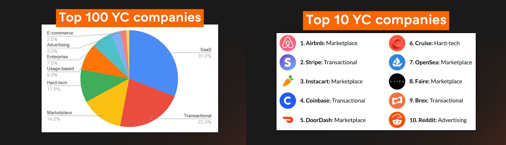

Business Model = How you make money?

# 9 Business models

The majority of billion-dollar companies are these:

-   SaaS - Cloud-based subscription software
-   Transactional - Facilitate transactions and take a cut
-   Marketplace - Facilitate transactions with buyers and sellers
-   Hard-tech - Lots of technical risk and long time horizons
-   Usage-based - Pay-as-you-go based on consumption
-   Enterprise - Sell large contracts to huge companies
-   Advertising - Sell ads to monetize free users
-   E-commerce - Sell products online
-   Bio - Science based tech companies

# Business model guide

The best businesses:

-   Generate recurring revenue
-   Have high retention
-   Build defensible moats
-   Are close to the transaction
-   Scale with software, not people
-   Are proven, and familiar to customers

# Top 100 Y Combinator companies

Marketplaces are the most likely to build winner-takes-all companies.

Marketplaces represent 14% of the top 100 companies, and they create 30% of the overall value.

They are tough to get off the ground because of the chicken & egg problem i.e. having to solve both supply and demand at the same time, and once it's solved, it scales incredibly fast.

Transactional buinsess outperform because they're in the flow of funds.

They represent 22% of the top 100 companies, and they create 29% of the overall value.

Get as close to the transaction as possible. Credit card processors are closest, while affiliate marketing is the furthest.

Very few advertising businesses become winners.

3% of top 100.

SaaS is 32% of top 100.

Don't sell ads unless you will be in the top 10 site on the internet (area).

Not in the top 100 list

-   Services/consulting - non-recurring, scales with people, low margins
-   Affiliate - Foo far away from the transaction
-   Hardware - Requires lots of capital, low margins
-   Businesses built on other platforms. - Too much platform risk

# Recurring revenue

Recurring revenue consistently creates winners.

-   Highly predictable
-   Higher LTV
-   Lower CACs

Only works with strong retention.

95% monthly retention = 54% annual
90% monthly retention = 28% annual

5% of retention makes or breaks the business.

# Moats

Biggest winners are built with moats. Higher margins = bigger moats.

-   Network effect - Each new user increases the value for marketplaces.
-   Lock-in/high switching costs - Transactional, SaaS, Enterprise
-   Technical innovation - Hard-tech and Bio-tech
-   Higher margins/better unit economics - Negotiations leverage for marketplaces
-   Organic distribution - Virality i.e. recommendations

# Pricing

It's a tool to help you learn faster.

Pricing can teach you:

-   Who wants your product
-   How much they want it
-   How much value your product provides
-   Which channels you can use to acquire customers.

Top pricing advice:

1. You should charge.

    - Are users willing to pay?
    - Which users are willing to pay?
    - How much are they willing to pay? Stripe charged 5% vs 3% competitors, to prove their product is valuable.

2. Don't overthink.

    - Find the right order of magnitude. For a $10 product, if customers are willing to pay $100, change the price, as you are and order of magnitude away. If they are in the $15-$20, don't worry.
    - Pricing isn't permanent. It takes to realize the full value of your product.

3. Price on value, not cost

    - Founders often start with cost+ pricing, by adding a little on the top, which is a mistake.
    - Pricing implies value. Lower price tells customers you are less valuable than the competitors.

4. Pricing isn't permanent.

    - Increasing price. There are 2 ways to reduce friction:
        - Exclude existing cutomers or features. Only charge new users the higher price.
        - Give advance notice for the increase, and back it up by increasing the product value.
    - Lowering price. Only these scenarios:
        - Your first user. Just get someone to try the product.
        - A valuable logo i.e. social proof for potential customers.
        - You get lock-in.
        - Renew at higher price.

5. Keep it simple. Don't offer convoluted options. Limit to one or two. Ex. free, premium and pro.

# Find the product value

1. Talk to your users and get them to articulate the value. "What is the problem that our product could solve?"

-   Make more money
-   Reduce costs
-   Move faster
-   Avoid risk

2. Keep raising prices until you get pushback. The ideal price is when customers compain by still pay.

3. Most startups are undercharging. Lower price is not a sustainable advantage.

4. You need to build more value into your product to be able to charge more, or solve a bigger problem.
