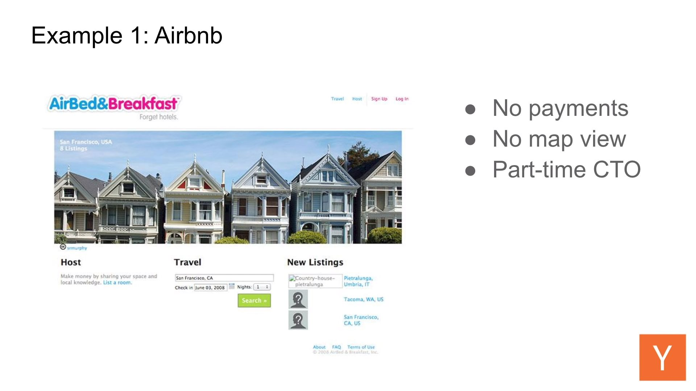
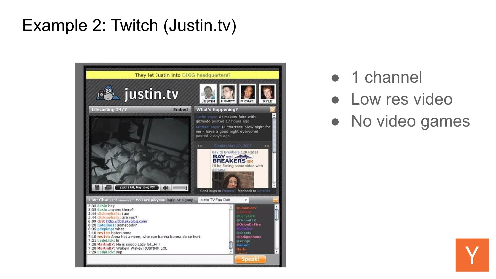

# Most important

-   Launch in 3 months MVP.
-   Ship early, ship often. Build new every 2 weeks.
-   Dogfood your product
-   Build your team. Hire slow. Fire Fast.

# Build time estimation

Rule #1 of estimating when your product is done:

Take the worst estimate and multiply it with 3.

# Building Product

An app needs to be:

-   Easy to use.
-   Visually intuitive.
-   Easy to learn.
-   Help users accomplish something valuable.

MVP = You've built something bad, for the most desperate want.

[Building Product - Michael Seibel](https://youtu.be/C27RVio2rOs)

Justin.tv later Twitch

Things that allowed us to survive (All were essential):

-   Founding team was extremely technical. This allowed them to break a lot of rules.
-   Didn't spend a lot of money.
-   Ego was highly tied to the startup. Failing = Fail in life.

## What problem are you solving?

-   Can you state the problem clearly in 1 sentence?
-   Have you experienced the problem yourself?
-   Can you describe the problem narrowly?
-   Is the problem solvable? Ex. "Uber for babysitting" is very hard to solve.

## Who is your customer?

-   Everyone? **NO!**
-   How often do you have the problem?

    -   Ex. Car selling app. The customer is not the buyer, but the seller! The buyer comes back after 7 years, the seller has the problem everyday.

-   How intense is the problem?
-   Are they willing to pay?

    -   _I need to give it away for free, it's the only way I'll get users_. **WRONG!** If you want to know if you have a good product it's a lot easier to make it harded for the user to use it, and see if they use it anyway. If they have an extremely intense problem, and you ask for $100, they'll see a deal. If you charge $0, you'll get people trying something out, without a real problem. **Starting with a price is always better than free**.

-   How easy are they to find?

## Does your MVP solve the problem?

Usually you end up with a completely differnt product by the end.

The longer you build it, the more it drifts away from the initial idea.

The answer to this question hurts.

## Which customers should you go after first?

Go after the easiest first! The instinct is to go after the hardest first, almost as a proof.

If you're trying to sell a simple \$1,000 / month software, and you're engaged in a 6 month conversation with them, that's not a desperate company, MOVE ON!

_Whose business is gonna go out of business without using you?_

Find the people screaming for the product!

Ignore investors, friends, other founders... They will 100% lead you astray. Talk to customers.

## Which customers should you run away from?

The hard ones!

Customers blasting your support, constantly complaining... Exploiting your value.

You can FIRE a customer.

## Should you discount or start with a super low price?

**NO!**

You can structure discounts and incentives into your sales pitch, if you understand what value you're getting back.

Ex. We've made a deal with AWS to have 40% discount, and we can pass that onto you, but only for the first 30 days. I'd love for you to take as much time as you want to make a decision, but I really would hate you buying it on the 31st day.

It's a structured discount. Also, the price is simply set higher from the start.

This is the way to do it, not by giving it for free because no one will use it.

## How to setup metrics

Google Analytics is bad for this.

-   How many people visited the website.
-   How many pages they viewed.
-   Where they came from.

You need an events based metrics product i.e. what their actions were.

-   Did they click this button?
-   Did they see this screen?
-   How long were they on a page before doing something else?
-   Did they leave something in their cart?

Ex. Mixpanel, Amplitude, Heap...

Pick 5-10 important stats.

Ex. Instagram:

-   Open the app
-   Create an account
-   Took a photo
-   Applied effects
-   Shared he photo

Make measurements a part of the product spec i.e. strart tracking with the release.

## Product Development Cycle (v1)

Have **ONE** brainstorming meeting every week. In order to prevent hating it, make it the only one during the cycle.

1. KPI goal - A number that you track, that reflects how well the company is doing.

    - If you charge money, it's revenue.
    - If not, it's usage.

2. Brainstorm. Any stated idea, is writted on a board.

    - New features / Reitereation on existing ones.
    - Bug fixes.
    - Tests. A/B testing.

3. Easy / Medium / Hard, time for one engineer to build.

    - Easy. 1-2 hours.
    - Medium. 1-2 days.
    - Hard. While dev cycle.

    Most hard ideas can be restated as an easy idea, if you undrestand what bits of the hard idea are both useless and hard. Most of the time, these can be removed.

4. Decide

    Decide which features would impact the KPI the most. Hard first, medium second, easy last.

5. Writte spec. Everyone fuck up here, and no one likes this step.

    Go through the brainstorm ideas, and write down the selected on in **DETAIL**. This is **EXTREMELY IMPORTANT**

## Pivot vs Iterate

If you are expecting to build something significant under two years, you are doing it wrong.

Pivot = Changing the customer and/or the problem (rare) Means start a new company.  
Iterate = Changing the solution (common)

Many make the mistake by thinkin the solution is the genius part, and they look for different customers for their solution. Actually, identifying the problem that other's haven't figured out how to solve is the genius part. Facebook and Google weren't first.

## Fake vs Real Steve Jobs (how not to be a product dictator)

Fake Steve Jobs = The product has to be this way, because I said so. Fuck the customer, fuck everyone else, fuck you... Dreams and creates art.

Real Steve Jobs = Release a shitty MVP and every year reiterate. Iterates and talks to customers.

# How to Plan an MVP (Minimum Viable Product)

[How to Plan an MVP - Michael Seibel](https://www.youtube.com/watch?v=1hHMwLxN6EM)

When you think about MVP, you should think about something ridiculously simple. It's the first think you can give, to the very first users, in order to see if you can deliver any value at all.

**THE THING THAT GETS PEOPLE REALLY SCREWED UP WITH THEIR MVP, IS THAT THEY HAVE A VISION THAT'S BIG, AND ARE NOT WILLING TO HAVE A SMALL MVP**

Talk to your users before writing code, to understand the problem!

You can be your own first user.

## Goal of a pre-launch startup

-   Launch something bad quickly!
-   Get initial customers, anyone.
-   Talk to customers and get feedback.
-   Iterate i.e. continue improving the solution.

Most founders have an idea what to build, so they think that having not built the full thing, it's not worth getting feddback on the shitty initial thing. This is a mistake, because the final product might not be what your customers want at all.

Holt the problem tightly, the customer tightly, but the solution loosely.

On iteration, it's like your making a screwdriver, and the mechanic tells you it doesn't screw anything, so you go looking for uses of the screwdriver if it can cook. Fix the product, rather than look for a customer for the broken one.

## Lean MVP (most cases)

-   Very fast to build (weeks, not months)
-   **Extremely** limited functionality.
-   Appeal to a small set of users. Have a vision of everyone, make an MVP for a few.
-   Base to iterate from. Your MVP is not special.

## Heavy MPV (very few cases)

-   Significant regulation (banking, insurance)
-   Hardtech (rockets)
-   Biotech
-   Moonshot (bore tunnels under cities)

## Launching

**It's not important to "launch"** i.e. do you remember Google, Facebook, Twitter launches?

Launch simply means to start getting customers.

Learning from customers is easier with an MVP, than without.

## Hacks for building an MVP quickly

-   Time box your spec (list of stuff to build)
-   Write your spec (Most fuck it up)
-   Cut your spec (unimportant stuff)
-   Don't fall in love with your MVP

The goal is to get ANYTHING in front of a customer.

If you think your MPV is special, you think it has to be perfect, you then spend a lot of time messing with it.

You must assume it **HAS TO BE SHITTY**.

If you are looking for a shirt to paint with and destroy, you woudln't spend time tailoring it.

## NEVER ASK USERS FOR FEATURES

It's no their job to come up with features. Their job is to come up with problems.

-   How often do they have it?
-   How intense is it?
-   Are they willing to pay for it?
-   Do they know others that have it?

Any feature request should be converted into problem dissection.

## Product market fit

Do I have product market fit? If you have to ask, you don't. You know you have it if you start spending the whole time just keeping servers alive to meet demand, rather than making new features. "We're gonna die because we have too many users!"

Almost no one achieves product market fit. You may have some users, but that's not product market fit.

# How To Talk To Users

[Source](https://youtu.be/z1iF1c8w5Lg)

Talk to customers. They will keep you honest about the product, because they are the only ones that care.

Do not use no-reply emails.

### Interview

-   Do you care about X?
-   Why or why not?
-   Who in your company is relevant for X?

-   Video, phone or in-person.
-   Build rapport.
-   Don't introduce your product or solution.
-   Listen, don't talk.
-   Ask open ended questions.
-   Take notes.

Questions

-   Tell me how you do X today?
-   What is the hardest thing about doing X?
-   Why is it hard?
-   How often do you have to do X?
-   Why is it important for your company to do X?
-   What do you do to solve this problem for yourself?

Follow up

-   What do you mean by that?
-   Can you tell me more about that?
-   Why is that important to you?

Don't ask

-   Will you use our product?
-   Which features would make our product better?
-   Yes/No questions.
-   How woulad a better product look like to you?
-   Two questions at the same time.

It's even better to watch them how they solve their problem now.

Understand their behavior, not what they are saying.

Focus on problems, not features

Users have good problems, but bad solutions.

Look for the underlying reason of their solution, i.e. what the problem is.

Users have no incentive to say no to features.

### Idea

Is solving this problem valuable?

-   Are people paying money for solutions in this space today?
-   Have they tried to solve this problem on their own i.e. do they have Excels that solves it decently? To move someone from using Excel, your solution must be dramatically better.
-   Some customers will always be easier than others to do research on.

Prototype

Show your product and DO NOT TELL THE USER WHAT TO DO, GIVE THEM A GOAL instead.

Tell them to speak their mind while they are using it, and take notes.

Make them feel special, like they are a part of a special club.
