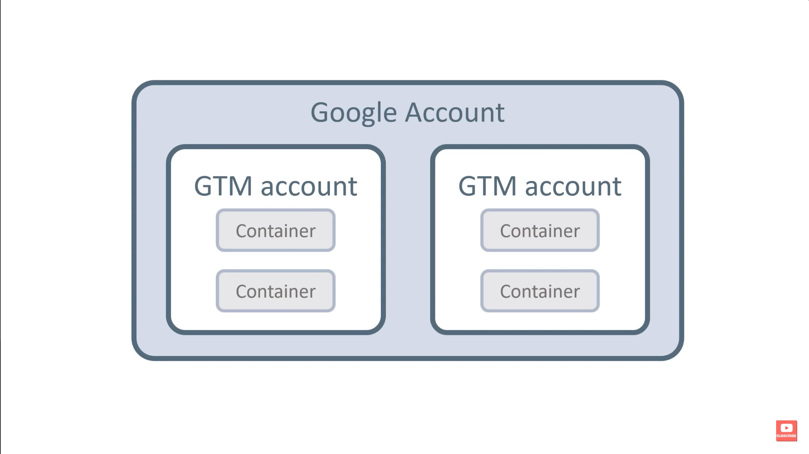
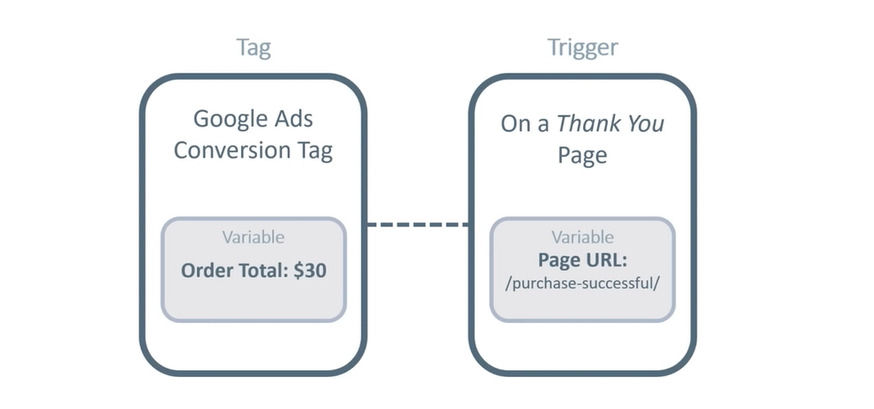

Used to embed code and track events across many websites, without coding.

Super useful, even if you are a developer.

# Account



Container = Property in Google Analytics

Create a separate container for each website.

# Components



-   **Event** - An actual generic event like button click.
-   **Tag** - Micro code injections/embeds. Can send event meta-data to 3rd parties.
    -   Google Analytics GA4 Event - Dedicated for Google Analytics.
    -   ~~Google Tag - General purpose, works for other Google services.~~

```
tags > new > tag configuration > Google Analytics > Google Analytics GA4 Event > Insert Tag ID (found in Google Analytics data stream)

triggering > Initialization - All Pages
```

-   **Trigger** - Conditions for the event to activate the tag script. Ex. specific button (class name). Triggers are not enabled by default, need to create them.

```
triggers > new > trigger configuration > trigger type
```

-   **Variables** - Static content (URL pattern) or dynamically set values (order total).
-   **Templates** - Custom tags with specific fields for them.

# Settings

Enable all link clicks (not available by default). You can add other data (variables) to tags as well.

```
Variables > configure > clicks (tick checkboxes)
```

Put the measurement ID (data stream) into a variable.

# Workflow

1. Configure tags, triggers, variables.
2. Click preview (tag assistant) to verify events fire.
3. Check Google Analytics DebugView to verify events fired.
4. Submit and name the container configuration version.
