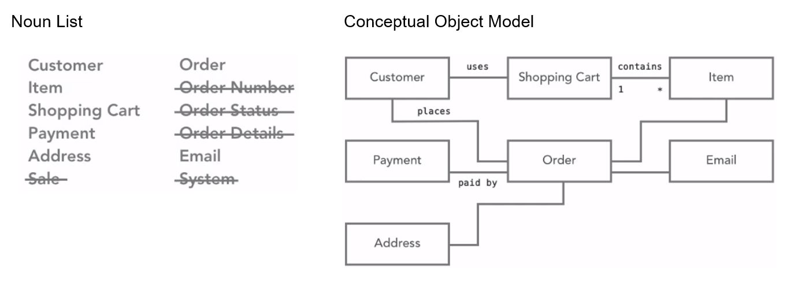
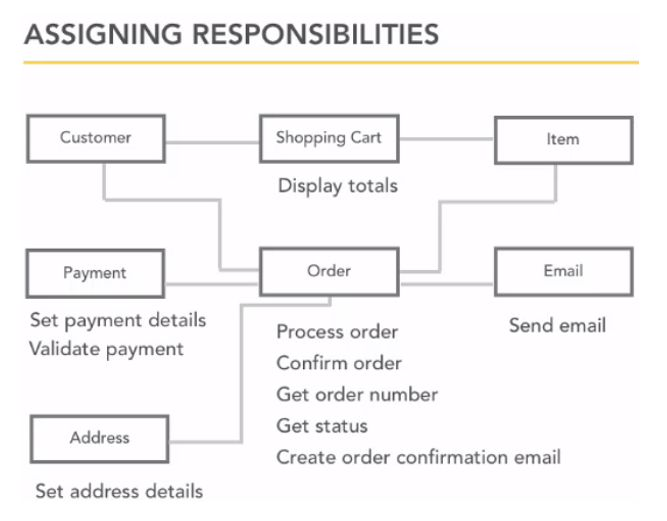

> _Build software, make mistakes. Don’t focus on learning at the expense of practice. The more you learn the more you realize there is to learn. You’ll never feel fully prepared for a project._

# Agile

# Requirements

This should be used in every case, regardless of it being for a client or self.

A team may think this can be skipped because they know all the requirements, but the problem is that they all have semi-formed ideas about what the application **COULD DO**. The goal is to **WRITE DOWN** what the application **MUST DO**. You can't design half a feature.

The bigger the application and organization, the more formal the process needs to be.

**FURPS / FURPS+** is a common formal requirements approach. It's a checklist, not instructions. Focus on **MUST HAVE**, instead of **NICE TO HAVE**.

**FURPS:**

-   **Functional** - App features.
-   **Usability** - Help, documentation, tutorials...
-   **Reliability** - Disaster recovery, acceptable fail rate...
-   **Performance** - Availability, capacity, resources...
-   **Supportability** - Maintenance, scalability.

**PLUS**

-   **Design** - Must be an iPhone app, must use relational databases.
-   **Implementation** - Which technologies? Languages?
-   **Interface** - Not UI, but rather the need to interface with an external systems.
-   **Physical** - Needs to run on a device with a camera, must ship with 50GB DVDs.

## Functional Requirements

What does the application do? Done via user stories or use cases.

ex. Application must allow user to search by customer's last name, telephone number or order number.

| User Stories            | Use Cases                  |
| ----------------------- | -------------------------- |
| short (index cards)     | long (document)            |
| one goal, no details    | multiple goals and details |
| informal                | casual to very formal      |
| coversation placeholder | conversation record        |

## Non-Functional Requirements

What else? ex. System must respond to searches within 2 sec.

-   Help. What kind of documentation needs to be provided?
-   Legal. Are there any laws to comply to? Who knows these laws?
-   Performance. Response time? How many people can use it at once?
-   Support. What happens if there is a problem at 2 am on a sunday?
-   Security. It can be functional or non-functional depending on the app.

# Use Cases

Here we focus on the user instead of the features of the program. How does the user accomplish something?

Informal vs Fully dressed use cases. The latter can hinder process for small projects, but is necessary for major global ones.

1. **Title**. What is the goal? Short phrase, active verb. ex. Create new page, Purchase items, Register new member...

2. **Actor**. Who desires it? Instead of simple user, use Customer, Member, Administrator... It doesn't have to be a human. It can be a system. A simple game can have just a user, whereas a corporate application can have multiple actors with different job titles and departments. Also within that same application, some processes require special actors regardless of job titles. ex. Requester and Approval for an Expense Approval System.

3. **Scenario**. How is it accomplished? Paragraphs vs Lists (Step by step guides). Preconditions and extensions can be defined. ex. Precondition: Customer must select one item. ex. If the item is out of stock.
   The focus should be on specific actions. ex. Log into system. Why does one log into? The user logs in to do something, not just to log in. Log in is too broad and simply a step towards the important goals i.e. the do something. ex. Purchase something, Create new document.
   Write a sunny day scenario first where everything works in order. Later add the scenarios for everything that can go wrong from the actions side, not the technical. ex. Item is out of stock vs .NET is outdated.

## Active Voice

Use **ACTIVE VOICE** and **FOCUS ON INTENTION**!. To the point without too many details. Ex. Provide steps without mentioning clicks, pages, mouse, buttons etc... **Just the pure intent**.

| BAD                                                                                                                                                                                      | GOOD                                                |
| ---------------------------------------------------------------------------------------------------------------------------------------------------------------------------------------- | --------------------------------------------------- |
| The system is provided with the payment information and shipping information by the Customer.                                                                                            | Customer provides payment and shipping information. |
| The system connects to the external payment processor over HTTPS and uses JSON to submit the provided payment information to be validated, then waits for a delegated callback response. | System validates payment information.               |

Questions that can provide unforseen actors and scenarios.

-   Who does system administration tasks?
-   Who manages users and security?
-   What happens if the system fails?
-   Is anyone looking at performance metrics and logs?

## Format

**Title:** what is the goal?  
**Actor:** who desires it?  
**Scenario:** how is it done?

### Scenario as steps

**Title:** Purchase items  
**Actor:** Customer  
**Scenario:**

1. `Customer` chooses to enter checkout process.
2. `Customer` is shown a confirmation page for their order, allowing them to change quantities, remove items, or cancel.
3. `Customer` enters the shipping address.
4. `System` validates the customer address.
5. `Customer` selects payment method.
6. `System` validates the payment details.
7. `System` creates an order number that can be used for tracking.
8. `System` displays a confirmation screen to the `Customer`.
9. `Email` is sent to the `Customer` with order details.

### Scenario as paragraph

**Title:** Purchase items  
**Actor:** Customer  
**Scenario:** Customer reviews items in shopping cart. Customer provides payment and shipping information. System validates payment information and responds with confirmation of order and provides order number that Customer can use to check on order status. System will send Customer a confirmation of order details and tracking number in email.

# User Stories

They are simpler and shorter than use cases. It describes a scenario from a user perspective with the focus on their goal, rather than the system. They are usually 1 or 2 sentences long, in comparison to use cases which can be pages long.

## Format

As a **(type of user)**  
I want **(goal)**  
so that **(reason)**

## UBER example

When gathering requirements, you make it a statement from the user point of view. And there could be multiple users with different needs.

Then you can also use these statements as your test plan to test against. These requirements also tell developers how it should be coded.

### Customer Requirements

-   As a Customer, I want to be able to pay my Driver through my phone and include an optional tip.
-   As a Customer, I want to be able to rate my Driver through the phone app.
-   As a Customer, I want to be able to report my Driver anonymously through the phone app for any ethical or illegal activities during my ride.
-   As a Customer, I want to view my Driver's route to pock me up on a map in real time along with an updated ETA.

### Driver Requirements

-   As a Driver I want the app to display on my phone pick up and drop off addresses of my fare.
-   As a Driver, I want to be able to accept or decline each fare request on my phone.
-   As a Driver, I want to be able to log on and log off duty on my phone.
-   As a Driver, I want a map on my phone appbshowing me how to get to my pickup.
-   As a Driver I want the appvto notify my Customer in real time my ETA.

### Accountant Requirements

-   As an Accountant, I want to be able to track each route by Driver which includes mileage and Tip.

# Domain Modelling

## Conceptual Object Model

The goal here is to make a conceptual object model, not a database model. This is purely for planning purposes, not execution. Look for the verbs. An object should be responsible for itself. Don’t confuse the actors with this. They initiate the behavior that lives in the objects.

> `Customer` confirms `items` in `shopping cart`. Customer provides `payment` and `address` to process `sale`. `System` validates payment and responds by confirming `order`, and provides `order number` that Customer can use to check on `order status`. System will send Customer a copy of `order details` by `email`.

## Responsibilities

> Customer `confirms items` in shopping cart. Customer `provides payment and address` to `process sale`. System `validates payment` and responds by `confirming order`, and `provides order number` that Customer can use to `check on order status`. System will `send` Customer a copy of order details by `email`.

It may sound like many of these should be under the customer, but keep in mind that the customer is the initiator.

It’s a common mistake for people new in OOP to give way too much behavior to actors.

## System

> Customer confirms items in shopping cart. Customer provides payment and address to process sale. `System validates payment` and responds by confirming order, and provides order number that Customer can use to check on order status. `System will send Customer a copy of order details by email`.

This can lead to people creating a “System” object and putting a lot of behavior in it. This is a big mistake. “System” is just a placeholder word for the specific object that has not yet been identified. It should be read as “SOME PART of the system does something…”.

Responsibilities should be distributed between objects, not stored in one master object. This is a sign that you are thinking procedurally, not OOP.
