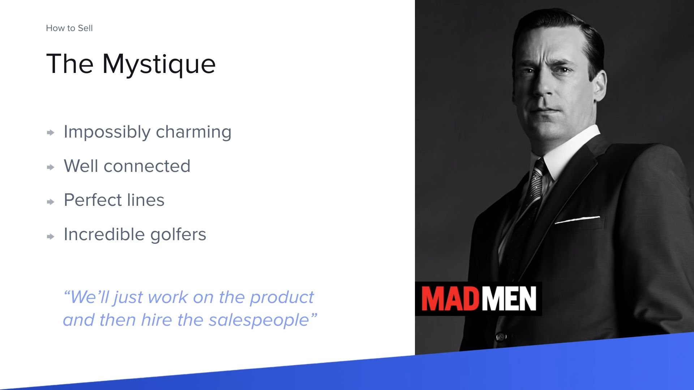
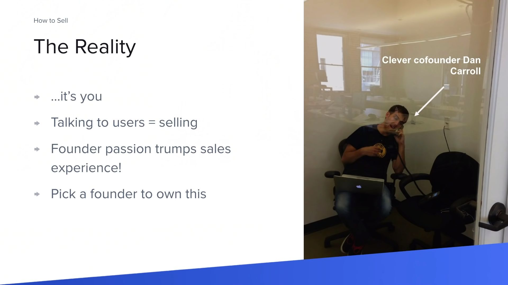
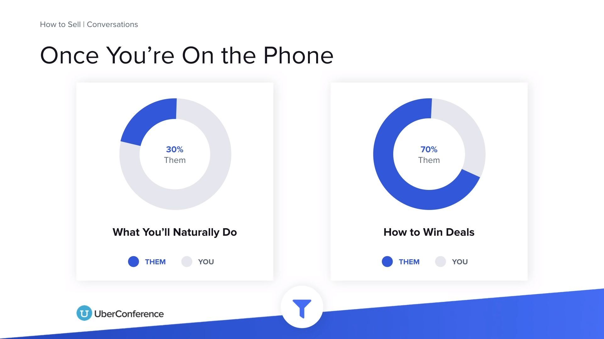
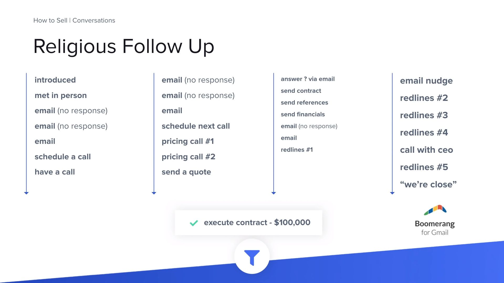
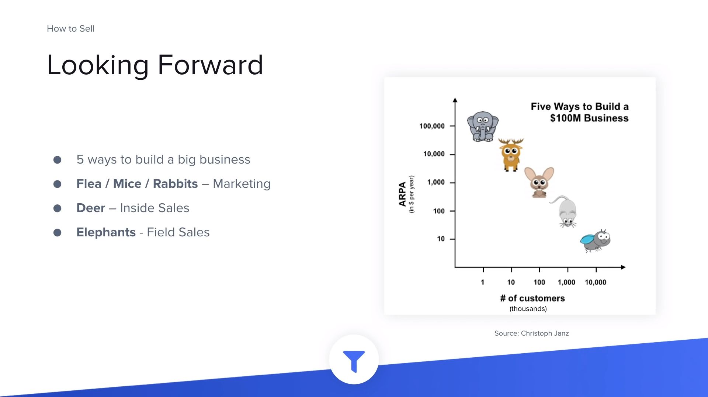

# Call to action (CTA)

Always end with a **call to action** (CTA). Never let the prospect dictate the next step. Never let it end with you waiting on them to act when they want.

# Important

Are you targeting executives? Directors? Managers? Lower level staff?

How your product works with each of those levels will be different because the expectations and needs of customers at these levels are all different.

**Remember, you’re not selling into a company, you’re selling into a role at the company.**

**People don’t buy products, they buy experiences involving products from people like them or people they aspire to be. People buy end results.**

People don’t like sales people but love implementation people. Your website should be doing all of the heavy lifting and you should be implementing really intelligent ways to collect data about interested parties so that you can customize your follow up with them.

It’s never about getting them on the phone to talk about their business, it’s always about what you can already know about their business and showing that you can provide value towards improving it.

# How to Sell - Tyler Bosemy

[How to Sell - Tyler Bosemy](https://www.youtube.com/watch?v=xZi4kTJG-LE)





_You should be spending every moment, of every day, doing one of two things... Bulding product or talking to users_ - Paul Graham

You have 2 HUGE advantages: passion + deep expertize

Ideally, there should be a sales dedicated co-founder, doing it full-time.

## They almighty funnel

1. Prospecting - Who might be interested?
2. Conversations - Is this the right product for them?
3. Closing - How to not lose the deal.
4. Revenue

## Prospecting

Figure out who will even take your call.

-   Find the innovators (2.5%)
-   It's a numbers game! You have to find the innovators.
-   Reach out to > 100 companies.
-   Top 3 methods:
    -   Your network
    -   Conferences
    -   Cold emails

**You're gonna hear a lot of NO!**

### Conferences

-   Figure out what's out there.
-   Go to a few.
-   Get the list!
    -   Find out who's going to be there in advance.
    -   Do it with as many as possible.
    -   Email people in advance to setup a pitch.
    -   Schedule entire days in 30 min increments.

### Cold Emails

All you're trying to do is get a call or meet them i.e. move out of prospecting and start a converstaion

-   Short
-   To the point
-   Personalized
-   Actionable
-   Don't be to salesy.

```
John,

My name is Tyler and I'm the CEO of Clever.

My company has developed new technology that reduces the time spent doing SIS integrations by 80%.

I figured this might be of interest to you given the new middle school reading software Scholastic just released.

I'd love to get your feedback even if you're not in the market for this right now.

Do you have 20 minutes this week? I'm open Tuesday at 1 or 2pm ET if either may work.

Tyler
```

## Conversations



When you get them on the phone, remember to **SHUT UP AND LISTEN!**.

Number 1 sales tip: Sales is about listening.

Listening is what sales is at its core. If you can do that, the rest is easy. People think it's about being a battering ram and forcing someone to buy. Rather, it's about building relationships with people, understanding their problems and needs, and seeing if you can help them with your solution.

Ask questions:

    - Tell me about the problem you're having.
    - How do you solve it today?
    - What does your ideal solution look like?

### Religious Follow Up


_This is 2 months of work for closing a \$100,000/year customer_

...And this is for someone that wants to buy the product! It's not over till they say no.

The potential client has a lot on their mind that's not you. Being persistent is not rude if done the right way.

**In order to not be pushy, follow up a little under a week (5-6 days)**... As long as it's thoughful and personalized.

It's a lot of work to do sales well and it takes a lot of follow up. You have to have an inhumane willingness to just keep going.

**There's a lot of value in driving conversations towards yes/no quickly.** - In order to not waste time on "no-s".

Until you hear a no, you can follow up within reason. 8 unanswered emails... take a hint.

## Closing Traps

### Redlines

-   Final step is to send them an agreement. **HAVE IT READY!**
-   Use the open source YC contract template.
-   Don't waste time on minor legal points.

Redlining = Changes to an agreement

Usually when you send the contract, companies will want to change things.

Early customers are like mana from heaven, do not lose them by draggin on the process! Obviously don't sign something stupid.

### 1 more feature

"I want to buy, but only if you had this feature..."

-   Usually a polite pass.
-   Building it will not get you the sale!

Either sign a conditional agreement, or wait to hear demand from more customers.

### Free trials

"We want to try it for a month before buying"

-   Early on you need **commitment**, **validation** and **revenue**.
-   Free trial gets you **none** of these.

Instead, offer a first 30 days cancellation period on an annual contract.

If you're ever going to **not** charge someone, put together an invoice anyway, with a 100% one-time discount, so that there's a record of the "value" of the job.

## Looking forward



5 ways to build a big business:

    - Flea / Mice / Rabbits - Marketing
    - Deer - Inside Sales
    - Elephants - Field Sales

How much you're able to charge determines your approach on sales.

Prioritize the easiest sells i.e the most in need. Don't look for references, but rather for product validation.

Low pricing ex. \$50/month: Demand generation, Email campaigns, self-service sign-up flows, referral codes...

## Pricing

It's a really tough question.

Just start with something and iterate, as the market will respond.

More startups need to charge more.

Guess a reasonable number for you, if you close that sale, try doubling it next time and so on...

Be bold and confident about the price, but iterate in private.

# How to Get Users and Grow - Gustaf Alstromer

[How to Get Users and Grow - Gustaf Alstromer](https://www.youtube.com/watch?v=T9ikpoF2GH0)

# Startups = Growth

Some people think that if you build a product, and you put it out on the market, people will come and start using it. Not really.

**Don't have a growth team if you don't have product market fit** - It's super dangerous as it will kill the business.
