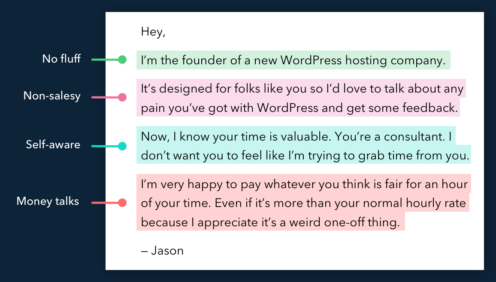
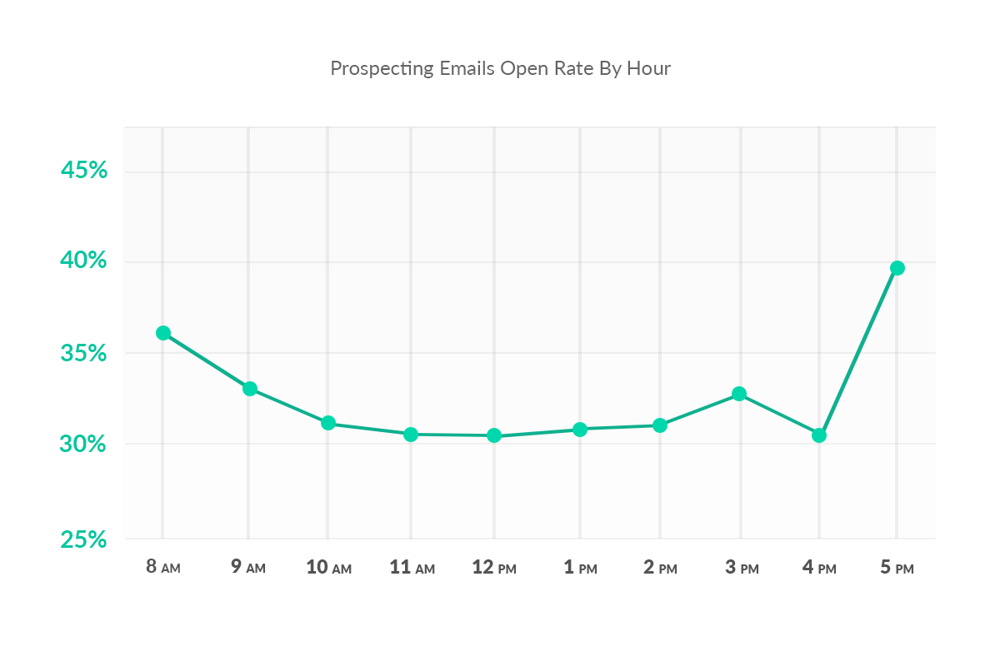
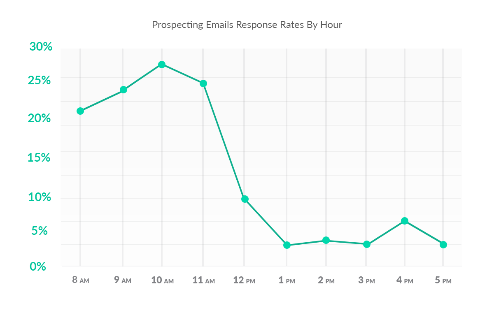

# Structure

-   Greeting and softener.
-   Outline logic for the targeted personal email.
-   Introduce yourself, your role at your company, and outline your company’s product/service in a way that clearly and directly solves a top 3 challenge for the prospect in their role at target company.
-   Suggest a meet/call to outline the aspects of notable relevance.
-   Close with an assumptive feeler about the best time/date to speak.

# Subject Line

Referencing the product or service in your subject line will reduce open rates, so don’t do it.

Something more ambiguous works better in 90% of cases.

Ex. "2017 plans", "London next week", "Better organization" etc.

# Content

**Write the content as if every word costs \$1,000.**

-   Forget feature and benefit lists. Instead just outline the end result without worrying too much about the mechanics and steps involved.
-   Forget everything you have read about social proof. Delete those three big-named clients: instead tell your prospect you know exactly how your service/product will make a big difference at their company.
-   Drop the marketing language and jargon. Tell it in plain English using simple, uncomplicated sentences.
-   Avoid obvious data insertions. Data insertions are a fantastic way to target mails – but they’re a real turn-off if they’re noticeable. Always reality check samples of your mails before hitting send.
-   Save the discounts and special offers. For an engagement mail there’s no need to start desperately discounting. You need to sell your proposition not start skimming off its price.
-   PDF attachments and web links are a no-no. Your marketing department is going to love you. Not only have you discarded all their carefully crafted sales copy in favour of a conversational tone but you are also going to need to refuse to attach their latest promo piece or insert a link to their latest video or landing page. The fact is, when you look at the stats attachments and web links just distract your prospects from your main aim: to get in contact to find out more.

```
Hello <name>,

I hope you're having a productive <day of week>.

My name is <name> and I would like to offer you <product> that solves <problem>.

Do you have 5 minutes for a phone call?

You can find out more on <link>.

Respectfully,
```

```
Hi Dave,

I read your post on cloud migration last week – really got me thinking about your approach.

Mind if I drop you a call… I have a couple of thoughts I wanted to run past you?

Do you have a few minutes on Thurs?

Cheers
```

February 2010. Jason Cohen had an idea for a new WordPress hosting service. He logged onto Linkedin, searched for Wordpress consultants and sent forty of them the following email:

> 100% agreed to talk to me on the phone. Not one asked for any money. Thirty agreed to pay $50 / mo. Before I had a company name, before I had a powerpoint, before I had a server, I already had 30 customers willing to pay. — Jason

Today, WP Engine, makes $100M / year.



# Timing

**Send emails on Tuesday, Wednesday, Thursday between 09:00 and 11:00**

Emails sent between 08:00 and 11:00 represented 46% of the total, yet they accounted for 75% of all responses.

Best days are Tuesday, Wednesday, Thursday because Monday's are super busy while on Friday's people shut off for the weekend.





https://sopro.io/best-time-to-send-prospecting-emails  
https://sopro.io/six-simple-steps-to-prospecting-success  
https://sopro.io/whats-sopro-email  
https://sopro.io/the-golden-rules-of-email-prospecting

# TPC: Trigger, Pitch, Call To Action

[Source](https://mailchi.mp/ab2d7eab2a2d/killer-cold-emails?e=[UNIQID)

Most sales reps over-engineer their emails.

-   Write too formal
-   Overuse personalisation
-   Spend a lot of time researching
-   Spend a lot of time writing their emails
-   Use lengthy sentences and subject lines

None of which are necessary.

### **The 3 steps to writing killer cold emails**

-   Find relevant buying triggers
-   Pitch a problem the prospect is likely to have
-   Interest-based call to action & create curiosity

In other words:

-   Monitor the same 3 buying triggers to be instantly relevant
-   Pitch a problem that is unique to your ICP (ideal customer profile)
-   Ask for interest, not time.

Bonus tip: add a piece of value. The Law Of Reciprocity says you're more likely to get a response :-)

### **1. Monitor triggers to find high propensity prospects**

The first sentence in your email needs to tell the prospect immediately why **you are reaching out to them, and why now**.

You have about 3 seconds attention span to get that right. Otherwise, TLDR.

The best way to do this is to refer to a trigger from your research.

**Triggers are visible events that indicate that the prospect is currently in market for what you sell**, for example:

-   Increased hiring or headcount growth
-   Executive leadership change
-   International expansion
-   New product launch
-   Funding event
-   M&A
-   The tech stack they use

**Tip: always look out for the same 3 triggers. It will make your research more efficient.**

Here's what your subject line and first sentence could look like:

```
Subject: Series B

Hi Tom,

You recently raised 2.5M Series B funding with Wingman Ventures. Congratulations!
```

### **2. Pitch a problem or pain you know they have**

You have their attention. Now it's all about adding immediate value.

When I say "pitch", I do not mean product features. Or ROI. Or customer references. All of these are salesy and there's no place for them in the first email.

Instead, **pitch a problem that you know your prospect is likely to have in the current stage that they're in**. If done right this positions you as a trusted advisor, someone who can add value to their business.

**Tip: Problems/pains are persona-specific. The CSO has different pains than the CFO. Know your ICP, and know what resonates with them!**

Here's what the body of your email could look like:

```
Series B scale ups often face challenges when it comes to scaling their go-to-market teams. They realise the tools and processes that served them well at the seed stage does not scale during that next phase.

This issue is often related to data silos and manual tasks.
```

### **3. Ask for interest, not time**

Most sales reps get this wrong.

The problem with asking for time is that it's too much commitment. Even though you are relevant and the prospect might be interested, he or she is busy. You're asking too much.

Instead, **ask for their interest**. See if they are curious. Find out if they are open to learn more.

**Tip: Use the law of reciprocity. Attach some value to your CTA.
The prospect will feel more compelled to give you something in return:
a response.**

Here's what your CTA could look like:

```
With Salesforce we help Series B startups to remove growth bottlenecks and scale faster. Here's a video of what the CEO of X has to say about us: link

Tom, is this topic relevant for you at the moment?
```

### **Example**

```
Hi Tom,

You recently raised 2.5M Series B funding with Wingman Ventures. Congratulations!

Series B scale ups often face challenges when it comes to scaling their go-to-market teams. They realise the tools and processes that served them well at the seed stage does not scale during that next phase. This issue is often related to data silos and manual tasks.

With Salesforce we help Series B startups to remove growth bottlenecks and scale faster. Here's a video of what the CEO of X has to say about us: link

Tom, is this topic relevant for you at the moment?

Best, Christian
```
