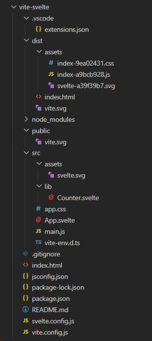
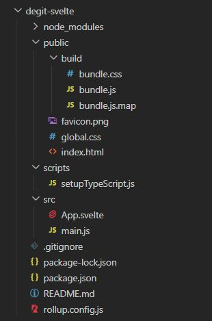

# Content

-   [Terminology](#terminology)
-   [Svelte](#svelte)
-   [Install via Vite](#install-via-vite)
-   [Use Vite in existing Svelte app](#use-vite-in-existing-svelte-app)
-   [Install via Degit - Old deprecated](#install-via-degit---old-deprecated)
-   [VS Code extensions](#vs-code-extensions)
-   [Formatter](#formatter)
-   [Injected components](#injected-components)
-   [Basics](#basics)
-   [Reactivity](#reactivity)
-   [Props](#props)
-   [Logic](#logic)
-   [Events](#events)
-   [Binding](#binding)
-   [Lifecycle](#lifecycle)
-   [Stores](#stores)
-   [Motions](#motions)
-   [Transitions](#transitions)
-   [CSS](#css)
-   [Composition](#composition)
-   [Context API](#context-api)
-   [Special elements](#special-elements)
-   [Debugging](#debugging)
-   [Routing](#routing)
-   [Rollup](#rollup)
-   [SvelteKit](#sveltekit)
-   [UI component libraries](#ui-component-libraries)

# Terminology

**Svelte** - Language, a compiler and a frontend framework.

**SvelteKit** - Full-stack meta-framework built on top of Svelte. SvelteKit is to Svelte, what Next.js is to React.

**Vite** - Build tool and dev server which uses rollup for bundling. It obfuscates a bunch of the configuration and has an EXTREMELY fast dev server built in, which uses native ES modules rather than traditional bundling everything in one file.

**Rollup** - Default bundler for production. Rollup is still the bundler when you're using Vite (and you have a `rollupOptions` on your `vite.config.js` if you want to configure it). Rollup's job is to take your application's source files (so far, just `src/main.js` and `src/App.svelte`), pass them to other programs (including Svelte, in our case) and convert them into the code that will actually run when you open the application in a browser.

# Svelte

Svelte converts your app into ideal JavaScript at build time, rather than interpreting your application code at run time. This means you don't pay the performance cost of the framework's abstractions, and you don't incur a penalty when your app first loads.

You can build your entire app with Svelte, or you can add it incrementally to an existing codebase. You can also ship components as standalone packages that work anywhere, without the overhead of a dependency on a conventional framework.

The compiler turns each component into a regular JavaScript class, located by default in `public/build/bundle.js` as defined in `rollup.config.js`.

```js
import App from "./App.svelte";

const app = new App({
    target: document.body,
    props: {
        answer: 42,
    },
});

export default app;
```

# Install via Vite

A tool to quickly start a project from a basic template for popular frameworks.

Vite uses the native ES modules feature in the browser to handle imports, while Webpack and Rollup use a more traditional approach of bundling all the files together.

```bash
# Create scaffold via a Vite CLI install prompt
npm create vite@latest
```



One thing you may have noticed is that in a Vite project, `index.html` is front-and-central instead of being tucked away inside public. This is intentional: during development Vite is a server, and `index.html` is the entry point to your application.

Vite treats `index.html` as source code and part of the module graph. It resolves `<script type="module" src="...">` that references your JavaScript source code. Even inline `<script type="module">` and CSS referenced via `<link href>` also enjoy Vite-specific features. In addition, URLs inside index.html are automatically rebased so there's no need for special `%PUBLIC_URL%` placeholders.

**package.json**

```json
{
    "name": "vite-svelte",
    "private": true,
    "version": "0.0.0",
    "type": "module",
    "scripts": {
        "dev": "vite",
        "build": "vite build",
        "preview": "vite preview"
    },
    "devDependencies": {
        "@sveltejs/vite-plugin-svelte": "^2.0.2",
        "svelte": "^3.55.1",
        "vite": "^4.1.0"
    }
}
```

When you npm run build every file and folder from `public` is copied into `dist`.

```bash
# install dependencies
npm install # if ENOENT: npm cache verify; npm update;

# starts a dev server http://localhost:5173
npm run dev

# create a production-ready version of your app in /dist (copies everything from public into dist)
npm run build
```

**IMPORTANT:** Setup Vite to work with server API on different port.

```js
import { defineConfig } from "vite";
import { svelte } from "@sveltejs/vite-plugin-svelte";

// https://vitejs.dev/config/
export default defineConfig({
    plugins: [svelte()],
    server: {
        proxy: {
            "/api": "http://localhost:9999",
            "/auth": "http://localhost:9999",
            "/socket.io": {
                target: "ws://localhost:9999",
                ws: true,
            },
        },
    },
});
```

# Use Vite in existing Svelte app

1. `package.json` → remove every 'rollup' devDependency
2. `package.json` → remove 'sirv-cli' dependency
3. `npm install vite @sveltejs/vite-plugin-svelte --save-dev`
4. remove `rollup.config.js`
5. add `vite.config.js`

```
import { defineConfig } from 'vite';
import { svelte } from '@sveltejs/vite-plugin-svelte';

export default defineConfig({
    plugins: [
        svelte({
            /* plugin options */
        })
    ]
});
```

6. modify `package.json`

```
"scripts": {
  "build": "vite build",
  "dev": "vite",
  "start": "vite preview"
}
```

7. move `index.html` from `/public` to project root directory
8. delete `/public/build` folder
9. in `index.html` remove the `bundle.css`
10. in `index.html` replace `build/bundle.js` with `<script type="module" src="/src/main.js"></script>`
11. and you’re done! run `npm run dev` to start working
12. optionally add [preserveLocalState setting](https://youtu.be/D66wC4VsgVU?t=271) to quickly activate it in case needed

```
export default defineConfig({
    plugins: [
        svelte({
            hot: {
                // preserveLocalState: true
            }
        })
    ]
});
```

13. Add `/dist` folder to `.gitignore` after first build.

# Install via Degit - Old deprecated

**npx** - Package runner (part of `npm`), that runs a package (degit), without having it as a dependency.

**degit** - Downloader of the last commit of a git repository. When you run degit `some-user/some-repo`, it will find the latest commit on `https://github.com/some-user/some-repo` and download the associated tar file to `~/.degit/some-user/some-repo/commithash.tar.gz` if it doesn't already exist locally. This is much quicker than using `git clone`, because you're not downloading the entire git history.

```bash
# download last commit of sveltejs/template in specified location
npx degit sveltejs/template my-app
```



**package.json**

```json
{
    "name": "svelte-app",
    "version": "1.0.0",
    "private": true,
    "type": "module",
    "scripts": {
        "build": "rollup -c",
        "dev": "rollup -c -w",
        "start": "sirv public --no-clear"
    },
    "devDependencies": {
        "@rollup/plugin-commonjs": "^24.0.0",
        "@rollup/plugin-node-resolve": "^15.0.0",
        "@rollup/plugin-terser": "^0.4.0",
        "rollup": "^3.15.0",
        "rollup-plugin-css-only": "^4.3.0",
        "rollup-plugin-livereload": "^2.0.0",
        "rollup-plugin-svelte": "^7.1.2",
        "svelte": "^3.55.0"
    },
    "dependencies": {
        "sirv-cli": "^2.0.0"
    }
}
```

```bash
# install dependencies
npm install # if ENOENT: npm cache verify; npm update;

# starts a default server http://localhost:5000
npm run dev

# starts a custom server http://localhost:4444
HOST=127.0.0.1 PORT=4444 npm run dev

# create a production-ready version of your app in /public/bundle.js.
npm run build
```

# VS Code extensions

-   Svelte for VS Code
-   Svelte Intellisense

# Formatter

1. Install the `prettier` extension.
2. install the `svelte.svelte-vscode` extension.
3. `CTRL + SHIFT + P` command `settings.json` open settings
4. Add this line.

    ```
    "[svelte]": {
        "editor.defaultFormatter": "svelte.svelte-vscode"
    },
    ```

5. Create a local `.prettierrc` file in the project.
6. Add this in the file.

    ```
    {
    "trailingComma": "es5",
    "svelteSortOrder": "scripts-markup-styles",
    "tabWidth": 4
    }
    ```

7. **Explicitly restart the language server** with this command `Svelte: Restart Language Server`. **IT WILL NOT WORK WITHOUT THIS**. This needs to be done after each change to the settings.

# Injected components

## **Node.js**

Or, we can then import the component and instantiate with `new`.

**Svelte main.js**

```js
import App from "./App.svelte";

export default App;
```

**Nodejs module app.js**

```js
const bundle = require(`../svelte/public/build//bundle.js`);

module.exports = async (ctx) => {
    let html = `
        <div id="app" class="content-table"></div>
    `;

    content.innerHTML = html;

    new bundle({
        target: document.getElementById("app"),
        props: {
            foo: "bar",
        },
    });
};
```

**nodejs index.js**

```js
page("/app", app);
```

In order for this to work in `node` and be further bundled in an existing non-svelte app, we need this setting in `rollup.config.js`.

```js
export default {
    input: "src/main.js",
    output: {
        sourcemap: true,
        format: "cjs",
        name: "app",
        file: "public/build/bundle.js",
    },
};
```

## **Browser**

**main.js**

Just reference the DOM element in the bundle.

```js
import App from "./App.svelte";

const app = new App({
    target: document.getElementById("app"),
    props: {
        name: "world",
    },
});

export default app;
```

# Basics

## Hello world

```html
<script>
    let name = "world";
</script>

<h1>Hello {name.toUpperCase()}!</h1>

<input placeholder="hello {name}" />
```

## Shorthand attributes

If the attribute has the same name and value, we can use the shorthand.

```html
<script>
    let src = "image.jpg";
</script>


```

## CSS

The styling is scoped to the component. It's converted into a custom gibberish class on compilation.

```html
<style>
    p {
        color: red;
    }
</style>

<p>This is a paragraph.</p>
```

## Components

App.svelte

```html
<script>
    import Nested from "./Nested.svelte";
</script>

<style>
    p {
        color: purple;
        font-family: "Comic Sans MS", cursive;
        font-size: 2em;
    }
</style>

<p>This is a paragraph.</p>

<Nested />
```

Nested.svelte

```html
<style>
    p {
        color: red;
    }
</style>

<p>This is another paragraph.</p>
```

## HTML strings

To read the string as HTML, we use the `@html` directive. This is vulnerable to XSS.

```html
<script>
    let string = `this string contains some <strong>HTML!!!</strong>`;
</script>

<p>{@html string}</p>
```

# Reactivity

**Svelte's reactivity is triggered by assignments!**

Meaning `let foo = 0; foo += 1` will trigger it, while changes to an array won't, unless we reassign it.

At the heart of Svelte is a powerful system of reactivity for keeping the DOM in sync with your application state — for example, in response to an event.

```html
<script>
    let count = 0;

    function handleClick() {
        count++;
    }
</script>

<button on:click="{handleClick}">Clicked {count} {count === 1 ? 'time' : 'times'}</button>
```

## Reactive values

Svelte interprets `$:` as **"re-run this code whenever any of the referenced values change"**.

```js
let count = 0;
$: doubled = count * 2;
```

Svelte automatically updates the DOM when your component's state changes. Often, some parts of a component's state need to be computed from other parts and recomputed whenever they change.

Reactive values become particularly valuable when you need to reference them multiple times, or you have values that depend on other reactive values.

```html
<script>
    let count = 0;

    function handleClick() {
        count += 1;
    }

    $: doubled = count * 2;
</script>

<button on:click="{handleClick}">Clicked {count} {count === 1 ? 'time' : 'times'}</button>

<p>{count} doubled is {doubled}</p>

or

<p>{count} doubled is {count * 2}</p>
```

The `$:` is valid javascript called a `labeled statement`, that can be used with `break` or `continue` statements. It is prefixing a statement with an identifier which you can refer to.

```js
let str = "";

loop1: for (let i = 0; i < 5; i++) {
    if (i === 1) {
        continue loop1;
    }
    str = str + i;
}

console.log(str);
// expected output: "0234"
```

## Reactive statements

We can also run any javascript statement reactively, whenever `count` changes.

```js
$: console.log(`the count is ${count}`);

$: {
    console.log(`the count is ${count}`);
    alert(`I SAID THE COUNT IS ${count}`);
}

$: if (count >= 10) {
    alert(`count is dangerously high!`);
    count = 9;
}
```

## Reactive arrays

**Svelte's reactivity is triggered by assignments!**

Using array methods like `push` and `splice` won't automatically cause updates.

```js
function addNumber() {
    numbers = [...numbers, numbers.length + 1];
}
```

A simple rule of thumb: the name of the updated variable must appear on the left hand side of the assignment. For example this...

```js
const foo = obj.foo;
foo.bar = "baz";
```

...won't update references to `obj.foo.bar`, unless you follow it up with `obj = obj`.

Example

```html
<script>
    let numbers = [1, 2, 3, 4];

    function addNumber() {
        numbers = [...numbers, numbers.length + 1];
    }

    $: sum = numbers.reduce((t, n) => t + n, 0);
</script>

<p>{numbers.join(' + ')} = {sum}</p>
<!-- // 1 + 2 + 3 + 4 + 5 + 6 = 21 -->

<button on:click="{addNumber}">Add a number</button>
```

## Reactive async

Updates the products when the company changes.

```js
async function fetchProducts(id) {
    $products = await utils.fetchGet(`/api/companies/${$companyId}/products`);
}

$: fetchProducts($dashboardId);
```

# Props

n any real application, you'll need to pass data from one component down to its children. To do that, we need to declare properties, generally shortened to `props`.

In Svelte, we do that with the `export` keyword.

App.svelte

```html
<script>
    import Nested from "./Nested.svelte";
</script>

<Nested answer="{42}" />
```

Nested.svelte

```html
<script>
    export let answer = 0; // 0 default
</script>

<p>The answer is {answer}</p>
```

## Spread props

App.svelte

```html
<script>
    import Info from "./Info.svelte";

    const pkg = {
        name: "svelte",
        version: 3,
        speed: "blazing",
        website: "https://svelte.dev",
    };
</script>

<Info {...pkg} />

<!-- instead of using
<Info name="{pkg.name}" version="{pkg.version}" speed="{pkg.speed}" website="{pkg.website}" />
-->
```

Nested.svelte

```html
<script>
    export let name;
    export let version;
    export let speed;
    export let website;
</script>

<p>The <code>{name}</code> package is {speed} fast. Download version {version} from <a href="https://www.npmjs.com/package/{name}">npm</a> and <a href="{website}">learn more here</a></p>
```

# Logic

```
#   block opening tag.
/   block closing tag.

:   block continuation tag, as in {:else}.
```

## If statement

```
{#if true}

{:else}

{/if}
```

```html
<script>
    let user = { loggedIn: false };

    function toggle() {
        user.loggedIn = !user.loggedIn;
    }
</script>

{#if user.loggedIn}
<button on:click="{toggle}">Log out</button>
{:else}
<button on:click="{toggle}">Log in</button>
{/if}
```

```html
<script>
    let x = 7;
</script>

{#if x > 10}
<p>{x} is greater than 10</p>
{:else if 5 > x}
<p>{x} is less than 5</p>
{:else}
<p>{x} is between 5 and 10</p>
{/if}
```

## Loop

```html
{#each items as item, i (item.id}
<p>{item.value}</p>
{/each}
```

The `(item.id)` tells Svelte how to figure out what changed i.e. prevent's updating the wrong component.

```html
<script>
    let cats = [
        { id: "J---aiyznGQ", name: "Keyboard Cat" },
        { id: "z_AbfPXTKms", name: "Maru" },
        { id: "OUtn3pvWmpg", name: "Henri The Existential Cat" },
    ];
</script>

<h1>The Famous Cats of YouTube</h1>

<ul>
    {#each cats as cat, i}
    <li><a target="_blank" href="https://www.youtube.com/watch?v={cat.id}"> {i + 1}: {cat.name} </a></li>
    {/each}
</ul>
```

## Async/await

```html
{#await promise then value}
<p>{value}</p>
{/await}
```

```html
{#await promise}
<p>loading...</p>
{:then value}
<p>{value}</p>
{:catch error}
<p>{error}</p>
{/await}
```

```html
<script>
    let promise = getRandomNumber();

    async function getRandomNumber() {
        const res = await fetch(`tutorial/random-number`);
        const text = await res.text();

        if (res.ok) {
            return text;
        } else {
            throw new Error(text);
        }
    }

    function handleClick() {
        promise = getRandomNumber();
    }
</script>

<button on:click="{handleClick}">generate random number</button>

{#await promise}
<p>...waiting</p>
{:then number}
<p>The number is {number}</p>
{:catch error}
<p style="color: red">{error.message}</p>
{/await}
```

# Events

You can listen to any event on an element with the on: directive:

```html
<script>
    let m = { x: 0, y: 0 };

    function handleMousemove(event) {
        m.x = event.clientX;
        m.y = event.clientY;
    }
</script>

<style>
    div {
        width: 100%;
        height: 100%;
    }
</style>

<div on:mousemove="{handleMousemove}">The mouse position is {m.x} x {m.y}</div>
```

Can also be done inline

```html
<div on:mousemove="{e => m = { x: e.clientX, y: e.clientY }}">The mouse position is {m.x} x {m.y}</div>
```

The event handlers can have modifiers

```html
<button on:click|once|preventDefault="{handleClick}">Click me</button>
```

## Dispatcher

`createEventDispatcher` must be called when the component is first instantiated — you can't do it later inside e.g. a `setTimeout` callback. This links `dispatch` to the component instance.

App.svelte

```html
<script>
    import Inner from "./Inner.svelte";

    function handleMessage(event) {
        alert(event.detail.text);
    }
</script>

<Inner on:hello-message="{handleMessage}" />
```

Inner.svelte

```html
<script>
    import { createEventDispatcher } from "svelte";

    const dispatch = createEventDispatcher();

    function sayHello() {
        dispatch("hello-message", {
            text: "Hello!",
        });
    }
</script>

<button on:click="{sayHello}">Click to say hello</button>
```

Unlike DOM events, component events don't `bubble`. If you want to listen to an event on some deeply nested component, the intermediate components must `forward` the event.

In order to avoid boilerplate, an `on:message` event directive without a value means **'forward all message events'**.

Outer.svelte

```html
<script>
    import Inner from "./Inner.svelte";
</script>

<Inner on:message />
```

Event forwarding works for DOM events too.

```html
<button on:click>Click me</button>
```

# Binding

As a general rule, data flow in Svelte is top down — a parent component can set props on a child component, and a component can set attributes on an element, but not the other way around.

Instead of adding an `on:input` event handler for an `<input>` that sets the value of `name` to `event.target.value`...

We can can use the `bind:value `directive for **two-way binding**.

```html
<input bind:value="{name}" />
```

This means that not only will changes to the value of `name` update the input value, but changes to the input value will update `name`.

If the naming is the same...

```html
<textarea bind:value="{value}"></textarea>
```

we can use the shorthand.

```html
<textarea bind:value></textarea>
```

You can even bind to properties inside an `each` block.

Note that interacting with these `<input>` elements will mutate the array. If you prefer to work with immutable data, you should avoid these bindings and use event handlers instead.

```html
<input type="checkbox" bind:checked="{todo.done}" />

<input placeholder="What needs to be done?" bind:value="{todo.text}" />
```

## Element / Node

We can reference any html element like this.

```html
<script>
    let element = null;
</script>

<div bind:this="{element}" />
```

## Component

Whole componets can be bound for easier calling.

**parent - App.svelte**

```html
<script>
    import Component from "./Component.svelte";
    let component;
    let test;
</script>

<Component bind:this="{component}" bind:test />

<button on:click="{component.test}">component</button>

<button on:click="{test}">function</button>
```

**child - Component.svelte**

```html
<script>
    export function test() {
        console.log("test");
    }
</script>
```

## Number

The binding also takes care of type casting i.e. it converts the input value to a number.

```html
<input type="number" bind:value="{a}" min="0" max="10" />
```

## Checkbox

Instead of binding to `input.value`, we bind to `input.checked`.

```html
<script>
    let yes = false;
</script>

<label>
    <input type="checkbox" bind:checked="{yes}" />
    Yes! Send me regular email spam
</label>

{#if yes}
<p>Thank you. We will bombard your inbox and sell your personal details.</p>
{:else}
<p>You must opt in to continue. If you're not paying, you're the product.</p>
{/if}

<button disabled="{!yes}">Subscribe</button>
```

## Group Inputs

If you have multiple inputs relating to the same value, you can use `bind:group `along with the `value` attribute.

Radio inputs in the same group are mutually exclusive; checkbox inputs in the same group form an array of selected values.

```html
<script>
    let scoops = 1;
    let flavours = ["Mint choc chip"];

    let menu = ["Cookies and cream", "Mint choc chip", "Raspberry ripple"];

    function join(flavours) {
        if (flavours.length === 1) return flavours[0];
        return `${flavours.slice(0, -1).join(", ")} and ${flavours[flavours.length - 1]}`;
    }
</script>

<h2>Scoops</h2>

<label>
    <input type="radio" bind:group="{scoops}" value="{1}" />
    One scoop
</label>

<label>
    <input type="radio" bind:group="{scoops}" value="{2}" />
    Two scoops
</label>

<label>
    <input type="radio" bind:group="{scoops}" value="{3}" />
    Three scoops
</label>

<h2>Flavours</h2>

{#each menu as flavour}
<label>
    <input type="checkbox" bind:group="{flavours}" value="{flavour}" />
    {flavour}
</label>

<br />
{/each} {#if flavours.length === 0}
<p>Please select at least one flavour</p>
{:else if flavours.length > scoops}
<p>Can't order more flavours than scoops!</p>
{:else}
<p>You ordered {scoops} {scoops === 1 ? 'scoop' : 'scoops'} of {join(flavours)}</p>
{/if}
<!-- You ordered 3 scoops of Cookies and cream, Mint choc chip and Raspberry ripple -->
```

## Select

We can also use `bind:value` with `<select>` elements.

Because we haven't set an initial value of `selected`, **the binding will set it to the default value (the first in the list) automatically**.

Be careful though — until the binding is initialised, `selected` remains `undefined`, so we can't blindly reference e.g. `selected.id` in the template.

```html
<script>
    let questions = [
        { id: 1, text: `Where did you go to school?` },
        { id: 2, text: `What is your mother's name?` },
        { id: 3, text: `What is another personal fact that an attacker could easily find with Google?` },
    ];

    let selected;

    let answer = "";

    function handleSubmit() {
        alert(`answered question ${selected.id} (${selected.text}) with "${answer}"`);
    }
</script>

<style>
    input {
        display: block;
        width: 500px;
        max-width: 100%;
    }
</style>

<h2>Insecurity questions</h2>

<form on:submit|preventDefault="{handleSubmit}">
    <select bind:value="{selected}" on:change="{() => answer = ''}">
        {#each questions as question}
        <option value="{question}">{question.text}</option>
        {/each}
    </select>

    <input bind:value="{answer}" />

    <button disabled="{!answer}" type="submit">Submit</button>
</form>

<p>selected question {selected ? selected.id : '[waiting...]'}</p>
```

Using `multiple` returns an array.

```html
<select multiple bind:value="{flavours}">
    {#each menu as flavour}
    <option value="{flavour}">{flavour}</option>
    {/each}
</select>
```

## Component

Just as you can bind to properties of DOM elements, you can bind to component props. For example, we can bind to the `counter` prop of this `<Counter>`.

App.svelte

```html
<script>
    import Counter from "./Counter.svelte";

    let foo;
</script>

<h1>{foo}</h1>

<Counter bind:counter="{foo}" />
```

Counter.svelte

```html
<script>
    export let counter = 0;
    const increment = () => counter++;
</script>

<button on:click="{increment}">{counter}</button>
```

Now, when the user interacts with the `counter`, the value of `foo` in the parent component is immediately updated.

**Use component bindings sparingly**. It can be difficult to track the flow of data around your application if you have too many of them, especially if there is no 'single source of truth'.

# Lifecycle

Every component has a lifecycle that starts when it is created, and ends when it is destroyed. There are a handful of functions that allow you to run code at key moments during that lifecycle.

With the exception of `onDestroy`, lifecycle functions don't run during **SSR** (server-side rendering).

Lifecycle functions must be called while the component is initialising so that the callback is bound to the component instance.

## onMount

The one you'll use most frequently is `onMount`, which runs after the component is first rendered to the DOM.

```html
<script>
    import { onMount } from "svelte";

    let photos = [];

    onMount(async () => {
        const res = await fetch(`https://jsonplaceholder.typicode.com/photos?_limit=20`);
        photos = await res.json();
    });
</script>
```

It's recommended to put the `fetch` in `onMount` rather than at the top level of the `<script>` because of SSR in order to avoid fetching data that should be loaded lazily once the component has been mounted in the DOM.

If the onMount callback returns a function, that function will be called when the component is destroyed.

## beforeUpdate / afterUpdate

Useful for doing things imperatively that are difficult to achieve in a purely state-driven way, like updating the scroll position of an element.

Ex. a chat feature may be annoying because you have to keep scrolling the chat window after each addition.

```js
let div;
let autoscroll;

beforeUpdate(() => {
    autoscroll = div && div.offsetHeight + div.scrollTop > div.scrollHeight - 20;
});

afterUpdate(() => {
    if (autoscroll) div.scrollTo(0, div.scrollHeight);
});
```

## tick

The `tick` function is unlike other lifecycle functions in that you can call it any time, not just when the component first initialises. It returns a promise that resolves as soon as any pending state changes have been applied to the DOM (or immediately, if there are no pending state changes).

When you update component state in Svelte, it doesn't update the DOM immediately. Instead, it waits until the next microtask to see if there are any other changes that need to be applied, including in other components. Doing so avoids unnecessary work and allows the browser to batch things more effectively.

# Stores

Not all application state belongs inside your application's component hierarchy. Sometimes, you'll have values that need to be accessed by multiple unrelated components, or by a regular JavaScript module.

There are 3 types of stores:

-   **Readable:** These store values are read-only and are used when none of your components should be able to edit the value.
-   **Writable:** These store values can be updated by any of your components.
-   **Derived:** These store values are considered “reactive” values - they are derived from other store values and computed or mapped into a new value. They will automatically update when the value they are derived from changes.

## Writeable

In Svelte, we do this with stores. A store is simply an object with a `subscribe` method that allows interested parties to be notified whenever the store value changes.

`stores.js` is a writable store, which means it has `set` and `update` methods in addition to `subscribe`.

We can reference a store value by prefixing the store name with `$:`

Any name beginning with `$` is assumed to refer to a store value. It's effectively a reserved character — Svelte will prevent you from declaring your own variables with a `$` prefix.

_Auto-subscription only works with store variables that are declared (or imported) at the top-level scope of a component._

stores.js

```js
import { writable } from "svelte/store";

export const count = writable(0);
```

App.svelte

```html
<script>
    import { count } from "./stores.js";
    import Incrementer from "./Incrementer.svelte";
    import Decrementer from "./Decrementer.svelte";
    import Resetter from "./Resetter.svelte";
</script>

<h1>The count is {$count}</h1>

<Incrementer />
<Decrementer />
<Resetter />
```

Incrementer.svelte

```html
<script>
    import { count } from "./stores.js";

    function increment() {
        count.update((n) => n + 1);
    }
</script>

<button on:click="{increment}">+</button>
```

Decrementer.svelte

```html
<script>
    import { count } from "./stores.js";

    function decrement() {
        count.update((n) => n - 1);
    }
</script>

<button on:click="{decrement}">-</button>
```

Resetter.svelte

```html
<script>
    import { count } from "./stores.js";

    function reset() {
        count.set(0);
    }
</script>

<button on:click="{reset}">reset</button>
```

Using the auto-subscription with `$` prevents the code from becoming boilerplatey.

```js
let count_value;

const unsubscribe = count.subscribe((value) => {
    count_value = value;
});

const unsubscribe = count.subscribe((value) => {
    count_value = value;
});

onDestroy(unsubscribe);
```

## Readable

Not all stores should be writable by whoever has a reference to them. For example, you might have a store representing the mouse position or the user's geolocation, and it doesn't make sense to be able to set those values from 'outside'. For those cases, we have readable stores.

`readable` has two arguments:

-   The first argument is an initial value, which can be `null` or `undefined` if you don't have one yet.
-   The second argument is a `start` function that takes a `set` callback and returns a `stop` function. The `start` function is called when the store gets its first subscriber; `stop` is called when the last subscriber unsubscribes.

stores.js

```jss
import { readable } from "svelte/store";

export const time = readable(new Date(), function start(set) {
    const interval = setInterval(() => {
        set(new Date());
    }, 1000);

    return function stop() {
        clearInterval(interval);
    };
});
```

App.svelte

```html
<script>
    import { time } from "./stores.js";

    const formatter = new Intl.DateTimeFormat("en", {
        hour12: true,
        hour: "numeric",
        minute: "2-digit",
        second: "2-digit",
    });
</script>

<h1>The time is {formatter.format($time)}</h1>
```

## Derived

You can create a store whose value is based on the value of one or more other stores with derived. Building on our previous example, we can create a store that derives the time the page has been open.

```js
export const elapsed = derived(time, ($time) => Math.round(($time - start) / 1000));
```

It's possible to derive a store from multiple inputs, and to explicitly set a value instead of returning it (which is useful for deriving values asynchronously).

## Custom

As long as an object correctly implements the `subscribe` method, it's a `store`. Beyond that, anything goes. It's very easy, therefore, to create custom stores with domain-specific logic.

For example, the count store from our earlier example could include `increment`, `decrement` and `reset` methods and avoid exposing `set` and `update`.

stores.js

```js
import { writable } from "svelte/store";

function createCount() {
    const { subscribe, set, update } = writable(0);

    return {
        subscribe,
        increment: () => update((n) => n + 1),
        decrement: () => update((n) => n - 1),
        reset: () => set(0),
    };
}

export const count = createCount();
```

App.svelte

```html
<script>
    import { count } from "./stores.js";
</script>

<h1>The count is {$count}</h1>

<button on:click="{count.increment}">+</button>
<button on:click="{count.decrement}">-</button>
<button on:click="{count.reset}">reset</button>
```

## Store binding

If a store is writable — i.e. it has a `set` method — you can bind to its value, just as you can bind to local component state.

In this example we have a writable store `name` and a derived store `greeting`.

Changing the input value will now update `name` and all its dependents.

stores.js

```js
import { writable, derived } from "svelte/store";

export const name = writable("world");

export const greeting = derived(name, ($name) => `Hello ${$name}!`);
```

App.svelte

```html
<script>
    import { name, greeting } from "./stores.js";
</script>

<h1>{$greeting}</h1>
<input bind:value="{$name}" />

<button on:click="{() => $name += '!'}">Add exclamation mark!</button>
```

The `$name += '!'` assignment is equivalent to `name.set($name + '!')`.

## Update vs set

`update()` is a built-in method on Svelte stores that you can use to update the value of a given writable store. update() takes one argument: a callback function. This callback function receives the current value of the store as its argument, and then returns an updated value that overrides the current value. This method is particularly **useful when you want the new value to be some value relative to the current value**, for example, incremented by 1.

Alternatively, you can use the `set()` method to update a writable store. set() takes one argument, which is the new value. **Svelte will override the store's current value with this new value**.

```js
// adds 1 to the current value
counter.update((c) => c + 1);
counter.update((c) => {
    return c + 1;
});

// sets it to five, regardless of the current value
counter.set(5);
```

## Update store outside component

**stores.js**

```js
import { writable } from "svelte/store";

export const cart = writable([]);
export const messageObject = writable({});
```

**utils.js** (Non svelte file)

```js
import { messageObject, cart } from "../stores.js";

export async function addToCart(sku, quantity) {
    await fetchPost("/api/cart", { sku, quantity });

    let cartData = await getCart();

    cart.update(() => cartData);

    messageObject.update(() => ({
        showMessage: true,
        type: "success",
        message: "Product added successfully.",
    }));
}
```

# Motions

Tweening = inbeTweening i.e adding an effect between a start and end state ex. progress bar.

# Transitions

We can make more appealing user interfaces by gracefully transitioning elements into and out of the DOM. Svelte makes this very easy with the `transition` directive.

`transition` is reversible — if you interrupt a transition, it will reverse from the current point, rather than the beginning or the end.

## fade

```html
<script>
    import { fade } from "svelte/transition";
    let visible = true;
</script>

<label>
    <input type="checkbox" bind:checked="{visible}" />
    visible
</label>

{#if visible}
<p transition:fade>Fades in and out</p>
{/if}
```

## fly

```html
<script>
    import { fly } from "svelte/transition";
    let visible = true;
</script>

<label>
    <input type="checkbox" bind:checked="{visible}" />
    visible
</label>

{#if visible}
<p transition:fly="{{ y: 200, duration: 2000 }}">Flies in and out</p>
{/if}
```

## in / out

Instead of the `transition` directive, an element can have an `in` or an `out` directive, or both together.

```html
<script>
    import { fade, fly } from "svelte/transition";
    let visible = true;
</script>

<label>
    <input type="checkbox" bind:checked="{visible}" />
    visible
</label>

{#if visible}
<p in:fly="{{ y: 200, duration: 2000 }}" out:fade>Flies in, fades out</p>
{/if}
```

## custom

Custom effects are easily doable. Read the documentation.

## Local transitions

Only plays when the immediate parent block is added or removed.

```html
<div transition:slide|local>{item}</div>
```

# CSS

```html
<button class="{current === 'foo' ? 'active' : ''}" on:click="{() => current = 'foo'}">foo</button>
```

```html
<button class:active="{current === 'foo'}" on:click="{() => current = 'foo'}">foo</button>
```

If the class has the same name as the value...

```html
<div class:big="{big}"></div>
```

```html
<div class:big></div>
```

# Composition

## Slots

Components can have child components. Before a component can accept children, though, it needs to know where to put them. We do this with the `<slot>` element.

App.svelte

```html
<script>
    import Box from "./Box.svelte";
</script>

<Box>
    <h2>Hello!</h2>
    <p>This is a box. It can contain anything.</p>
</Box>

<Box />
<!-- Default content if left empty -->
```

Box.svelte

```html
<div class="box">
    <slot>
        <span>Default content if left empty</span>
    </slot>
</div>
```

## Named slots

For more control over placement, such as with this `<ContactCard>`, we can use named slots.

App.svelte

```html
<script>
    import ContactCard from "./ContactCard.svelte";
</script>

<ContactCard>
    <span slot="name">P. Sherman</span>

    <span slot="address">42 Wallaby Way, Sydney</span>
</ContactCard>
```

ContactCard.svelte

```html
<article class="contact-card">
    <h2>
        <slot name="name">
            <span class="missing">Unknown name</span>
        </slot>
    </h2>

    <div class="address">
        <slot name="address">
            <span class="missing">Unknown address</span>
        </slot>
    </div>

    <div class="email">
        <slot name="email">
            <span class="missing">Unknown email</span>
        </slot>
    </div>
</article>
```

## Slot props

The `<Hoverable>` component tracks whether the mouse is currently over it. It needs to pass that data back to the parent component, so that we can update the slotted contents.

For this, we use slot props. In Hoverable.svelte, we pass the `hovering` value into the slot.

Then, to expose `hovering` to the contents of the `<Hoverable>` component, we use the `let` directive. We can also rename the variable to `active` in the parent component.

The slotted props will remain local to the component where they're declared.

Named slots can also have props; use the `let` directive on an element with a slot="..." attribute, instead of on the component itself.

App.svelte

```html
<script>
    import Hoverable from "./Hoverable.svelte";
</script>

<style>
    div {
        padding: 1em;
        margin: 0 0 1em 0;
        background-color: #eee;
    }

    .active {
        background-color: #ff3e00;
        color: white;
    }
</style>

<Hoverable let:hovering="{active}">
    <div class:active>
        {#if active}
        <p>I am being hovered upon.</p>
        {:else}
        <p>Hover over me!</p>
        {/if}
    </div>
</Hoverable>

<Hoverable let:hovering="{active}">
    <div class:active>
        {#if active}
        <p>I am being hovered upon.</p>
        {:else}
        <p>Hover over me!</p>
        {/if}
    </div>
</Hoverable>

<Hoverable let:hovering="{active}">
    <div class:active>
        {#if active}
        <p>I am being hovered upon.</p>
        {:else}
        <p>Hover over me!</p>
        {/if}
    </div>
</Hoverable>
```

Hoverable.svelte

```html
<script>
    let hovering;

    function enter() {
        hovering = true;
    }

    function leave() {
        hovering = false;
    }
</script>

<div on:mouseenter="{enter}" on:mouseleave="{leave}">
    <slot hovering="{hovering}"></slot>
</div>
```

# Context API

The context API provides a mechanism for components to 'talk' to each other without passing around data and functions as props, or dispatching lots of events. It's an advanced feature, but a useful one.

There are two halves to the context API — `setContext` and `getContext`. If a component calls `setContext(key, context)`, then any child component can retrieve the context with `const context = getContext(key)`.

The context object can be anything you like. Like lifecycle functions, `setContext` and `getContext` must be called during component initialisation

## Context API vs stores

**Contexts and stores seem similar**. They differ in that stores are available to `any` part of an app, while a context is **only** available to a `component` and its `descendants`. This can be helpful if you want to use several instances of a component without the state of one interfering with the state of the others.

In fact, you might use the two together. Since context is not reactive, values that change over time should be represented as stores.

## Context keys

We can use anything as a key — we could do `setContext('mapbox', ...)` for example. The downside of using a `string` is that different component libraries might accidentally use the same one.

Using an `object` literal means the keys are guaranteed not to conflict in any circumstance (since an object only has referential equality to itself, i.e. `{} !== {}` whereas `"x" === "x")`, even when you have multiple different contexts operating across many component layers.

## Example

We'd like to display the markers, using the `<MapMarker>` component, but we don't want to have to pass around a reference to the underlying Mapbox instance as a prop on each component.

Let's set the context first. In `Map.svelte` we set the context with `setContext`. Since `map` isn't created until the component has mounted, our context object contains a `getMap` function rather than `map` itself.

In `MapMarker.svelte`, we can now get a reference to the `Mapbox` instance.

App.svelte

```html
<script>
    import Map from "./Map.svelte";
    import MapMarker from "./MapMarker.svelte";
</script>

<map lat="{35}" lon="{-84}" zoom="{3.5}">
    <MapMarker lat="{37.8225}" lon="{-122.0024}" label="Svelte Body Shaping" />
    <MapMarker lat="{33.8981}" lon="{-118.4169}" label="Svelte Barbershop & Essentials" />
    <MapMarker lat="{29.7230}" lon="{-95.4189}" label="Svelte Waxing Studio" />
    <MapMarker lat="{28.3378}" lon="{-81.3966}" label="Svelte 30 Nutritional Consultants" />
    <MapMarker lat="{40.6483}" lon="{-74.0237}" label="Svelte Brands LLC" />
    <MapMarker lat="{40.6986}" lon="{-74.4100}" label="Svelte Medical Systems" />
</map>
```

Map.svelte

```html
<script>
    import { onMount, setContext } from "svelte";
    import { mapbox, key } from "./mapbox.js";

    setContext(key, {
        getMap: () => map,
    });

    export let lat;
    export let lon;
    export let zoom;

    let container;
    let map;

    onMount(() => {
        const link = document.createElement("link");
        link.rel = "stylesheet";
        link.href = "https://unpkg.com/mapbox-gl/dist/mapbox-gl.css";

        link.onload = () => {
            map = new mapbox.Map({
                container,
                style: "mapbox://styles/mapbox/streets-v9",
                center: [lon, lat],
                zoom,
            });
        };

        document.head.appendChild(link);

        return () => {
            map.remove();
            link.parentNode.removeChild(link);
        };
    });
</script>

<style>
    div {
        width: 100%;
        height: 100%;
    }
</style>

<div bind:this="{container}">
    {#if map}
    <slot></slot>
    {/if}
</div>
```

MapMarker.svelte

```html
<script>
    import { getContext } from "svelte";
    import { mapbox, key } from "./mapbox.js";

    const { getMap } = getContext(key);
    const map = getMap();

    export let lat;
    export let lon;
    export let label;

    const popup = new mapbox.Popup({ offset: 25 }).setText(label);

    const marker = new mapbox.Marker().setLngLat([lon, lat]).setPopup(popup).addTo(map);
</script>
```

mapbox.js

```js
import mapbox from "mapbox-gl";

// https://docs.mapbox.com/help/glossary/access-token/
mapbox.accessToken = MAPBOX_ACCESS_TOKEN;

const key = {}; // {} instead of "mapbox"

export { mapbox, key };
```

# Special elements

## svelte:self

Allows a component to contain itself recursively ex. folder structure.

Since using `<Folder {...file}/>` is impossible i.e. **modules can't import themselves.**, we do it like this...

Folder.svelte

```html
{#if expanded}
<ul>
    {#each files as file}
    <li>
        {#if file.type === 'folder'}
        <svelte:self {...file} />
        {:else}
        <File {...file} />
        {/if}
    </li>
    {/each}
</ul>
{/if}
```

## svelte:component

Dynamically assign components, rather than a bunch of `if` statements.

```html
<script>
    import RedThing from "./RedThing.svelte";
    import GreenThing from "./GreenThing.svelte";
    import BlueThing from "./BlueThing.svelte";

    const options = [
        { color: "red", component: RedThing },
        { color: "green", component: GreenThing },
        { color: "blue", component: BlueThing },
    ];

    let selected = options[0];
</script>

<select bind:value="{selected}">
    {#each options as option}
    <option value="{option}">{option.color}</option>
    {/each}
</select>

<!-- 
{#if selected.color === 'red'}
	<RedThing/>
{:else if selected.color === 'green'}
	<GreenThing/>
{:else if selected.color === 'blue'}
	<BlueThing/>
{/if}
 -->

<svelte:component this="{selected.component}" />
```

## svelte:window

Just as you can add event listeners to any DOM element, you can add event listeners to the window object with `<svelte:window>`.

```html
<svelte:window on:keydown="{handleKeydown}" />
```

We can also bind to certain properties of `window`.

```html
<svelte:window bind:scrollY="{y}" />
```

## svelte:body

Listen for events that fire on `document.body`. This is useful with the `mouseenter` and `mouseleave` events, which don't fire on `window`.

```html
<svelte:body on:mouseenter="{handleMouseenter}" on:mouseleave="{handleMouseleave}" />
```

## svelte:head

Insert elements inside the `<head>` of your document.

```html
<svelte:head>
	<link rel="stylesheet" href="tutorial/dark-theme.css">
</svelte:head>
```

# Debugging

Occasionally, it's useful to inspect a piece of data as it flows through your app.

One approach is to use `console.log(...)` inside your markup. If you want to pause execution, though, you can use the `{@debug ...}` tag with a comma-separated list of values you want to inspect:

```html
<script>
    let user = {
        firstname: "Ada",
        lastname: "Lovelace",
    };
</script>

<input bind:value="{user.firstname}" />
<input bind:value="{user.lastname}" />

{@debug user}

<h1>Hello {user.firstname}!</h1>
```

# Routing

```
npm install page
```

Put this in `package.json`

```
"start": "sirv public --single"
```

`sirv` is middleware for serving the public folder i.e. the production app.

`--single` treats the directory as a single-page application. When true, the directory's index page (default index.html) will be sent if the request asset does not exist.

**If you change this while the app is running, you need to restart it (`npm run dev`) for the change to occur.**

App.js

```html
<script>
    import router from "page";
    import Home from "./Home.svelte";
    import About from "./About.svelte";

    let page;

    router("/", () => (page = Home));
    router("/about", () => (page = About));

    router();
</script>

<style></style>

<svelte:component this="{page}" />
```

Link.svelte

```html
<script>
    import router from "page";

    export let label;
    export let page;

    function navigate() {
        router(`/${page}`);
    }
</script>

<style></style>

<a on:click="{navigate}">{label}</a>
```

Home.svelte

```html
<script>
    import Link from "./Link.svelte";
</script>

<style></style>

<Link label={'About'} page={'about'} />
<div class="container">HOME</div>
```

About.svelte

```html
<script>
    import Link from "./Link.svelte";
</script>

<style></style>

<Link label={'Home'} page={''} />
<div class="container">ABOUT</div>
```

# Rollup

Remove `console.log` and `comments` in production.

```js
// rollup.config.js

import { terser } from "rollup-plugin-terser";

export default {
    input: "src/main.js",
    output: {
        //
    },
    plugins: [
        terser({
            compress: { drop_console: true },
            output: { comments: false },
        }),
    ],
};
```

# SvelteKit

SvelteKit is to Svelte, what Next.js is to React.

Sveltekit uses vitejs for the build process, but vitejs can also generate multiple starter projects, including svelte. This is old school svelte, where you can install your own router and keep it a simple SPA. I agree its frustrating, there's a constant "upsell" from svelte to sveltekit. But not everybody wants its weird file based routing, and SSR is completely unnecessary for many SPA apps (and many SPA's that use SSR shouldn't even be SPAs in the first place because they are web sites, not web apps.). And even if you can turn off SSR with some kind of "adapter", why should you even bother with it in the first place?

# UI component libraries

-   https://svelte-mui.ibbf.ru/textfield
-   https://illright.github.io/attractions/
-   https://ibm.github.io/carbon-components-svelte/?path=/story/button--default
-   https://smeltejs.com/components/date-pickers
-   https://docs.svelteit.dev/
-   https://illright.github.io/attractions/
-   https://madewithsvelte.com/
-   https://svelte-community.netlify.app/code/
-   https://framework7.io/
